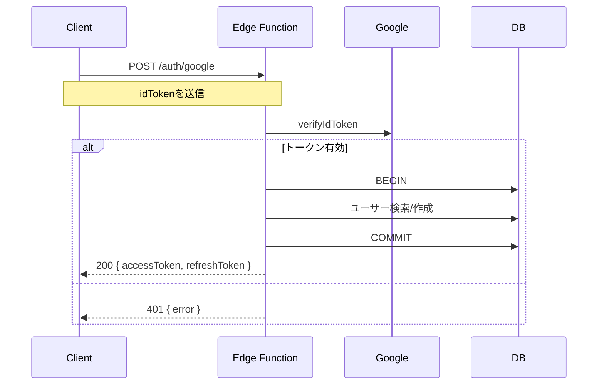
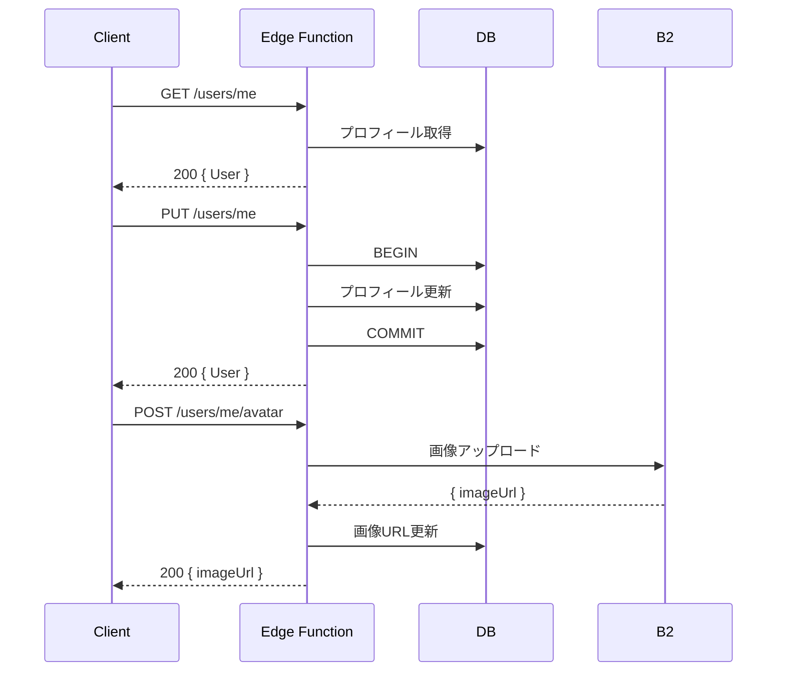
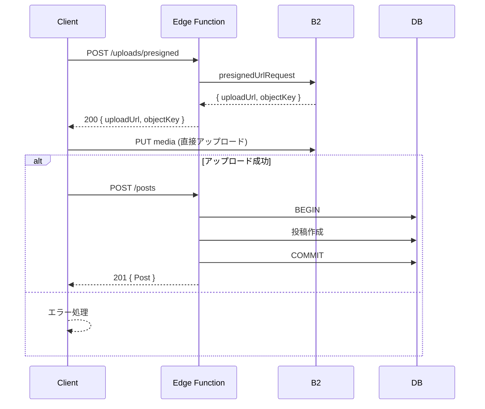
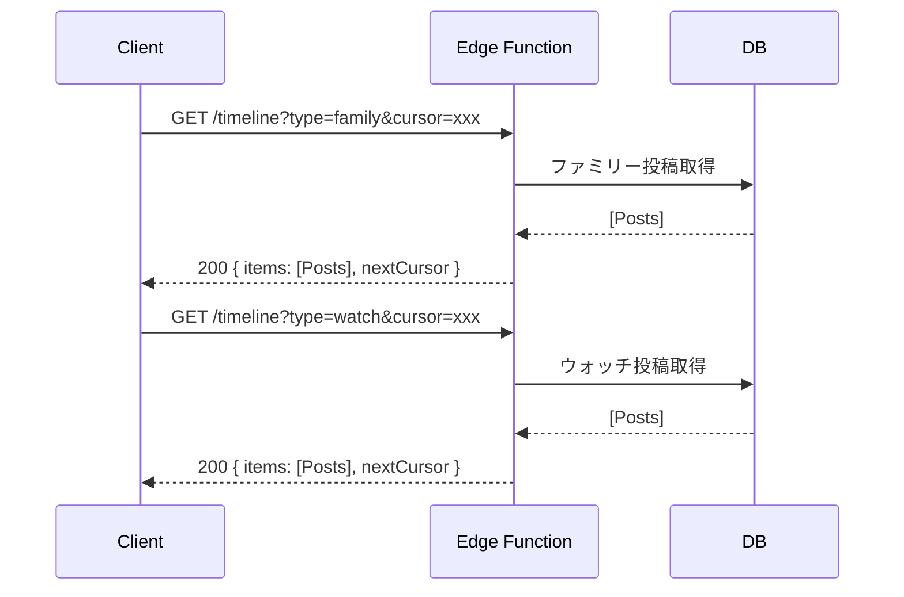
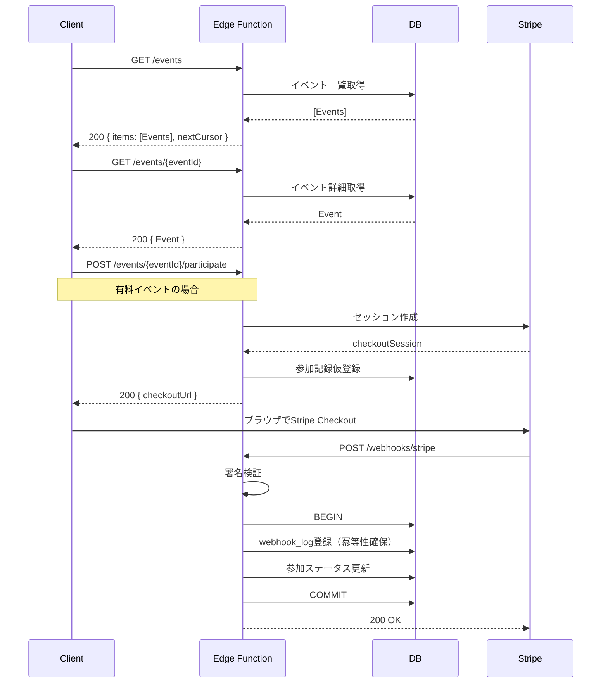
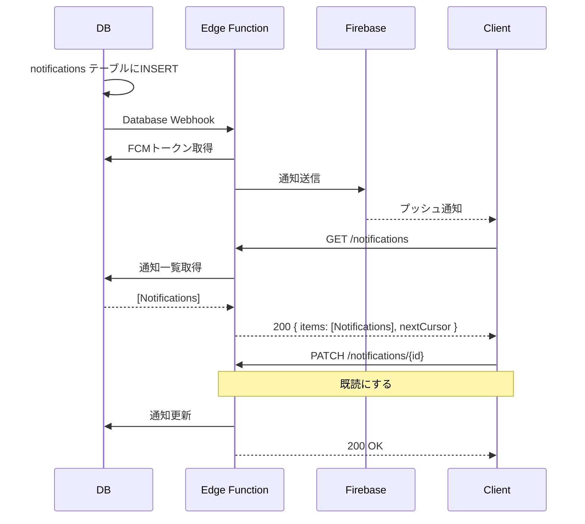
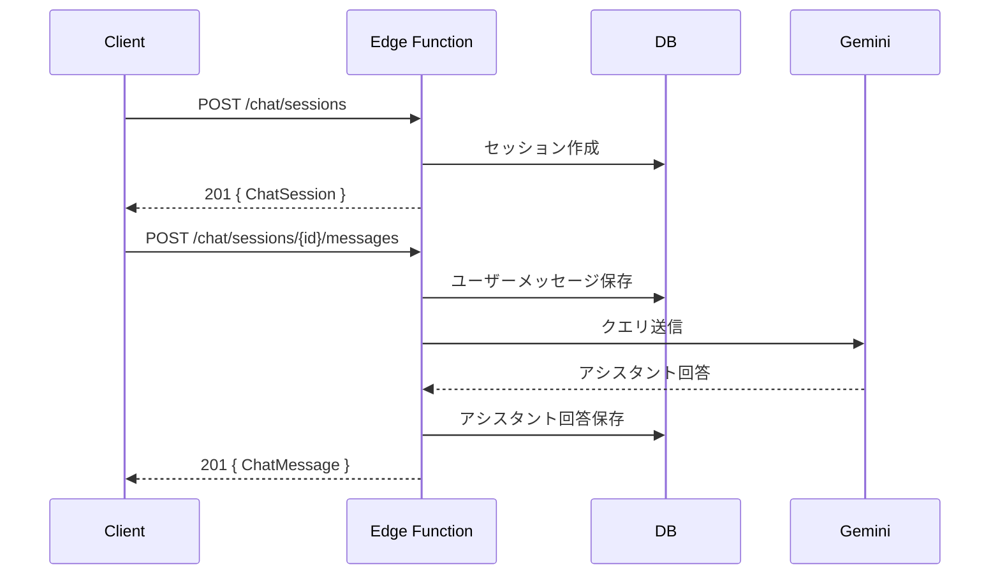
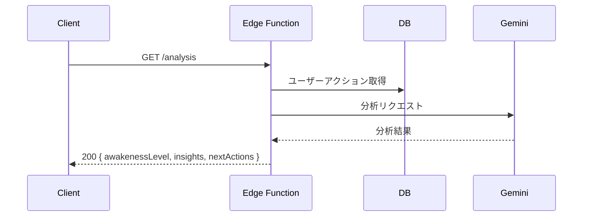

# APIシーケンス図

## 1. 認証フロー

```mermaid
sequenceDiagram
  Client->>Edge Function: POST /auth/google
  Note over Client,Edge Function: idTokenを送信
  Edge Function->>Google: verifyIdToken
  alt トークン有効
    Edge Function->>DB: BEGIN
    Edge Function->>DB: ユーザー検索/作成
    Edge Function->>DB: COMMIT
    Edge Function-->>Client: 200 { accessToken, refreshToken }
  else
    Edge Function-->>Client: 401 { error }
  end
```

## 2. プロフィール管理フロー

```mermaid
sequenceDiagram
  Client->>Edge Function: GET /users/me
  Edge Function->>DB: プロフィール取得
  Edge Function-->>Client: 200 { User }
  
  Client->>Edge Function: PUT /users/me
  Edge Function->>DB: BEGIN
  Edge Function->>DB: プロフィール更新
  Edge Function->>DB: COMMIT
  Edge Function-->>Client: 200 { User }
  
  Client->>Edge Function: POST /users/me/avatar
  Edge Function->>B2: 画像アップロード
  B2-->>Edge Function: { imageUrl }
  Edge Function->>DB: 画像URL更新
  Edge Function-->>Client: 200 { imageUrl }
```

## 3. 投稿作成フロー

```mermaid
sequenceDiagram
  Client->>Edge Function: POST /uploads/presigned
  Edge Function->>B2: presignedUrlRequest
  B2-->>Edge Function: { uploadUrl, objectKey }
  Edge Function-->>Client: 200 { uploadUrl, objectKey }

  Client->>B2: PUT media (直接アップロード)
  
  alt アップロード成功
    Client->>Edge Function: POST /posts
    Edge Function->>DB: BEGIN
    Edge Function->>DB: 投稿作成
    Edge Function->>DB: COMMIT
    Edge Function-->>Client: 201 { Post }
  else
    Client-->>Client: エラー処理
  end
```

## 4. タイムライン取得フロー

```mermaid
sequenceDiagram
  Client->>Edge Function: GET /timeline?type=family&cursor=xxx
  Edge Function->>DB: ファミリー投稿取得
  DB-->>Edge Function: [Posts]
  Edge Function-->>Client: 200 { items: [Posts], nextCursor }
  
  Client->>Edge Function: GET /timeline?type=watch&cursor=xxx
  Edge Function->>DB: ウォッチ投稿取得
  DB-->>Edge Function: [Posts]
  Edge Function-->>Client: 200 { items: [Posts], nextCursor }
```

## 5. イベント参加フロー

```mermaid
sequenceDiagram
  Client->>Edge Function: GET /events
  Edge Function->>DB: イベント一覧取得
  DB-->>Edge Function: [Events]
  Edge Function-->>Client: 200 { items: [Events], nextCursor }
  
  Client->>Edge Function: GET /events/{eventId}
  Edge Function->>DB: イベント詳細取得
  DB-->>Edge Function: Event
  Edge Function-->>Client: 200 { Event }
  
  Client->>Edge Function: POST /events/{eventId}/participate
  Note over Client,Edge Function: 有料イベントの場合
  Edge Function->>Stripe: セッション作成
  Stripe-->>Edge Function: checkoutSession
  Edge Function->>DB: 参加記録仮登録
  Edge Function-->>Client: 200 { checkoutUrl }
  
  Client->>Stripe: ブラウザでStripe Checkout
  
  Stripe->>Edge Function: POST /webhooks/stripe
  Edge Function->>Edge Function: 署名検証
  Edge Function->>DB: BEGIN
  Edge Function->>DB: webhook_log登録（冪等性確保）
  Edge Function->>DB: 参加ステータス更新
  Edge Function->>DB: COMMIT
  Edge Function-->>Stripe: 200 OK
```

## 6. 通知配信フロー

```mermaid
sequenceDiagram
  DB->>DB: notifications テーブルにINSERT
  DB->>Edge Function: Database Webhook
  Edge Function->>DB: FCMトークン取得
  Edge Function->>Firebase: 通知送信
  Firebase-->>Client: プッシュ通知
  
  Client->>Edge Function: GET /notifications
  Edge Function->>DB: 通知一覧取得
  DB-->>Edge Function: [Notifications]
  Edge Function-->>Client: 200 { items: [Notifications], nextCursor }
  
  Client->>Edge Function: PATCH /notifications/{id}
  Note over Client,Edge Function: 既読にする
  Edge Function->>DB: 通知更新
  Edge Function-->>Client: 200 OK
```

## 7. チャットセッションフロー

```mermaid
sequenceDiagram
  Client->>Edge Function: POST /chat/sessions
  Edge Function->>DB: セッション作成
  Edge Function-->>Client: 201 { ChatSession }
  
  Client->>Edge Function: POST /chat/sessions/{id}/messages
  Edge Function->>DB: ユーザーメッセージ保存
  Edge Function->>Gemini: クエリ送信
  Gemini-->>Edge Function: アシスタント回答
  Edge Function->>DB: アシスタント回答保存
  Edge Function-->>Client: 201 { ChatMessage }
```

## 8. 分析データ取得フロー

```mermaid
sequenceDiagram
  Client->>Edge Function: GET /analysis
  Edge Function->>DB: ユーザーアクション取得
  Edge Function->>Gemini: 分析リクエスト
  Gemini-->>Edge Function: 分析結果
  Edge Function-->>Client: 200 { awakenessLevel, insights, nextActions }
```