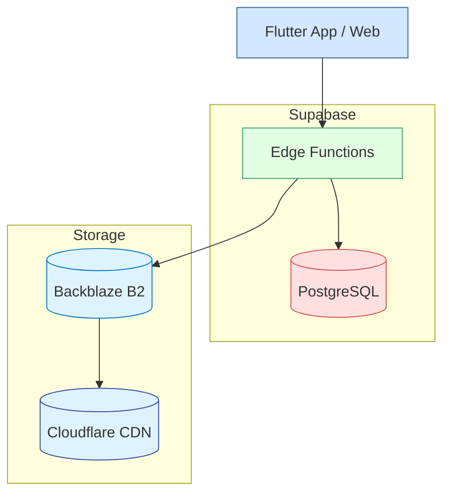

# 詳細設計書 (Supabase Edge Functions ＋ Supabase Postgres 構成)

- **API実行環境**：Supabase Edge Functions  
- **データベース**：Supabase(PostgreSQL, Serverless)  
- **キャッシュ**：不要
- **メディア配信**：Backblaze B2 ＋ Cloudflare CDN  
- **ロードバランサ**：不要（Edge Functions が直接呼び出し）  

---

## 1. 全体アーキテクチャ


---

## 2. ネットワーク設計
| セグメント       | 用途                       |
|---------------|--------------------------|
| Supabase Edge | Edge Functions / Auth   |
| Supabase DB   | Postgres (RLS + JWT)    |
| Storage       | B2 + Cloudflare CDN      |

---

## 3. コンポーネント構成
| コンポーネント         | サービス                     | 役割                                              |
|--------------------|--------------------------|-------------------------------------------------|
| Flutter App & Web  | Flutter 3.22 (Riverpod)   | UI / オフラインキャッシュ                                |
| Supabase Edge Fn   | TypeScript               | REST API / JWT 認証 / RateLimit / Idempotency-Key |
| Supabase Postgres  | PostgreSQL (Serverless)   | 永続化データ保存                                     |
| Backblaze B2       | B2 Storage (S3互換)      | メディアオブジェクト保存                                |
| Cloudflare CDN     | Cloudflare CDN           | メディアエッジ配信                                    |

---

## 4. データモデル
ER図は `er_diagram.mmd` を参照。Postgres スキーマをそのまま利用可能。

---

## 5. API エンドポイント (Supabase Functions)
詳細は `openapi.yaml` を参照。
- `POST /auth/google` → `authOAuth`  
- `GET/PUT/DELETE /users/me` → `userProfile`  
- `POST /uploads/presigned` → `uploadPresigned`  
- `POST /posts` → `createPost`  
- `GET /timeline` → `getTimeline`  
- `POST /posts/:id/comments` → `addComment`  
- `POST /posts/:id/highlight` → `addHighlight`  
- `POST /follows` → `addFollow`  
- `DELETE /follows/:id` → `removeFollow`  
- `GET/POST /events` → `eventList` / `createEvent`  
- `POST /webhooks/stripe` → `handleStripe`  
- `GET /analysis` → `getAnalysis`  
- `GET /search` → `search`  
- `GET/POST /chat/sessions` → `chatSession`  
- `GET/POST /chat/sessions/:id/messages` → `chatMessage`  
- `GET /notifications` → `getNotifications`  
- `PATCH /notifications/:id` → `updateNotification`  

---

## 6. シーケンス図
### 6.1 認証フロー
```mermaid
sequenceDiagram
  Client->>EF: POST /auth/google
  EF->>Google: verifyIdToken
  alt valid
    EF->>DB: BEGIN; SELECT/INSERT USER; COMMIT
    EF-->>Client: 200 { accessToken }
  else
    EF-->>Client: 401 { error }
  end
```

### 6.2 投稿作成フロー
```mermaid
sequenceDiagram
  Client->>EF: POST /uploads/presigned
  EF->>B2: presignedUrlRequest
  B2-->>EF: { uploadUrl, objectKey }
  EF-->>Client: { uploadUrl, objectKey }

  Client->>B2: PUT media
  alt OK
    Client->>EF: POST /posts
    EF->>DB: BEGIN; INSERT post; COMMIT
    EF-->>Client: 201 { Post }
  else
    EF-->>Client: 400 { error }
  end
```

### 6.3 Stripe Webhook
```mermaid
sequenceDiagram
  Stripe->>EF: POST /webhooks/stripe
  EF->>EF: verifySignature
  alt valid
    EF->>DB: SELECT/INSERT log; UPDATE participant
    EF-->>Stripe: 200 OK
  else
    EF-->>Stripe: 400 { error }
  end
```

---

## 7. プッシュ通知

Supabaseだけでプッシュ通知を実装可能です。主に「DB Webhook + Edge Function」の組み合わせで、FCM/APNsを仲介して配信します。

### 7.1 テーブル定義
```sql
create table public.profiles (
  id uuid references auth.users(id) primary key,
  fcm_token text -- Expo/FCM/APNs トークン
);

create table public.notifications (
  id uuid default gen_random_uuid() primary key,
  user_id uuid references auth.users(id) not null,
  created_at timestamptz default now(),
  title text not null,
  body text not null,
  data jsonb
);
```

### 7.2 DB Webhook 設定
- Supabase Dashboard → Table Editor → `notifications` テーブル
- Insert イベントに対し Edge Function をトリガー設定
  - エンドポイント: `/functions/v1/push`
  - 認証ヘッダー: サービスロールキー
  - Payload: 新規レコード JSON

### 7.3 Edge Function 実装
```ts
import { serve } from "https://deno.land/x/supabase_functions/mod.ts";
import { createClient } from "https://esm.sh/@supabase/supabase-js";
import fetch from "https://esm.sh/node-fetch";

const supabase = createClient(
  Deno.env.get("SUPABASE_URL")!,
  Deno.env.get("SUPABASE_SERVICE_ROLE_KEY")!
);

const expoPushUrl = "https://exp.host/--/api/v2/push/send";
const expoAccessToken = Deno.env.get("EXPO_ACCESS_TOKEN")!;

serve(async (req) => {
  const { record } = await req.json();
  const { user_id, title, body, data } = record;
  // FCM/APNs トークン取得
  const { data: profiles } = await supabase
    .from('profiles')
    .select('fcm_token')
    .eq('id', user_id)
    .single();

  if (!profiles?.fcm_token) return new Response(null, { status: 404 });

  // Expo (FCM/APNs) へ通知
  const payload = [{
    to: profiles.fcm_token,
    title,
    body,
    data,
  }];
  await fetch(expoPushUrl, {
    method: 'POST',
    headers: {
      'Content-Type': 'application/json',
      'Authorization': `Bearer ${expoAccessToken}`,
    },
    body: JSON.stringify(payload),
  });

  return new Response(JSON.stringify({ success: true }), { status: 200 });
});
```

- **環境変数**：`SUPABASE_SERVICE_ROLE_KEY`, `EXPO_ACCESS_TOKEN`を設定
- **エラー処理**：無効トークンの削除や retry ロジックを追加推奨

> Supabase Docs: Sending Push Notifications ([supabase.com](https://supabase.com/docs/guides/functions/examples/push-notifications?utm_source=chatgpt.com), [github.com](https://github.com/supabase/supabase/blob/master/apps/docs/content/guides/functions/examples/push-notifications.mdx?utm_source=chatgpt.com))

---

## 8. セキュリティ & 運用
- **トランザクション**：Postgres トランザクション  
- **冪等性**：Postgres ユニーク制約 + Edge Function 内チェック  
- **Rate Limit**：Edge Function のミドルウェア or Supabase Functions Config  
- **OIDC**：`@supabase/gotrue-js`  
- **Webhook**：署名検証 + 冪等性ログ  
- **GDPR**：ソフト削除／匿名化 API  
- **バックアップ**：Supabase 自動スナップショット  
- **モニタリング**：Supabase Dashboard + Edge Function Logs

