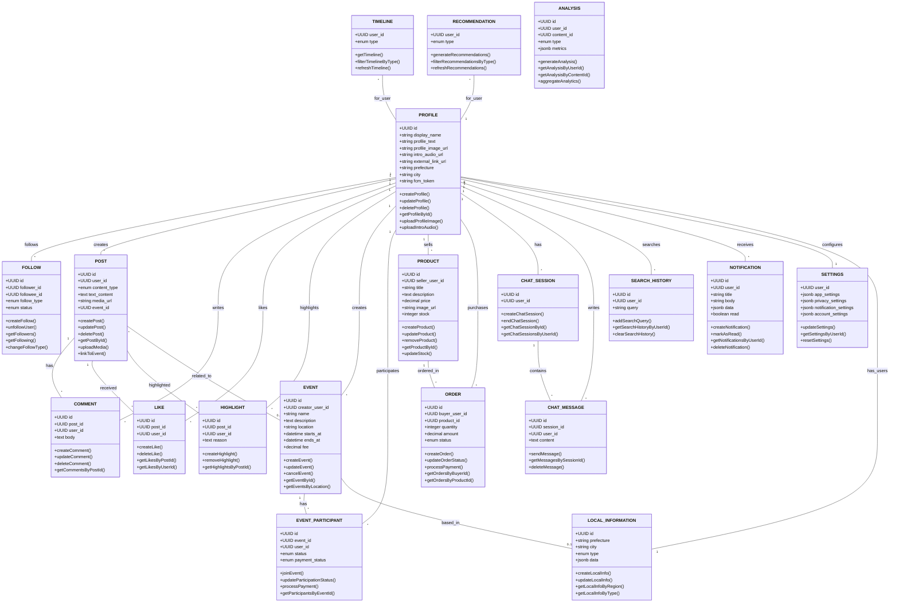

# 神主アプリのドメインモデル

## ドメイン詳細

### ユーザー関連

#### プロフィール (PROFILE)
**要素：**
- UUID id - プロフィール固有ID
- string display_name - 表示名
- string profile_text - 自己紹介テキスト
- string profile_image_url - プロフィール画像のURL
- string intro_audio_url - 自己紹介音声のURL
- string external_link_url - 外部リンク
- string prefecture - 都道府県
- string city - 市区町村
- string fcm_token - プッシュ通知用トークン

**機能：**
- プロフィールの作成、編集、削除
- プロフィール画像のアップロードと更新
- 自己紹介音声のアップロードと更新
- 地域情報の編集
- 外部リンクの設定
- 他ユーザーのプロフィール閲覧
- プッシュ通知トークンの登録と更新

**要件定義：**
- 全ユーザーはプロフィールを持つ
- 表示名は必須、他の情報は任意
- プロフィール画像がない場合はデフォルト画像を表示
- 地域情報（都道府県、市区町村）は地域コンテンツの表示に使用
- プロフィールは公開情報と非公開情報を含む

#### フォロー関係 (FOLLOW)
**要素：**
- UUID id - フォロー関係固有ID
- UUID follower_id - フォローするユーザーID
- UUID followee_id - フォローされるユーザーID
- enum follow_type - 関係タイプ（family | watch）
- enum status - 状態（active | unfollowed）

**機能：**
- フォローの作成と解除
- フォロワーとフォロー中ユーザーの一覧取得
- フォロータイプの変更（family↔watch）
- フォロー状態の管理

**要件定義：**
- ユーザーは他のユーザーをフォローすることができる
- フォローには2種類のタイプがある：
  - family: 近い関係、タイムライン優先表示
  - watch: 一般的な関心、通常表示
- フォロー状態は履歴として保存される
- フォロー関係は相互である必要はない（片思い可能）

### コンテンツ関連

#### 投稿 (POST)
**要素：**
- UUID id - 投稿固有ID
- UUID user_id - 投稿者のID
- enum content_type - コンテンツタイプ（text | image | video | audio）
- text text_content - テキスト内容
- string media_url - メディアファイルのURL
- UUID event_id - 関連するイベントID（任意）

**機能：**
- 投稿の作成、編集、削除
- メディア（画像、動画、音声）のアップロード
- イベントとの関連付け
- 投稿の閲覧と取得

**要件定義：**
- 複数のコンテンツタイプをサポート
- テキストは最大500文字まで
- 画像は最大5MBまで、推奨解像度とフォーマットを定義
- 動画は最大30秒まで、最大5MB
- 音声は最大30秒まで、最大2MB
- 投稿は公開か非公開かを指定可能

#### コメント (COMMENT)
**要素：**
- UUID id - コメント固有ID
- UUID post_id - コメント対象の投稿ID
- UUID user_id - コメント者のID
- text body - コメント内容

**機能：**
- コメントの作成、編集、削除
- 投稿に対するコメントの一覧取得

**要件定義：**
- コメントはテキストのみ（最大200文字）
- コメントは投稿者と閲覧者に通知される
- コメントは時系列で表示される

#### いいね (LIKE)
**要素：**
- UUID id - いいね固有ID
- UUID post_id - いいね対象の投稿ID
- UUID user_id - いいねをしたユーザーID

**機能：**
- いいねの作成と取り消し
- 投稿に対するいいね数の取得
- ユーザーがいいねした投稿の一覧取得

**要件定義：**
- ユーザーは各投稿に対して一度だけいいね可能
- いいねはトグル操作（オン/オフ）
- いいねは投稿者に通知される

#### ハイライト (HIGHLIGHT)
**要素：**
- UUID id - ハイライト固有ID
- UUID post_id - ハイライト対象の投稿ID
- UUID user_id - ハイライトをつけたユーザーID
- text reason - ハイライトした理由

**機能：**
- ハイライトの作成と削除
- ハイライトされた投稿の一覧取得

**要件定義：**
- ハイライトされた投稿はタイムラインや検索で優先表示される
- ハイライトする理由を入力可能（任意）
- ハイライトは投稿者に通知される

### タイムラインおよびコンテンツ関連

#### タイムライン (TIMELINE)
**要素：**
- UUID user_id - タイムライン表示対象ユーザーID
- enum type - タイムラインタイプ（family | watch | all）

**機能：**
- タイムラインの取得と表示
- タイムラインタイプによるフィルタリング
- タイムラインの更新とリフレッシュ

**要件定義：**
- フォロー関係に基づいた投稿を表示
- タイムラインは3種類ある：
  - family: ファミリータイプでフォローしているユーザーの投稿
  - watch: ウォッチタイプでフォローしているユーザーの投稿
  - all: すべてのタイプの投稿を統合
- 投稿は時系列順に表示される
- ハイライトされた投稿は優先表示される
- 環境設定により表示件数や取得期間を調整可能

#### おすすめ (RECOMMENDATION)
**要素：**
- UUID user_id - 推薦コンテンツ表示対象ユーザーID
- enum type - 推薦タイプ（post | event | user）

**機能：**
- ユーザーに適した推薦コンテンツ生成
- タイプ別の推薦コンテンツフィルタリング
- 推薦コンテンツの更新とリフレッシュ

**要件定義：**
- ユーザーの興味や行動履歴に基づいた推薦
- 推薦コンテンツは3タイプある：
  - post: よく見た投稿や興味に合う投稿
  - event: 地域や興味に基づくイベント
  - user: フォローすると良さそうなユーザー
- アルゴリズムはユーザーの行動とともに学習し、推薦精度を向上
- ユーザーは推薦のフィードバックを提供可能

### イベント関連

#### イベント (EVENT)
**要素：**
- UUID id - イベント固有ID
- UUID creator_user_id - 作成者ユーザーID
- string name - イベント名
- text description - イベント説明
- string location - 開催場所
- datetime starts_at - 開始日時
- datetime ends_at - 終了日時
- decimal fee - 参加費用

**機能：**
- イベントの作成、編集、キャンセル
- イベント情報の取得
- 地域ごとのイベント検索

**要件定義：**
- ユーザーはイベントを作成して共有できる
- イベントには無料・有料の種類がある
- 開催日時と場所は必須
- イベントは投稿に関連付けて宣伝可能
- イベントの作成者は管理権限を持つ

#### イベント参加者 (EVENT_PARTICIPANT)
**要素：**
- UUID id - イベント参加者固有ID
- UUID event_id - イベントID
- UUID user_id - 参加者ユーザーID
- enum status - 参加ステータス（going | interested）
- enum payment_status - 支払いステータス（pending | paid | refunded）

**機能：**
- イベントへの参加登録
- 参加ステータスの更新
- 参加費用の支払い処理
- イベント参加者一覧の取得

**要件定義：**
- ユーザーは以下ステータスでイベントに参加卓可能：
  - going: 参加予定
  - interested: 興味あり（未定）
- 有料イベントの場合、支払いステータスが管理される
- 参加したイベントは通知される
- イベントのキャンセルや変更時には参加者に通知される

### 商品・取引関連
- **商品 (PRODUCT)**
  - 販売商品の情報
- **注文 (ORDER)**
  - 商品購入に関する情報

### コミュニケーション関連
- **チャットセッション (CHAT_SESSION)**
  - ユーザー間のチャット管理
- **チャットメッセージ (CHAT_MESSAGE)**
  - チャット内の個別メッセージ

### ユーザー体験関連
- **検索履歴 (SEARCH_HISTORY)**
  - ユーザーの検索クエリ
- **通知 (NOTIFICATION)**
  - ユーザーへの通知情報

### 分析関連
- **分析 (ANALYSIS)**
  - ユーザー行動分析
  - コンテンツパフォーマンス指標
  - エンゲージメント統計

### 地域関連
- **地域情報 (LOCAL_INFORMATION)**
  - 都道府県・市区町村別のコンテンツ
  - 地域イベントやトレンド
  - 地域コミュニティ

### 設定関連
- **設定 (SETTINGS)**
  - ユーザーアプリ設定
  - プライバシー設定
  - 通知設定
  - アカウント設定

## ドメイン間の関連性（クラス図）

## 主要なドメイン間の相互作用

1. **プロフィールとコンテンツ**
   - ユーザーは投稿を作成、コメント、いいね、ハイライトなどのアクションを実行

2. **プロフィールとフォロー関係**
   - ユーザー間の繋がりを形成（family/watchタイプの関係性）

3. **投稿とイベント**
   - 投稿はイベントに関連付けることが可能
   - イベント参加者とイベントの関係

4. **地域情報と各コンテンツ**
   - 地域ベースのコンテンツ、イベント、コミュニティが形成される

5. **タイムラインとコンテンツ**
   - フォロー関係に基づく投稿表示
   - アルゴリズムによる最適化コンテンツ（おすすめ）