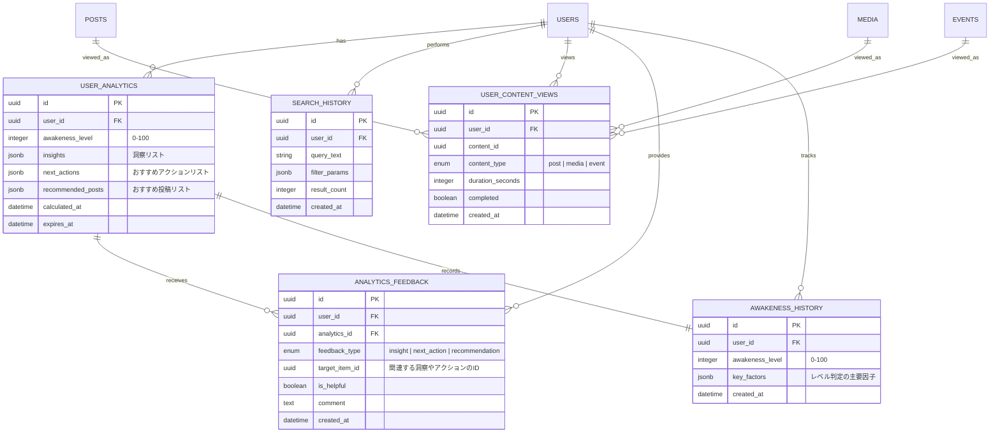

# 分析ドメインER図



## テーブル詳細

### USER_ANALYTICS
ユーザーの分析結果とレコメンデーションを格納します。キャッシュとして機能し、頻繁なLLM呼び出しを減らします。

**カラム詳細:**
- `id`: 分析結果の一意識別子
- `user_id`: 対象ユーザーID（外部キー）
- `awakeness_level`: 目醒め度（0〜100の整数）
- `insights`: ユーザーに対する洞察（JSONBで格納）
- `next_actions`: 推奨されるアクション（JSONBで格納）
- `recommended_posts`: おすすめ投稿リスト（JSONBで格納）
- `calculated_at`: 分析実行日時
- `expires_at`: キャッシュの有効期限

### SEARCH_HISTORY
ユーザーの検索履歴を保存し、関心領域を分析するのに使用します。

**カラム詳細:**
- `id`: 検索履歴の一意識別子
- `user_id`: 検索したユーザーID（外部キー）
- `query_text`: 検索クエリテキスト
- `filter_params`: 適用されたフィルター（JSONBで格納）
- `result_count`: 検索結果の数
- `created_at`: 検索実行日時

### USER_CONTENT_VIEWS
ユーザーのコンテンツ閲覧履歴と滞在時間を記録します。エンゲージメント分析に使用されます。

**カラム詳細:**
- `id`: 閲覧レコードの一意識別子
- `user_id`: 閲覧したユーザーID（外部キー）
- `content_id`: 閲覧したコンテンツID
- `content_type`: コンテンツのタイプ（投稿、メディア、イベント）
- `duration_seconds`: 閲覧時間（秒）
- `completed`: 完全に閲覧したかどうか（動画や音声の場合）
- `created_at`: 閲覧日時

### ANALYTICS_FEEDBACK
分析結果やレコメンデーションに対するユーザーフィードバックを格納します。分析精度向上に使用されます。

**カラム詳細:**
- `id`: フィードバックの一意識別子
- `user_id`: フィードバックを提供したユーザーID（外部キー）
- `analytics_id`: 関連する分析結果ID（外部キー）
- `feedback_type`: フィードバックのタイプ（洞察、アクション、レコメンデーション）
- `target_item_id`: フィードバック対象の特定項目ID
- `is_helpful`: 有益だったかどうか
- `comment`: 追加コメント
- `created_at`: フィードバック提供日時

### AWAKENESS_HISTORY
ユーザーの目醒め度の履歴を保存し、時間的な変化を追跡します。

**カラム詳細:**
- `id`: 履歴レコードの一意識別子
- `user_id`: 対象ユーザーID（外部キー）
- `awakeness_level`: 目醒め度スコア（0〜100）
- `key_factors`: スコア判定の主要因子（JSONBで格納）
- `created_at`: 記録日時

## リレーション

- **USERS - USER_ANALYTICS**: 1対多の関係。ユーザーは複数の分析結果（過去の分析も含む）を持ちます。
- **USERS - SEARCH_HISTORY**: 1対多の関係。ユーザーは複数の検索履歴を持ちます。
- **USERS - USER_CONTENT_VIEWS**: 1対多の関係。ユーザーは複数のコンテンツ閲覧履歴を持ちます。
- **USERS - ANALYTICS_FEEDBACK**: 1対多の関係。ユーザーは複数のフィードバックを提供します。
- **USERS - AWAKENESS_HISTORY**: 1対多の関係。ユーザーは複数の目醒め度履歴を持ちます。

- **USER_ANALYTICS - ANALYTICS_FEEDBACK**: 1対多の関係。分析結果は複数のフィードバックを受け取ります。
- **USER_ANALYTICS - AWAKENESS_HISTORY**: 1対1の関係。分析結果は目醒め度履歴に記録されます。

- **POSTS - USER_CONTENT_VIEWS**: 1対多の関係。投稿は複数のユーザーに閲覧されます。
- **MEDIA - USER_CONTENT_VIEWS**: 1対多の関係。メディアは複数のユーザーに閲覧されます。
- **EVENTS - USER_CONTENT_VIEWS**: 1対多の関係。イベントは複数のユーザーに閲覧されます。

## インデックス

- USER_ANALYTICS: user_id にインデックスを作成
- USER_ANALYTICS: (user_id, expires_at) に複合インデックスを作成
- USER_ANALYTICS: awakeness_level にインデックスを作成

- SEARCH_HISTORY: user_id にインデックスを作成
- SEARCH_HISTORY: (user_id, created_at) に複合インデックスを作成
- SEARCH_HISTORY: query_text に部分一致インデックスを作成

- USER_CONTENT_VIEWS: user_id にインデックスを作成
- USER_CONTENT_VIEWS: (content_id, content_type) に複合インデックスを作成
- USER_CONTENT_VIEWS: (user_id, created_at) に複合インデックスを作成
- USER_CONTENT_VIEWS: duration_seconds にインデックスを作成

- ANALYTICS_FEEDBACK: user_id にインデックスを作成
- ANALYTICS_FEEDBACK: analytics_id にインデックスを作成
- ANALYTICS_FEEDBACK: feedback_type にインデックスを作成
- ANALYTICS_FEEDBACK: is_helpful にインデックスを作成

- AWAKENESS_HISTORY: user_id にインデックスを作成
- AWAKENESS_HISTORY: (user_id, created_at) に複合インデックスを作成
- AWAKENESS_HISTORY: awakeness_level にインデックスを作成

## 注記

1. この設計では、分析結果はLLMによるリアルタイム解析を基本としつつも、一定期間有効なキャッシュとして保存することで、パフォーマンスを向上させています。

2. 目醒め度の判定基準データは既存テーブルから取得します：
   - 投稿内容 → POSTS
   - いいね → LIKES
   - コメント → COMMENTS
   - ハイライト → HIGHLIGHTS
   - イベント参加 → EVENT_PARTICIPANT
   - 検索履歴 → SEARCH_HISTORY
   - コンテンツ閲覧 → USER_CONTENT_VIEWS

3. USER_ANALYTICSテーブルのJSONB型フィールドには以下のような構造が格納されます：

   **insights の例**:
   ```json
   [
     {
       "id": "insight-uuid-1",
       "text": "自己探求に関する投稿が増えています",
       "relevance_score": 0.85,
       "evidence": ["post-uuid-1", "post-uuid-2"]
     },
     {
       "id": "insight-uuid-2",
       "text": "瞑想に関する関心が高まっています",
       "relevance_score": 0.76,
       "evidence": ["search-uuid-1", "event-uuid-3"]
     }
   ]
   ```

   **next_actions の例**:
   ```json
   [
     {
       "id": "action-uuid-1",
       "text": "「内観と自己理解」イベントへの参加を検討してみてください",
       "type": "event",
       "target_id": "event-uuid-2",
       "relevance_score": 0.92
     },
     {
       "id": "action-uuid-2",
       "text": "瞑想実践記録の共有を続けることで、周囲の方々にもポジティブな影響を与えられます",
       "type": "posting",
       "relevance_score": 0.88
     }
   ]
   ```

   **recommended_posts の例**:
   ```json
   [
     {
       "post_id": "post-uuid-1",
       "relevance_score": 0.94,
       "reason": "あなたの最近の関心に関連しています"
     },
     {
       "post_id": "post-uuid-2",
       "relevance_score": 0.87,
       "reason": "目醒めへの道のりを進めるのに役立ちます"
     }
   ]
   ```