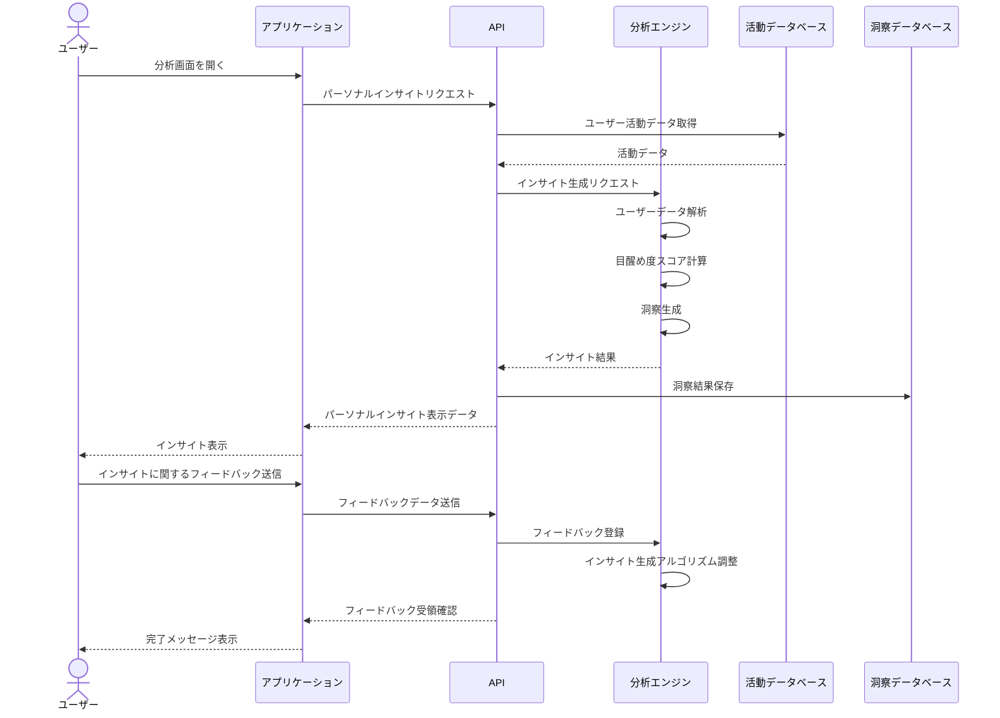
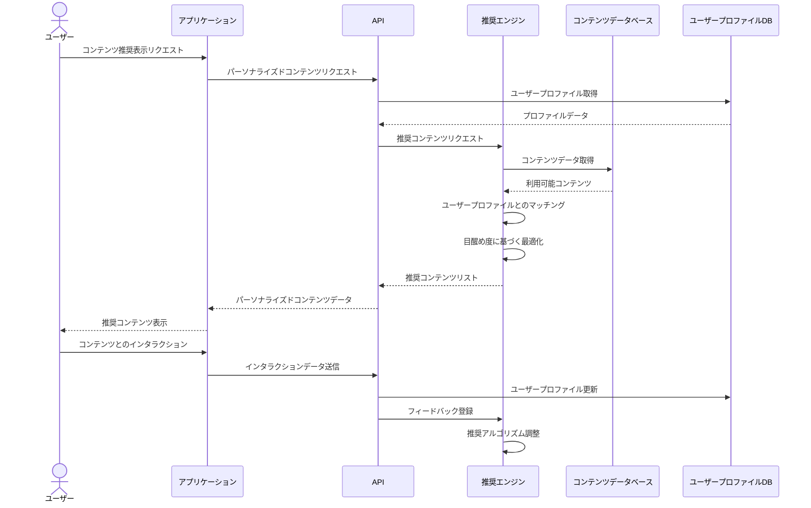
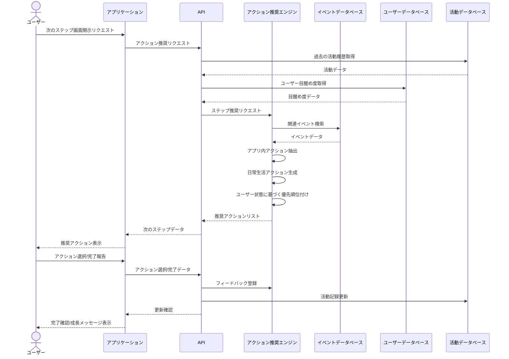
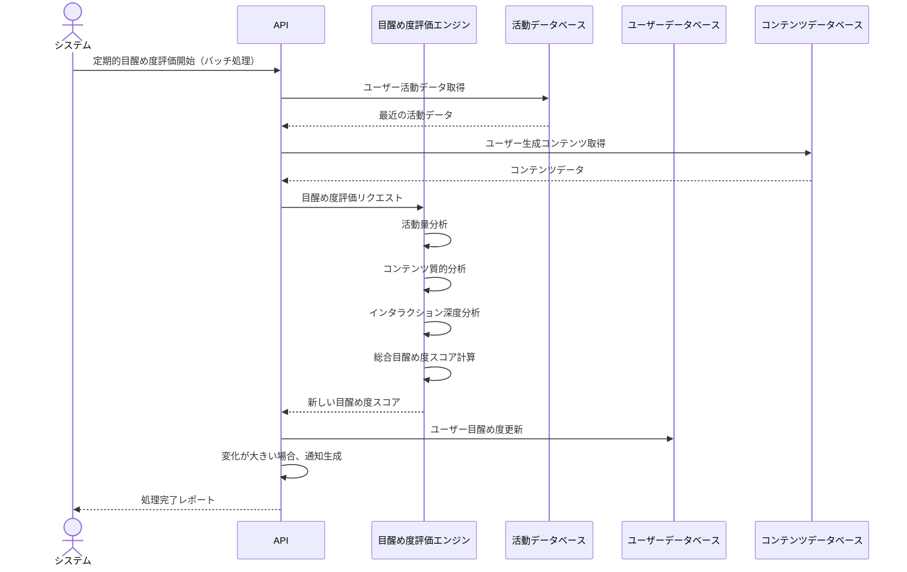
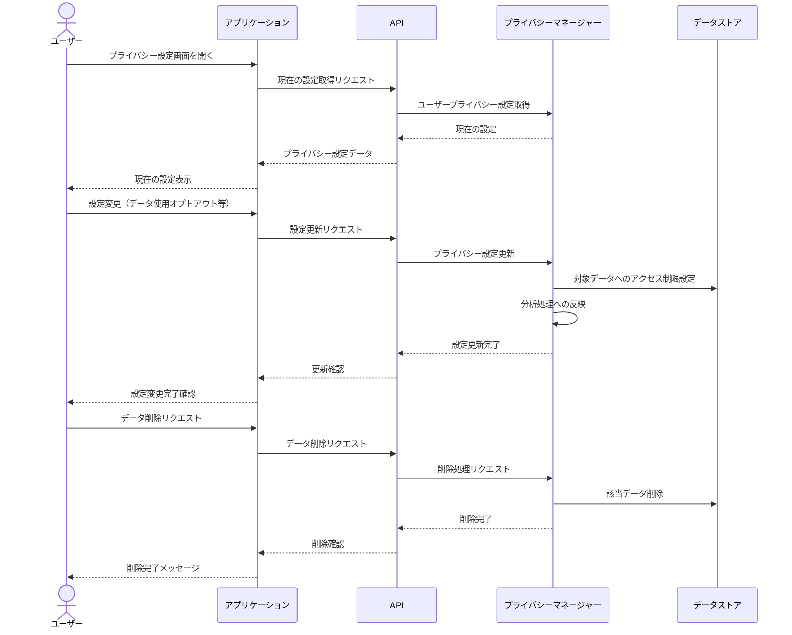

# 分析ドメイン シーケンス図

## 1. パーソナルインサイト生成プロセス

```mermaid
sequenceDiagram
    actor User as ユーザー
    participant App as アプリケーション
    participant API as API
    participant AnalysisEngine as 分析エンジン
    participant ActivityDB as 活動データベース
    participant InsightDB as 洞察データベース
    
    User->>App: 分析画面を開く
    App->>API: パーソナルインサイトリクエスト
    API->>ActivityDB: ユーザー活動データ取得
    ActivityDB-->>API: 活動データ
    API->>AnalysisEngine: インサイト生成リクエスト
    AnalysisEngine->>AnalysisEngine: ユーザーデータ解析
    AnalysisEngine->>AnalysisEngine: 目醒め度スコア計算
    AnalysisEngine->>AnalysisEngine: 洞察生成
    AnalysisEngine-->>API: インサイト結果
    API->>InsightDB: 洞察結果保存
    API-->>App: パーソナルインサイト表示データ
    App-->>User: インサイト表示
    User->>App: インサイトに関するフィードバック送信
    App->>API: フィードバックデータ送信
    API->>AnalysisEngine: フィードバック登録
    AnalysisEngine->>AnalysisEngine: インサイト生成アルゴリズム調整
    API-->>App: フィードバック受領確認
    App-->>User: 完了メッセージ表示
```

## 2. パーソナライズドコンテンツ推奨プロセス

```mermaid
sequenceDiagram
    actor User as ユーザー
    participant App as アプリケーション
    participant API as API
    participant RecEngine as 推奨エンジン
    participant ContentDB as コンテンツデータベース
    participant UserProfileDB as ユーザープロファイルDB
    
    User->>App: コンテンツ推奨表示リクエスト
    App->>API: パーソナライズドコンテンツリクエスト
    API->>UserProfileDB: ユーザープロファイル取得
    UserProfileDB-->>API: プロファイルデータ
    API->>RecEngine: 推奨コンテンツリクエスト
    RecEngine->>ContentDB: コンテンツデータ取得
    ContentDB-->>RecEngine: 利用可能コンテンツ
    RecEngine->>RecEngine: ユーザープロファイルとのマッチング
    RecEngine->>RecEngine: 目醒め度に基づく最適化
    RecEngine-->>API: 推奨コンテンツリスト
    API-->>App: パーソナライズドコンテンツデータ
    App-->>User: 推奨コンテンツ表示
    User->>App: コンテンツとのインタラクション
    App->>API: インタラクションデータ送信
    API->>UserProfileDB: ユーザープロファイル更新
    API->>RecEngine: フィードバック登録
    RecEngine->>RecEngine: 推奨アルゴリズム調整
```

## 3. 次のステップ提案プロセス

```mermaid
sequenceDiagram
    actor User as ユーザー
    participant App as アプリケーション
    participant API as API
    participant ActionEngine as アクション推奨エンジン
    participant EventDB as イベントデータベース
    participant UserDB as ユーザーデータベース
    participant ActivityDB as 活動データベース
    
    User->>App: 次のステップ画面開示リクエスト
    App->>API: アクション推奨リクエスト
    API->>ActivityDB: 過去の活動履歴取得
    ActivityDB-->>API: 活動データ
    API->>UserDB: ユーザー目醒め度取得
    UserDB-->>API: 目醒め度データ
    API->>ActionEngine: ステップ推奨リクエスト
    ActionEngine->>EventDB: 関連イベント検索
    EventDB-->>ActionEngine: イベントデータ
    ActionEngine->>ActionEngine: アプリ内アクション抽出
    ActionEngine->>ActionEngine: 日常生活アクション生成
    ActionEngine->>ActionEngine: ユーザー状態に基づく優先順位付け
    ActionEngine-->>API: 推奨アクションリスト
    API-->>App: 次のステップデータ
    App-->>User: 推奨アクション表示
    User->>App: アクション選択/完了報告
    App->>API: アクション選択/完了データ
    API->>ActionEngine: フィードバック登録
    API->>ActivityDB: 活動記録更新
    API-->>App: 更新確認
    App-->>User: 完了確認/成長メッセージ表示
```

## 4. 目醒め度評価更新プロセス

```mermaid
sequenceDiagram
    actor System as システム
    participant API as API
    participant AwakeningEngine as 目醒め度評価エンジン
    participant ActivityDB as 活動データベース
    participant UserDB as ユーザーデータベース
    participant ContentDB as コンテンツデータベース
    
    System->>API: 定期的目醒め度評価開始（バッチ処理）
    API->>ActivityDB: ユーザー活動データ取得
    ActivityDB-->>API: 最近の活動データ
    API->>ContentDB: ユーザー生成コンテンツ取得
    ContentDB-->>API: コンテンツデータ
    API->>AwakeningEngine: 目醒め度評価リクエスト
    AwakeningEngine->>AwakeningEngine: 活動量分析
    AwakeningEngine->>AwakeningEngine: コンテンツ質的分析
    AwakeningEngine->>AwakeningEngine: インタラクション深度分析
    AwakeningEngine->>AwakeningEngine: 総合目醒め度スコア計算
    AwakeningEngine-->>API: 新しい目醒め度スコア
    API->>UserDB: ユーザー目醒め度更新
    API->>API: 変化が大きい場合、通知生成
    API-->>System: 処理完了レポート
```

## 5. データプライバシー管理プロセス

```mermaid
sequenceDiagram
    actor User as ユーザー
    participant App as アプリケーション
    participant API as API
    participant PrivacyManager as プライバシーマネージャー
    participant DataStore as データストア
    
    User->>App: プライバシー設定画面を開く
    App->>API: 現在の設定取得リクエスト
    API->>PrivacyManager: ユーザープライバシー設定取得
    PrivacyManager-->>API: 現在の設定
    API-->>App: プライバシー設定データ
    App-->>User: 現在の設定表示
    User->>App: 設定変更（データ使用オプトアウト等）
    App->>API: 設定更新リクエスト
    API->>PrivacyManager: プライバシー設定更新
    PrivacyManager->>DataStore: 対象データへのアクセス制限設定
    PrivacyManager->>PrivacyManager: 分析処理への反映
    PrivacyManager-->>API: 設定更新完了
    API-->>App: 更新確認
    App-->>User: 設定変更完了確認
    User->>App: データ削除リクエスト
    App->>API: データ削除リクエスト
    API->>PrivacyManager: 削除処理リクエスト
    PrivacyManager->>DataStore: 該当データ削除
    PrivacyManager-->>API: 削除完了
    API-->>App: 削除確認
    App-->>User: 削除完了メッセージ
```