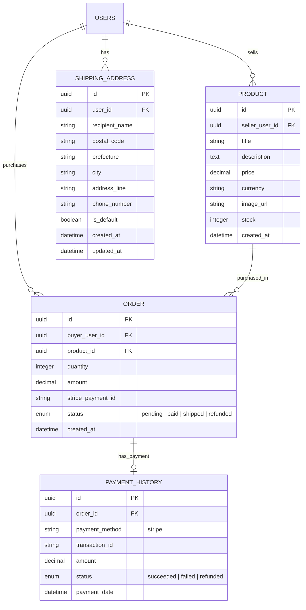

# ECドメインER図

## テーブル詳細

### PRODUCT
ECサイトで販売される商品を管理します。商品詳細、価格、在庫情報などを含みます。

**カラム詳細:**
- `id`: 商品の一意識別子
- `seller_user_id`: 販売者のユーザーID（外部キー）
- `title`: 商品タイトル
- `description`: 商品説明
- `price`: 価格
- `currency`: 通貨コード（例：JPY, USD）
- `image_url`: 商品画像のURL
- `stock`: 在庫数
- `created_at`: 商品登録日時

### ORDER
ユーザーによる商品注文を管理します。注文状態や決済情報を含みます。

**カラム詳細:**
- `id`: 注文の一意識別子
- `buyer_user_id`: 購入者のユーザーID（外部キー）
- `product_id`: 購入商品のID（外部キー）
- `quantity`: 購入数量
- `amount`: 支払金額
- `stripe_payment_id`: Stripe決済ID
- `status`: 注文状態（pending | paid | shipped | refunded）
- `created_at`: 注文日時

### SHIPPING_ADDRESS
ユーザーの配送先住所を管理します。

**カラム詳細:**
- `id`: 住所の一意識別子
- `user_id`: ユーザーID（外部キー）
- `recipient_name`: 受取人名
- `postal_code`: 郵便番号
- `prefecture`: 都道府県
- `city`: 市区町村
- `address_line`: 番地・建物名
- `phone_number`: 電話番号
- `is_default`: デフォルト住所かどうか
- `created_at`: 登録日時
- `updated_at`: 最終更新日時

### PAYMENT_HISTORY
注文に対する決済履歴を管理します。

**カラム詳細:**
- `id`: 決済履歴の一意識別子
- `order_id`: 関連する注文ID（外部キー）
- `payment_method`: 決済方法（現在はStripeのみ）
- `transaction_id`: 決済プロバイダでの取引ID
- `amount`: 決済金額
- `status`: 決済状態（succeeded | failed | refunded）
- `payment_date`: 決済日時

## リレーション

- **USERS - PRODUCT**: 1対多の関係。ユーザーは複数の商品を販売できます。
- **USERS - ORDER**: 1対多の関係。ユーザーは複数の注文を行うことができます。
- **USERS - SHIPPING_ADDRESS**: 1対多の関係。ユーザーは複数の配送先住所を登録できます。
- **PRODUCT - ORDER**: 1対多の関係。商品は複数の注文に含まれることがあります。
- **ORDER - PAYMENT_HISTORY**: 1対1の関係。注文には一つの決済履歴が関連付けられます。

## インデックス

- PRODUCT: seller_user_id にインデックスを作成
- PRODUCT: created_at にインデックスを作成
- PRODUCT: price にインデックスを作成

- ORDER: buyer_user_id にインデックスを作成
- ORDER: product_id にインデックスを作成
- ORDER: status にインデックスを作成
- ORDER: created_at にインデックスを作成

- SHIPPING_ADDRESS: user_id にインデックスを作成
- SHIPPING_ADDRESS: (user_id, is_default) に複合インデックスを作成

- PAYMENT_HISTORY: order_id に一意性制約とインデックスを作成
- PAYMENT_HISTORY: status にインデックスを作成
- PAYMENT_HISTORY: payment_date にインデックスを作成