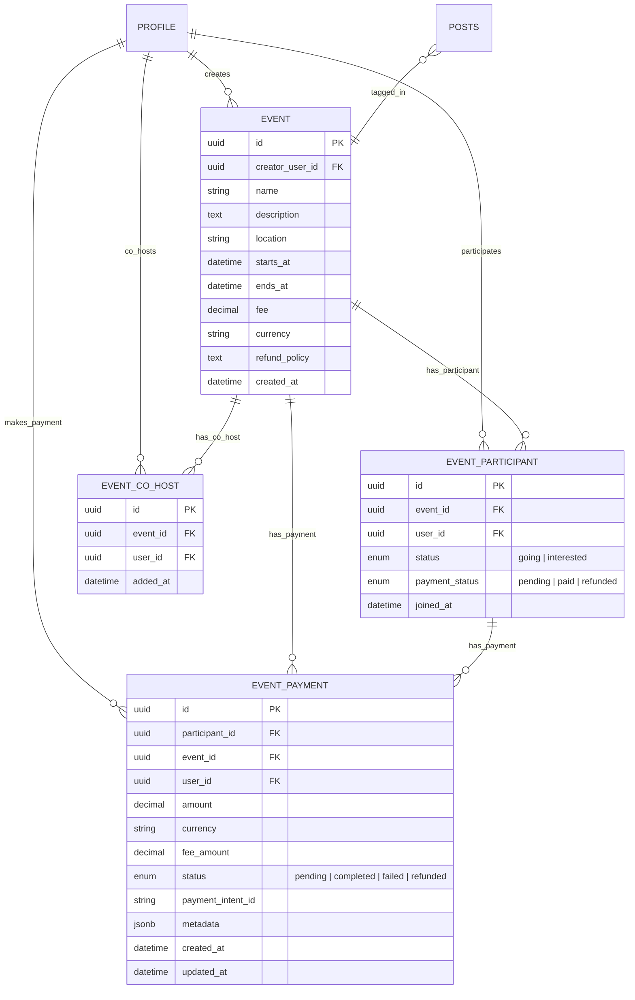

# イベントドメインER図

## テーブル詳細

### EVENT
イベントの基本情報を管理します。イベント名、説明、開催場所、日時、料金などの情報を含みます。

**カラム詳細:**
- `id`: イベントの一意識別子
- `creator_user_id`: イベント作成者（主催者）のユーザーID（外部キー）
- `name`: イベント名
- `description`: イベントの詳細説明
- `location`: 開催場所
- `starts_at`: 開始日時
- `ends_at`: 終了日時
- `fee`: 参加費（無料の場合は0）
- `currency`: 通貨単位（JPY、USDなど）
- `refund_policy`: 返金ポリシーの説明
- `created_at`: イベント作成日時

### EVENT_PARTICIPANT
ユーザーのイベント参加状況を管理します。参加ステータスや支払い状況を追跡します。

**カラム詳細:**
- `id`: 参加登録の一意識別子
- `event_id`: イベントID（外部キー）
- `user_id`: 参加者のユーザーID（外部キー）
- `status`: 参加ステータス（going：参加、interested：興味あり）
- `payment_status`: 支払いステータス（pending：保留中、paid：支払い済み、refunded：返金済み）
- `joined_at`: 参加登録日時

### EVENT_PAYMENT
イベント参加に関する支払い情報を管理します。決済処理の状態や詳細を追跡します。

**カラム詳細:**
- `id`: 支払いの一意識別子
- `participant_id`: 参加者レコードのID（外部キー）
- `event_id`: イベントID（外部キー）
- `user_id`: 支払いを行ったユーザーID（外部キー）
- `amount`: 支払い金額
- `currency`: 通貨単位
- `fee_amount`: 手数料金額
- `status`: 支払いステータス（pending：処理中、completed：完了、failed：失敗、refunded：返金済み）
- `payment_intent_id`: 決済サービス（Stripe）の支払いインテントID
- `metadata`: 支払いに関するメタデータ（JSONBフォーマット）
- `created_at`: 支払い作成日時
- `updated_at`: 支払い情報の最終更新日時

### EVENT_CO_HOST
イベントの共同開催者（共同ホスト）を管理します。

**カラム詳細:**
- `id`: 共同ホスト関係の一意識別子
- `event_id`: イベントID（外部キー）
- `user_id`: 共同ホストのユーザーID（外部キー）
- `added_at`: 共同ホストとして追加された日時

## リレーション

- **PROFILE - EVENT**: 1対多の関係。ユーザーは複数のイベントを作成できます。
- **PROFILE - EVENT_PARTICIPANT**: 1対多の関係。ユーザーは複数のイベントに参加できます。
- **PROFILE - EVENT_CO_HOST**: 1対多の関係。ユーザーは複数のイベントの共同ホストになれます。
- **PROFILE - EVENT_PAYMENT**: 1対多の関係。ユーザーは複数の支払いを行うことができます。

- **EVENT - EVENT_PARTICIPANT**: 1対多の関係。イベントには複数の参加者がいます。
- **EVENT - EVENT_PAYMENT**: 1対多の関係。イベントには複数の支払いが関連します。
- **EVENT - EVENT_CO_HOST**: 1対多の関係。イベントには複数の共同ホストがいることがあります。

- **EVENT_PARTICIPANT - EVENT_PAYMENT**: 1対多の関係。参加登録には複数の支払い（例：部分払いや返金）が関連することがあります。

- **POSTS - EVENT**: 多対1の関係。複数の投稿が同一のイベントにタグ付けされることがあります。

## インデックス

- EVENT: creator_user_id にインデックスを作成
- EVENT: starts_at にインデックスを作成
- EVENT: (starts_at, ends_at) に複合インデックスを作成
- EVENT: fee にインデックスを作成（無料/有料フィルタリング用）

- EVENT_PARTICIPANT: event_id にインデックスを作成
- EVENT_PARTICIPANT: user_id にインデックスを作成
- EVENT_PARTICIPANT: (event_id, user_id) に一意性制約とインデックスを作成
- EVENT_PARTICIPANT: status にインデックスを作成
- EVENT_PARTICIPANT: payment_status にインデックスを作成

- EVENT_PAYMENT: participant_id にインデックスを作成
- EVENT_PAYMENT: event_id にインデックスを作成
- EVENT_PAYMENT: user_id にインデックスを作成
- EVENT_PAYMENT: status にインデックスを作成
- EVENT_PAYMENT: payment_intent_id に一意性制約とインデックスを作成

- EVENT_CO_HOST: event_id にインデックスを作成
- EVENT_CO_HOST: user_id にインデックスを作成
- EVENT_CO_HOST: (event_id, user_id) に一意性制約とインデックスを作成