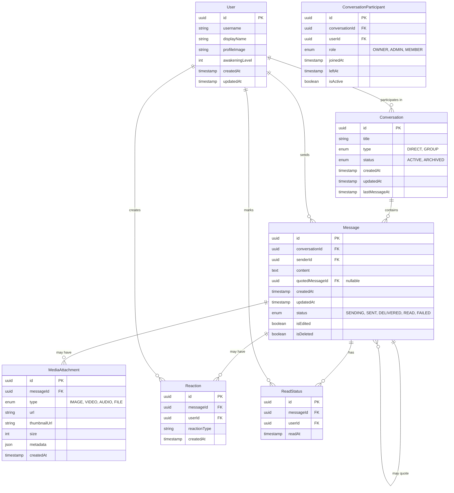

# ダイレクトメッセージ機能のERダイアグラム

## 主要エンティティと関係

## エンティティの説明

### User（ユーザー）
ユーザー情報を格納します。このエンティティは既存のUserエンティティを拡張または参照します。

### Conversation（会話）
メッセージのやり取りが行われる会話コンテキストを表します。直接メッセージング（1対1）とグループメッセージングの両方をサポートします。

### ConversationParticipant（会話参加者）
会話に参加しているユーザーとその役割を定義します。これは多対多の関係を解決するためのジャンクションテーブルです。

### Message（メッセージ）
会話内で送信された個々のメッセージを表します。テキスト内容、ステータス、タイムスタンプなどの情報を含みます。メッセージは他のメッセージを引用することもできます。

### MediaAttachment（メディア添付）
メッセージに添付されたメディアファイル（画像、動画、音声、その他のファイル）を表します。

### Reaction（リアクション）
メッセージに対するユーザーのリアクション（いいね、笑い、悲しみなど）を表します。

### ReadStatus（既読状態）
特定のユーザーによるメッセージの既読状態を追跡します。

## 関係の説明

1. ユーザーは複数の会話に参加できます（ConversationParticipantテーブルを通じて）。
2. 会話は複数のメッセージを含みます。
3. ユーザーは複数のメッセージを送信できます。
4. メッセージは複数のメディア添付を持つことができます。
5. メッセージは複数のリアクションを受け取ることができます。
6. ユーザーは複数のリアクションを作成できます。
7. メッセージは複数の既読状態を持ちます（各受信者ごとに1つ）。
8. メッセージは他のメッセージを引用することができます。

## インデックス

パフォーマンスを最適化するために以下のインデックスを作成します：

1. Conversation.lastMessageAt（会話一覧の並べ替え用）
2. Message.conversationId, Message.createdAt（会話内のメッセージ取得用）
3. ConversationParticipant.userId, ConversationParticipant.isActive（ユーザーの会話一覧取得用）
4. ReadStatus.messageId, ReadStatus.userId（既読状態の高速検索用）
5. Message.senderId, Message.createdAt（ユーザーが送信したメッセージの検索用）

## 備考

1. **メッセージのソフト削除**: メッセージが削除された場合、実際のレコードは削除されず、isDeletedフラグが設定されます。これにより、メッセージの履歴を維持しながら、UIからは削除されたように見せることができます。

2. **会話の読み込み最適化**: lastMessageAtフィールドを使用して、最新の会話を効率的に取得します。

3. **スケーラビリティの考慮**: 非常にアクティブな会話では、メッセージテーブルが非常に大きくなる可能性があります。将来的には、古いメッセージをアーカイブテーブルに移動するなどの戦略が必要になる場合があります。

4. **プライバシーとセキュリティ**: エンドツーエンド暗号化を実装する場合、メッセージ内容の保存方法を調整する必要があります。

5. **覚醒レベル統合**: ユーザーの覚醒レベルを活用した特別な機能（特殊なフォーマット、追加アクション）については、適切なフラグやメタデータフィールドを追加する必要があります。