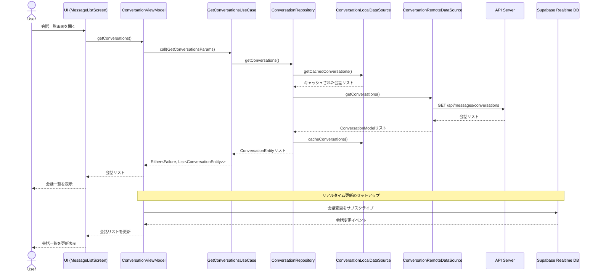
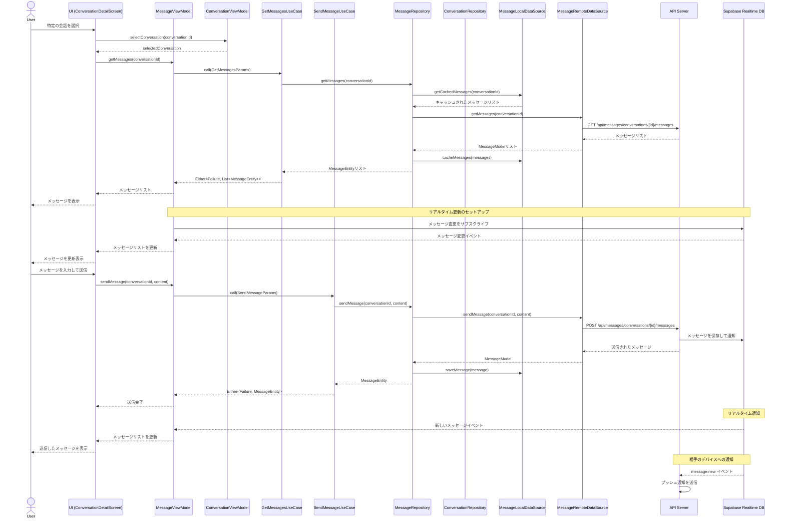
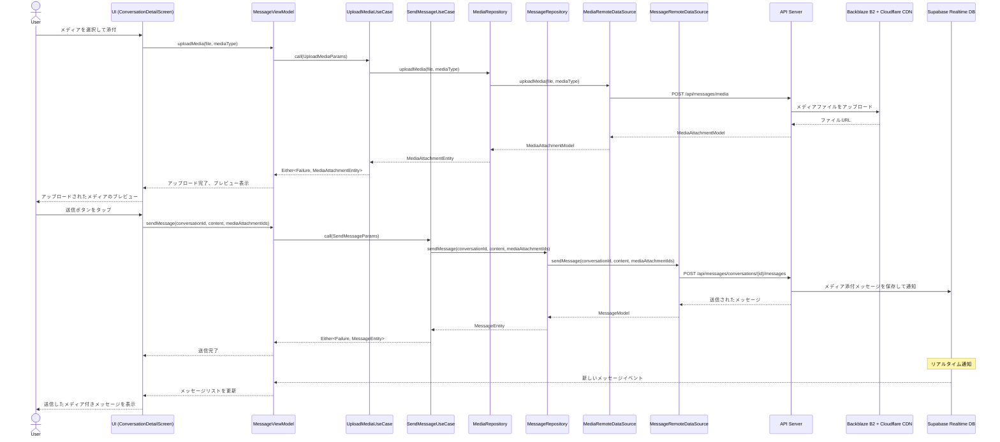
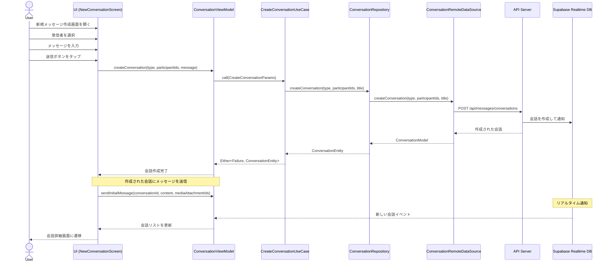
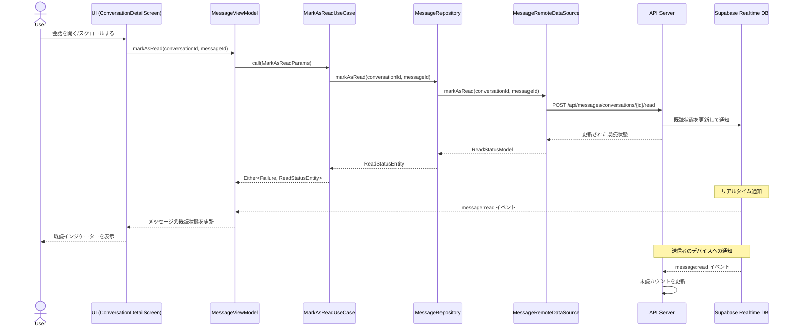
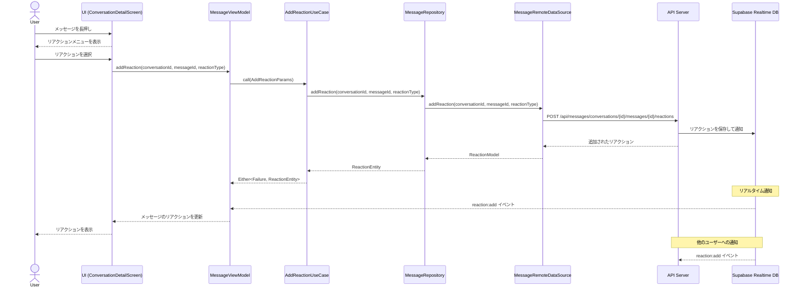
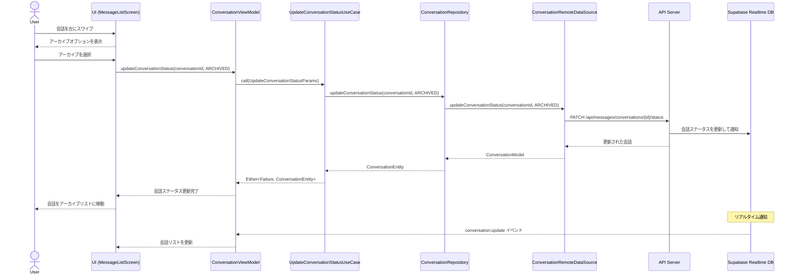
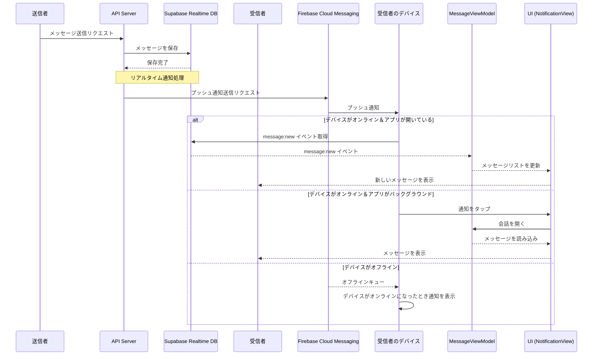
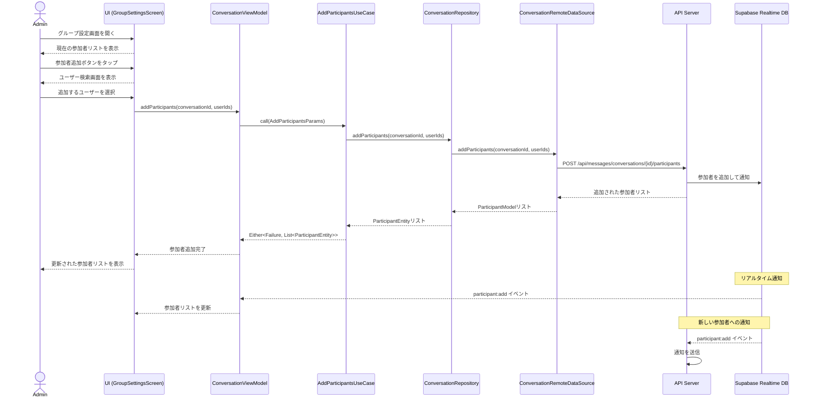
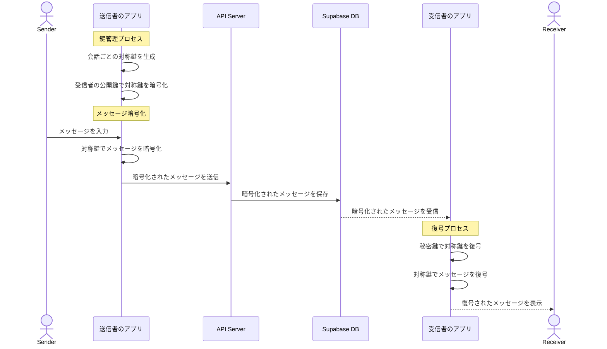

# ダイレクトメッセージ機能のシーケンス図

このドキュメントでは、ダイレクトメッセージ機能における主要な操作のシーケンス図を記述します。

## 1. 会話一覧の取得

## 2. メッセージの取得と送信

## 3. メディア添付のアップロードとメッセージ送信

## 4. 新規会話の作成

## 5. メッセージの既読状態の更新

## 6. メッセージへのリアクション追加

## 7. 会話のアーカイブ

## 8. リアルタイム通知の処理

## 9. グループメッセージの参加者管理（フェーズ2）

## 10. エンドツーエンド暗号化プロセス（フェーズ3）

