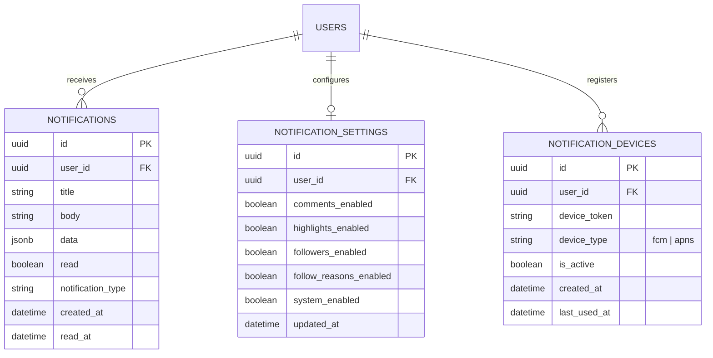

# 通知ドメインER図

## テーブル詳細

### NOTIFICATIONS
ユーザーに送信された通知の情報を管理します。

- **id**: 通知の一意識別子
- **user_id**: 通知の受信者であるユーザーのID（PROFILEテーブル参照）
- **title**: 通知のタイトル（表示名）
- **body**: 通知の本文
- **data**: 通知に関連する追加データ（JSON形式）
- **read**: 通知が既読かどうかを示すフラグ
- **notification_type**: 通知の種類（コメント、ハイライト、フォロワー、システムなど）
- **created_at**: 通知が作成された日時
- **read_at**: 通知が既読になった日時

### NOTIFICATION_SETTINGS
ユーザーごとの通知設定を管理します。

- **id**: 設定の一意識別子
- **user_id**: 設定を所有するユーザーのID（PROFILEテーブル参照）
- **comments_enabled**: コメント通知の有効/無効設定
- **highlights_enabled**: ハイライト通知の有効/無効設定
- **followers_enabled**: 新規フォロワー通知の有効/無効設定
- **follow_reasons_enabled**: フォロー理由通知の有効/無効設定
- **system_enabled**: システム通知の有効/無効設定
- **updated_at**: 設定が最後に更新された日時

### NOTIFICATION_DEVICES
ユーザーのデバイストークン情報を管理します。プッシュ通知の送信先として使用されます。

- **id**: デバイス登録の一意識別子
- **user_id**: デバイスを所有するユーザーのID（PROFILEテーブル参照）
- **device_token**: FCMまたはAPNsのデバイストークン
- **device_type**: トークンの種類（fcm または apns）
- **is_active**: デバイストークンがアクティブかどうか
- **created_at**: デバイスが登録された日時
- **last_used_at**: デバイスが最後に使用された日時

## リレーション

- **USERS - NOTIFICATIONS**: 1対多の関係。各ユーザーは複数の通知を受け取ります。
- **USERS - NOTIFICATION_SETTINGS**: 1対1の関係。各ユーザーは一つの通知設定を持ちます。
- **USERS - NOTIFICATION_DEVICES**: 1対多の関係。各ユーザーは複数のデバイスを登録できます。

## インデックス

- NOTIFICATIONS: user_id にインデックスを作成
- NOTIFICATIONS: (user_id, read) に複合インデックスを作成
- NOTIFICATIONS: (user_id, notification_type) に複合インデックスを作成
- NOTIFICATIONS: created_at にインデックスを作成
- NOTIFICATION_SETTINGS: user_id に一意性制約とインデックスを作成
- NOTIFICATION_DEVICES: user_id にインデックスを作成
- NOTIFICATION_DEVICES: device_token に一意性制約とインデックスを作成

## 技術的考慮点

1. **通知データの保持期間**: 通知データは一定期間（例：3ヶ月）後に自動的にアーカイブまたは削除することを検討します。

2. **プッシュ通知の配信**: Expo Push Service (FCM/APNs) を利用し、Database WebhookとEdge Functionの組み合わせで実装します。

3. **通知設定のデフォルト値**: 新規ユーザー登録時にデフォルトですべての通知が有効な状態で通知設定レコードを作成します。

4. **バッチ処理**: 特定のイベント（例：人気投稿の通知）では、多数のユーザーに同時に通知を送信する必要があるため、バッチ処理の仕組みを実装します。