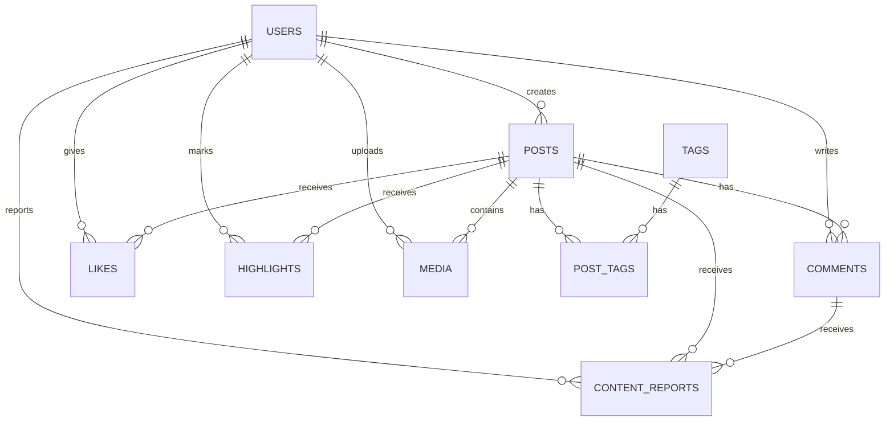

# 投稿ドメイン ER図

## 概要
投稿ドメインのエンティティ関連図を示します。このドメインは投稿の作成・管理、コメント、いいね、ハイライトなどのインタラクション機能を担当します。

## エンティティ一覧

| エンティティ名 | 説明 |
|------------|------|
| POSTS | ユーザーが作成したコンテンツ投稿 |
| COMMENTS | 投稿に対するコメント |
| LIKES | 投稿に対するいいね |
| HIGHLIGHTS | 特に重要とマークされた投稿 |
| MEDIA | 投稿に添付されるメディアファイル |
| TAGS | 投稿の分類やフィルタリングに使用されるタグ |
| POST_TAGS | 投稿とタグの関連付け |
| CONTENT_REPORTS | 不適切なコンテンツの報告 |

## ER図

## テーブル定義

### POSTS
投稿情報を格納するテーブル

| カラム名 | データ型 | NULL | 説明 |
|---------|---------|------|------|
| id | UUID | NO | 主キー |
| user_id | UUID | NO | 作成者ID（USERS.idへの外部キー） |
| content_type | ENUM | NO | 投稿タイプ（text, image, video, audio） |
| text_content | TEXT | YES | テキスト内容 |
| media_url | VARCHAR(255) | YES | メディアファイルURL |
| event_id | UUID | YES | 関連イベントID |
| is_public | BOOLEAN | NO | 公開設定 |
| created_at | TIMESTAMP | NO | 作成日時 |
| updated_at | TIMESTAMP | NO | 更新日時 |

- インデックス: (user_id), (content_type), (event_id), (created_at)

### COMMENTS
投稿に対するコメント情報を格納するテーブル

| カラム名 | データ型 | NULL | 説明 |
|---------|---------|------|------|
| id | UUID | NO | 主キー |
| post_id | UUID | NO | 対象投稿ID（POSTS.idへの外部キー） |
| user_id | UUID | NO | コメント者ID（USERS.idへの外部キー） |
| parent_comment_id | UUID | YES | 親コメントID（自己参照） |
| body | TEXT | NO | コメント本文 |
| created_at | TIMESTAMP | NO | 作成日時 |
| updated_at | TIMESTAMP | NO | 更新日時 |

- インデックス: (post_id), (user_id), (parent_comment_id)

### LIKES
いいね情報を格納するテーブル

| カラム名 | データ型 | NULL | 説明 |
|---------|---------|------|------|
| id | UUID | NO | 主キー |
| post_id | UUID | NO | 対象投稿ID（POSTS.idへの外部キー） |
| user_id | UUID | NO | いいねしたユーザーID（USERS.idへの外部キー） |
| created_at | TIMESTAMP | NO | 作成日時 |

- インデックス: (post_id), (user_id)
- ユニーク制約: (post_id, user_id) - 同じ投稿に対して同じユーザーは一度だけいいね可能

### HIGHLIGHTS
ハイライト情報を格納するテーブル

| カラム名 | データ型 | NULL | 説明 |
|---------|---------|------|------|
| id | UUID | NO | 主キー |
| post_id | UUID | NO | 対象投稿ID（POSTS.idへの外部キー） |
| user_id | UUID | NO | ハイライトしたユーザーID（USERS.idへの外部キー） |
| reason | TEXT | YES | ハイライトした理由 |
| created_at | TIMESTAMP | NO | 作成日時 |

- インデックス: (post_id), (user_id)
- ユニーク制約: (post_id, user_id) - 同じ投稿に対して同じユーザーは一度だけハイライト可能

### MEDIA
メディアファイル情報を格納するテーブル

| カラム名 | データ型 | NULL | 説明 |
|---------|---------|------|------|
| id | UUID | NO | 主キー |
| user_id | UUID | NO | アップロードしたユーザーID（USERS.idへの外部キー） |
| media_type | ENUM | NO | メディアタイプ（image, video, audio） |
| url | VARCHAR(255) | NO | ファイルURL |
| thumbnail_url | VARCHAR(255) | YES | サムネイルURL |
| metadata | JSONB | YES | メタデータ（サイズ、形式、長さなど） |
| created_at | TIMESTAMP | NO | 作成日時 |

- インデックス: (user_id), (media_type)

### TAGS
タグ情報を格納するテーブル

| カラム名 | データ型 | NULL | 説明 |
|---------|---------|------|------|
| id | UUID | NO | 主キー |
| name | VARCHAR(30) | NO | タグ名 |
| usage_count | INTEGER | NO | 使用回数 |
| created_at | TIMESTAMP | NO | 作成日時 |

- インデックス: (name), (usage_count)
- ユニーク制約: (name) - タグ名の重複は不可

### POST_TAGS
投稿とタグの関連付けを格納するテーブル

| カラム名 | データ型 | NULL | 説明 |
|---------|---------|------|------|
| post_id | UUID | NO | 投稿ID（POSTS.idへの外部キー） |
| tag_id | UUID | NO | タグID（TAGS.idへの外部キー） |
| created_at | TIMESTAMP | NO | 作成日時 |

- 主キー: (post_id, tag_id)
- インデックス: (post_id), (tag_id)

### CONTENT_REPORTS
不適切コンテンツ報告情報を格納するテーブル

| カラム名 | データ型 | NULL | 説明 |
|---------|---------|------|------|
| id | UUID | NO | 主キー |
| reporter_user_id | UUID | NO | 報告者のユーザーID（USERS.idへの外部キー） |
| content_id | UUID | NO | 報告されたコンテンツのID |
| content_type | ENUM | NO | コンテンツの種類（post, comment） |
| reason | ENUM | NO | 報告理由（inappropriate, spam, violence, copyright, other） |
| description | TEXT | YES | 報告の詳細説明 |
| status | ENUM | NO | 報告の状態（pending, reviewed, rejected, actioned） |
| created_at | TIMESTAMP | NO | 報告日時 |
| reviewed_at | TIMESTAMP | YES | レビュー日時 |

- インデックス: (reporter_user_id), (content_id, content_type), (status), (created_at)

## 関連図の詳細説明

1. **ユーザーと投稿の関連**:
   - ユーザーは複数の投稿を作成できる（1対多）
   - 各投稿は1人のユーザーに所有される

2. **投稿とインタラクションの関連**:
   - 投稿は複数のコメント、いいね、ハイライトを持つことができる（1対多）
   - 投稿は複数のタグを持つことができる（多対多、POST_TAGSテーブルで実現）
   - 投稿は複数のメディアファイルを含むことができる（1対多）

3. **ユーザーとインタラクションの関連**:
   - ユーザーは複数のコメント、いいね、ハイライトを行うことができる（1対多）
   - ユーザーは複数のメディアをアップロードできる（1対多）
   - ユーザーは複数のコンテンツを報告できる（1対多）

4. **コンテンツ報告の関連**:
   - 投稿とコメントの両方が報告対象になる（多態的関連）
   - レポートのcontent_typeフィールドで報告対象のタイプを区別

## 実装上の注意点

1. **トランザクション管理**:
   - 投稿の作成やメディアのアップロードなど、複数テーブルの操作が必要な場合はトランザクションを使用

2. **データ整合性**:
   - 外部キー制約を使用して参照整合性を確保
   - 削除時は関連するレコードも適切に処理（カスケード削除またはソフトデリート）

3. **パフォーマンス**:
   - 頻繁にアクセスされるクエリには適切なインデックスを設定
   - タグ検索やコンテンツフィルタリングは効率的なクエリを設計

4. **セキュリティ**:
   - ユーザー権限に基づいたアクセス制御
   - 入力データのバリデーションと無害化