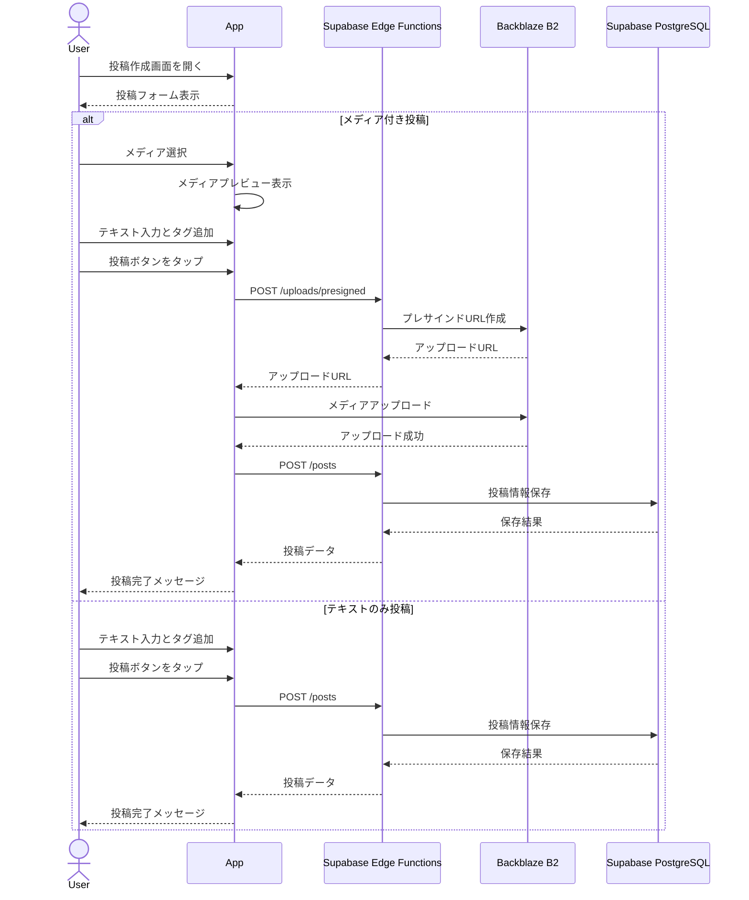
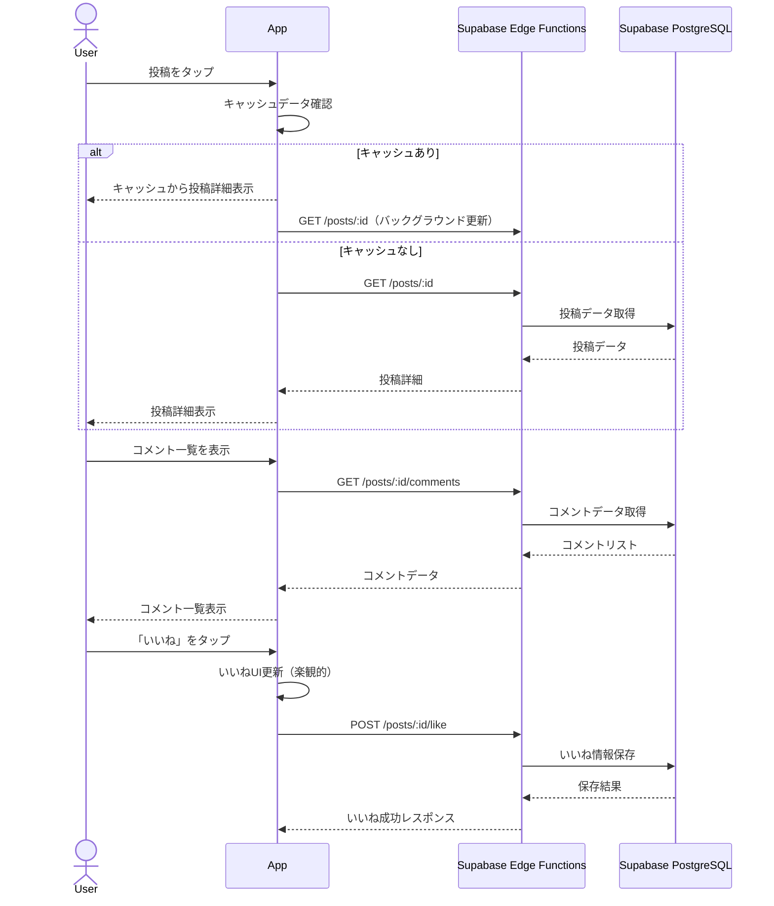
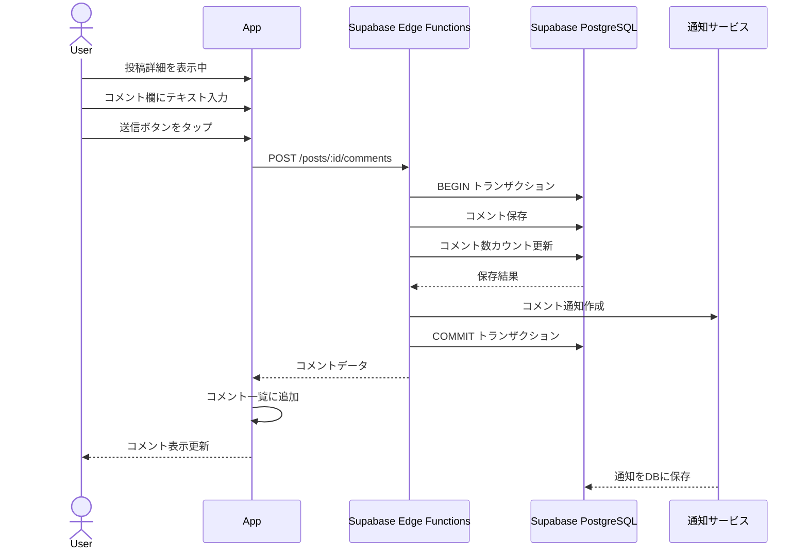
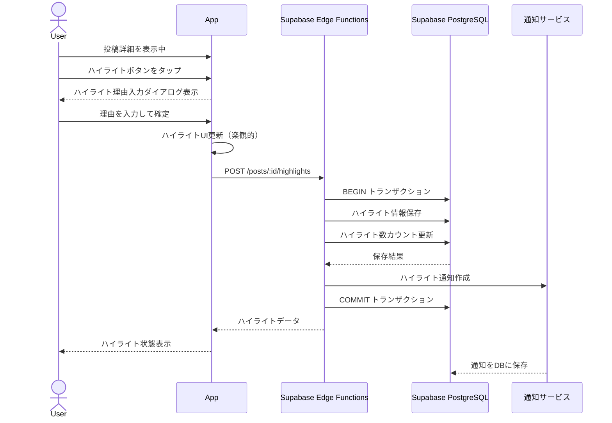
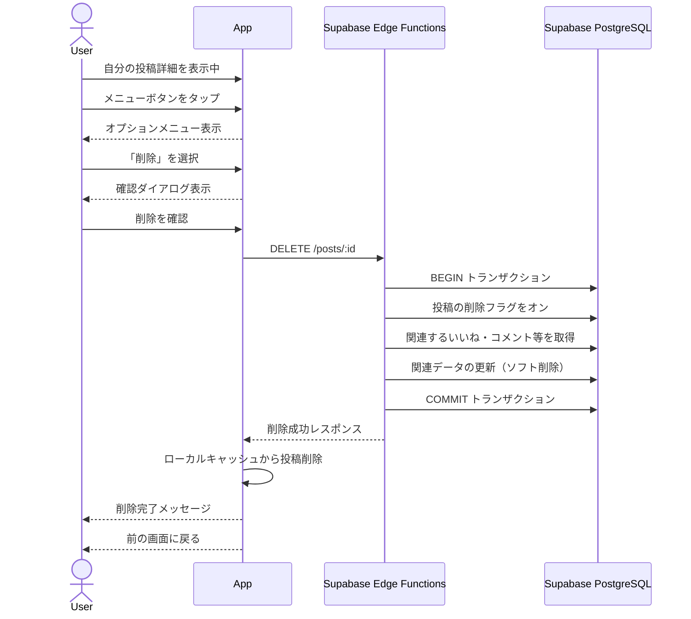
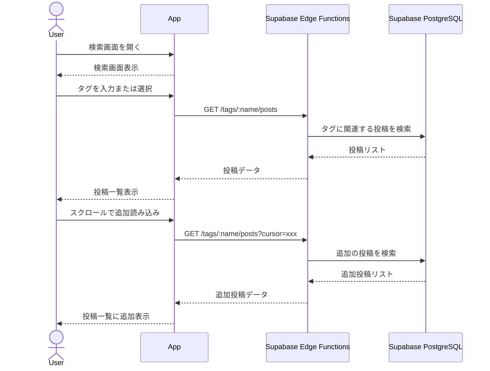
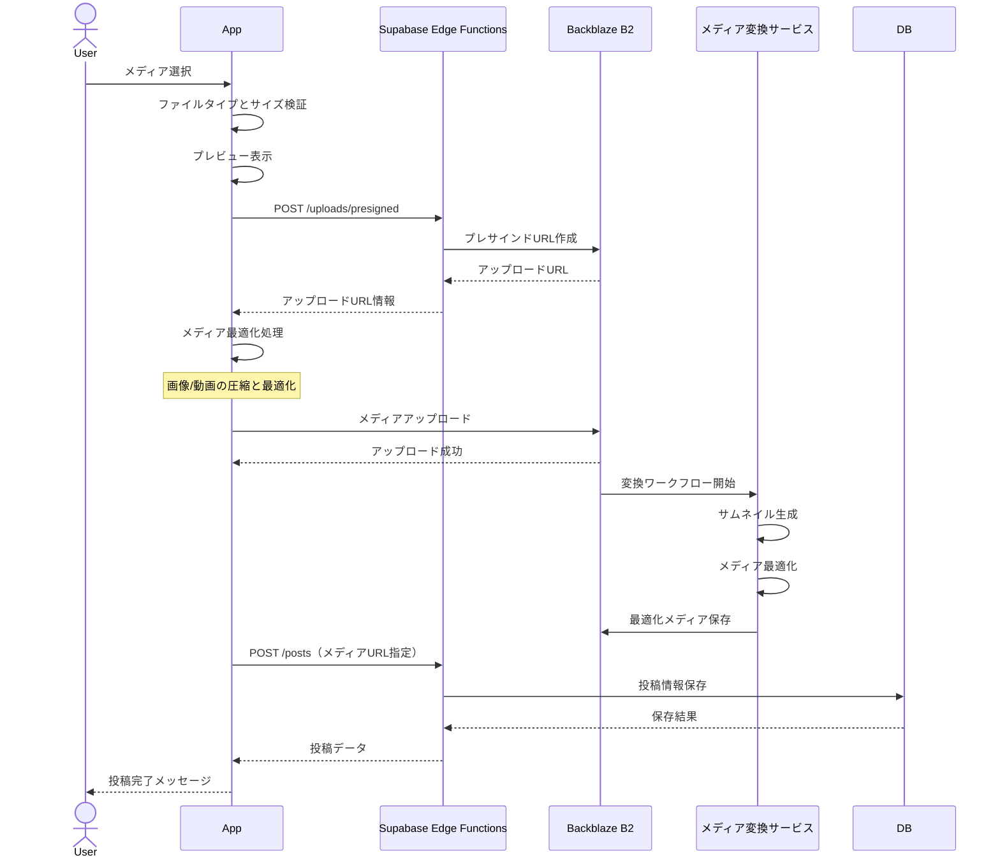
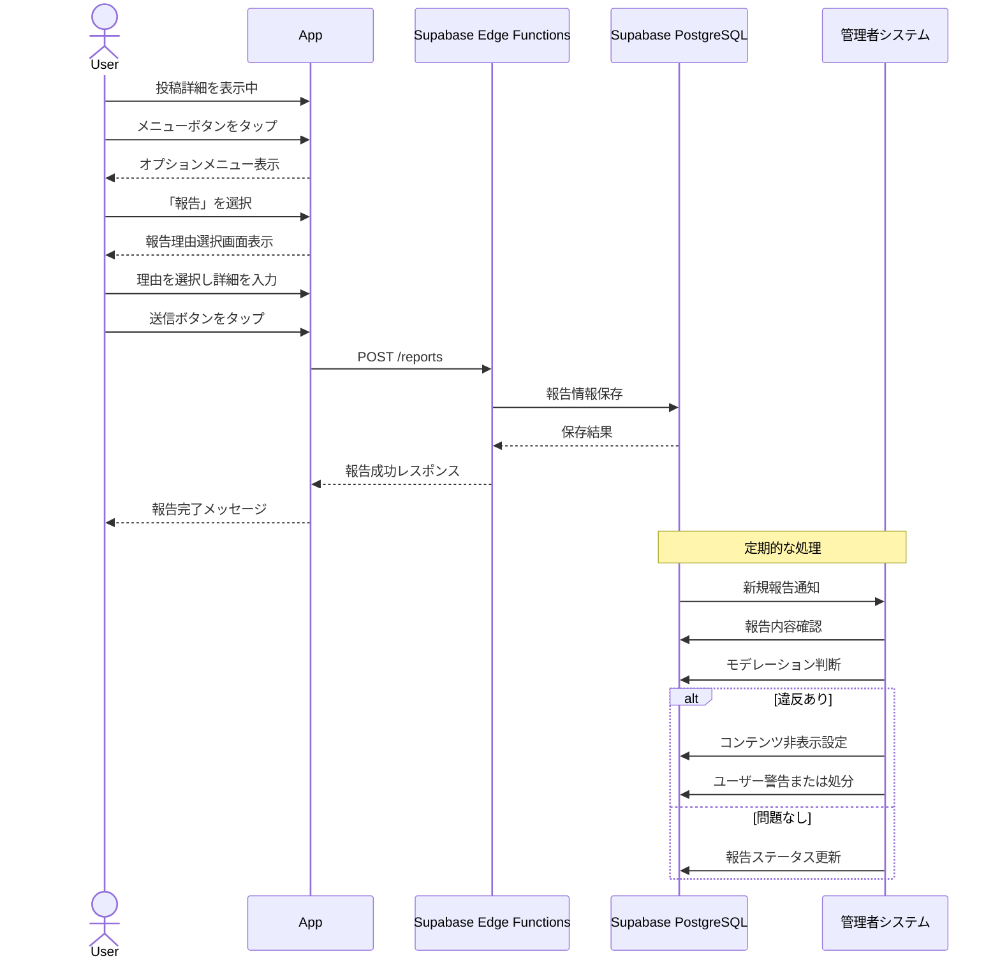

# 投稿ドメインシーケンス図

## 1. 投稿作成フロー

```mermaid
sequenceDiagram
    actor User
    participant App
    participant API as Supabase Edge Functions
    participant Storage as Backblaze B2
    participant DB as Supabase PostgreSQL
    
    User->>App: 投稿作成画面を開く
    App-->>User: 投稿フォーム表示
    
    alt メディア付き投稿
        User->>App: メディア選択
        App->>App: メディアプレビュー表示
        User->>App: テキスト入力とタグ追加
        User->>App: 投稿ボタンをタップ
        
        App->>API: POST /uploads/presigned
        API->>Storage: プレサインドURL作成
        Storage-->>API: アップロードURL
        API-->>App: アップロードURL
        
        App->>Storage: メディアアップロード
        Storage-->>App: アップロード成功
        
        App->>API: POST /posts
        API->>DB: 投稿情報保存
        DB-->>API: 保存結果
        API-->>App: 投稿データ
        App-->>User: 投稿完了メッセージ
    else テキストのみ投稿
        User->>App: テキスト入力とタグ追加
        User->>App: 投稿ボタンをタップ
        
        App->>API: POST /posts
        API->>DB: 投稿情報保存
        DB-->>API: 保存結果
        API-->>App: 投稿データ
        App-->>User: 投稿完了メッセージ
    end
```

## 2. 投稿詳細表示フロー

```mermaid
sequenceDiagram
    actor User
    participant App
    participant API as Supabase Edge Functions
    participant DB as Supabase PostgreSQL
    
    User->>App: 投稿をタップ
    App->>App: キャッシュデータ確認
    
    alt キャッシュあり
        App-->>User: キャッシュから投稿詳細表示
        App->>API: GET /posts/:id（バックグラウンド更新）
    else キャッシュなし
        App->>API: GET /posts/:id
        API->>DB: 投稿データ取得
        DB-->>API: 投稿データ
        API-->>App: 投稿詳細
        App-->>User: 投稿詳細表示
    end
    
    User->>App: コメント一覧を表示
    App->>API: GET /posts/:id/comments
    API->>DB: コメントデータ取得
    DB-->>API: コメントリスト
    API-->>App: コメントデータ
    App-->>User: コメント一覧表示
    
    User->>App: 「いいね」をタップ
    App->>App: いいねUI更新（楽観的）
    App->>API: POST /posts/:id/like
    API->>DB: いいね情報保存
    DB-->>API: 保存結果
    API-->>App: いいね成功レスポンス
```

## 3. コメント投稿フロー

```mermaid
sequenceDiagram
    actor User
    participant App
    participant API as Supabase Edge Functions
    participant DB as Supabase PostgreSQL
    participant Notify as 通知サービス
    
    User->>App: 投稿詳細を表示中
    User->>App: コメント欄にテキスト入力
    User->>App: 送信ボタンをタップ
    
    App->>API: POST /posts/:id/comments
    API->>DB: BEGIN トランザクション
    API->>DB: コメント保存
    API->>DB: コメント数カウント更新
    DB-->>API: 保存結果
    API->>Notify: コメント通知作成
    API->>DB: COMMIT トランザクション
    API-->>App: コメントデータ
    
    App->>App: コメント一覧に追加
    App-->>User: コメント表示更新
    
    Notify-->>DB: 通知をDBに保存
```

## 4. ハイライト操作フロー

```mermaid
sequenceDiagram
    actor User
    participant App
    participant API as Supabase Edge Functions
    participant DB as Supabase PostgreSQL
    participant Notify as 通知サービス
    
    User->>App: 投稿詳細を表示中
    User->>App: ハイライトボタンをタップ
    App-->>User: ハイライト理由入力ダイアログ表示
    User->>App: 理由を入力して確定
    
    App->>App: ハイライトUI更新（楽観的）
    App->>API: POST /posts/:id/highlights
    API->>DB: BEGIN トランザクション
    API->>DB: ハイライト情報保存
    API->>DB: ハイライト数カウント更新
    DB-->>API: 保存結果
    API->>Notify: ハイライト通知作成
    API->>DB: COMMIT トランザクション
    API-->>App: ハイライトデータ
    
    App-->>User: ハイライト状態表示
    Notify-->>DB: 通知をDBに保存
```

## 5. 投稿削除フロー

```mermaid
sequenceDiagram
    actor User
    participant App
    participant API as Supabase Edge Functions
    participant DB as Supabase PostgreSQL
    
    User->>App: 自分の投稿詳細を表示中
    User->>App: メニューボタンをタップ
    App-->>User: オプションメニュー表示
    User->>App: 「削除」を選択
    App-->>User: 確認ダイアログ表示
    User->>App: 削除を確認
    
    App->>API: DELETE /posts/:id
    API->>DB: BEGIN トランザクション
    API->>DB: 投稿の削除フラグをオン
    API->>DB: 関連するいいね・コメント等を取得
    API->>DB: 関連データの更新（ソフト削除）
    API->>DB: COMMIT トランザクション
    API-->>App: 削除成功レスポンス
    
    App->>App: ローカルキャッシュから投稿削除
    App-->>User: 削除完了メッセージ
    App-->>User: 前の画面に戻る
```

## 6. タグによる投稿検索フロー

```mermaid
sequenceDiagram
    actor User
    participant App
    participant API as Supabase Edge Functions
    participant DB as Supabase PostgreSQL
    
    User->>App: 検索画面を開く
    App-->>User: 検索画面表示
    User->>App: タグを入力または選択
    
    App->>API: GET /tags/:name/posts
    API->>DB: タグに関連する投稿を検索
    DB-->>API: 投稿リスト
    API-->>App: 投稿データ
    
    App-->>User: 投稿一覧表示
    
    User->>App: スクロールで追加読み込み
    App->>API: GET /tags/:name/posts?cursor=xxx
    API->>DB: 追加の投稿を検索
    DB-->>API: 追加投稿リスト
    API-->>App: 追加投稿データ
    App-->>User: 投稿一覧に追加表示
```

## 7. メディアアップロードフロー（詳細）

```mermaid
sequenceDiagram
    actor User
    participant App
    participant API as Supabase Edge Functions
    participant Storage as Backblaze B2
    participant Transform as メディア変換サービス
    
    User->>App: メディア選択
    App->>App: ファイルタイプとサイズ検証
    App->>App: プレビュー表示
    
    App->>API: POST /uploads/presigned
    API->>Storage: プレサインドURL作成
    Storage-->>API: アップロードURL
    API-->>App: アップロードURL情報
    
    App->>App: メディア最適化処理
    Note over App: 画像/動画の圧縮と最適化
    
    App->>Storage: メディアアップロード
    Storage-->>App: アップロード成功
    Storage->>Transform: 変換ワークフロー開始
    
    Transform->>Transform: サムネイル生成
    Transform->>Transform: メディア最適化
    Transform->>Storage: 最適化メディア保存
    
    App->>API: POST /posts（メディアURL指定）
    API->>DB: 投稿情報保存
    DB-->>API: 保存結果
    API-->>App: 投稿データ
    App-->>User: 投稿完了メッセージ
```

## 8. 不適切コンテンツ報告フロー

```mermaid
sequenceDiagram
    actor User
    participant App
    participant API as Supabase Edge Functions
    participant DB as Supabase PostgreSQL
    participant Admin as 管理者システム
    
    User->>App: 投稿詳細を表示中
    User->>App: メニューボタンをタップ
    App-->>User: オプションメニュー表示
    User->>App: 「報告」を選択
    App-->>User: 報告理由選択画面表示
    User->>App: 理由を選択し詳細を入力
    User->>App: 送信ボタンをタップ
    
    App->>API: POST /reports
    API->>DB: 報告情報保存
    DB-->>API: 保存結果
    API-->>App: 報告成功レスポンス
    App-->>User: 報告完了メッセージ
    
    Note over DB,Admin: 定期的な処理
    DB->>Admin: 新規報告通知
    Admin->>DB: 報告内容確認
    Admin->>DB: モデレーション判断
    
    alt 違反あり
        Admin->>DB: コンテンツ非表示設定
        Admin->>DB: ユーザー警告または処分
    else 問題なし
        Admin->>DB: 報告ステータス更新
    end
```