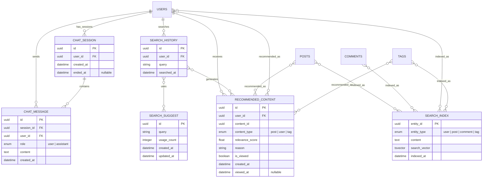

# 検索ドメインER図

## テーブル詳細

### CHAT_SESSION
AIチャットのセッションを管理します。各ユーザーは複数のチャットセッションを持つことができます。

**カラム詳細:**
- `id`: セッションの一意識別子
- `user_id`: セッションを所有するユーザーID（外部キー）
- `created_at`: セッション開始日時
- `ended_at`: セッション終了日時（終了していない場合はnull）

### CHAT_MESSAGE
AIチャットのメッセージを管理します。各メッセージはユーザーまたはAIアシスタントによるものです。

**カラム詳細:**
- `id`: メッセージの一意識別子
- `session_id`: メッセージが属するセッションID（外部キー）
- `user_id`: メッセージを送信したユーザーID（外部キー、AIの場合はnull）
- `role`: メッセージの送信元（user または assistant）
- `content`: メッセージの内容
- `created_at`: メッセージ送信日時

### SEARCH_HISTORY
ユーザーの検索履歴を管理します。

**カラム詳細:**
- `id`: 検索履歴の一意識別子
- `user_id`: 検索を実行したユーザーID（外部キー）
- `query`: 検索クエリ文字列
- `searched_at`: 検索実行日時

### SEARCH_SUGGEST
検索サジェストのデータを管理します。頻繁に検索されるクエリに基づいてサジェストを生成します。

**カラム詳細:**
- `id`: サジェストの一意識別子
- `query`: サジェストクエリ文字列
- `usage_count`: 使用回数
- `created_at`: 作成日時
- `updated_at`: 最終更新日時

### SEARCH_INDEX
全文検索のためのインデックスを管理します。ユーザー、投稿、コメント、タグなど異なるエンティティタイプに対して検索を効率化します。

**カラム詳細:**
- `entity_id`: 検索対象エンティティの一意識別子
- `entity_type`: エンティティのタイプ（ユーザー、投稿、コメント、タグ）
- `content`: 検索対象のテキストコンテンツ
- `search_vector`: 検索ベクトル（tsvector型、全文検索用）
- `indexed_at`: インデックス作成/更新日時

### RECOMMENDED_CONTENT
ユーザーの検索履歴や行動に基づいてパーソナライズされたコンテンツ推薦を管理します。

**カラム詳細:**
- `id`: 推薦の一意識別子
- `user_id`: 推薦対象のユーザーID（外部キー）
- `content_id`: 推薦されるコンテンツの一意識別子
- `content_type`: コンテンツのタイプ（投稿、ユーザー、タグ）
- `relevance_score`: 関連性スコア（0.0〜1.0）
- `reason`: 推薦理由
- `is_viewed`: 閲覧済みフラグ
- `created_at`: 推薦作成日時
- `viewed_at`: 閲覧日時（未閲覧の場合はnull）

## リレーション

- **USERS - CHAT_SESSION**: 1対多の関係。ユーザーは複数のチャットセッションを持つことができます。
- **USERS - CHAT_MESSAGE**: 1対多の関係。ユーザーは複数のチャットメッセージを送信できます。
- **USERS - SEARCH_HISTORY**: 1対多の関係。ユーザーは複数の検索履歴を持つことができます。
- **USERS - RECOMMENDED_CONTENT**: 1対多の関係。ユーザーは複数の推薦コンテンツを受け取ることができます。

- **CHAT_SESSION - CHAT_MESSAGE**: 1対多の関係。チャットセッションは複数のメッセージを含みます。
- **SEARCH_HISTORY - SEARCH_SUGGEST**: 多対多の関係。検索履歴は既存のサジェストを使用し、新しいサジェストを生成します。
- **SEARCH_HISTORY - RECOMMENDED_CONTENT**: 多対多の関係。検索履歴に基づいてコンテンツ推薦が生成されます。

- **POSTS - SEARCH_INDEX**: 多対多の関係。投稿は検索インデックスに登録されます。
- **COMMENTS - SEARCH_INDEX**: 多対多の関係。コメントは検索インデックスに登録されます。
- **USERS - SEARCH_INDEX**: 多対多の関係。ユーザーは検索インデックスに登録されます。
- **TAGS - SEARCH_INDEX**: 多対多の関係。タグは検索インデックスに登録されます。

- **POSTS - RECOMMENDED_CONTENT**: 多対多の関係。投稿は推薦コンテンツとして提案されることがあります。
- **USERS - RECOMMENDED_CONTENT**: 多対多の関係。ユーザーは推薦コンテンツとして提案されることがあります。
- **TAGS - RECOMMENDED_CONTENT**: 多対多の関係。タグは推薦コンテンツとして提案されることがあります。

## インデックス

- CHAT_SESSION: user_id にインデックスを作成
- CHAT_SESSION: created_at にインデックスを作成
- CHAT_SESSION: (user_id, created_at) に複合インデックスを作成

- CHAT_MESSAGE: session_id にインデックスを作成
- CHAT_MESSAGE: user_id にインデックスを作成
- CHAT_MESSAGE: (session_id, created_at) に複合インデックスを作成

- SEARCH_HISTORY: user_id にインデックスを作成
- SEARCH_HISTORY: query にインデックスを作成
- SEARCH_HISTORY: searched_at にインデックスを作成
- SEARCH_HISTORY: (user_id, searched_at) に複合インデックスを作成

- SEARCH_SUGGEST: query にインデックスを作成
- SEARCH_SUGGEST: usage_count にインデックスを作成

- SEARCH_INDEX: entity_id と entity_type に複合一意インデックスを作成
- SEARCH_INDEX: search_vector にGINインデックスを作成（全文検索向け）
- SEARCH_INDEX: indexed_at にインデックスを作成

- RECOMMENDED_CONTENT: user_id にインデックスを作成
- RECOMMENDED_CONTENT: (content_id, content_type) に複合インデックスを作成
- RECOMMENDED_CONTENT: relevance_score にインデックスを作成
- RECOMMENDED_CONTENT: is_viewed にインデックスを作成
- RECOMMENDED_CONTENT: (user_id, is_viewed, created_at) に複合インデックスを作成

## トリガー

- **検索履歴トリガー**: 新しい検索クエリが追加されたとき、SEARCH_SUGGEST テーブルを更新するトリガー
- **コンテンツ更新トリガー**: 投稿、コメント、ユーザープロフィール、タグが更新されたとき、対応する SEARCH_INDEX を更新するトリガー
- **推薦コンテンツトリガー**: 検索履歴が更新されたとき、RECOMMENDED_CONTENT テーブルに新しい推薦を生成するトリガー

## 特記事項

- 全文検索は MariaDB の全文検索機能を利用します
- 検索クエリは日に5回までの制限があります（ユーザーごと）
- チャットログは10年間保存されます
- 検索インデックスはバッチジョブによって定期的に更新されます
- 推薦コンテンツは検索履歴と行動履歴に基づいてアルゴリズムによって生成されます