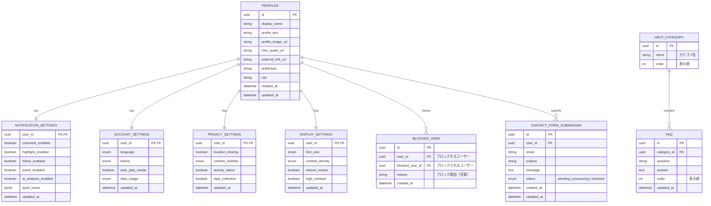

# 設定ドメインER図



## テーブル説明

### NOTIFICATION_SETTINGS（通知設定）
ユーザーの通知設定を管理するテーブル。どのタイプの通知を受け取るかの設定を保存します。

- **user_id**: ユーザーID（PROFILESテーブルへの外部キー）
- **comment_enabled**: コメント通知の有効/無効
- **highlight_enabled**: ハイライト通知の有効/無効
- **follow_enabled**: フォロー通知の有効/無効
- **event_enabled**: イベント通知の有効/無効
- **ai_analysis_enabled**: AI分析通知の有効/無効
- **quiet_hours**: 通知を抑制する時間帯設定（JSONBとして保存）
  ```json
  {
    "enabled": true,
    "start": "22:00",
    "end": "07:00"
  }
  ```
- **updated_at**: 最終更新日時

### ACCOUNT_SETTINGS（アカウント設定）
アプリの表示や動作に関するアカウント設定を管理するテーブル。

- **user_id**: ユーザーID（PROFILESテーブルへの外部キー）
- **language**: 言語設定（ja | en）
- **theme**: テーマ設定（light | dark | system）
- **auto_play_media**: メディアの自動再生設定
- **data_usage**: データ使用量設定（low | medium | high）
- **updated_at**: 最終更新日時

### PRIVACY_SETTINGS（プライバシー設定）
ユーザーのプライバシーとデータ共有に関する設定を管理するテーブル。

- **user_id**: ユーザーID（PROFILESテーブルへの外部キー）
- **location_sharing**: 位置情報共有の有効/無効
- **content_visibility**: 投稿の可視性デフォルト設定（public | family | private）
- **activity_status**: アクティビティステータスの表示有効/無効
- **data_collection**: 分析データ収集の許可有効/無効
- **updated_at**: 最終更新日時

### DISPLAY_SETTINGS（表示設定）
アプリの表示に関する設定を管理するテーブル。

- **user_id**: ユーザーID（PROFILESテーブルへの外部キー）
- **font_size**: 文字サイズ（small | medium | large）
- **content_density**: コンテンツ密度（compact | standard | comfortable）
- **reduce_motion**: モーション削減設定
- **high_contrast**: ハイコントラストモード設定
- **updated_at**: 最終更新日時

### BLOCKED_USER（ブロックユーザー）
ユーザーがブロックした他のユーザーを管理するテーブル。

- **id**: 一意の識別子
- **user_id**: ブロックするユーザーのID
- **blocked_user_id**: ブロックされるユーザーのID
- **reason**: ブロック理由（任意）
- **created_at**: ブロック作成日時

### HELP_CATEGORY（ヘルプカテゴリ）
FAQのカテゴリを管理するテーブル。

- **id**: カテゴリID
- **name**: カテゴリ名
- **order**: 表示順

### FAQ（よくある質問）
よくある質問とその回答を管理するテーブル。

- **id**: FAQ項目ID
- **category_id**: カテゴリID（HELP_CATEGORYテーブルへの外部キー）
- **question**: 質問文
- **answer**: 回答文
- **order**: 表示順
- **updated_at**: 最終更新日時

### CONTACT_FORM_SUBMISSION（お問い合わせ送信）
ユーザーからのお問い合わせ送信を管理するテーブル。

- **id**: 送信ID
- **user_id**: 送信したユーザーのID
- **email**: 連絡先メールアドレス
- **subject**: 件名
- **message**: 問い合わせ内容
- **status**: 対応状況（pending | processing | resolved）
- **created_at**: 送信日時
- **updated_at**: 最終更新日時

## インデックス設計

1. **NOTIFICATION_SETTINGS**
   - PRIMARY KEY: user_id

2. **ACCOUNT_SETTINGS**
   - PRIMARY KEY: user_id

3. **PRIVACY_SETTINGS**
   - PRIMARY KEY: user_id

4. **DISPLAY_SETTINGS**
   - PRIMARY KEY: user_id

5. **BLOCKED_USER**
   - PRIMARY KEY: id
   - INDEX: user_id
   - INDEX: blocked_user_id
   - UNIQUE INDEX: (user_id, blocked_user_id) - 同じユーザーを重複してブロックできないように

6. **HELP_CATEGORY**
   - PRIMARY KEY: id
   - INDEX: order

7. **FAQ**
   - PRIMARY KEY: id
   - INDEX: category_id
   - INDEX: order
   - FULL TEXT INDEX: question, answer - FAQ検索のため

8. **CONTACT_FORM_SUBMISSION**
   - PRIMARY KEY: id
   - INDEX: user_id
   - INDEX: status, created_at - ステータス別のソートや検索用