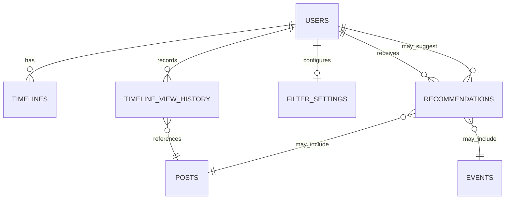

# タイムラインドメイン ER図

## 概要
タイムラインドメインのエンティティ関連図を示します。このドメインは投稿の表示、フィルタリング、閲覧履歴管理、おすすめ機能を担当します。タイムラインドメインは投稿ドメインのエンティティを参照します。

## エンティティ一覧

| エンティティ名 | 説明 |
|------------|------|
| TIMELINES | タイムライン表示の設定と状態 |
| TIMELINE_VIEW_HISTORY | ユーザーの投稿閲覧履歴 |
| FILTER_SETTINGS | ユーザーごとのタイムラインフィルター設定 |
| RECOMMENDATIONS | ユーザーへのおすすめコンテンツ |

## ER図

## テーブル定義

### TIMELINES
ユーザーごとのタイムライン設定を格納するテーブル

| カラム名 | データ型 | NULL | 説明 |
|---------|---------|------|------|
| id | UUID | NO | 主キー |
| user_id | UUID | NO | 対象ユーザーID（USERS.idへの外部キー） |
| type | ENUM | NO | タイムラインタイプ（family, watch, all） |
| settings | JSONB | YES | タイムライン表示設定 |
| last_refreshed_at | TIMESTAMP | NO | 最終更新日時 |
| created_at | TIMESTAMP | NO | 作成日時 |
| updated_at | TIMESTAMP | NO | 更新日時 |

- インデックス: (user_id, type), (last_refreshed_at)

### TIMELINE_VIEW_HISTORY
投稿閲覧履歴を格納するテーブル

| カラム名 | データ型 | NULL | 説明 |
|---------|---------|------|------|
| id | UUID | NO | 主キー |
| user_id | UUID | NO | ユーザーID（USERS.idへの外部キー） |
| post_id | UUID | NO | 閲覧した投稿ID（POSTS.idへの外部キー） |
| viewed_at | TIMESTAMP | NO | 閲覧日時 |
| view_duration | INTEGER | YES | 閲覧時間（秒） |
| completed | BOOLEAN | NO | 完全に閲覧したかどうか |
| device_info | JSONB | YES | 閲覧したデバイス情報 |

- インデックス: (user_id), (post_id), (viewed_at)
- ユニーク制約: (user_id, post_id, viewed_at) - 同じユーザーが同じ投稿を同じ時間に複数回閲覧することはない

### FILTER_SETTINGS
ユーザーごとのフィルター設定を格納するテーブル

| カラム名 | データ型 | NULL | 説明 |
|---------|---------|------|------|
| user_id | UUID | NO | 主キー、ユーザーID（USERS.idへの外部キー） |
| content_filters | JSONB | YES | コンテンツフィルター設定（表示/非表示） |
| blocked_terms | TEXT[] | YES | ブロックするキーワード配列 |
| blocked_users | UUID[] | YES | ブロックするユーザーID配列 |
| content_preferences | JSONB | YES | コンテンツ選好性の設定 |
| created_at | TIMESTAMP | NO | 作成日時 |
| updated_at | TIMESTAMP | NO | 更新日時 |

- インデックス: GIN(blocked_terms), GIN(blocked_users), GIN(content_preferences)

### RECOMMENDATIONS
おすすめコンテンツ情報を格納するテーブル

| カラム名 | データ型 | NULL | 説明 |
|---------|---------|------|------|
| id | UUID | NO | 主キー |
| user_id | UUID | NO | 対象ユーザーID（USERS.idへの外部キー） |
| type | ENUM | NO | 推薦タイプ（post, event, user） |
| target_id | UUID | NO | 推薦対象ID（タイプに応じてPOSTS.id, EVENTS.id, USERS.idを参照） |
| score | DECIMAL | NO | 推薦スコア（高いほど優先表示） |
| reason | JSONB | YES | 推薦理由 |
| is_shown | BOOLEAN | NO | 表示済みかどうか |
| created_at | TIMESTAMP | NO | 作成日時 |
| expires_at | TIMESTAMP | YES | 有効期限 |

- インデックス: (user_id, type), (target_id), (score), (expires_at)
- ユニーク制約: (user_id, type, target_id) - 同じユーザーに同じタイプの同じ対象の推薦は1つだけ

## 関連図の詳細説明

1. **ユーザーとタイムラインの関連**:
   - ユーザーは複数のタイムライン設定を持つことができる（1対多）
   - 各ユーザーはタイプごとに1つのタイムラインを持つ

2. **ユーザーと閲覧履歴の関連**:
   - ユーザーは複数の投稿閲覧履歴を持つ（1対多）
   - 閲覧履歴は投稿ドメインの投稿を参照する

3. **ユーザーとフィルター設定の関連**:
   - 各ユーザーは1つのフィルター設定を持つ（1対1）

4. **ユーザーとおすすめの関連**:
   - ユーザーは複数のおすすめを受け取る（1対多）
   - おすすめは投稿、イベント、またはユーザーを参照する

5. **投稿ドメインとの連携**:
   - タイムラインドメインは投稿ドメインからデータを取得して表示
   - 閲覧履歴とおすすめは投稿ドメインの投稿を参照

## 実装上の注意点

1. **ドメイン間の依存関係**:
   - タイムラインドメインは投稿ドメインに依存するが、逆は依存しない
   - 両ドメイン間の契約はインターフェースを通じて定義

2. **パフォーマンス最適化**:
   - タイムライン生成は大量のデータを扱うため、効率的なクエリ設計が必要
   - 閲覧履歴は定期的に集計・圧縮して長期保存する
   - おすすめは非同期で生成し、キャッシュを活用

3. **プライバシー考慮**:
   - 閲覧履歴データの保存期間と匿名化ポリシーを明確に定義
   - フィルター設定に個人情報が含まれる場合は適切に暗号化

4. **スケーラビリティ**:
   - タイムライン生成処理は分散処理に対応
   - フィルタリングやおすすめアルゴリズムは拡張可能な設計

5. **オフライン対応**:
   - タイムラインデータはローカルキャッシュに保存してオフライン表示に対応
   - 閲覧履歴はオフライン時も記録し、オンライン復帰時に同期