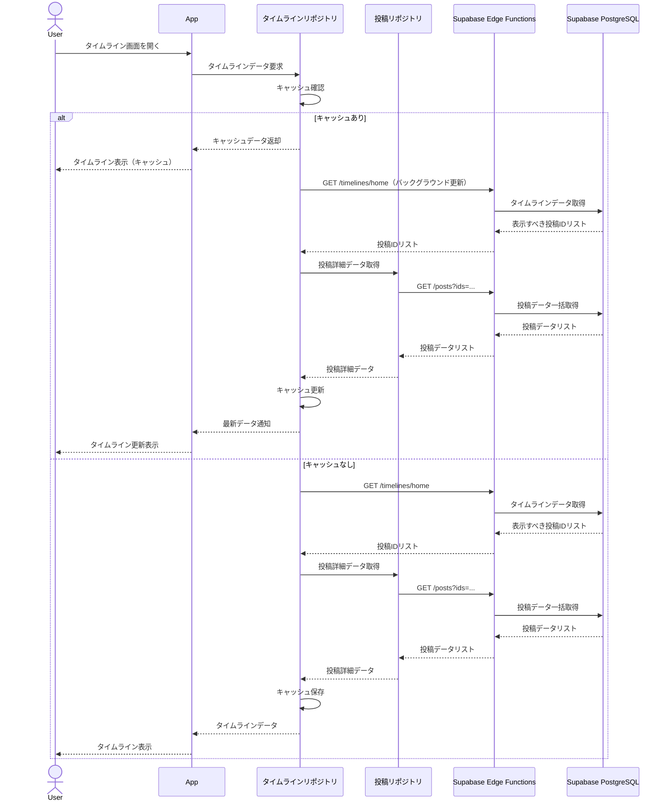
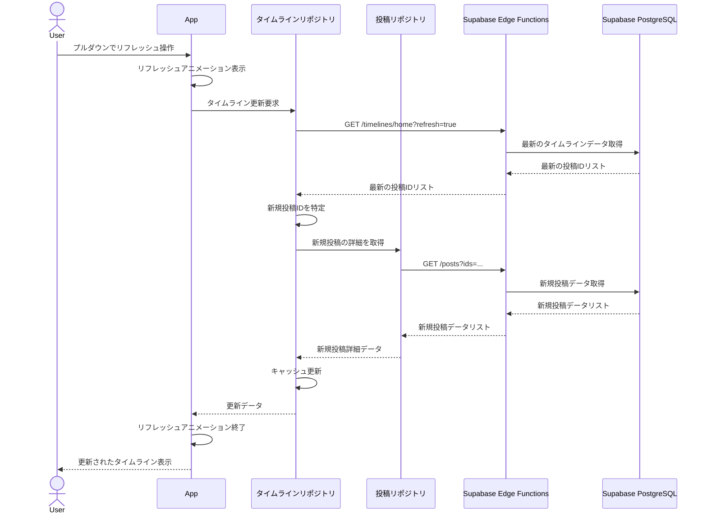
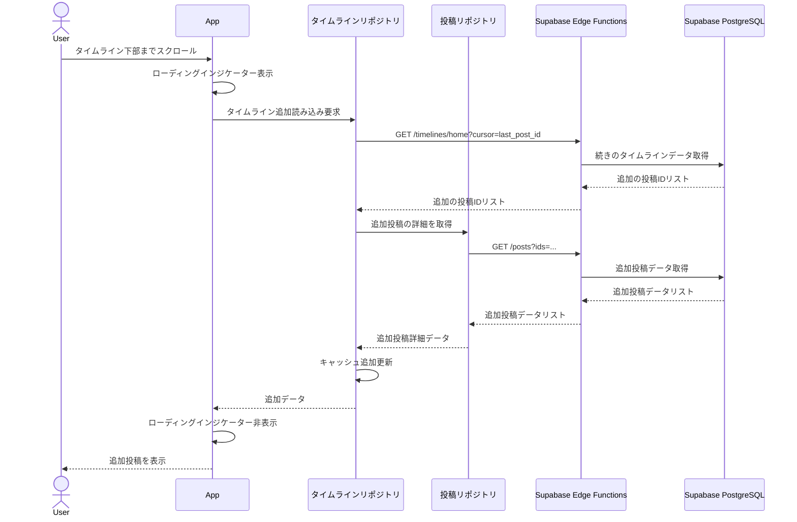
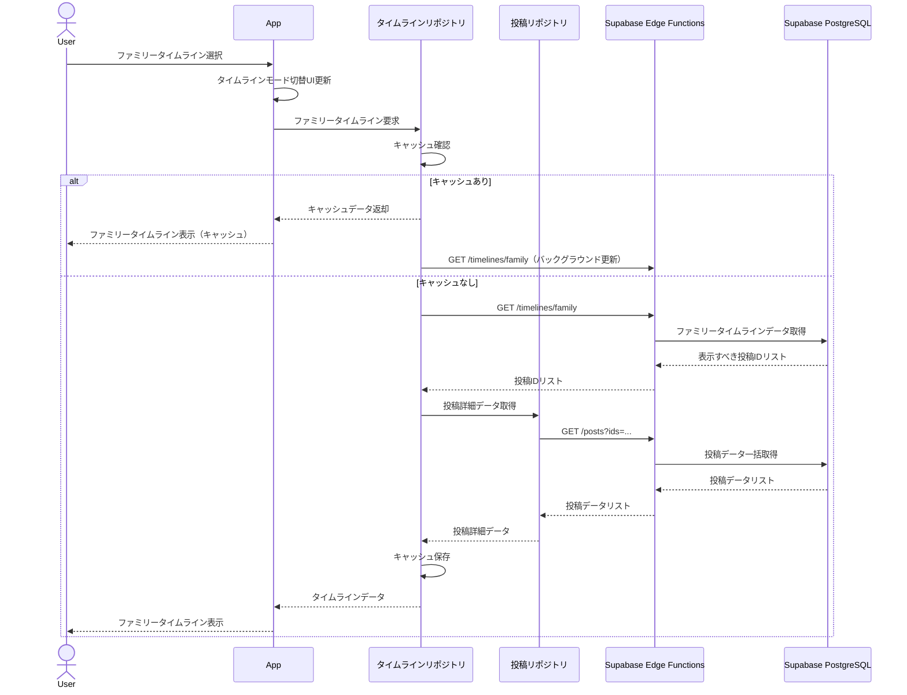
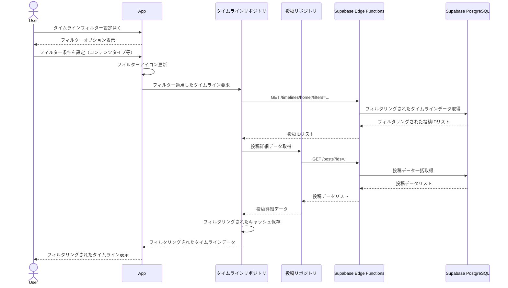

# タイムラインドメインシーケンス図

## 1. タイムライン表示フロー

```mermaid
sequenceDiagram
    actor User
    participant App
    participant TimelineRepo as タイムラインリポジトリ
    participant PostRepo as 投稿リポジトリ
    participant API as Supabase Edge Functions
    participant DB as Supabase PostgreSQL
    
    User->>App: タイムライン画面を開く
    App->>TimelineRepo: タイムラインデータ要求
    TimelineRepo->>TimelineRepo: キャッシュ確認
    
    alt キャッシュあり
        TimelineRepo-->>App: キャッシュデータ返却
        App-->>User: タイムライン表示（キャッシュ）
        
        TimelineRepo->>API: GET /timelines/home（バックグラウンド更新）
        API->>DB: タイムラインデータ取得
        DB-->>API: 表示すべき投稿IDリスト
        API-->>TimelineRepo: 投稿IDリスト
        
        TimelineRepo->>PostRepo: 投稿詳細データ取得
        PostRepo->>API: GET /posts?ids=...
        API->>DB: 投稿データ一括取得
        DB-->>API: 投稿データリスト
        API-->>PostRepo: 投稿データリスト
        PostRepo-->>TimelineRepo: 投稿詳細データ
        
        TimelineRepo->>TimelineRepo: キャッシュ更新
        TimelineRepo-->>App: 最新データ通知
        App-->>User: タイムライン更新表示
    else キャッシュなし
        TimelineRepo->>API: GET /timelines/home
        API->>DB: タイムラインデータ取得
        DB-->>API: 表示すべき投稿IDリスト
        API-->>TimelineRepo: 投稿IDリスト
        
        TimelineRepo->>PostRepo: 投稿詳細データ取得
        PostRepo->>API: GET /posts?ids=...
        API->>DB: 投稿データ一括取得
        DB-->>API: 投稿データリスト
        API-->>PostRepo: 投稿データリスト
        PostRepo-->>TimelineRepo: 投稿詳細データ
        
        TimelineRepo->>TimelineRepo: キャッシュ保存
        TimelineRepo-->>App: タイムラインデータ
        App-->>User: タイムライン表示
    end
```

## 2. タイムライン更新フロー（プルトゥリフレッシュ）

```mermaid
sequenceDiagram
    actor User
    participant App
    participant TimelineRepo as タイムラインリポジトリ
    participant PostRepo as 投稿リポジトリ
    participant API as Supabase Edge Functions
    participant DB as Supabase PostgreSQL
    
    User->>App: プルダウンでリフレッシュ操作
    App->>App: リフレッシュアニメーション表示
    App->>TimelineRepo: タイムライン更新要求
    
    TimelineRepo->>API: GET /timelines/home?refresh=true
    API->>DB: 最新のタイムラインデータ取得
    DB-->>API: 最新の投稿IDリスト
    API-->>TimelineRepo: 最新の投稿IDリスト
    
    TimelineRepo->>TimelineRepo: 新規投稿IDを特定
    TimelineRepo->>PostRepo: 新規投稿の詳細を取得
    PostRepo->>API: GET /posts?ids=...
    API->>DB: 新規投稿データ取得
    DB-->>API: 新規投稿データリスト
    API-->>PostRepo: 新規投稿データリスト
    PostRepo-->>TimelineRepo: 新規投稿詳細データ
    
    TimelineRepo->>TimelineRepo: キャッシュ更新
    TimelineRepo-->>App: 更新データ
    App->>App: リフレッシュアニメーション終了
    App-->>User: 更新されたタイムライン表示
```

## 3. タイムライン追加読み込みフロー（無限スクロール）

```mermaid
sequenceDiagram
    actor User
    participant App
    participant TimelineRepo as タイムラインリポジトリ
    participant PostRepo as 投稿リポジトリ
    participant API as Supabase Edge Functions
    participant DB as Supabase PostgreSQL
    
    User->>App: タイムライン下部までスクロール
    App->>App: ローディングインジケーター表示
    App->>TimelineRepo: タイムライン追加読み込み要求
    
    TimelineRepo->>API: GET /timelines/home?cursor=last_post_id
    API->>DB: 続きのタイムラインデータ取得
    DB-->>API: 追加の投稿IDリスト
    API-->>TimelineRepo: 追加の投稿IDリスト
    
    TimelineRepo->>PostRepo: 追加投稿の詳細を取得
    PostRepo->>API: GET /posts?ids=...
    API->>DB: 追加投稿データ取得
    DB-->>API: 追加投稿データリスト
    API-->>PostRepo: 追加投稿データリスト
    PostRepo-->>TimelineRepo: 追加投稿詳細データ
    
    TimelineRepo->>TimelineRepo: キャッシュ追加更新
    TimelineRepo-->>App: 追加データ
    App->>App: ローディングインジケーター非表示
    App-->>User: 追加投稿を表示
```

## 4. ファミリータイムライン切替フロー

```mermaid
sequenceDiagram
    actor User
    participant App
    participant TimelineRepo as タイムラインリポジトリ
    participant PostRepo as 投稿リポジトリ
    participant API as Supabase Edge Functions
    participant DB as Supabase PostgreSQL
    
    User->>App: ファミリータイムライン選択
    App->>App: タイムラインモード切替UI更新
    App->>TimelineRepo: ファミリータイムライン要求
    
    TimelineRepo->>TimelineRepo: キャッシュ確認
    
    alt キャッシュあり
        TimelineRepo-->>App: キャッシュデータ返却
        App-->>User: ファミリータイムライン表示（キャッシュ）
        
        TimelineRepo->>API: GET /timelines/family（バックグラウンド更新）
    else キャッシュなし
        TimelineRepo->>API: GET /timelines/family
        API->>DB: ファミリータイムラインデータ取得
        DB-->>API: 表示すべき投稿IDリスト
        API-->>TimelineRepo: 投稿IDリスト
        
        TimelineRepo->>PostRepo: 投稿詳細データ取得
        PostRepo->>API: GET /posts?ids=...
        API->>DB: 投稿データ一括取得
        DB-->>API: 投稿データリスト
        API-->>PostRepo: 投稿データリスト
        PostRepo-->>TimelineRepo: 投稿詳細データ
        
        TimelineRepo->>TimelineRepo: キャッシュ保存
        TimelineRepo-->>App: タイムラインデータ
        App-->>User: ファミリータイムライン表示
    end
```

## 5. タイムラインフィルタリングフロー

```mermaid
sequenceDiagram
    actor User
    participant App
    participant TimelineRepo as タイムラインリポジトリ
    participant PostRepo as 投稿リポジトリ
    participant API as Supabase Edge Functions
    participant DB as Supabase PostgreSQL
    
    User->>App: タイムラインフィルター設定開く
    App-->>User: フィルターオプション表示
    User->>App: フィルター条件を設定（コンテンツタイプ等）
    App->>App: フィルターアイコン更新
    
    App->>TimelineRepo: フィルター適用したタイムライン要求
    TimelineRepo->>API: GET /timelines/home?filters=...
    API->>DB: フィルタリングされたタイムラインデータ取得
    DB-->>API: フィルタリングされた投稿IDリスト
    API-->>TimelineRepo: 投稿IDリスト
    
    TimelineRepo->>PostRepo: 投稿詳細データ取得
    PostRepo->>API: GET /posts?ids=...
    API->>DB: 投稿データ一括取得
    DB-->>API: 投稿データリスト
    API-->>PostRepo: 投稿データリスト
    PostRepo-->>TimelineRepo: 投稿詳細データ
    
    TimelineRepo->>TimelineRepo: フィルタリングされたキャッシュ保存
    TimelineRepo-->>App: フィルタリングされたタイムラインデータ
    App-->>User: フィルタリングされたタイムライン表示
```