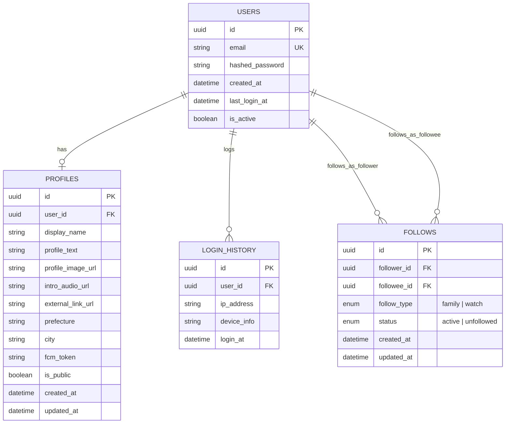

# ユーザードメインER図

## テーブル詳細

### USERS
ユーザーアカウントの基本情報を管理します。認証情報やアカウント状態を含みます。

### PROFILES
ユーザープロフィール情報を管理します。ユーザーの表示情報や自己紹介、地域情報などを含みます。

### FOLLOWS
ユーザー間のフォロー関係を管理します。「family」と「watch」の二種類のフォロータイプをサポートします。

### LOGIN_HISTORY
ユーザーのログイン履歴を記録します。セキュリティとアカウント分析のために使用されます。

## リレーション

- **USERS - PROFILES**: 1対1の関係。各ユーザーは一つのプロフィールを持ちます。
- **USERS - LOGIN_HISTORY**: 1対多の関係。各ユーザーは複数のログイン履歴を持ちます。
- **USERS - FOLLOWS**: 
  - ユーザーはフォローする側（follower_id）として複数のフォロー関係を持ちます。
  - ユーザーはフォローされる側（followee_id）として複数のフォロー関係を持ちます。

## インデックス

- PROFILES: user_id にインデックスを作成
- PROFILES: prefecture, city に複合インデックスを作成
- FOLLOWS: follower_id にインデックスを作成
- FOLLOWS: followee_id にインデックスを作成
- FOLLOWS: (follower_id, followee_id) に一意性制約とインデックスを作成
- LOGIN_HISTORY: user_id, login_at に複合インデックスを作成