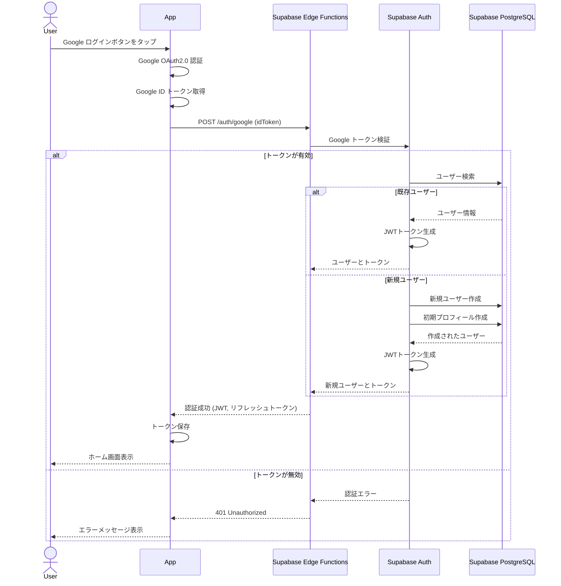
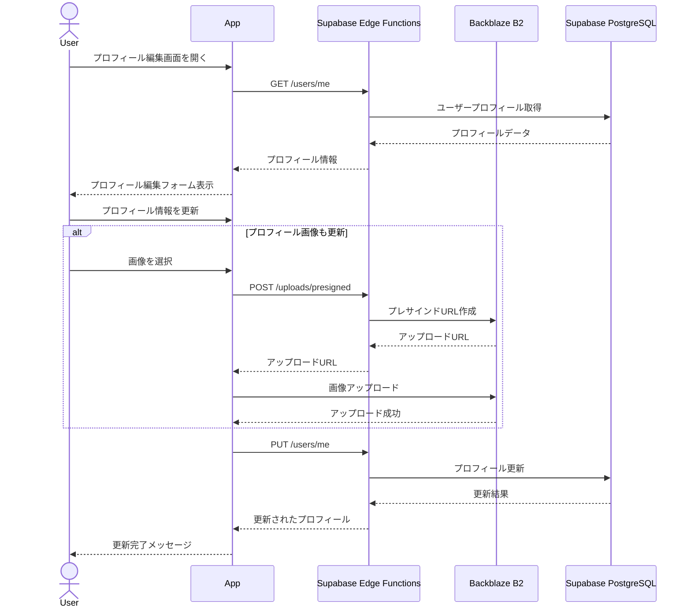
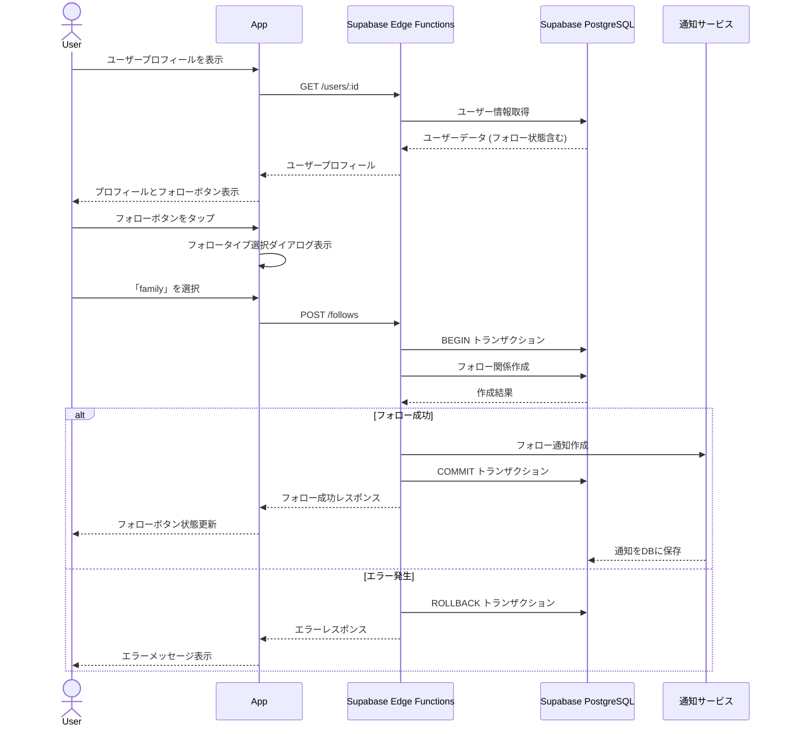
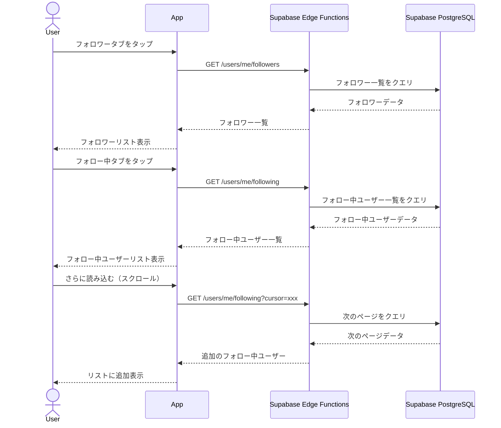
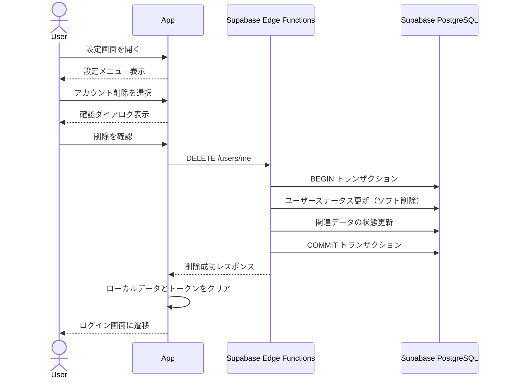

# ユーザードメインシーケンス図

## 1. ユーザー認証フロー

```mermaid
sequenceDiagram
    actor User
    participant App
    participant API as Supabase Edge Functions
    participant Auth as Supabase Auth
    participant DB as Supabase PostgreSQL
    
    User->>App: Google ログインボタンをタップ
    App->>App: Google OAuth2.0 認証
    App->>App: Google ID トークン取得
    App->>API: POST /auth/google (idToken)
    API->>Auth: Google トークン検証
    
    alt トークンが有効
        Auth->>DB: ユーザー検索
        
        alt 既存ユーザー
            DB-->>Auth: ユーザー情報
            Auth->>Auth: JWTトークン生成
            Auth-->>API: ユーザーとトークン
        else 新規ユーザー
            Auth->>DB: 新規ユーザー作成
            Auth->>DB: 初期プロフィール作成
            DB-->>Auth: 作成されたユーザー
            Auth->>Auth: JWTトークン生成
            Auth-->>API: 新規ユーザーとトークン
        end
        
        API-->>App: 認証成功 (JWT, リフレッシュトークン)
        App->>App: トークン保存
        App-->>User: ホーム画面表示
    else トークンが無効
        Auth-->>API: 認証エラー
        API-->>App: 401 Unauthorized
        App-->>User: エラーメッセージ表示
    end
```

## 2. プロフィール更新フロー

```mermaid
sequenceDiagram
    actor User
    participant App
    participant API as Supabase Edge Functions
    participant Storage as Backblaze B2
    participant DB as Supabase PostgreSQL
    
    User->>App: プロフィール編集画面を開く
    App->>API: GET /users/me
    API->>DB: ユーザープロフィール取得
    DB-->>API: プロフィールデータ
    API-->>App: プロフィール情報
    App-->>User: プロフィール編集フォーム表示
    
    User->>App: プロフィール情報を更新
    
    alt プロフィール画像も更新
        User->>App: 画像を選択
        App->>API: POST /uploads/presigned
        API->>Storage: プレサインドURL作成
        Storage-->>API: アップロードURL
        API-->>App: アップロードURL
        App->>Storage: 画像アップロード
        Storage-->>App: アップロード成功
    end
    
    App->>API: PUT /users/me
    API->>DB: プロフィール更新
    DB-->>API: 更新結果
    API-->>App: 更新されたプロフィール
    App-->>User: 更新完了メッセージ
```

## 3. フォロー操作フロー

```mermaid
sequenceDiagram
    actor User
    participant App
    participant API as Supabase Edge Functions
    participant DB as Supabase PostgreSQL
    participant Notify as 通知サービス
    
    User->>App: ユーザープロフィールを表示
    App->>API: GET /users/:id
    API->>DB: ユーザー情報取得
    DB-->>API: ユーザーデータ (フォロー状態含む)
    API-->>App: ユーザープロフィール
    App-->>User: プロフィールとフォローボタン表示
    
    User->>App: フォローボタンをタップ
    App->>App: フォロータイプ選択ダイアログ表示
    User->>App: 「family」を選択
    
    App->>API: POST /follows
    API->>DB: BEGIN トランザクション
    API->>DB: フォロー関係作成
    DB-->>API: 作成結果
    
    alt フォロー成功
        API->>Notify: フォロー通知作成
        API->>DB: COMMIT トランザクション
        API-->>App: フォロー成功レスポンス
        App-->>User: フォローボタン状態更新
        Notify-->>DB: 通知をDBに保存
    else エラー発生
        API->>DB: ROLLBACK トランザクション
        API-->>App: エラーレスポンス
        App-->>User: エラーメッセージ表示
    end
```

## 4. フォロー一覧取得フロー

```mermaid
sequenceDiagram
    actor User
    participant App
    participant API as Supabase Edge Functions
    participant DB as Supabase PostgreSQL
    
    User->>App: フォロワータブをタップ
    App->>API: GET /users/me/followers
    API->>DB: フォロワー一覧をクエリ
    DB-->>API: フォロワーデータ
    API-->>App: フォロワー一覧
    App-->>User: フォロワーリスト表示
    
    User->>App: フォロー中タブをタップ
    App->>API: GET /users/me/following
    API->>DB: フォロー中ユーザー一覧をクエリ
    DB-->>API: フォロー中ユーザーデータ
    API-->>App: フォロー中ユーザー一覧
    App-->>User: フォロー中ユーザーリスト表示
    
    User->>App: さらに読み込む（スクロール）
    App->>API: GET /users/me/following?cursor=xxx
    API->>DB: 次のページをクエリ
    DB-->>API: 次のページデータ
    API-->>App: 追加のフォロー中ユーザー
    App-->>User: リストに追加表示
```

## 5. アカウント削除フロー

```mermaid
sequenceDiagram
    actor User
    participant App
    participant API as Supabase Edge Functions
    participant DB as Supabase PostgreSQL
    
    User->>App: 設定画面を開く
    App-->>User: 設定メニュー表示
    User->>App: アカウント削除を選択
    App-->>User: 確認ダイアログ表示
    User->>App: 削除を確認
    
    App->>API: DELETE /users/me
    API->>DB: BEGIN トランザクション
    API->>DB: ユーザーステータス更新（ソフト削除）
    API->>DB: 関連データの状態更新
    API->>DB: COMMIT トランザクション
    
    API-->>App: 削除成功レスポンス
    App->>App: ローカルデータとトークンをクリア
    App-->>User: ログイン画面に遷移
```