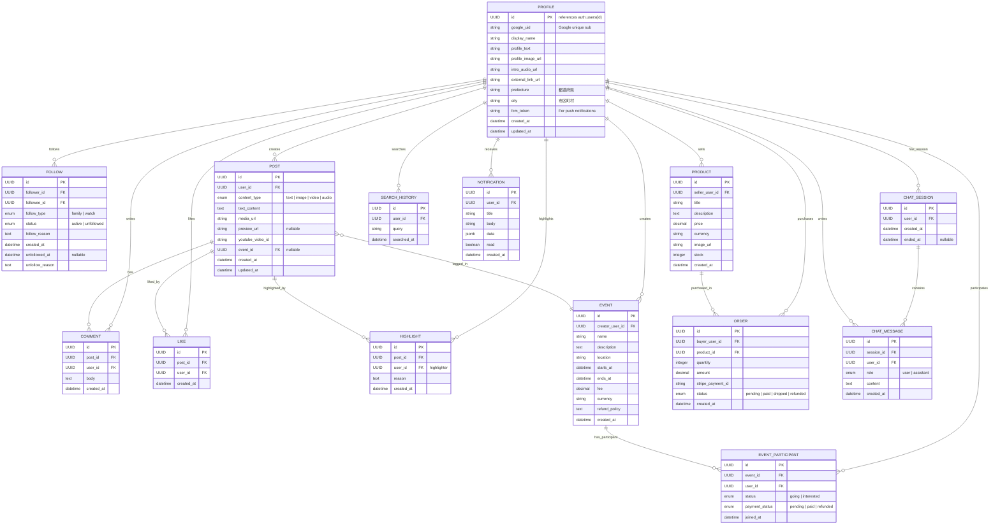

```mermaid
erDiagram
    PROFILE {
        UUID id PK "references auth.users(id)"
        string google_uid "Google unique sub"
        string display_name
        string profile_text
        string profile_image_url
        string intro_audio_url
        string external_link_url
        string prefecture "都道府県"
        string city "市区町村"
        string fcm_token "For push notifications"
        datetime created_at
        datetime updated_at
    }

    FOLLOW {
        UUID id PK
        UUID follower_id FK
        UUID followee_id FK
        enum follow_type "family | watch"
        enum status "active | unfollowed"
        text follow_reason
        datetime created_at
        datetime unfollowed_at "nullable"
        text unfollow_reason
    }

    POST {
        UUID id PK
        UUID user_id FK
        enum content_type "text | image | video | audio"
        text text_content
        string media_url
        string preview_url "nullable"
        string youtube_video_id
        UUID event_id FK "nullable"
        datetime created_at
        datetime updated_at
    }

    COMMENT {
        UUID id PK
        UUID post_id FK
        UUID user_id FK
        text body
        datetime created_at
    }

    LIKE {
        UUID id PK
        UUID post_id FK
        UUID user_id FK
        datetime created_at
    }

    HIGHLIGHT {
        UUID id PK
        UUID post_id FK
        UUID user_id FK "highlighter"
        text reason
        datetime created_at
    }

    EVENT {
        UUID id PK
        UUID creator_user_id FK
        string name
        text description
        string location
        datetime starts_at
        datetime ends_at
        decimal fee
        string currency
        text refund_policy
        datetime created_at
    }

    EVENT_PARTICIPANT {
        UUID id PK
        UUID event_id FK
        UUID user_id FK
        enum status "going | interested"
        enum payment_status "pending | paid | refunded"
        datetime joined_at
    }

    PRODUCT {
        UUID id PK
        UUID seller_user_id FK
        string title
        text description
        decimal price
        string currency
        string image_url
        integer stock
        datetime created_at
    }

    "ORDER" {
        UUID id PK
        UUID buyer_user_id FK
        UUID product_id FK
        integer quantity
        decimal amount
        string stripe_payment_id
        enum status "pending | paid | shipped | refunded"
        datetime created_at
    }

    CHAT_SESSION {
        UUID id PK
        UUID user_id FK
        datetime created_at
        datetime ended_at "nullable"
    }

    CHAT_MESSAGE {
        UUID id PK
        UUID session_id FK
        UUID user_id FK
        enum role "user | assistant"
        text content
        datetime created_at
    }

    SEARCH_HISTORY {
        UUID id PK
        UUID user_id FK
        string query
        datetime searched_at
    }

    NOTIFICATION {
        UUID id PK
        UUID user_id FK
        string title
        string body
        jsonb data
        boolean read
        datetime created_at
    }

    PROFILE ||--o{ FOLLOW : follows
    PROFILE ||--o{ POST : creates
    PROFILE ||--o{ COMMENT : writes
    PROFILE ||--o{ LIKE : likes
    PROFILE ||--o{ HIGHLIGHT : highlights
    PROFILE ||--o{ EVENT : creates
    PROFILE ||--o{ EVENT_PARTICIPANT : participates
    PROFILE ||--o{ PRODUCT : sells
    PROFILE ||--o{ "ORDER" : purchases
    PROFILE ||--o{ CHAT_SESSION : has_session
    PROFILE ||--o{ SEARCH_HISTORY : searches
    PROFILE ||--o{ NOTIFICATION : receives

    CHAT_SESSION ||--o{ CHAT_MESSAGE : contains
    PROFILE ||--o{ CHAT_MESSAGE : writes

    POST ||--o{ COMMENT : has
    POST ||--o{ LIKE : liked_by
    POST ||--o{ HIGHLIGHT : highlighted_by
    POST }o--|| EVENT : tagged_in

    EVENT ||--o{ EVENT_PARTICIPANT : has_participant

    PRODUCT ||--o{ "ORDER" : purchased_in
```
