# 画面フロー定義

## 画面一覧と要素定義

### 1. 認証・アカウント関連画面

#### 1.1 スプラッシュ画面
- ロゴアニメーション
- アプリ名
- ローディングインジケーター

#### 1.2 ログイン/新規登録画面
- Googleアカウント連携ボタン
- Appleアカウント連携ボタン
- Email+Passkeyログインフォーム
- 新規登録リンク
- パスワードリセットリンク

#### 1.3 オンボーディング画面群
##### プロフィール設定画面
- 表示名入力フィールド（必須）
- 次へボタン

##### 自己紹介文入力画面
- 自己紹介テキストエリア（最大500文字）
- 文字数カウンター
- スキップボタン
- 次へボタン

##### プロフィール画像設定画面
- 画像アップロードエリア
- カメラ撮影ボタン
- ギャラリー選択ボタン
- スキップボタン
- 次へボタン

##### 自己紹介音声録音画面
- 録音ボタン
- 再生/停止ボタン
- 波形表示
- 録音時間表示
- 録り直しボタン
- スキップボタン
- 次へボタン

##### 外部リンク設定画面
- URL入力フィールド
- リンクプレビュー
- スキップボタン
- 完了ボタン

### 2. タイムライン関連画面

#### 2.1 タイムライン画面（ファミリー/ウォッチ）
- ヘッダー
  - ロゴ
  - 通知アイコン（バッジ付き）
  - メッセージアイコン
- タブ切替（ファミリー/ウォッチ）
- 投稿リスト
  - 投稿カード（プロフィール画像、名前、投稿時間、コンテンツ、アクションボタン）
- 投稿作成ボタン（フローティング）
- 下部ナビゲーション
  - ホーム
  - 検索/発見
  - ライブルーム
  - ショップ
  - プロフィール

#### 2.2 投稿詳細画面
- 投稿ヘッダー（プロフィール画像、名前、投稿時間、メニューボタン）
- メインコンテンツ（音声プレーヤー/画像/動画/テキスト）
- 音声プレーヤー（ミニ版）
  - アートワーク
  - タイトル
  - 再生/停止ボタン
  - シークバー
  - 波形表示
- アクションバー
  - いいねボタン（カウント付き）
  - コメントボタン（カウント付き）
  - ハイライトボタン
  - ブックマークボタン
  - シェアボタン
  - 後で見るボタン
  - 削除ボタン（自分の投稿のみ）
- ハッシュタグリスト
- コメントセクション
- コメント入力フィールド

### 3. 投稿作成関連画面

#### 3.1 メディアタイプ選択画面
- 音声投稿ボタン
- 画像投稿ボタン
- テキスト投稿ボタン
- ストーリーズボタン
- キャンセルボタン

#### 3.2 音声投稿画面
- 録音ボタン
- ファイル選択ボタン
- 波形表示エリア
- 再生/停止ボタン
- 録音時間表示
- 録り直しボタン
- 次へボタン

#### 3.3 画像投稿画面
- カメラ撮影ボタン
- ギャラリー選択ボタン
- 画像プレビュー
- 画像編集ツール（フィルター、切り抜き、テキスト追加）
- 次へボタン

#### 3.4 テキスト投稿画面
- テキストエディタ（最大10,000文字）
- 文字数カウンター
- プレビューボタン
- 次へボタン

#### 3.5 投稿内容入力画面
- 投稿本文入力フィールド
- ハッシュタグ入力（最大5個）
- イベントタグ選択
- 公開設定（公開/限定公開）
- 「出品する」ボタン（音声投稿時）
- 投稿ボタン

### 4. プロフィール関連画面

#### 4.1 プロフィール画面
- プロフィールヘッダー
  - カバー画像
  - プロフィール画像
  - 表示名
  - 自己紹介文
  - 自己紹介音声再生ボタン
  - フォロワー/フォロー中カウント
  - 外部リンク
- アクションボタン
  - フォローボタン（ファミリー/ウォッチ切替）
  - メッセージボタン
  - 編集ボタン（自分の場合）
  - ショップボタン
- タブメニュー
  - 投稿
  - 音声
  - テキスト
  - ハイライト
  - イベント
- コンテンツグリッド/リスト

#### 4.2 プロフィール編集画面
- プロフィール画像変更
- 表示名編集
- 自己紹介文編集
- 自己紹介音声録音/変更
- 外部リンク編集
- 保存ボタン

### 5. 検索・AIチャット関連画面

#### 5.1 検索画面
- 検索バー
- 検索フィルター（ユーザー/投稿/ハッシュタグ）
- 検索履歴
- トレンドハッシュタグ
- 検索結果リスト

#### 5.2 AIチャット画面
- 直近のチャット履歴（最大3件）
  - セッションタイトル
  - 最終メッセージのプレビュー（最大50文字）
  - 最終更新日時
  - タップで詳細表示
- 新規チャット開始ボタン
- 現在のチャット表示エリア
  - メッセージ履歴
  - ユーザーメッセージ
  - AIメッセージ
  - タイムスタンプ
- 質問入力フィールド
- 質問サジェスト
- 送信ボタン
- チャット履歴クリアボタン

### 6. イベント関連画面

#### 6.1 イベント一覧画面
- イベントカテゴリータブ
- イベントカードリスト
  - イベント画像
  - タイトル
  - 日時
  - 場所（オンライン/オフライン）
  - 参加費
  - 参加者数
- イベント作成ボタン

#### 6.2 イベント詳細画面
- イベントヘッダー画像
- イベント基本情報
  - タイトル
  - 日時
  - 場所/URL
  - 参加費
  - 主催者情報
- イベント説明文
- 参加ボタン/興味ありボタン
- 参加者リスト
- イベント投稿タイムライン
- シェアボタン

#### 6.3 イベント作成画面
- 基本情報入力
  - タイトル
  - 種別（音声ワークショップ/その他）
  - 日時
  - 場所（オンライン/オフライン）
- 参加費設定
  - 金額
  - 手数料表示（7%）
- 募集期間設定
- イベント詳細入力
- カバー画像アップロード
- 主催者・共同開催者設定
- 確認・公開ボタン

### 7. ショップ関連画面

#### 7.1 ショップ画面
- カテゴリータブ（物理商品/オンラインセッション/音声）
- 商品グリッド
  - 商品画像/サムネイル
  - タイトル
  - 価格
  - 出品者名
- 出品ボタン
- フィルター/ソート機能

#### 7.2 商品詳細画面
- 商品画像ギャラリー
- 商品タイトル
- 価格表示
- 商品説明
- 音声プレビュー（音声商品の場合、20-30秒）
- 出品者情報
- 購入ボタン
- カートに追加ボタン
- 光ギフトボタン

#### 7.3 商品出品画面
- 商品タイプ選択
- 商品情報入力
  - タイトル
  - 説明（AI生成ボタン付き）
  - 価格
  - カテゴリー
- 画像/音声アップロード
- 在庫設定（物理商品の場合）
- 配送設定（物理商品の場合）
- 公開設定
- 出品ボタン

#### 7.4 注文管理画面（出品者）
- 注文リスト
  - 注文番号
  - 購入者名
  - 商品名
  - 金額
  - ステータス
- 売上ダッシュボード
  - 売上推移グラフ
  - 商品別売上
  - 手数料計算

### 8. メッセージ関連画面

#### 8.1 メッセージ一覧画面
- 会話リスト
  - 相手のプロフィール画像
  - 名前
  - 最新メッセージプレビュー
  - 時間
  - 未読バッジ
- 新規メッセージ作成ボタン

#### 8.2 メッセージ詳細画面
- メッセージヘッダー（相手の名前、オンラインステータス）
- メッセージ履歴（E2E暗号化表示）
  - テキストメッセージ
  - 画像メッセージ
  - 音声メッセージ（波形表示、再生ボタン）
  - 既読表示
- メッセージ入力エリア
  - テキスト入力フィールド
  - 画像添付ボタン
  - 音声録音ボタン
  - 送信ボタン

### 9. ライブルーム関連画面

#### 9.1 ライブルーム画面
- ルームタイトル
- ホスト情報エリア
- 登壇者エリア（最大10名）
  - プロフィール画像
  - 名前
  - ミュートステータス
- リスナーカウント
- ルームチャット
  - メッセージ表示エリア
  - ピン留めメッセージ
  - URL共有表示
- アクションボタン
  - 登壇リクエストボタン（リスナー）
  - 絵文字リアクションボタン
  - ミュート/アンミュートボタン（登壇者）
  - 退室ボタン
- ホスト専用コントロール
  - 登壇承認/拒否
  - 録音ボタン
  - ルーム終了ボタン
  - Deep-Linkコピーボタン

### 10. グループ関連画面

#### 10.1 グループ一覧画面
- 参加中グループリスト
- グループ検索バー
- グループ作成ボタン

#### 10.2 グループ詳細画面
- グループヘッダー
  - グループ画像
  - グループ名
  - メンバー数
  - 参加タイプ（無料/有料）
- タブメニュー
  - グループタイムライン
  - チャット
  - メンバー
  - 設定（管理者のみ）
- 参加/退会ボタン

### 11. 通知画面
- 通知リスト
  - 通知タイプアイコン
  - 通知内容
  - 時間
  - 未読インジケーター
- 通知フィルター（全て/コメント/ハイライト/フォロー/ギフト）

### 12. 設定画面
- アカウント設定
  - 複数アカウント管理
  - パスワード/認証設定
- 通知設定
  - プッシュ通知ON/OFF（マスター設定）
  - 通知タイプ別設定
    - コメント通知（ON/OFF）
    - ハイライト通知（ON/OFF）
    - 新規フォロワー通知（ON/OFF）
    - ギフト提案通知（ON/OFF）
- プライバシー設定
  - 公開範囲設定
  - ブロックリスト
- 一般設定
  - 言語設定
  - ダークモード
  - キャッシュ管理
- サポート
  - ヘルプ
  - お問い合わせ
  - 利用規約
  - プライバシーポリシー
- ログアウトボタン

### 13. 分析画面
- 目醒め度スコア表示
  - スコアゲージ
  - レベル表示
- 必要な気づきセクション
  - 気づきカード
  - 詳細説明
- ネクストアクション
  - 推奨アクションリスト
  - 実行ボタン
- 更新ボタン

## 画面フロー図

### 1. 全体図

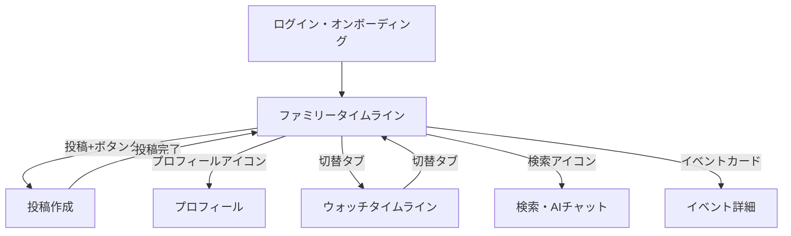

### 2. ログイン・オンボーディングフロー

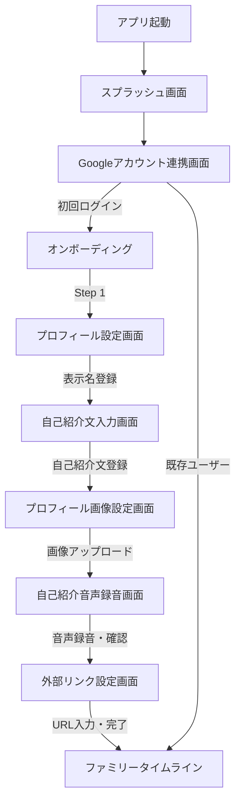

### 3. タイムラインフロー

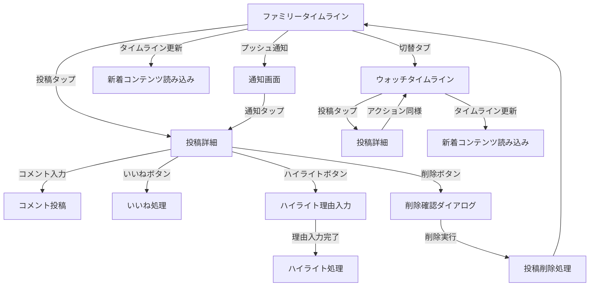

### 4. 投稿作成フロー

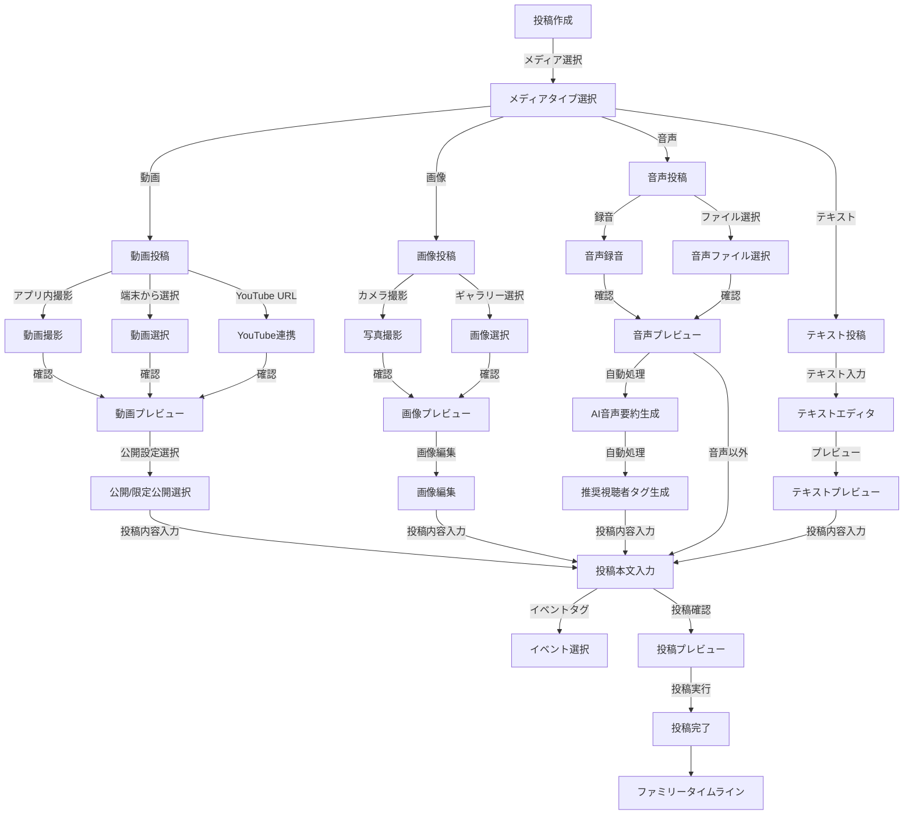

### 5. プロフィールフロー

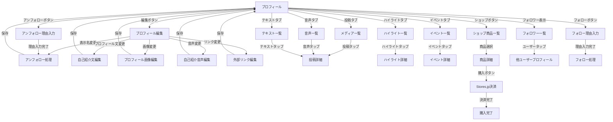

### 6. 検索・AIチャットフロー

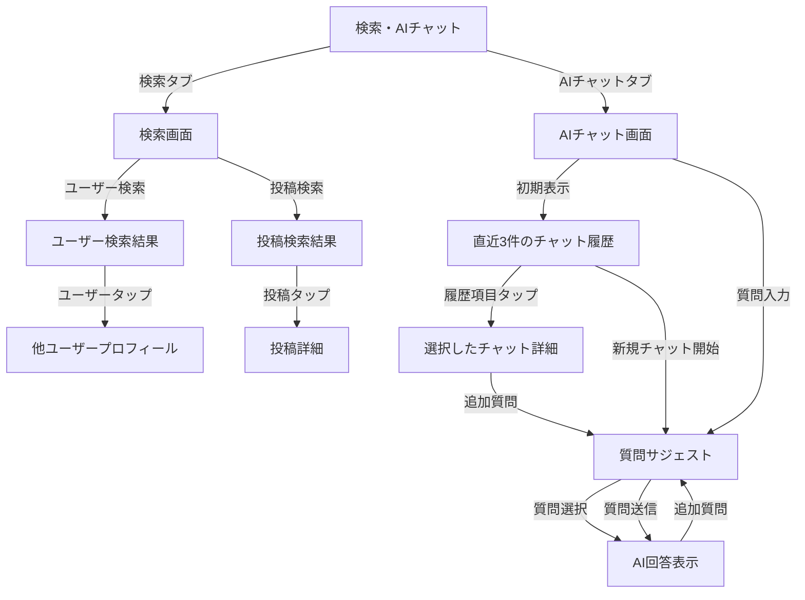

### 13. ストーリーズフロー

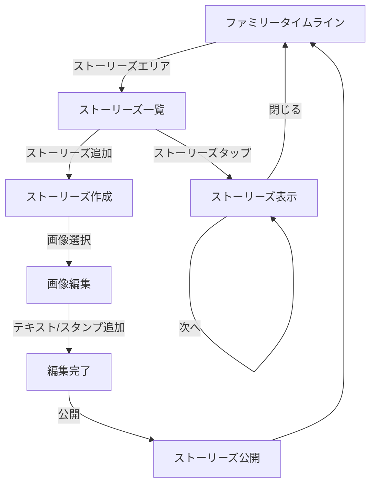

### 14. 音声即時出品フロー

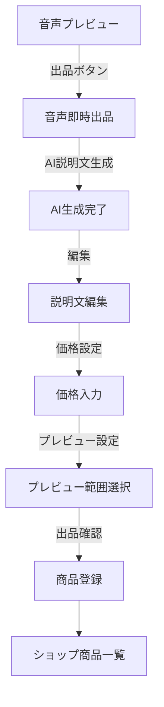

### 7. イベントフロー

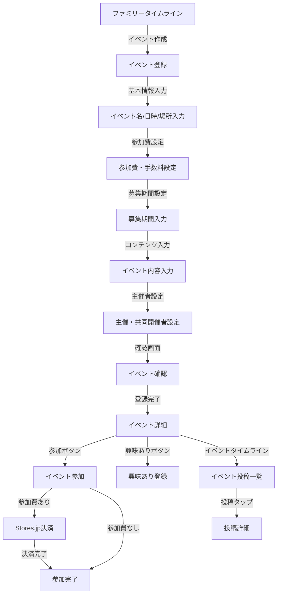

### 8. 分析ページフロー

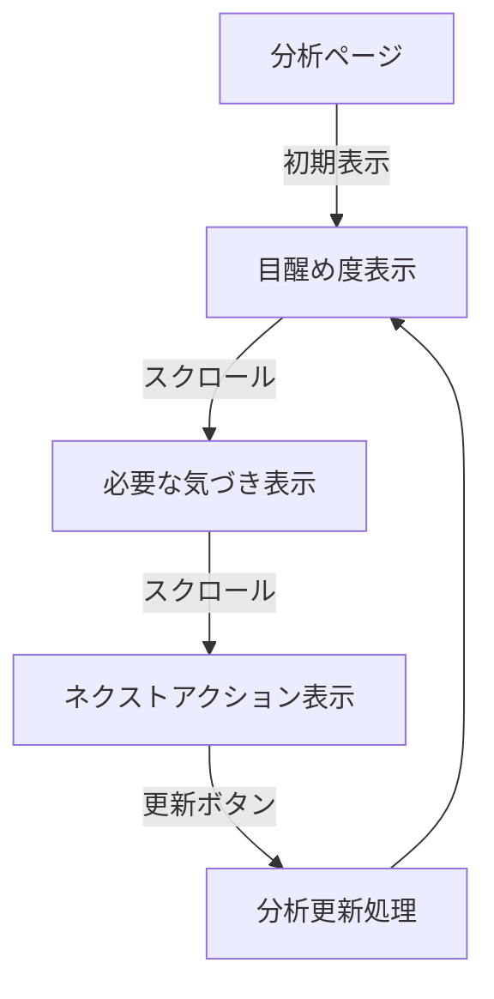

### 9. 設定・その他フロー

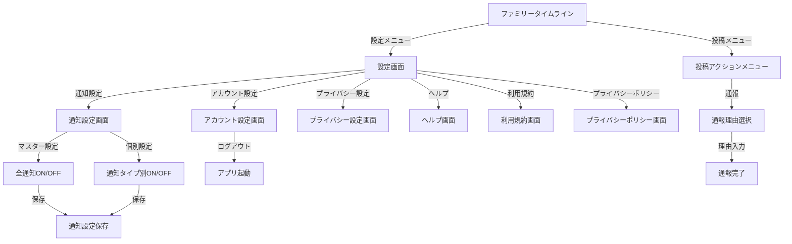

### 15. パーソナルAI・プレイリストフロー

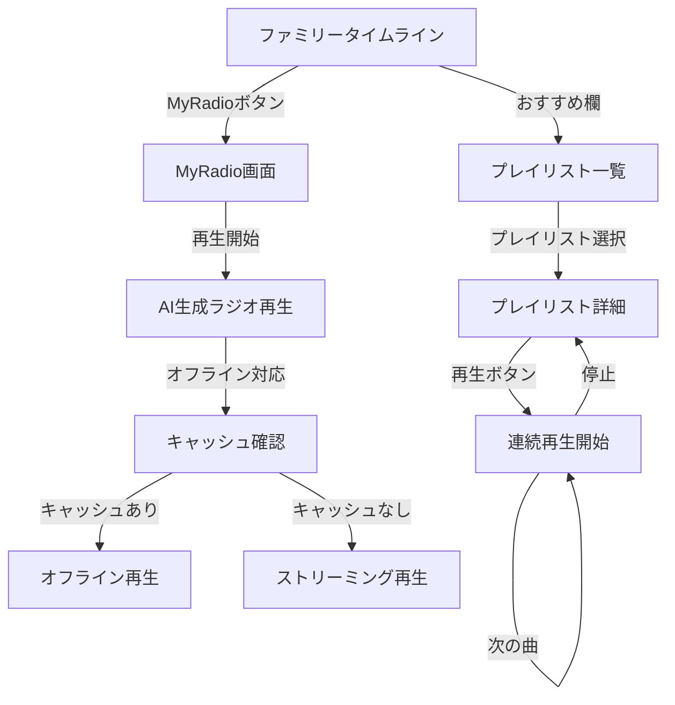

### 16. 光ギフトフロー

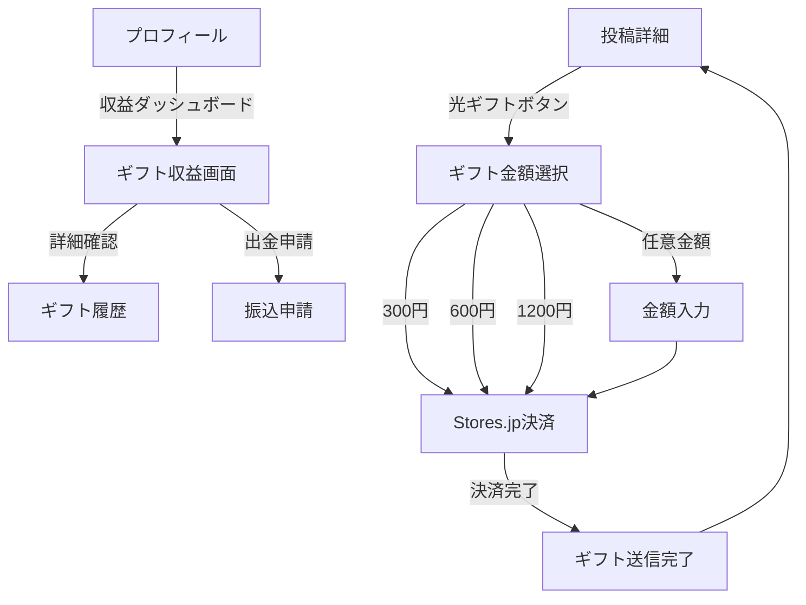

### 17. 後で見る機能フロー

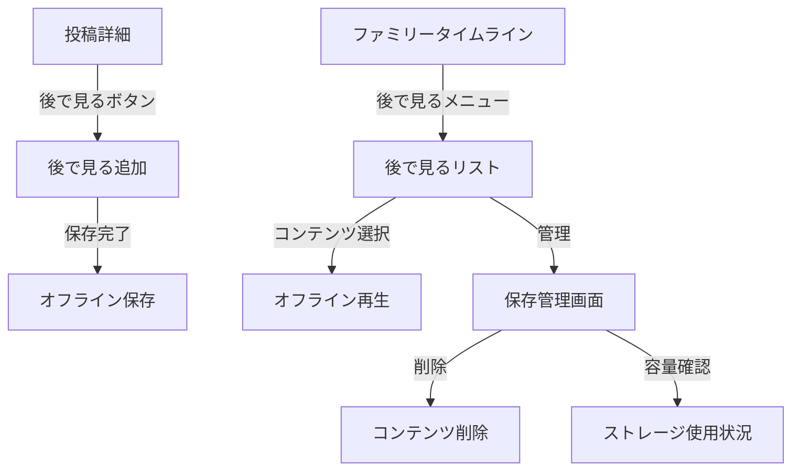

### 10. ライブルームフロー

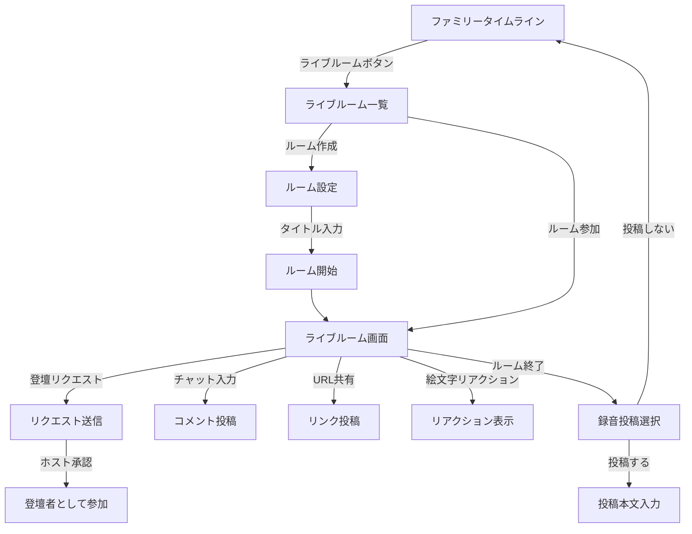

### 11. グループフロー

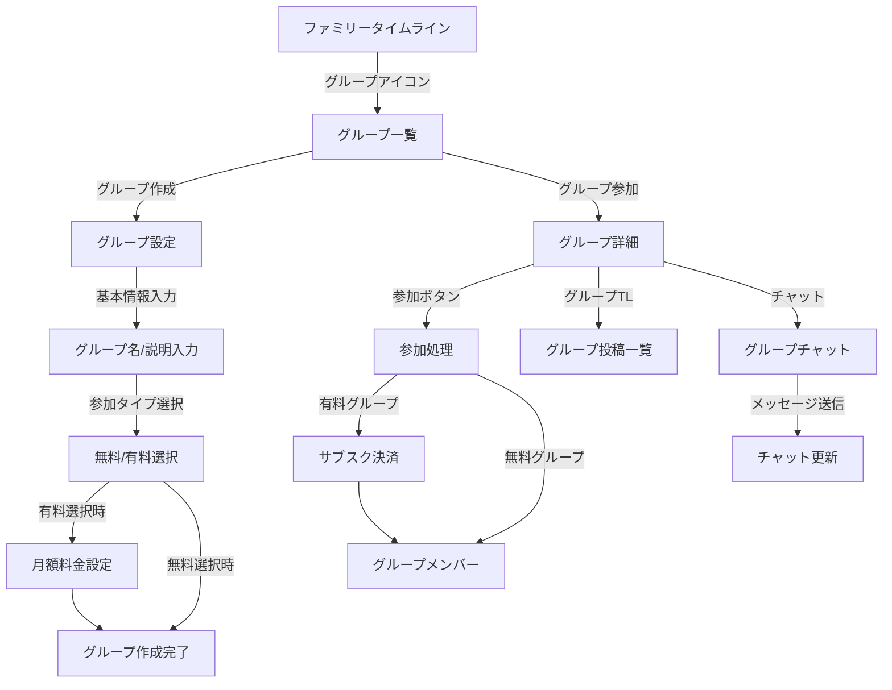

### 12. メッセージフロー

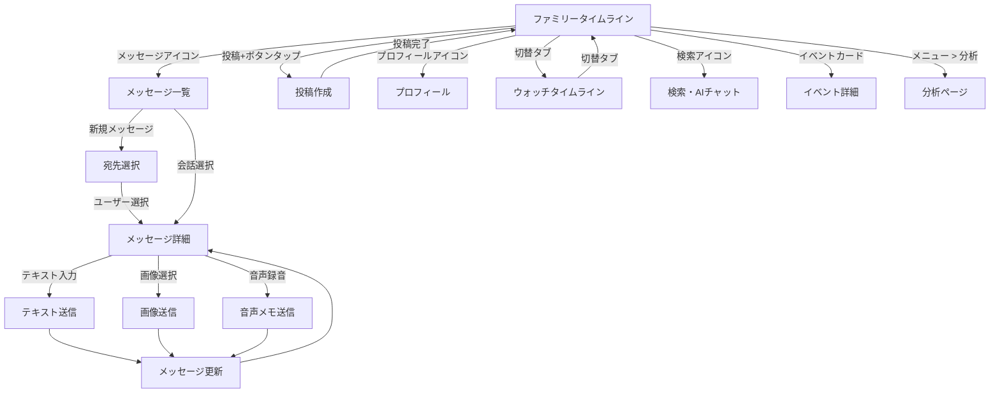

### 10. ライブルームフロー


### 11. グループフロー


### 12. メッセージフロー

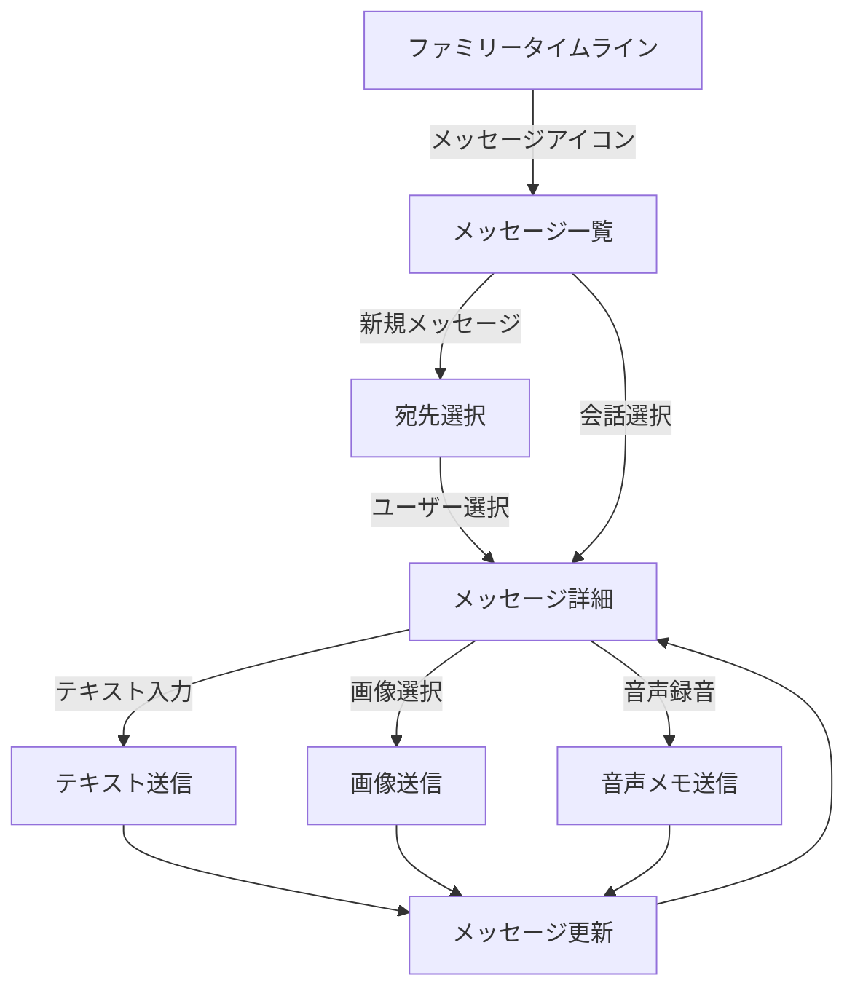

### 13. ストーリーズフロー

```mermaid
graph TD
  B[ファミリータイムライン] -->|ストーリーズエリア| ST[ストーリーズ一覧]
  ST -->|ストーリーズ追加| ST1[ストーリーズ作成]
  ST1 -->|画像選択| ST2[画像編集]
  ST2 -->|テキスト/スタンプ追加| ST3[編集完了]
  ST3 -->|公開| ST4[ストーリーズ公開]
  ST4 --> B
  
  ST -->|ストーリーズタップ| ST5[ストーリーズ表示]
  ST5 -->|次へ| ST5
  ST5 -->|閉じる| B
```

### 14. 音声即時出品フロー

```mermaid
graph TD
  C43[音声プレビュー] -->|出品ボタン| Q[音声即時出品]
  Q -->|AI説明文生成| Q1[AI生成完了]
  Q1 -->|編集| Q2[説明文編集]
  Q2 -->|価格設定| Q3[価格入力]
  Q3 -->|プレビュー設定| Q4[プレビュー範囲選択]
  Q4 -->|出品確認| Q5[商品登録]
  Q5 --> S[ショップ商品一覧]
```

### 15. パーソナルAI・プレイリストフロー

```mermaid
graph TD
  B[ファミリータイムライン] -->|おすすめ欄| P[プレイリスト一覧]
  P -->|プレイリスト選択| P1[プレイリスト詳細]
  P1 -->|再生ボタン| P2[連続再生開始]
  P2 -->|次の曲| P2
  P2 -->|停止| P1
  
  B -->|MyRadioボタン| MR[MyRadio画面]
  MR -->|再生開始| MR1[AI生成ラジオ再生]
  MR1 -->|オフライン対応| MR2[キャッシュ確認]
  MR2 -->|キャッシュあり| MR3[オフライン再生]
  MR2 -->|キャッシュなし| MR4[ストリーミング再生]
```

### 16. 光ギフトフロー

```mermaid
graph TD
  B1[投稿詳細] -->|光ギフトボタン| G1[ギフト金額選択]
  G1 -->|300円| G2[Stores.jp決済]
  G1 -->|600円| G2
  G1 -->|1200円| G2
  G1 -->|任意金額| G3[金額入力]
  G3 --> G2
  G2 -->|決済完了| G4[ギフト送信完了]
  G4 --> B1
  
  D[プロフィール] -->|収益ダッシュボード| GD[ギフト収益画面]
  GD -->|詳細確認| GD1[ギフト履歴]
  GD -->|出金申請| GD2[振込申請]
```

### 17. 後で見る機能フロー

```mermaid
graph TD
  B1[投稿詳細] -->|後で見るボタン| L1[後で見る追加]
  L1 -->|保存完了| L2[オフライン保存]
  L2 -->|1ヶ月後| L8[自動削除]
  
  B[ファミリータイムライン] -->|後で見るメニュー| L3[後で見るリスト]
  L3 -->|コンテンツ選択| L4[オフライン再生]
  L3 -->|管理| L5[保存管理画面]
  L5 -->|削除| L6[コンテンツ削除]
  L5 -->|容量確認| L7[ストレージ使用状況]
  L5 -->|保存期限表示| L9[各コンテンツの残り保存期間]
  
  D71[他ユーザープロフィール] -->|投稿選択| B1
  W1[投稿詳細] -->|後で見るボタン| L1
```

### 18. Deep-Linkフロー

```mermaid
graph TD
  DL[外部リンククリック] -->|アプリ未インストール| DL1[ストア誘導]
  DL -->|アプリインストール済| DL2[アプリ起動]
  
  DL2 -->|kanushi://post/<id>| B1[投稿詳細]
  DL2 -->|kanushi://profile/<id>| D71[他ユーザープロフィール]
  DL2 -->|kanushi://shop/product/<id>| S1[商品詳細]
  DL2 -->|kanushi://event/<id>| E[イベント詳細]
  DL2 -->|kanushi://room/<id>| L3[ライブルーム画面]
  DL2 -->|kanushi://group/<id>| G6[グループ詳細]
  
  DL2 -->|未ログイン| A3[Googleアカウント連携画面]
  A3 -->|ログイン完了| DL3[目的画面へ遷移]
  
  DL1 -->|インストール完了| DL2
```

