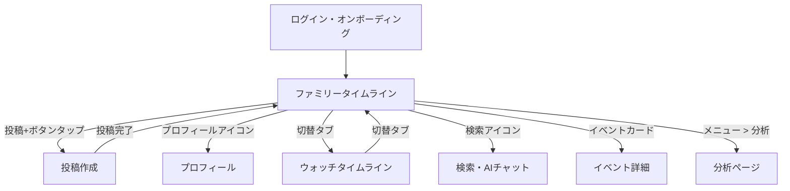
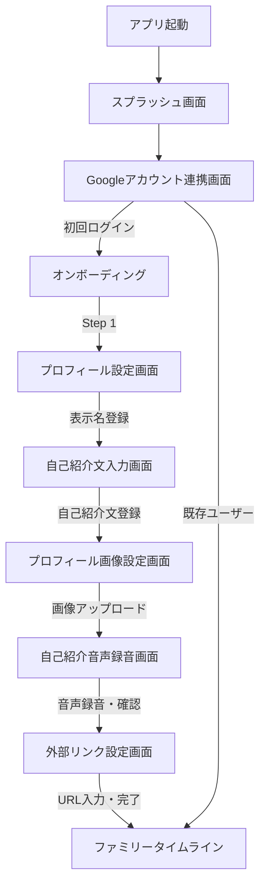
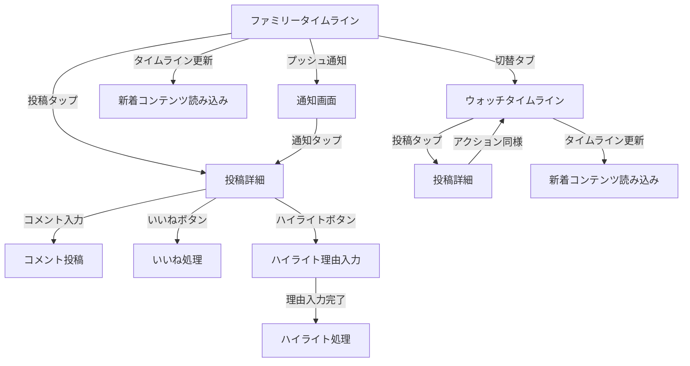
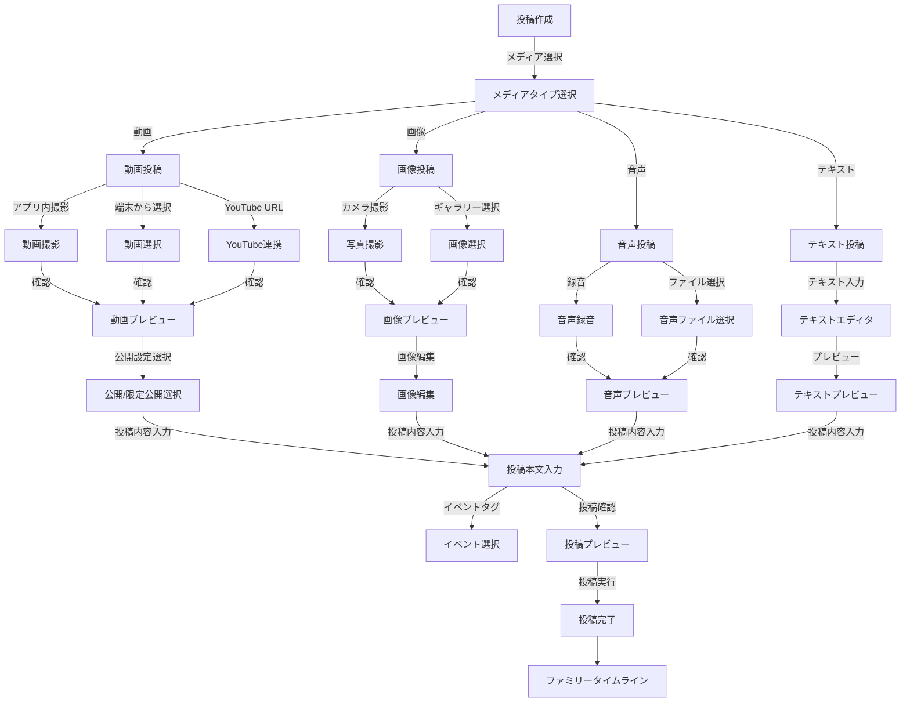
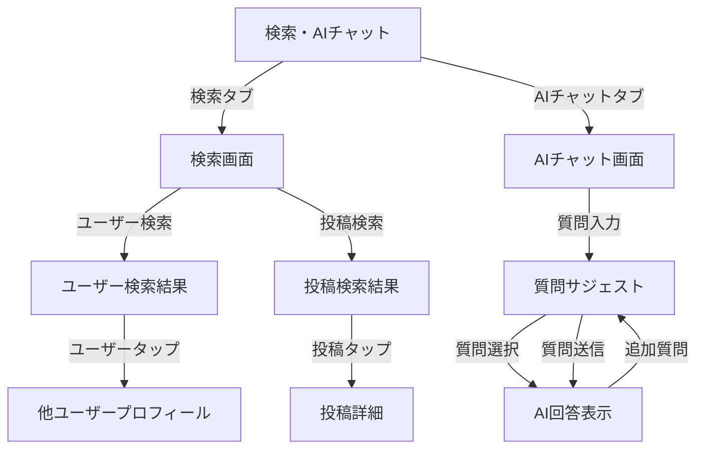
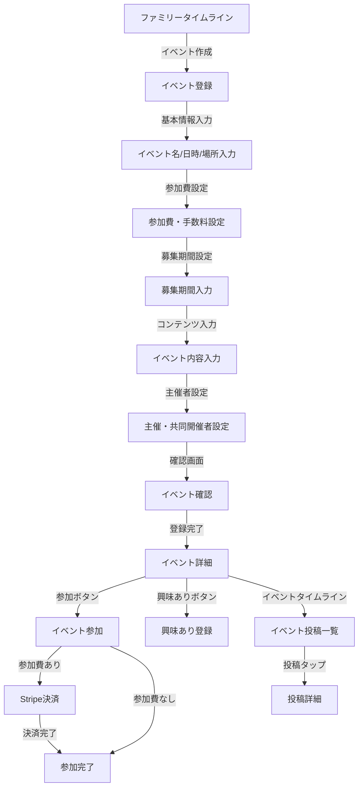
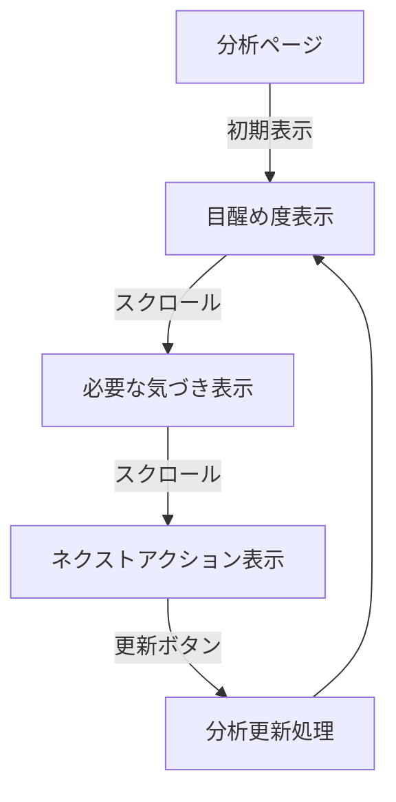
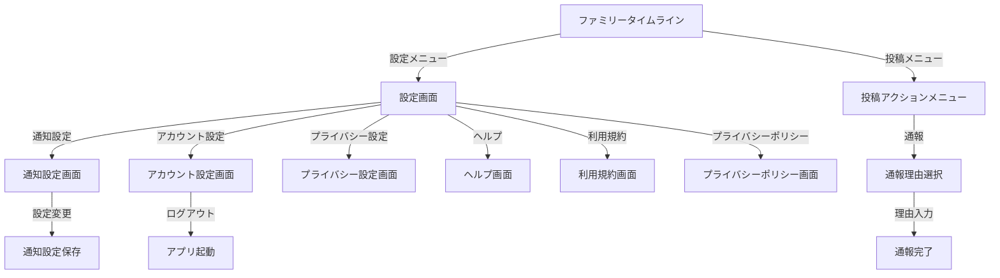

# 画面フロー定義

## 1. 全体図

```mermaid
graph TD
  A[ログイン・オンボーディング] --> B[ファミリータイムライン]
  B -->|投稿+ボタンタップ| C[投稿作成]
  C -->|投稿完了| B
  B -->|プロフィールアイコン| D[プロフィール]
  B -->|切替タブ| W[ウォッチタイムライン]
  W -->|切替タブ| B
  B -->|検索アイコン| X[検索・AIチャット]
  B -->|イベントカード| E[イベント詳細]
  B -->|メニュー > 分析| Z[分析ページ]
```

## 2. ログイン・オンボーディングフロー

```mermaid
graph TD
  A1[アプリ起動] --> A2[スプラッシュ画面]
  A2 --> A3[Googleアカウント連携画面]
  A3 -->|初回ログイン| A4[オンボーディング]
  A4 -->|Step 1| A5[プロフィール設定画面]
  A5 -->|表示名登録| A6[自己紹介文入力画面]
  A6 -->|自己紹介文登録| A7[プロフィール画像設定画面]
  A7 -->|画像アップロード| A8[自己紹介音声録音画面]
  A8 -->|音声録音・確認| A9[外部リンク設定画面]
  A9 -->|URL入力・完了| B[ファミリータイムライン]
  A3 -->|既存ユーザー| B
```

## 3. タイムラインフロー

```mermaid
graph TD
  B[ファミリータイムライン] -->|投稿タップ| B1[投稿詳細]
  B1 -->|コメント入力| B2[コメント投稿]
  B1 -->|いいねボタン| B3[いいね処理]
  B1 -->|ハイライトボタン| B4[ハイライト理由入力]
  B4 -->|理由入力完了| B5[ハイライト処理]
  
  B -->|切替タブ| W[ウォッチタイムライン]
  W -->|投稿タップ| W1[投稿詳細]
  W1 -->|アクション同様| W
  
  B -->|タイムライン更新| B6[新着コンテンツ読み込み]
  W -->|タイムライン更新| W2[新着コンテンツ読み込み]
  
  B -->|プッシュ通知| B7[通知画面]
  B7 -->|通知タップ| B1
```

## 4. 投稿作成フロー

```mermaid
graph TD
  C[投稿作成] -->|メディア選択| C1[メディアタイプ選択]
  C1 -->|動画| C2[動画投稿]
  C1 -->|画像| C3[画像投稿]
  C1 -->|音声| C4[音声投稿]
  C1 -->|テキスト| C5[テキスト投稿]
  
  C2 -->|アプリ内撮影| C21[動画撮影]
  C2 -->|端末から選択| C22[動画選択]
  C2 -->|YouTube URL| C23[YouTube連携]
  C21 -->|確認| C24[動画プレビュー]
  C22 -->|確認| C24
  C23 -->|確認| C24
  C24 -->|公開設定選択| C25[公開/限定公開選択]
  
  C3 -->|カメラ撮影| C31[写真撮影]
  C3 -->|ギャラリー選択| C32[画像選択]
  C31 -->|確認| C33[画像プレビュー]
  C32 -->|確認| C33
  C33 -->|画像編集| C34[画像編集]
  
  C4 -->|録音| C41[音声録音]
  C4 -->|ファイル選択| C42[音声ファイル選択]
  C41 -->|確認| C43[音声プレビュー]
  C42 -->|確認| C43
  
  C5 -->|テキスト入力| C51[テキストエディタ]
  C51 -->|プレビュー| C52[テキストプレビュー]
  
  C25 -->|投稿内容入力| C6[投稿本文入力]
  C34 -->|投稿内容入力| C6
  C43 -->|投稿内容入力| C6
  C52 -->|投稿内容入力| C6
  
  C6 -->|イベントタグ| C7[イベント選択]
  C6 -->|投稿確認| C8[投稿プレビュー]
  C8 -->|投稿実行| C9[投稿完了]
  C9 --> B[ファミリータイムライン]
```

## 5. プロフィールフロー

```mermaid
graph TD
  D[プロフィール] -->|編集ボタン| D1[プロフィール編集]
  D1 -->|表示名変更| D11[表示名編集]
  D1 -->|プロフィール文変更| D12[自己紹介文編集]
  D1 -->|画像変更| D13[プロフィール画像編集]
  D1 -->|音声変更| D14[自己紹介音声編集]
  D1 -->|リンク変更| D15[外部リンク編集]
  D11 -->|保存| D
  D12 -->|保存| D
  D13 -->|保存| D
  D14 -->|保存| D
  D15 -->|保存| D
  
  D -->|投稿タブ| D2[メディア一覧]
  D -->|音声タブ| D3[音声一覧]
  D -->|テキストタブ| D4[テキスト一覧]
  D -->|ハイライトタブ| D5[ハイライト一覧]
  D -->|イベントタブ| D6[イベント一覧]
  
  D2 -->|投稿タップ| B1[投稿詳細]
  D3 -->|音声タップ| B1
  D4 -->|テキストタップ| B1
  D5 -->|ハイライトタップ| D51[ハイライト詳細]
  D6 -->|イベントタップ| E[イベント詳細]
  
  D -->|ショップボタン| S[ショップ商品一覧]
  S -->|商品選択| S1[商品詳細]
  S1 -->|購入ボタン| S2[Stripe決済]
  S2 -->|決済完了| S3[購入完了]
  
  D -->|フォロワー表示| D7[フォロワー一覧]
  D7 -->|ユーザータップ| D71[他ユーザープロフィール]
  D -->|フォローボタン| D8[フォロー理由入力]
  D8 -->|理由入力完了| D9[フォロー処理]
  D -->|アンフォローボタン| D10[アンフォロー理由入力]
  D10 -->|理由入力完了| D11[アンフォロー処理]
```

## 6. 検索・AIチャットフロー

```mermaid
graph TD
  X[検索・AIチャット] -->|検索タブ| X1[検索画面]
  X -->|AIチャットタブ| X2[AIチャット画面]
  
  X1 -->|ユーザー検索| X11[ユーザー検索結果]
  X1 -->|投稿検索| X12[投稿検索結果]
  X11 -->|ユーザータップ| D71[他ユーザープロフィール]
  X12 -->|投稿タップ| B1[投稿詳細]
  
  X2 -->|質問入力| X21[質問サジェスト]
  X21 -->|質問選択| X22[AI回答表示]
  X21 -->|質問送信| X22
  X22 -->|追加質問| X21
```

## 7. イベントフロー

```mermaid
graph TD
  E[イベント詳細] -->|参加ボタン| E1[イベント参加]
  E1 -->|参加費あり| E11[Stripe決済]
  E11 -->|決済完了| E12[参加完了]
  E1 -->|参加費なし| E12
  
  E -->|興味ありボタン| E2[興味あり登録]
  E -->|イベントタイムライン| E3[イベント投稿一覧]
  E3 -->|投稿タップ| B1[投稿詳細]
  
  B[ファミリータイムライン] -->|イベント作成| E4[イベント登録]
  E4 -->|基本情報入力| E41[イベント名/日時/場所入力]
  E41 -->|参加費設定| E42[参加費・手数料設定]
  E42 -->|募集期間設定| E43[募集期間入力]
  E43 -->|コンテンツ入力| E44[イベント内容入力]
  E44 -->|主催者設定| E45[主催・共同開催者設定]
  E45 -->|確認画面| E46[イベント確認]
  E46 -->|登録完了| E[イベント詳細]
```

## 8. 分析ページフロー

```mermaid
graph TD
  Z[分析ページ] -->|初期表示| Z1[目醒め度表示]
  Z1 -->|スクロール| Z2[必要な気づき表示]
  Z2 -->|スクロール| Z3[ネクストアクション表示]
  Z3 -->|更新ボタン| Z4[分析更新処理]
  Z4 --> Z1
```

## 9. 設定・その他フロー

```mermaid
graph TD
  B[ファミリータイムライン] -->|設定メニュー| Y[設定画面]
  Y -->|通知設定| Y1[通知設定画面]
  Y1 -->|設定変更| Y11[通知設定保存]
  Y -->|アカウント設定| Y2[アカウント設定画面]
  Y2 -->|ログアウト| A1[アプリ起動]
  Y -->|プライバシー設定| Y3[プライバシー設定画面]
  Y -->|ヘルプ| Y4[ヘルプ画面]
  Y -->|利用規約| Y5[利用規約画面]
  Y -->|プライバシーポリシー| Y6[プライバシーポリシー画面]
  
  B -->|投稿メニュー| B8[投稿アクションメニュー]
  B8 -->|通報| B81[通報理由選択]
  B81 -->|理由入力| B82[通報完了]
```

