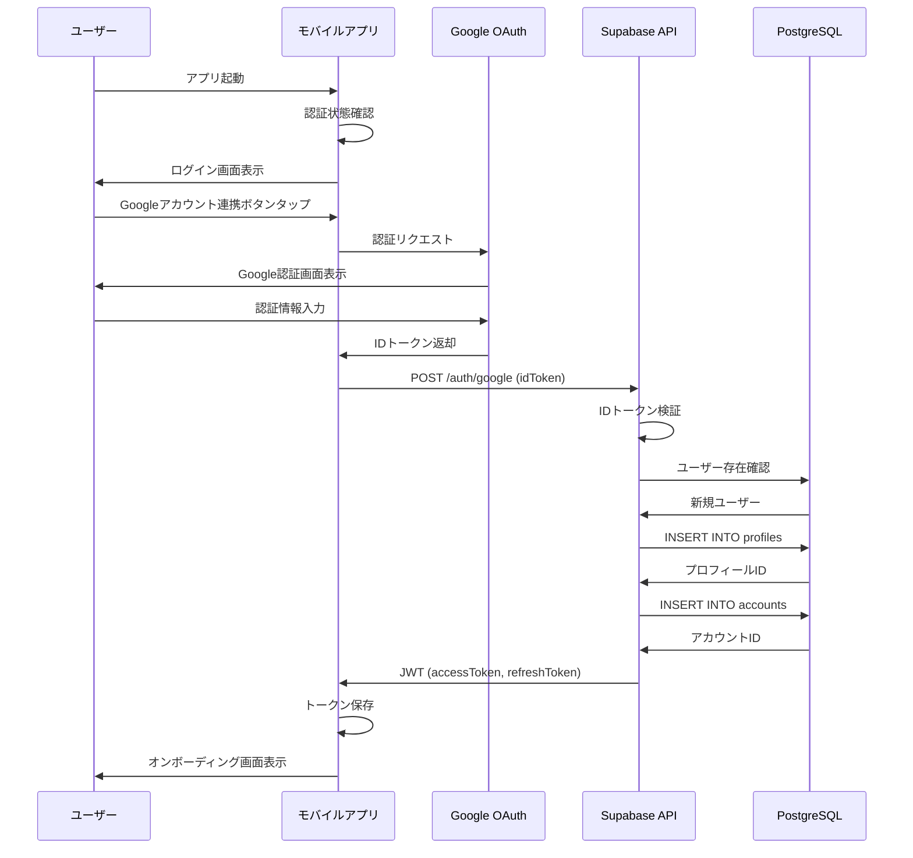
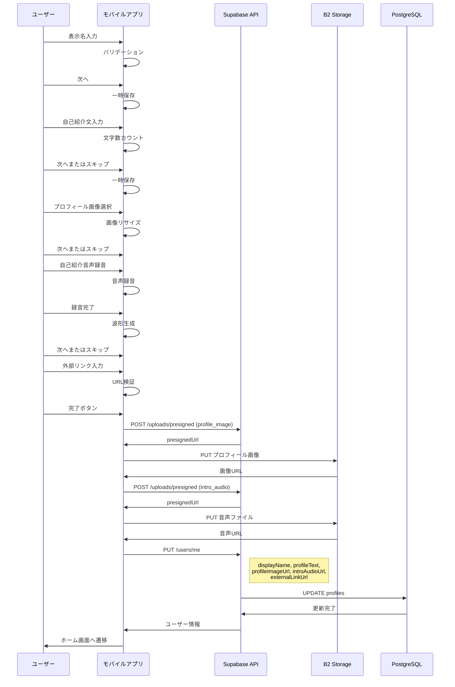
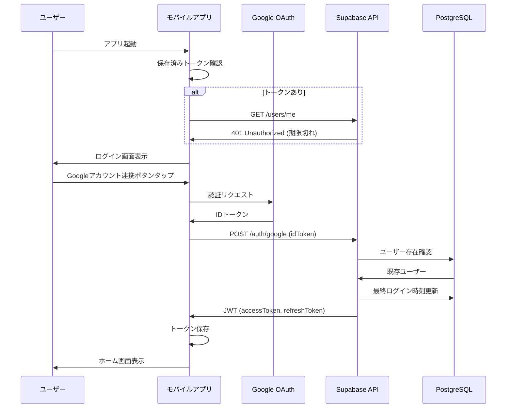
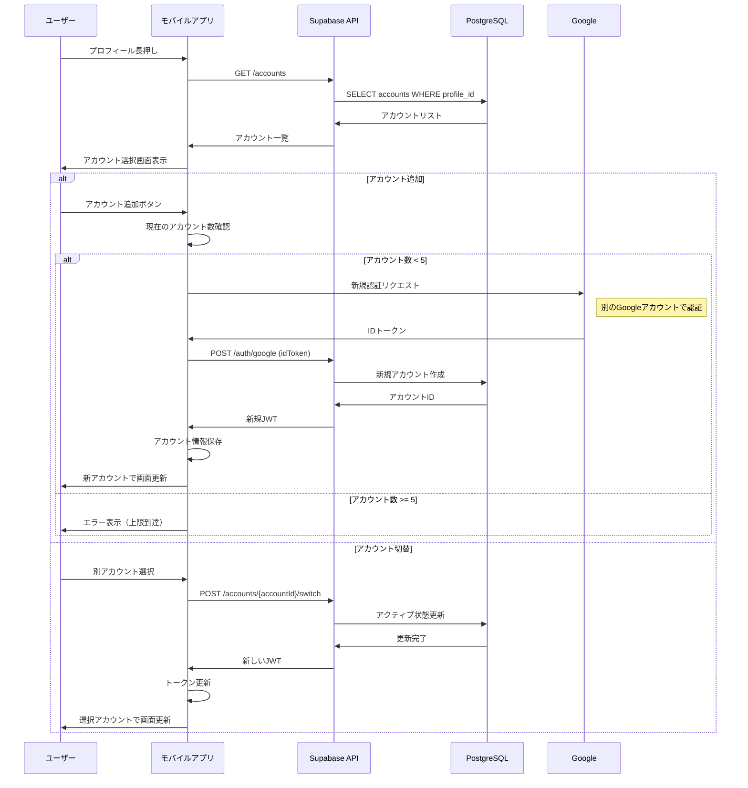
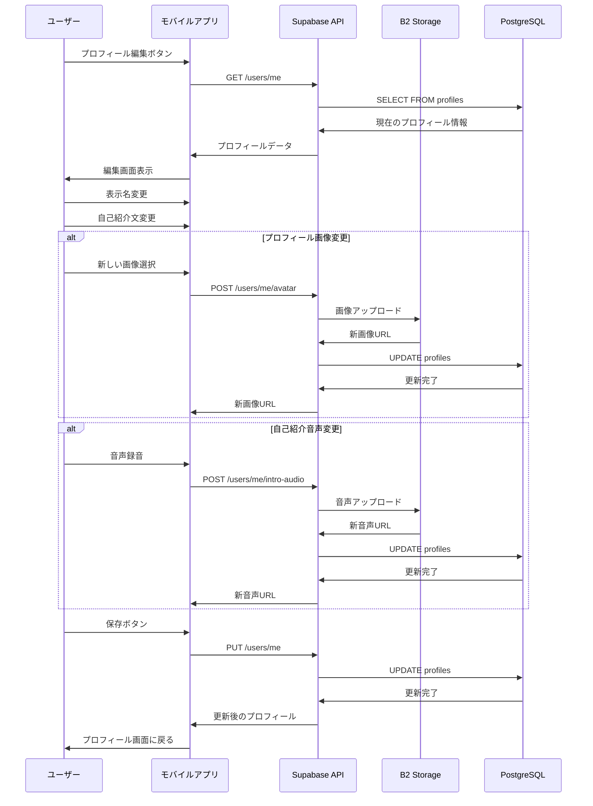
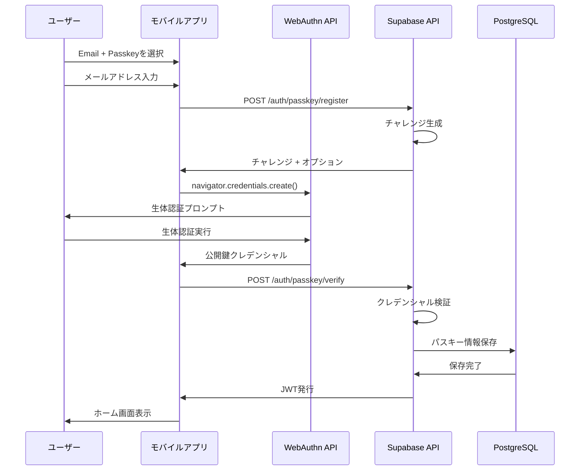
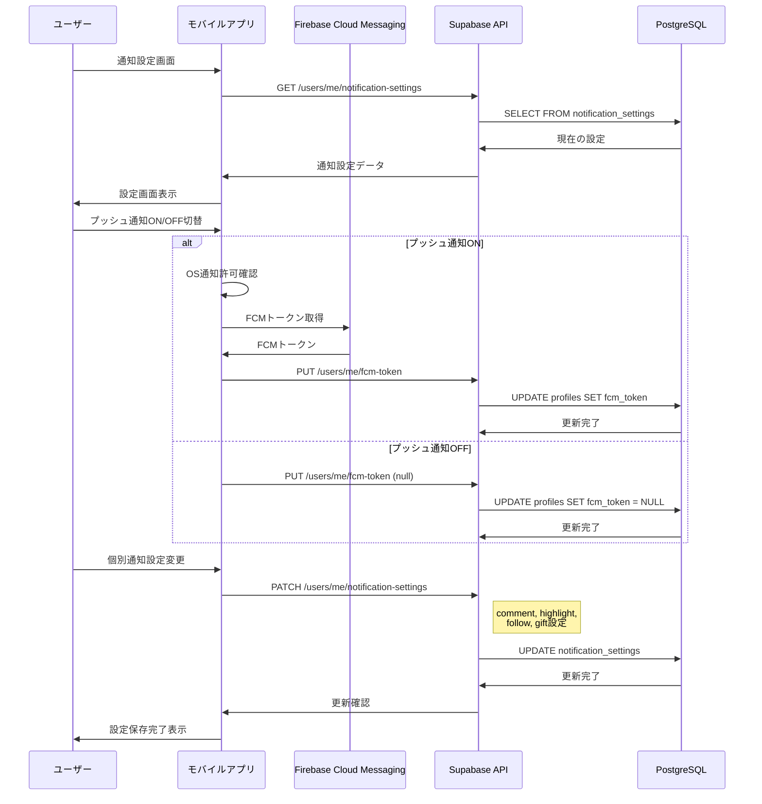
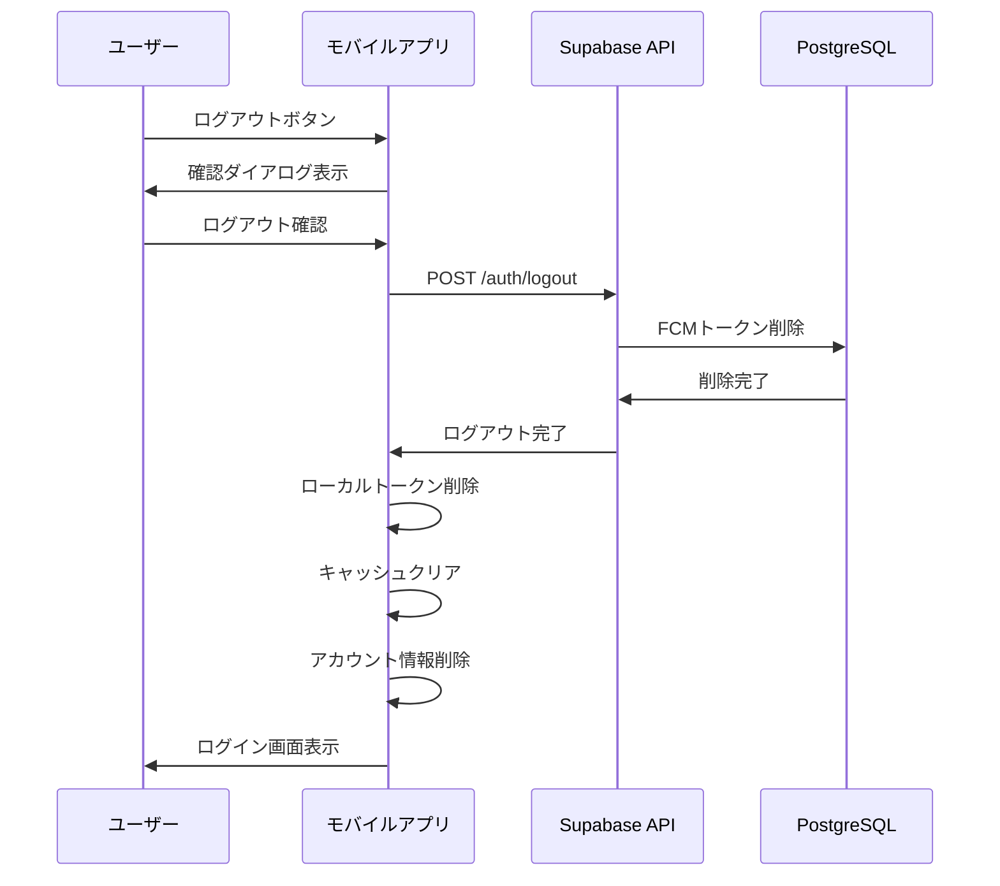
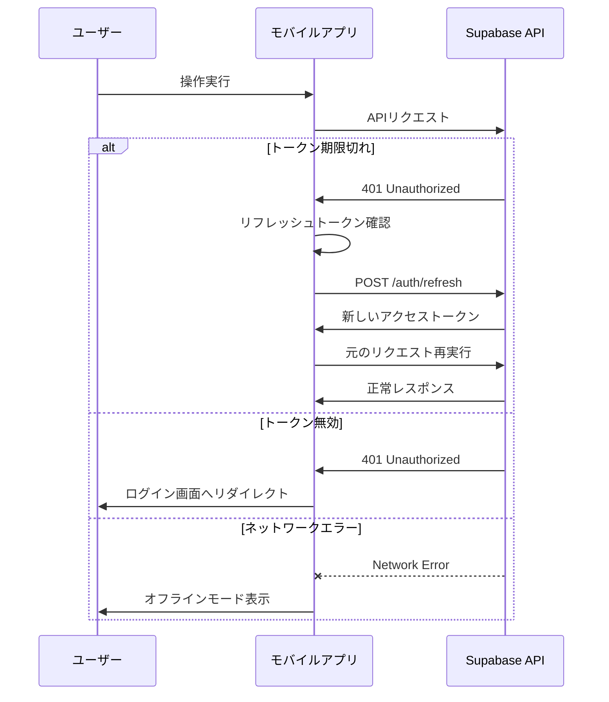
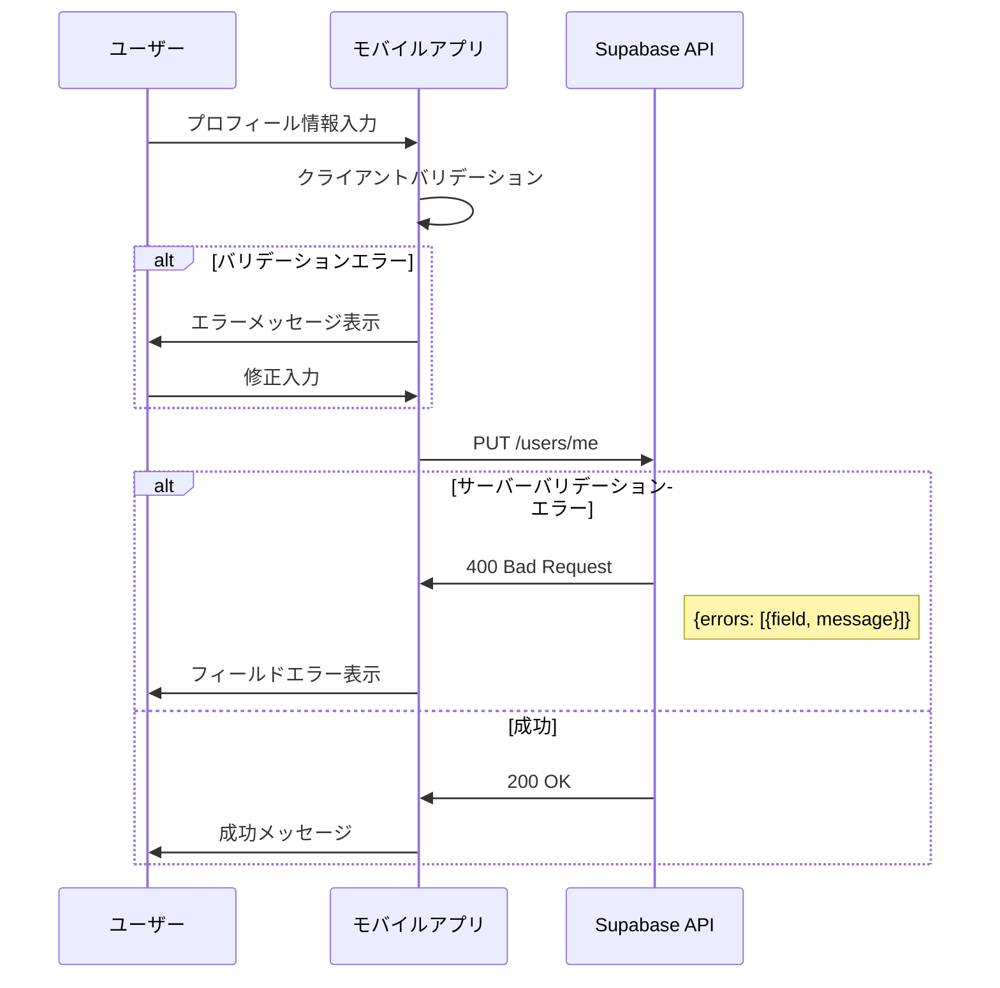

# 認証・アカウント管理シーケンス図

## 1. 新規登録（Google認証）

## 2. オンボーディングフロー

## 3. ログイン（既存ユーザー）

## 4. 複数アカウント管理

## 5. プロフィール編集

## 6. パスキー認証（Email + Passkey）

## 7. 通知設定管理

## 8. ログアウト

## エラーハンドリング

### 認証エラー

### バリデーションエラー

