# タイムライン・投稿機能シーケンス図

## 1. タイムライン取得（ファミリー/ウォッチ）

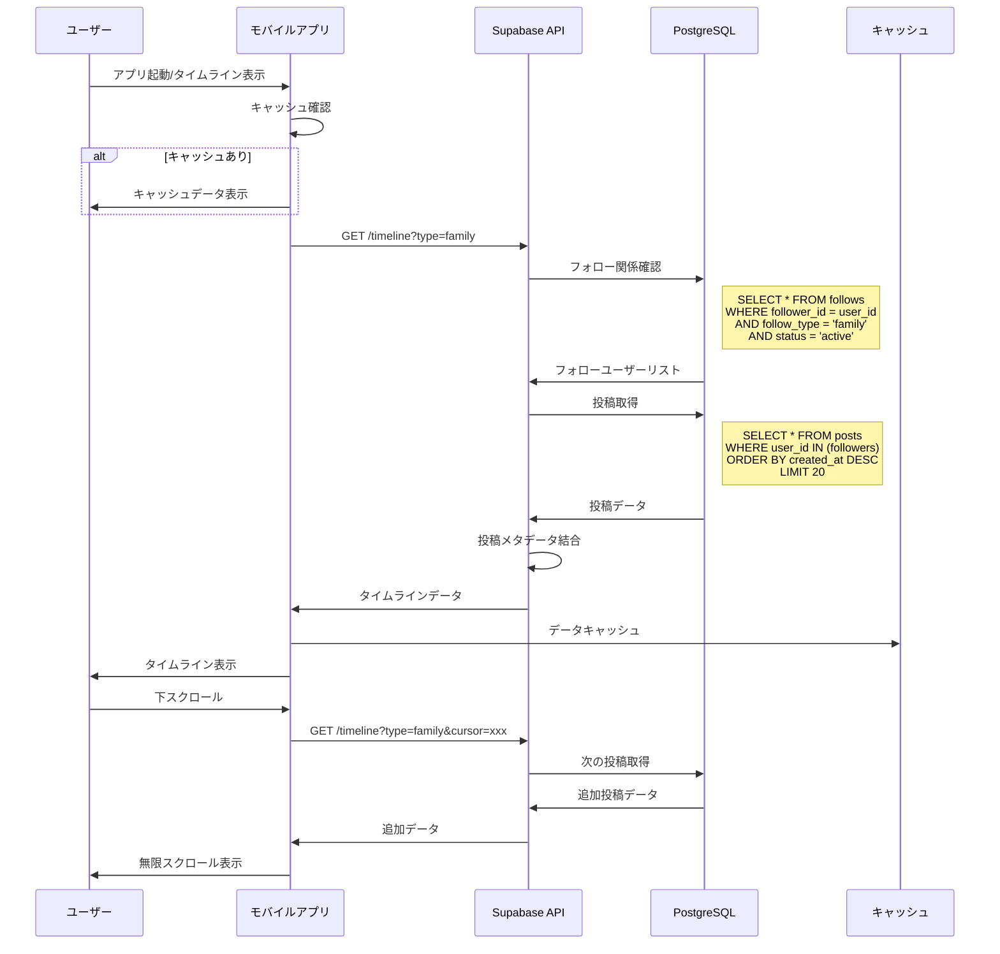
```mermaid
sequenceDiagram
    participant User as ユーザー
    participant App as モバイルアプリ
    participant API as Supabase API
    participant DB as PostgreSQL
    participant Cache as キャッシュ

    User->>App: アプリ起動/タイムライン表示
    App->>App: キャッシュ確認
    
    alt キャッシュあり
        App->>User: キャッシュデータ表示
    end
    
    App->>API: GET /timeline?type=family
    API->>DB: フォロー関係確認
    note right of DB: SELECT * FROM follows<br/>WHERE follower_id = user_id<br/>AND follow_type = 'family'<br/>AND status = 'active'
    
    DB->>API: フォローユーザーリスト
    API->>DB: 投稿取得
    note right of DB: SELECT * FROM posts<br/>WHERE user_id IN (followers)<br/>ORDER BY created_at DESC<br/>LIMIT 20
    
    DB->>API: 投稿データ
    API->>API: 投稿メタデータ結合
    API->>App: タイムラインデータ
    App->>Cache: データキャッシュ
    App->>User: タイムライン表示
    
    User->>App: 下スクロール
    App->>API: GET /timeline?type=family&cursor=xxx
    API->>DB: 次の投稿取得
    DB->>API: 追加投稿データ
    API->>App: 追加データ
    App->>User: 無限スクロール表示
```

## 2. 音声投稿作成

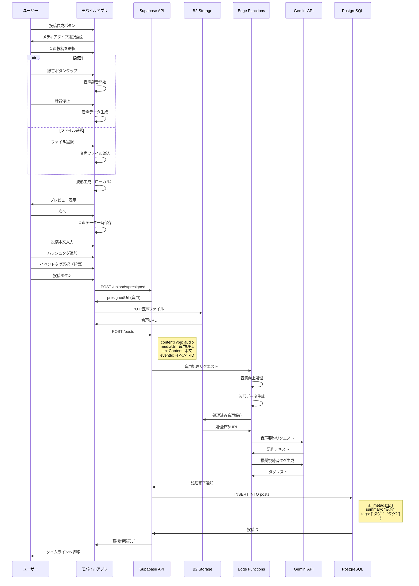
```mermaid
sequenceDiagram
    participant User as ユーザー
    participant App as モバイルアプリ
    participant API as Supabase API
    participant Storage as B2 Storage
    participant EdgeFunc as Edge Functions
    participant AI as Gemini API
    participant DB as PostgreSQL

    User->>App: 投稿作成ボタン
    App->>User: メディアタイプ選択画面
    User->>App: 音声投稿を選択
    
    alt 録音
        User->>App: 録音ボタンタップ
        App->>App: 音声録音開始
        User->>App: 録音停止
        App->>App: 音声データ生成
    else ファイル選択
        User->>App: ファイル選択
        App->>App: 音声ファイル読込
    end
    
    App->>App: 波形生成（ローカル）
    App->>User: プレビュー表示
    
    User->>App: 次へ
    App->>App: 音声データ一時保存
    
    User->>App: 投稿本文入力
    User->>App: ハッシュタグ追加
    User->>App: イベントタグ選択（任意）
    
    User->>App: 投稿ボタン
    App->>API: POST /uploads/presigned
    API->>App: presignedUrl (音声)
    
    App->>Storage: PUT 音声ファイル
    Storage->>App: 音声URL
    
    App->>API: POST /posts
    note right of API: contentType: audio<br/>mediaUrl: 音声URL<br/>textContent: 本文<br/>eventId: イベントID
    
    API->>EdgeFunc: 音声処理リクエスト
    EdgeFunc->>EdgeFunc: 音質向上処理
    EdgeFunc->>EdgeFunc: 波形データ生成
    EdgeFunc->>Storage: 処理済み音声保存
    Storage->>EdgeFunc: 処理済みURL
    
    EdgeFunc->>AI: 音声要約リクエスト
    AI->>EdgeFunc: 要約テキスト
    EdgeFunc->>AI: 推奨視聴者タグ生成
    AI->>EdgeFunc: タグリスト
    
    EdgeFunc->>API: 処理完了通知
    API->>DB: INSERT INTO posts
    note right of DB: ai_metadata: {<br/>  summary: "要約",<br/>  tags: ["タグ1", "タグ2"]<br/>}
    
    DB->>API: 投稿ID
    API->>App: 投稿作成完了
    App->>User: タイムラインへ遷移
```

## 3. 画像投稿作成

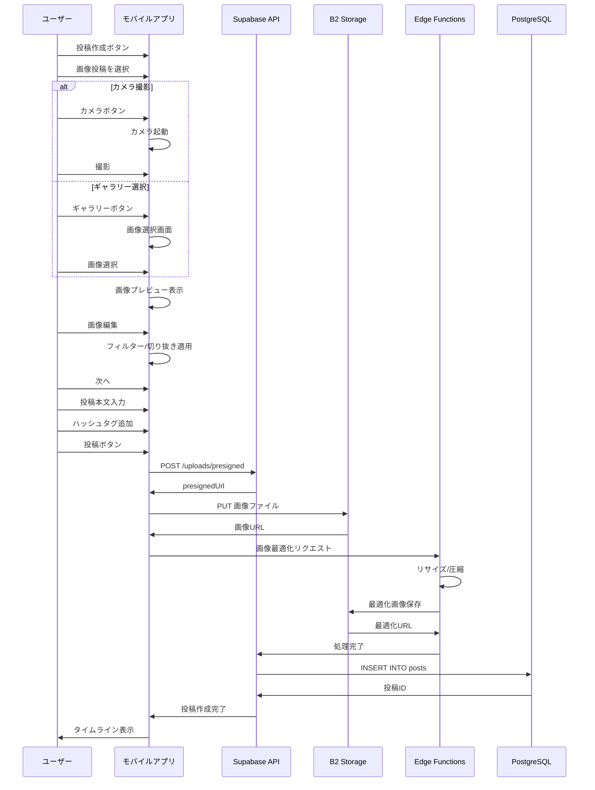
```mermaid
sequenceDiagram
    participant User as ユーザー
    participant App as モバイルアプリ
    participant API as Supabase API
    participant Storage as B2 Storage
    participant EdgeFunc as Edge Functions
    participant DB as PostgreSQL

    User->>App: 投稿作成ボタン
    User->>App: 画像投稿を選択
    
    alt カメラ撮影
        User->>App: カメラボタン
        App->>App: カメラ起動
        User->>App: 撮影
    else ギャラリー選択
        User->>App: ギャラリーボタン
        App->>App: 画像選択画面
        User->>App: 画像選択
    end
    
    App->>App: 画像プレビュー表示
    User->>App: 画像編集
    App->>App: フィルター/切り抜き適用
    
    User->>App: 次へ
    User->>App: 投稿本文入力
    User->>App: ハッシュタグ追加
    
    User->>App: 投稿ボタン
    App->>API: POST /uploads/presigned
    API->>App: presignedUrl
    
    App->>Storage: PUT 画像ファイル
    Storage->>App: 画像URL
    
    App->>EdgeFunc: 画像最適化リクエスト
    EdgeFunc->>EdgeFunc: リサイズ/圧縮
    EdgeFunc->>Storage: 最適化画像保存
    Storage->>EdgeFunc: 最適化URL
    
    EdgeFunc->>API: 処理完了
    API->>DB: INSERT INTO posts
    DB->>API: 投稿ID
    API->>App: 投稿作成完了
    App->>User: タイムライン表示
```

## 4. テキスト投稿作成

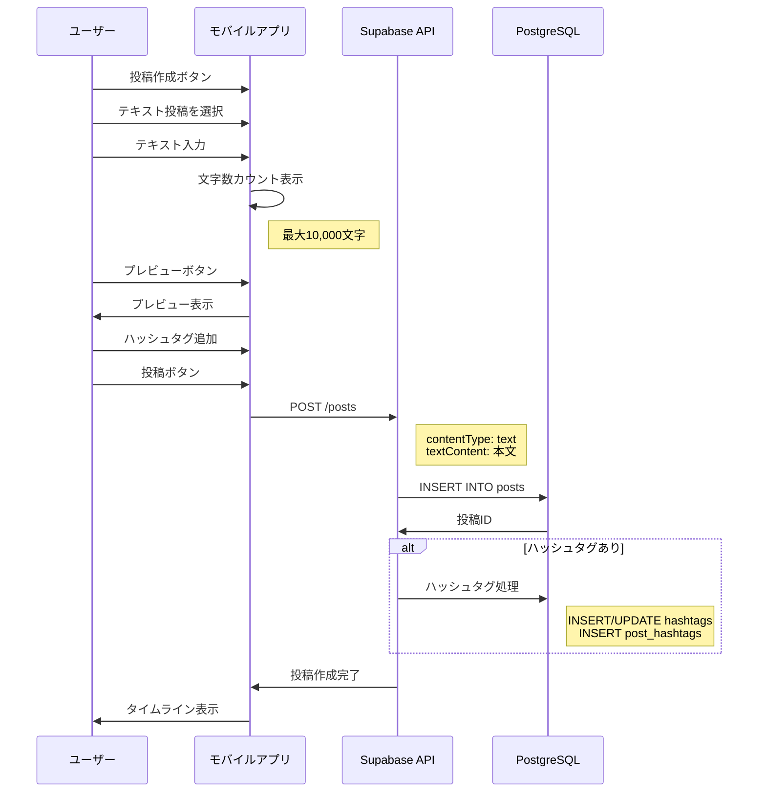
```mermaid
sequenceDiagram
    participant User as ユーザー
    participant App as モバイルアプリ
    participant API as Supabase API
    participant DB as PostgreSQL

    User->>App: 投稿作成ボタン
    User->>App: テキスト投稿を選択
    
    User->>App: テキスト入力
    App->>App: 文字数カウント表示
    note right of App: 最大10,000文字
    
    User->>App: プレビューボタン
    App->>User: プレビュー表示
    
    User->>App: ハッシュタグ追加
    
    User->>App: 投稿ボタン
    App->>API: POST /posts
    note right of API: contentType: text<br/>textContent: 本文
    
    API->>DB: INSERT INTO posts
    DB->>API: 投稿ID
    
    alt ハッシュタグあり
        API->>DB: ハッシュタグ処理
        note right of DB: INSERT/UPDATE hashtags<br/>INSERT post_hashtags
    end
    
    API->>App: 投稿作成完了
    App->>User: タイムライン表示
```

## 5. 投稿へのアクション

### 5.1 いいね

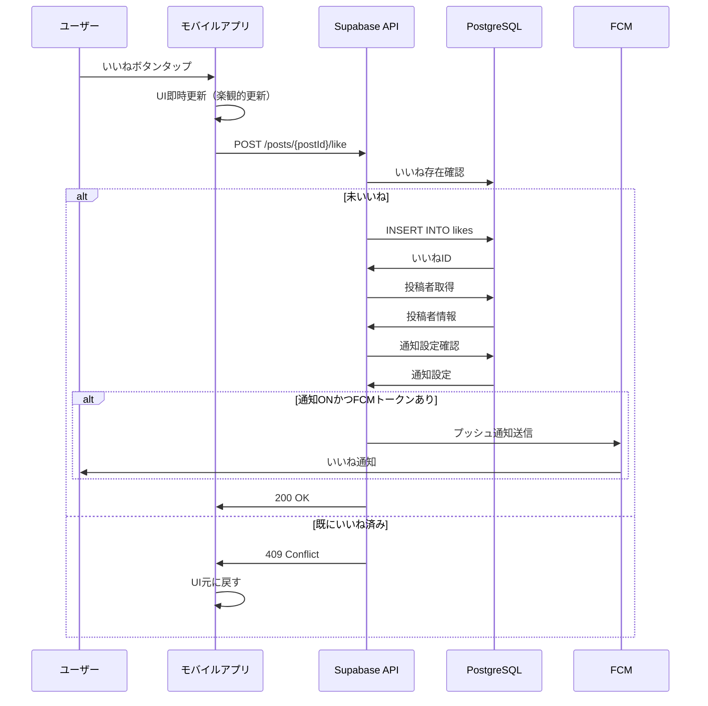
```mermaid
sequenceDiagram
    participant User as ユーザー
    participant App as モバイルアプリ
    participant API as Supabase API
    participant DB as PostgreSQL
    participant Push as FCM

    User->>App: いいねボタンタップ
    App->>App: UI即時更新（楽観的更新）
    
    App->>API: POST /posts/{postId}/like
    API->>DB: いいね存在確認
    
    alt 未いいね
        API->>DB: INSERT INTO likes
        DB->>API: いいねID
        API->>DB: 投稿者取得
        DB->>API: 投稿者情報
        
        API->>DB: 通知設定確認
        DB->>API: 通知設定
        
        alt 通知ONかつFCMトークンあり
            API->>Push: プッシュ通知送信
            Push->>User: いいね通知
        end
        
        API->>App: 200 OK
    else 既にいいね済み
        API->>App: 409 Conflict
        App->>App: UI元に戻す
    end
```

### 5.2 ハイライト

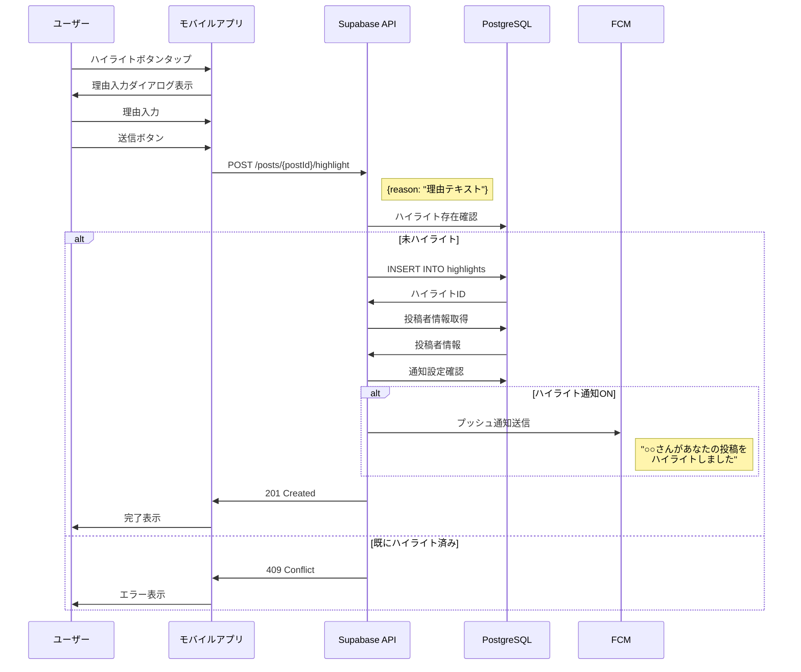
```mermaid
sequenceDiagram
    participant User as ユーザー
    participant App as モバイルアプリ
    participant API as Supabase API
    participant DB as PostgreSQL
    participant Push as FCM

    User->>App: ハイライトボタンタップ
    App->>User: 理由入力ダイアログ表示
    User->>App: 理由入力
    User->>App: 送信ボタン
    
    App->>API: POST /posts/{postId}/highlight
    note right of API: {reason: "理由テキスト"}
    
    API->>DB: ハイライト存在確認
    
    alt 未ハイライト
        API->>DB: INSERT INTO highlights
        DB->>API: ハイライトID
        
        API->>DB: 投稿者情報取得
        DB->>API: 投稿者情報
        
        API->>DB: 通知設定確認
        alt ハイライト通知ON
            API->>Push: プッシュ通知送信
            note right of Push: "○○さんがあなたの投稿を<br/>ハイライトしました"
        end
        
        API->>App: 201 Created
        App->>User: 完了表示
    else 既にハイライト済み
        API->>App: 409 Conflict
        App->>User: エラー表示
    end
```

### 5.3 コメント

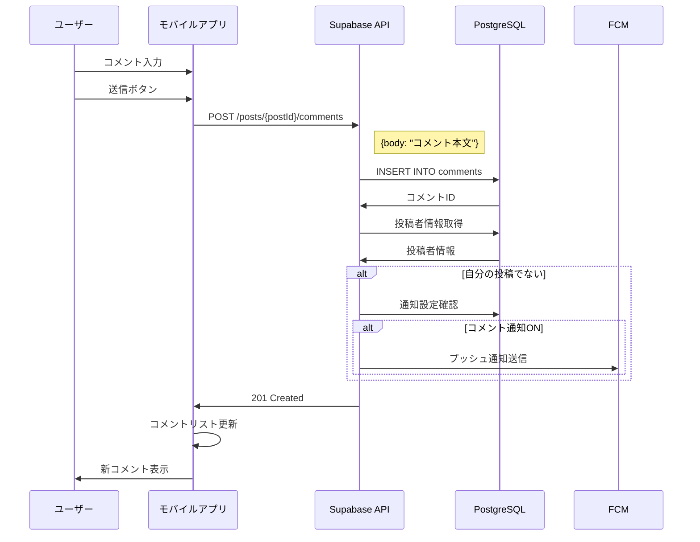
```mermaid
sequenceDiagram
    participant User as ユーザー
    participant App as モバイルアプリ
    participant API as Supabase API
    participant DB as PostgreSQL
    participant Push as FCM

    User->>App: コメント入力
    User->>App: 送信ボタン
    
    App->>API: POST /posts/{postId}/comments
    note right of API: {body: "コメント本文"}
    
    API->>DB: INSERT INTO comments
    DB->>API: コメントID
    
    API->>DB: 投稿者情報取得
    DB->>API: 投稿者情報
    
    alt 自分の投稿でない
        API->>DB: 通知設定確認
        alt コメント通知ON
            API->>Push: プッシュ通知送信
        end
    end
    
    API->>App: 201 Created
    App->>App: コメントリスト更新
    App->>User: 新コメント表示
```

### 5.4 ブックマーク

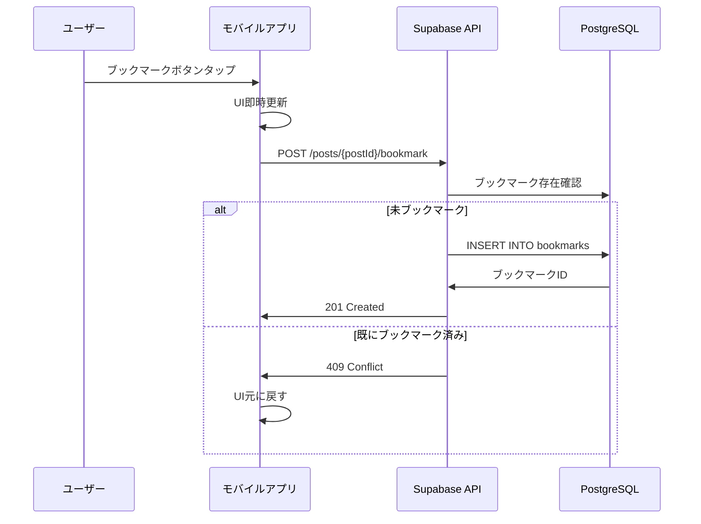
```mermaid
sequenceDiagram
    participant User as ユーザー
    participant App as モバイルアプリ
    participant API as Supabase API
    participant DB as PostgreSQL

    User->>App: ブックマークボタンタップ
    App->>App: UI即時更新
    
    App->>API: POST /posts/{postId}/bookmark
    API->>DB: ブックマーク存在確認
    
    alt 未ブックマーク
        API->>DB: INSERT INTO bookmarks
        DB->>API: ブックマークID
        API->>App: 201 Created
    else 既にブックマーク済み
        API->>App: 409 Conflict
        App->>App: UI元に戻す
    end
```

### 5.5 投稿削除

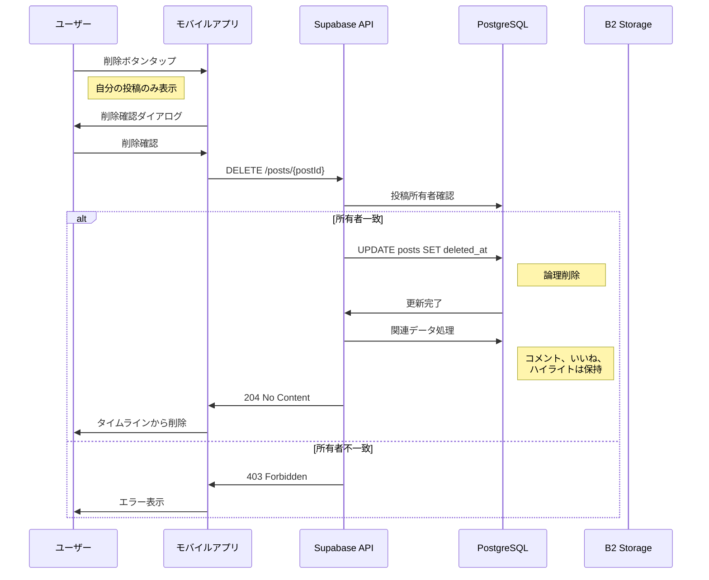
```mermaid
sequenceDiagram
    participant User as ユーザー
    participant App as モバイルアプリ
    participant API as Supabase API
    participant DB as PostgreSQL
    participant Storage as B2 Storage

    User->>App: 削除ボタンタップ
    note right of User: 自分の投稿のみ表示
    
    App->>User: 削除確認ダイアログ
    User->>App: 削除確認
    
    App->>API: DELETE /posts/{postId}
    API->>DB: 投稿所有者確認
    
    alt 所有者一致
        API->>DB: UPDATE posts SET deleted_at
        note right of DB: 論理削除
        
        DB->>API: 更新完了
        
        API->>DB: 関連データ処理
        note right of DB: コメント、いいね、<br/>ハイライトは保持
        
        API->>App: 204 No Content
        App->>User: タイムラインから削除
    else 所有者不一致
        API->>App: 403 Forbidden
        App->>User: エラー表示
    end
```

## 6. オフライン機能（後で見る）

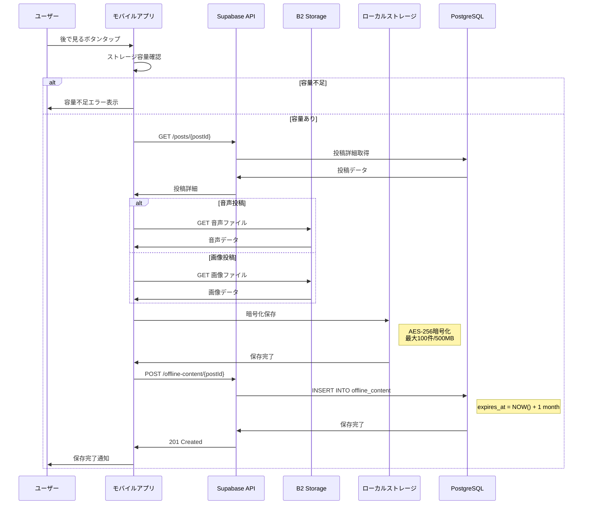
```mermaid
sequenceDiagram
    participant User as ユーザー
    participant App as モバイルアプリ
    participant API as Supabase API
    participant Storage as B2 Storage
    participant Local as ローカルストレージ
    participant DB as PostgreSQL

    User->>App: 後で見るボタンタップ
    App->>App: ストレージ容量確認
    
    alt 容量不足
        App->>User: 容量不足エラー表示
    else 容量あり
        App->>API: GET /posts/{postId}
        API->>DB: 投稿詳細取得
        DB->>API: 投稿データ
        API->>App: 投稿詳細
        
        alt 音声投稿
            App->>Storage: GET 音声ファイル
            Storage->>App: 音声データ
        else 画像投稿
            App->>Storage: GET 画像ファイル
            Storage->>App: 画像データ
        end
        
        App->>Local: 暗号化保存
        note right of Local: AES-256暗号化<br/>最大100件/500MB
        
        Local->>App: 保存完了
        
        App->>API: POST /offline-content/{postId}
        API->>DB: INSERT INTO offline_content
        note right of DB: expires_at = NOW() + 1 month
        
        DB->>API: 保存完了
        API->>App: 201 Created
        App->>User: 保存完了通知
    end
```

## 7. 後で見る再生

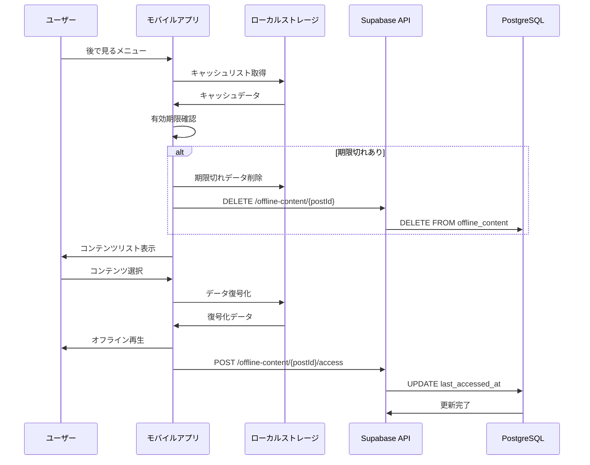
```mermaid
sequenceDiagram
    participant User as ユーザー
    participant App as モバイルアプリ
    participant Local as ローカルストレージ
    participant API as Supabase API
    participant DB as PostgreSQL

    User->>App: 後で見るメニュー
    App->>Local: キャッシュリスト取得
    Local->>App: キャッシュデータ
    
    App->>App: 有効期限確認
    alt 期限切れあり
        App->>Local: 期限切れデータ削除
        App->>API: DELETE /offline-content/{postId}
        API->>DB: DELETE FROM offline_content
    end
    
    App->>User: コンテンツリスト表示
    
    User->>App: コンテンツ選択
    App->>Local: データ復号化
    Local->>App: 復号化データ
    
    App->>User: オフライン再生
    
    App->>API: POST /offline-content/{postId}/access
    API->>DB: UPDATE last_accessed_at
    DB->>API: 更新完了
```

## 8. シェア機能

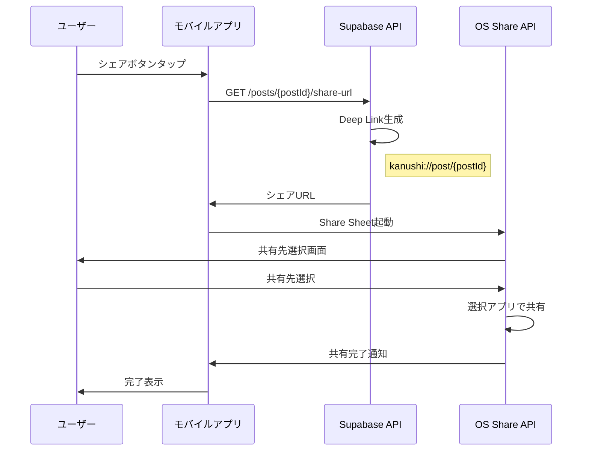
```mermaid
sequenceDiagram
    participant User as ユーザー
    participant App as モバイルアプリ
    participant API as Supabase API
    participant OS as OS Share API

    User->>App: シェアボタンタップ
    App->>API: GET /posts/{postId}/share-url
    API->>API: Deep Link生成
    note right of API: kanushi://post/{postId}
    
    API->>App: シェアURL
    App->>OS: Share Sheet起動
    OS->>User: 共有先選択画面
    
    User->>OS: 共有先選択
    OS->>OS: 選択アプリで共有
    OS->>App: 共有完了通知
    App->>User: 完了表示
```

## エラーハンドリング

### ネットワークエラー時の投稿

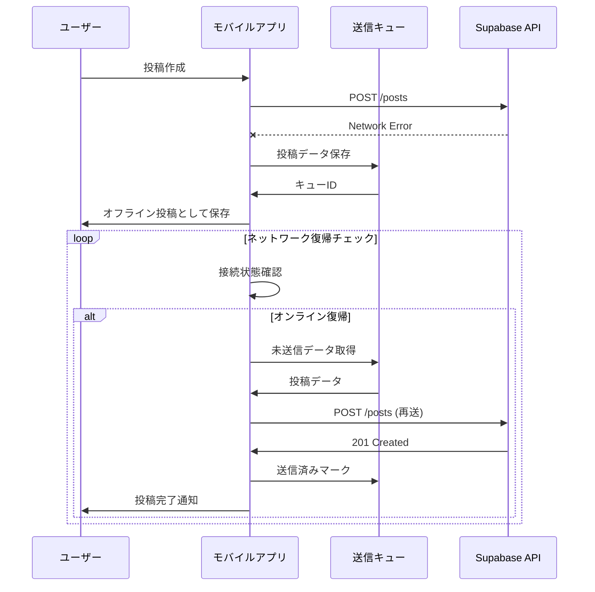
```mermaid
sequenceDiagram
    participant User as ユーザー
    participant App as モバイルアプリ
    participant Queue as 送信キュー
    participant API as Supabase API

    User->>App: 投稿作成
    App->>API: POST /posts
    API--xApp: Network Error
    
    App->>Queue: 投稿データ保存
    Queue->>App: キューID
    App->>User: オフライン投稿として保存
    
    loop ネットワーク復帰チェック
        App->>App: 接続状態確認
        alt オンライン復帰
            App->>Queue: 未送信データ取得
            Queue->>App: 投稿データ
            App->>API: POST /posts (再送)
            API->>App: 201 Created
            App->>Queue: 送信済みマーク
            App->>User: 投稿完了通知
        end
    end
```

### レート制限エラー

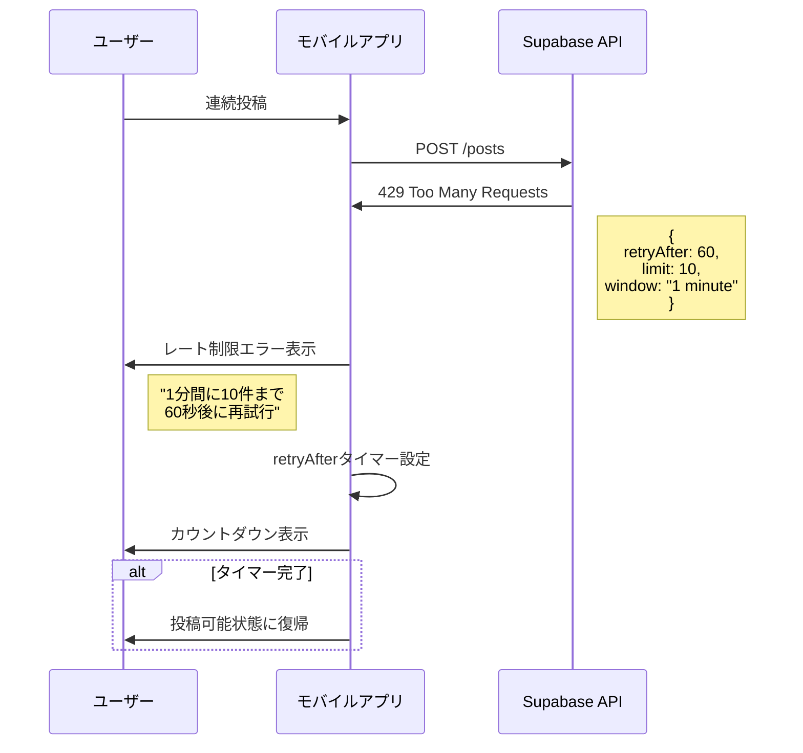
```mermaid
sequenceDiagram
    participant User as ユーザー
    participant App as モバイルアプリ
    participant API as Supabase API

    User->>App: 連続投稿
    App->>API: POST /posts
    API->>App: 429 Too Many Requests
    note right of API: {<br/>  retryAfter: 60,<br/>  limit: 10,<br/>  window: "1 minute"<br/>}
    
    App->>User: レート制限エラー表示
    note right of User: "1分間に10件まで<br/>60秒後に再試行"
    
    App->>App: retryAfterタイマー設定
    App->>User: カウントダウン表示
    
    alt タイマー完了
        App->>User: 投稿可能状態に復帰
    end
```