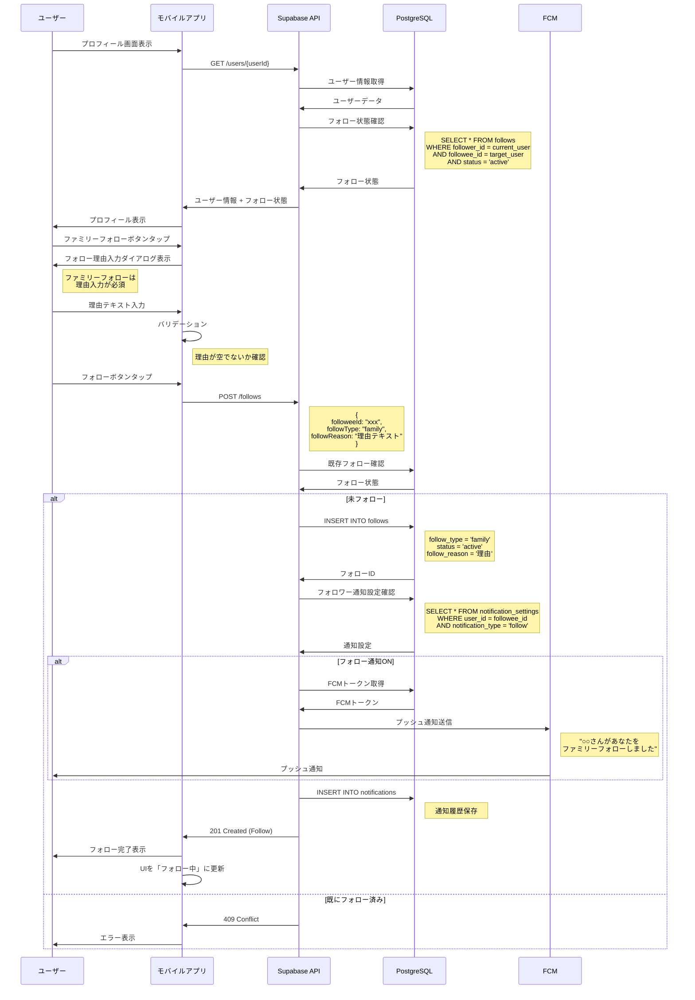
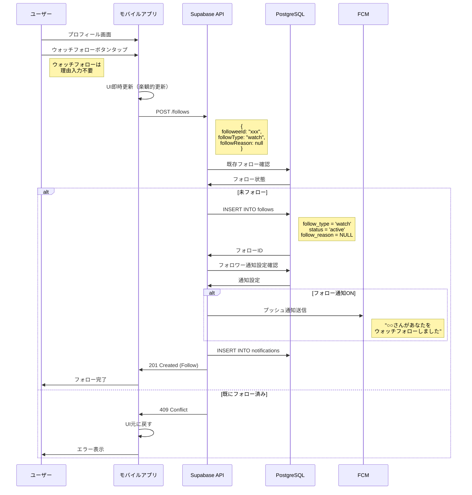
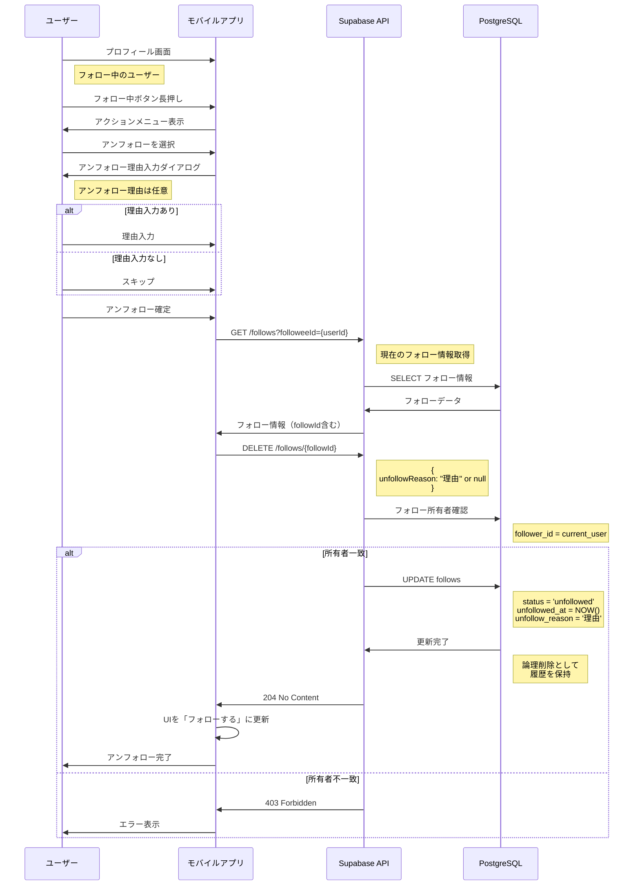
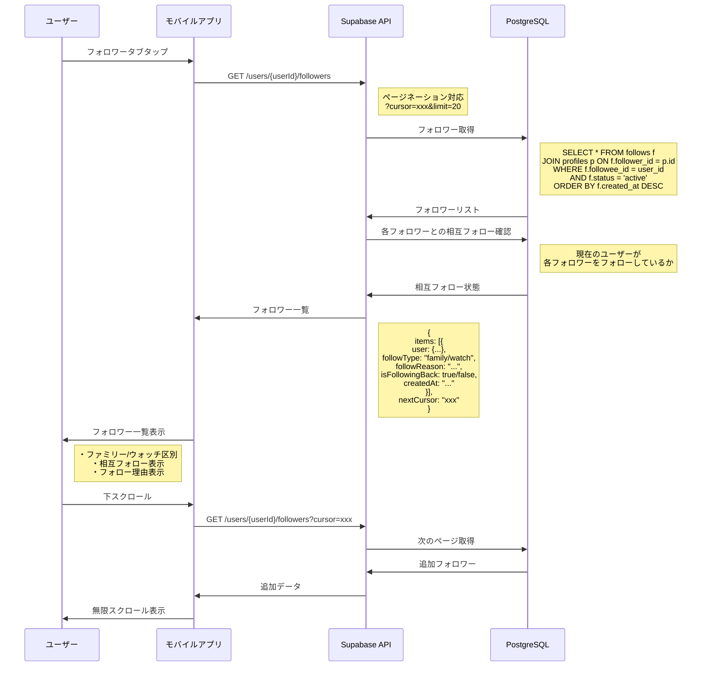
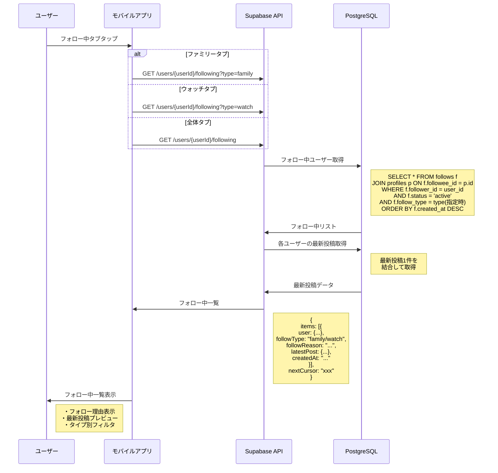
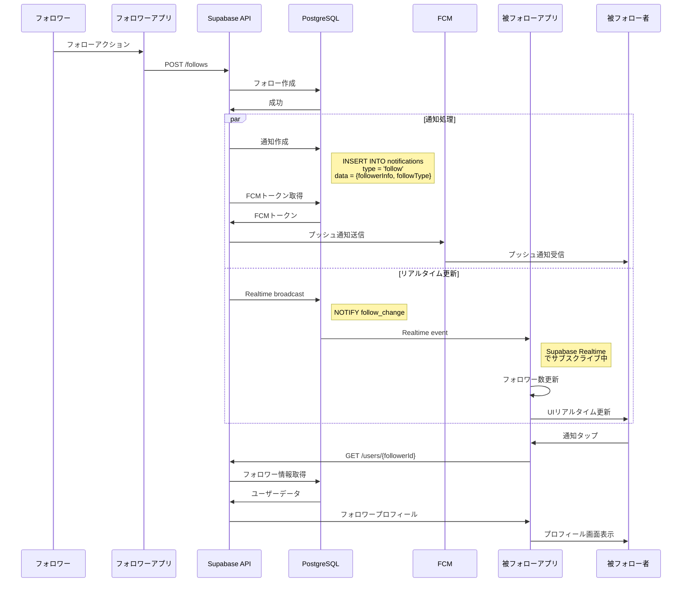
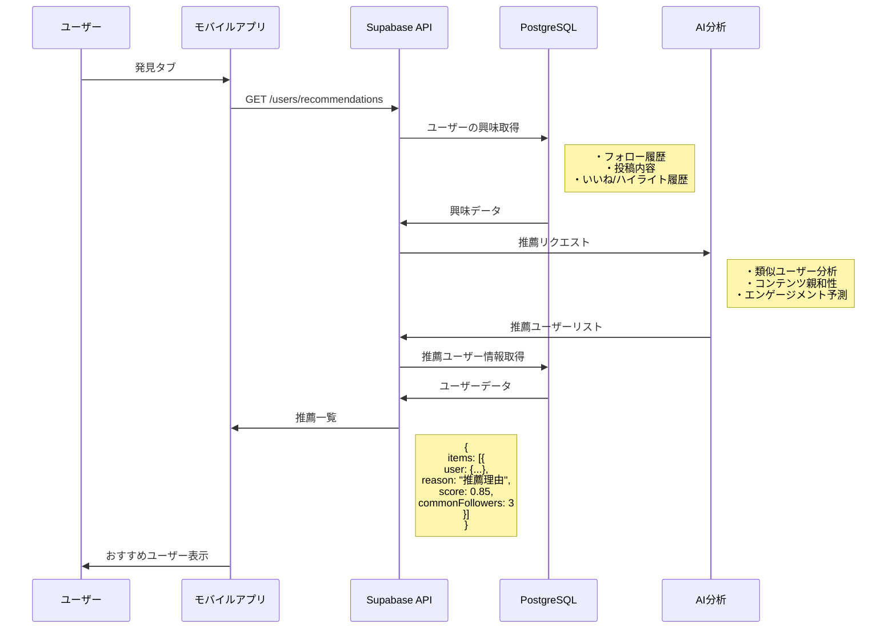
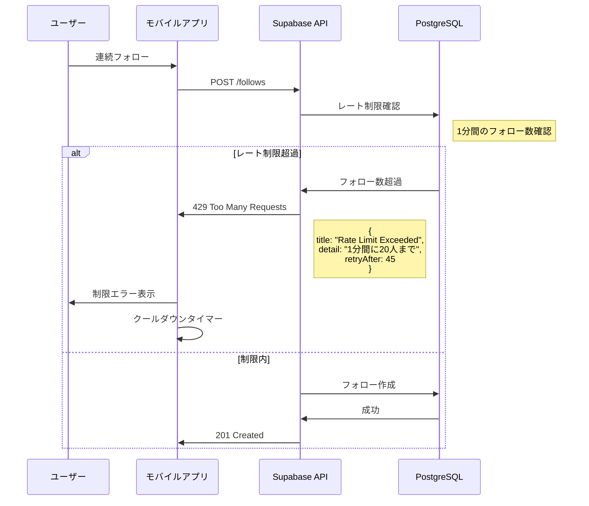
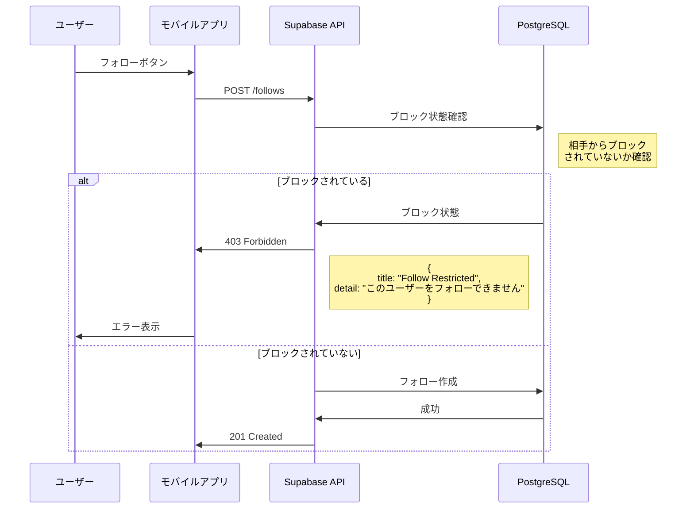

# フォロー機能シーケンス図

## 1. ファミリーフォロー（理由入力必須）

## 2. ウォッチフォロー（理由不要）

## 3. アンフォロー処理

## 4. フォロワー一覧取得

## 5. フォロー中一覧取得

## 6. フォロー状態変更の通知処理

## 7. フォロー推薦（将来拡張）

## エラーハンドリング

### フォロー制限

### 相互フォロー制限（将来実装）

