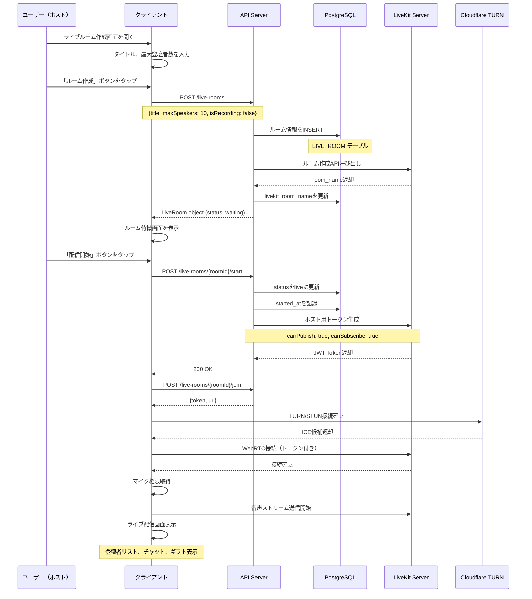
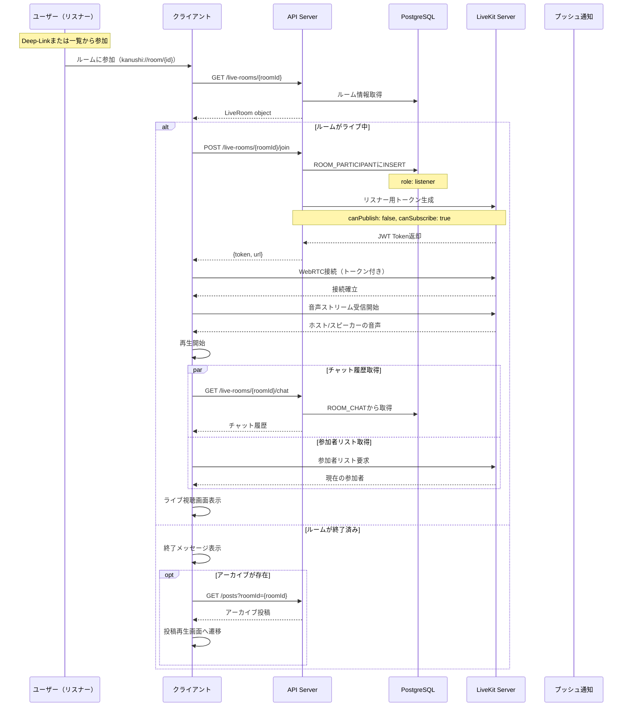
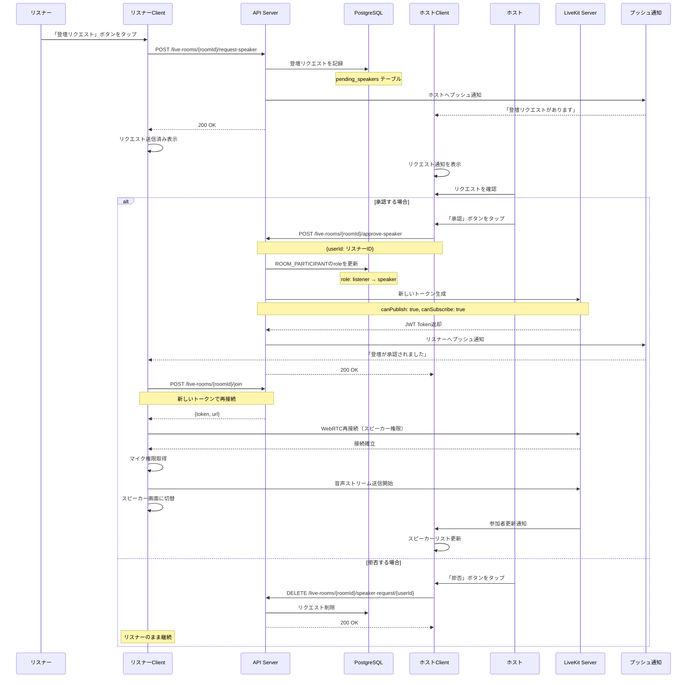
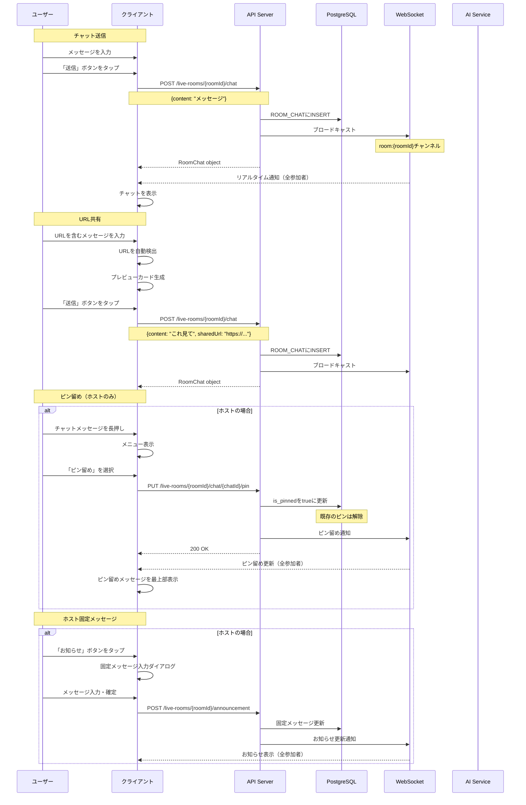
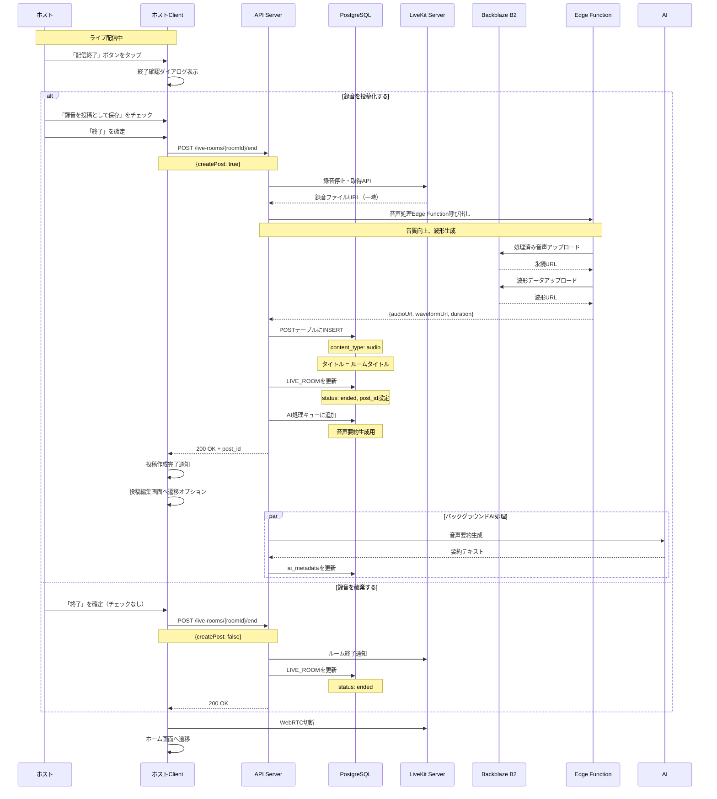
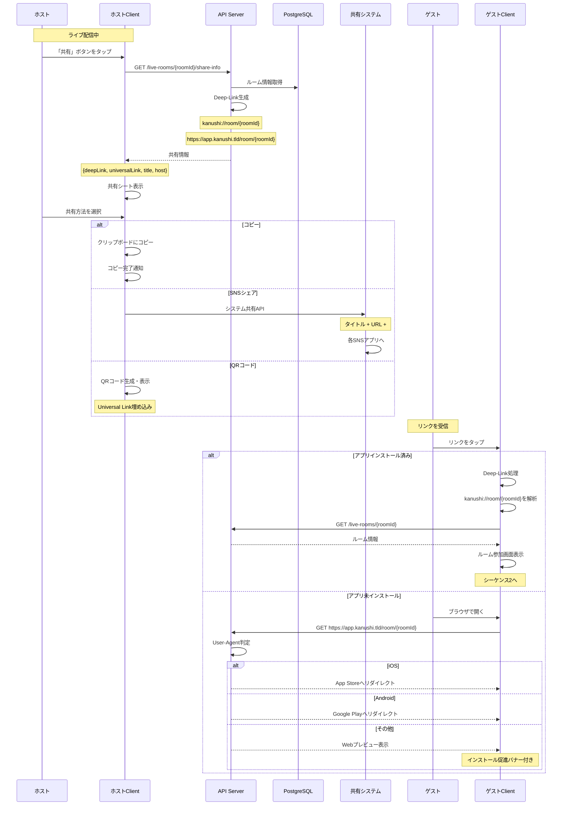
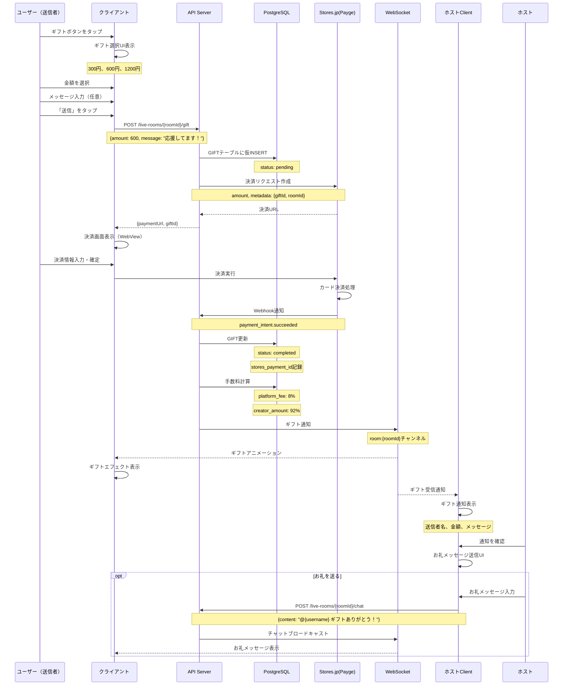
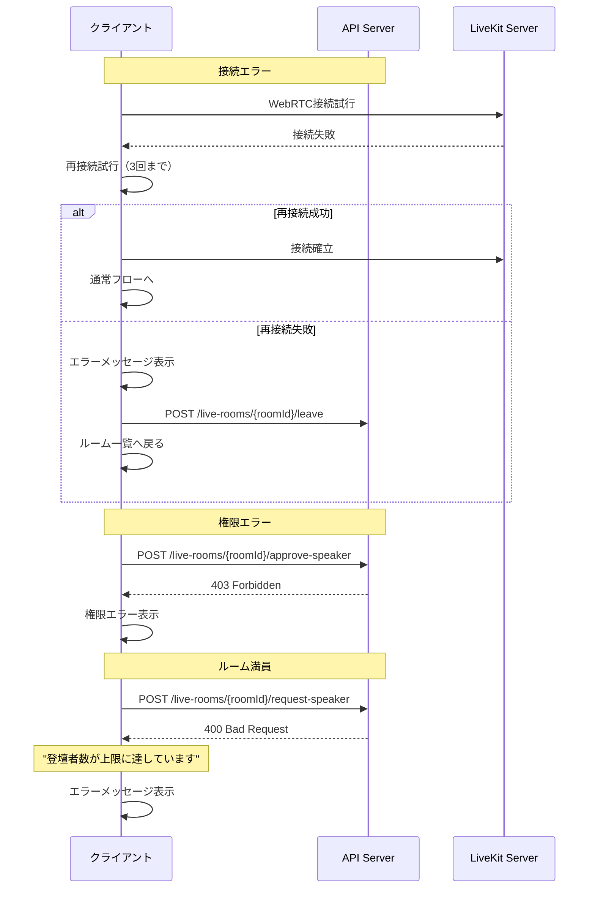

# ライブルーム機能シーケンス図

## 概要
本ドキュメントは、ライブルーム機能の詳細なシーケンス図を定義します。
LiveKit（WebRTC）を活用した音声配信機能の実装フローを示します。

## 1. ルーム作成・開始

## 2. ルーム参加（リスナー）

## 3. 登壇リクエスト・承認

## 4. ルームチャット・URL共有・ピン留め

## 5. 録音・投稿化

## 6. Deep-Link生成・共有

## 7. ギフト送信（ライブルーム）

## エラーハンドリング

## セキュリティ考慮事項

1. **JWT トークン**
   - 有効期限: 6時間
   - ルームID、ユーザーID、権限を含む
   - サーバーサイドで生成

2. **権限管理**
   - ホストのみ: 登壇承認、ピン留め、配信終了
   - スピーカー: 音声送信、チャット
   - リスナー: 音声受信、チャット、登壇リクエスト

3. **レート制限**
   - チャット送信: 10メッセージ/分
   - 登壇リクエスト: 1回/ルーム
   - ギフト送信: 決済完了後のみ

4. **録音データ**
   - 暗号化してB2に保存
   - ホストのみダウンロード可能
   - 投稿化しない場合は7日後に自動削除