# ダイレクトメッセージ機能シーケンス図

## 1. DM会話開始

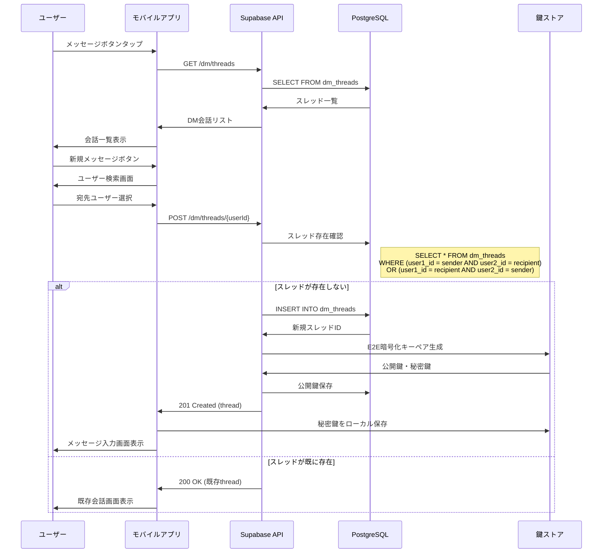

## 2. テキストメッセージ送信

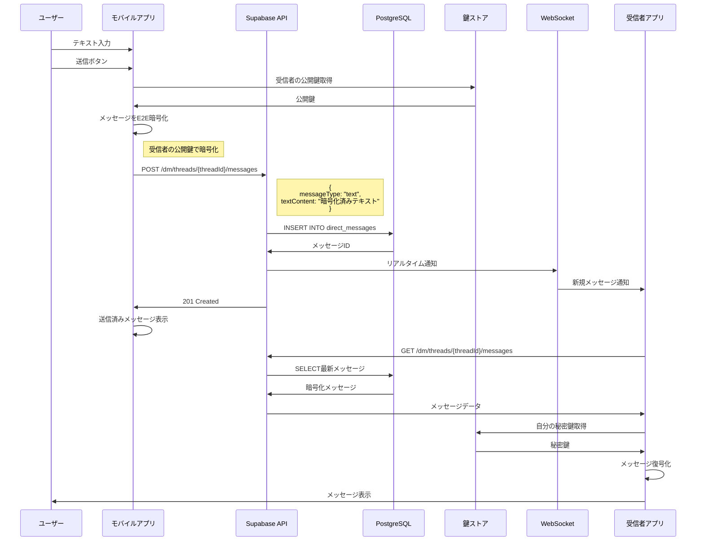

## 3. 画像メッセージ送信

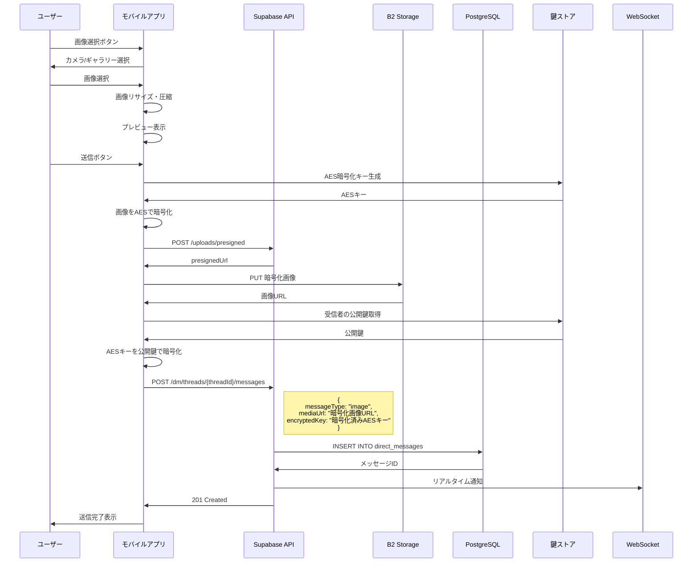

## 4. 音声メッセージ送信

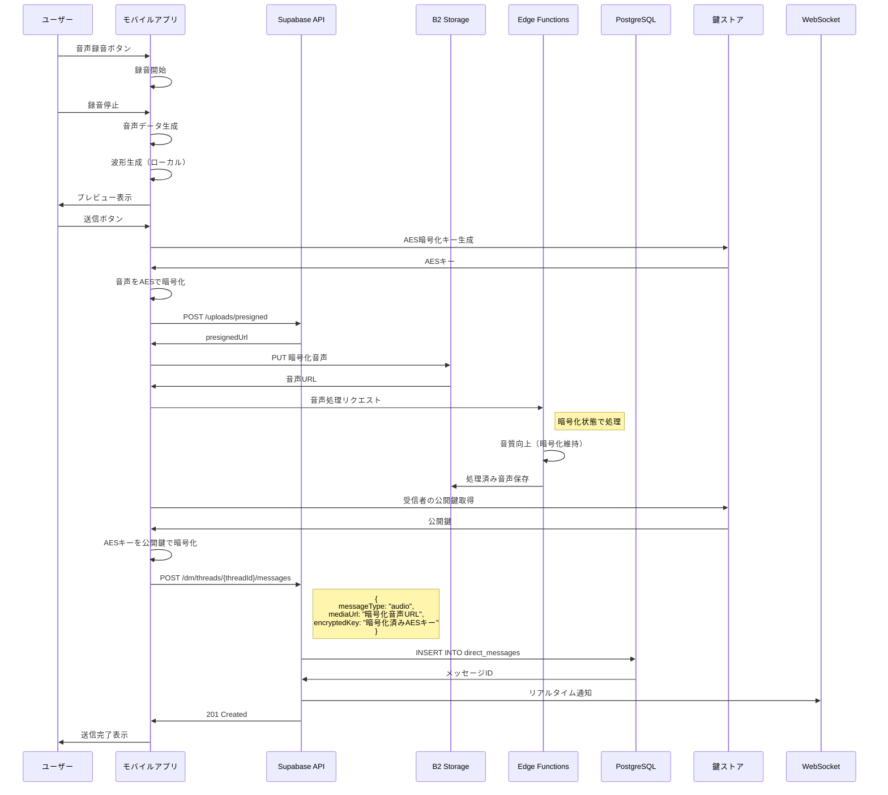

## 5. 既読処理

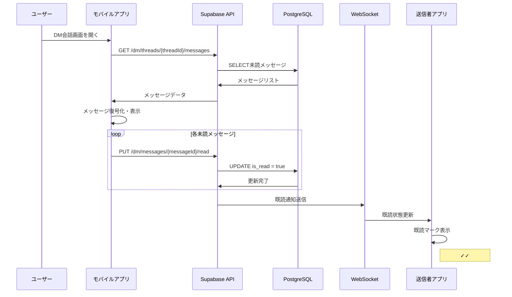

## 6. スレッド管理

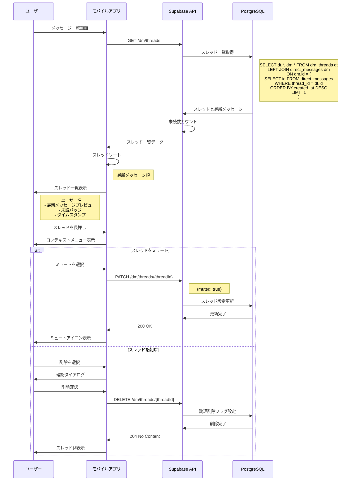

## 7. リアルタイム同期

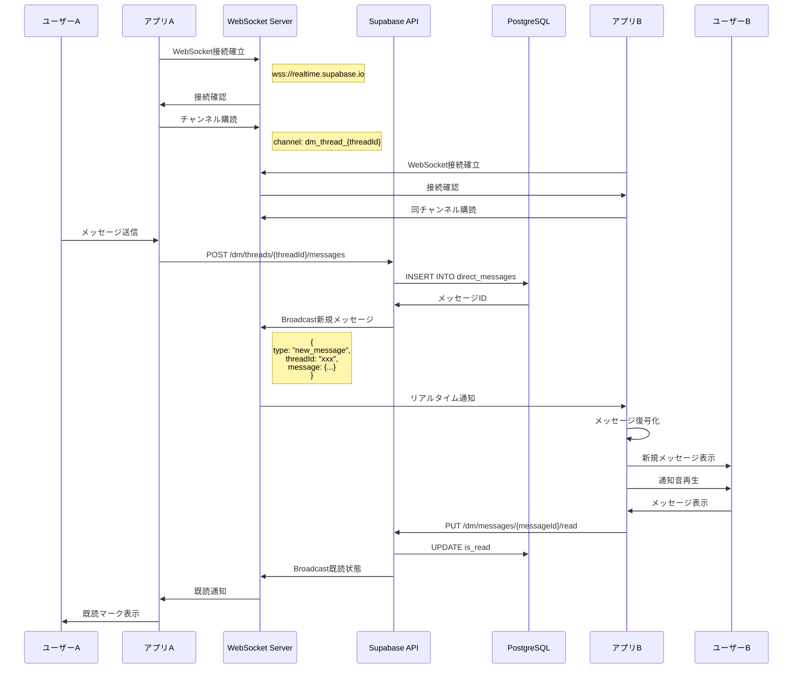

## 8. E2E暗号化の鍵交換

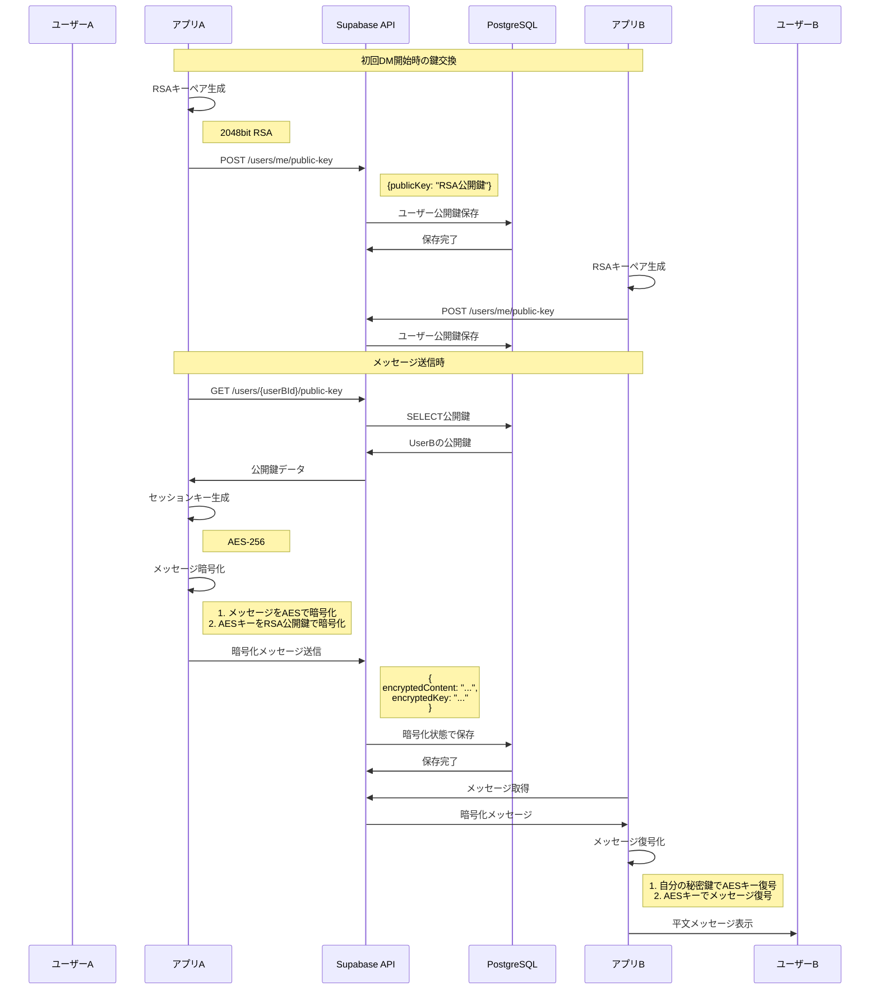

## エラーハンドリング

### メッセージ送信失敗時

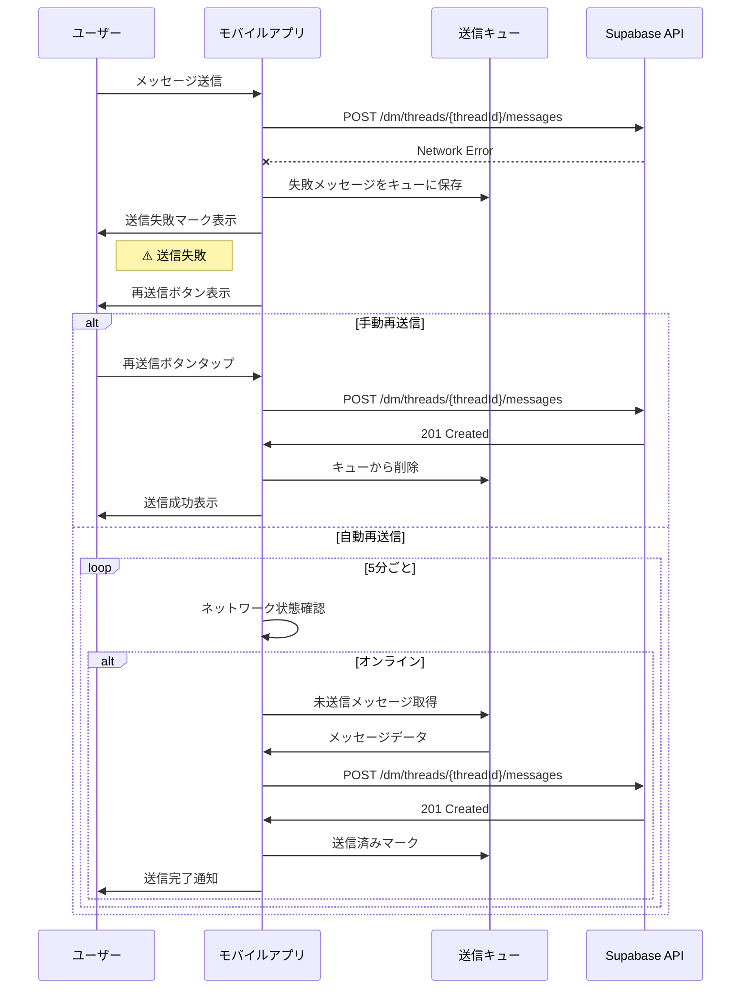

### 暗号化エラー

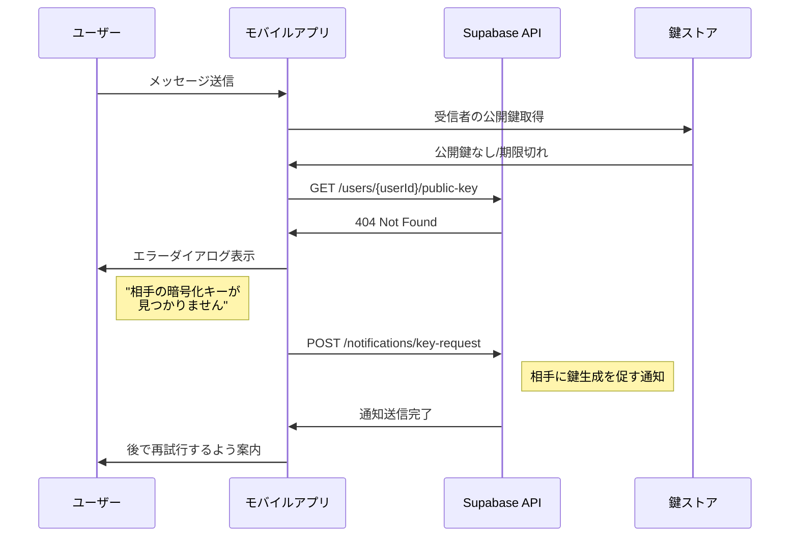

### WebSocket接続エラー

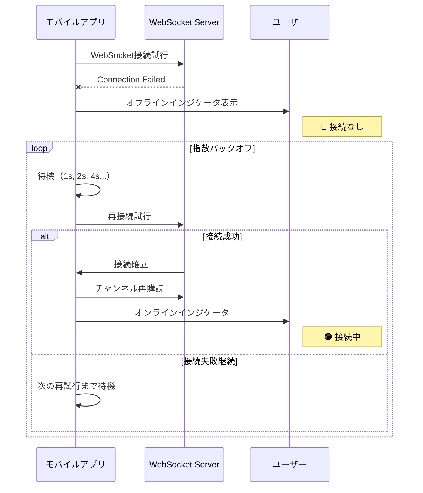