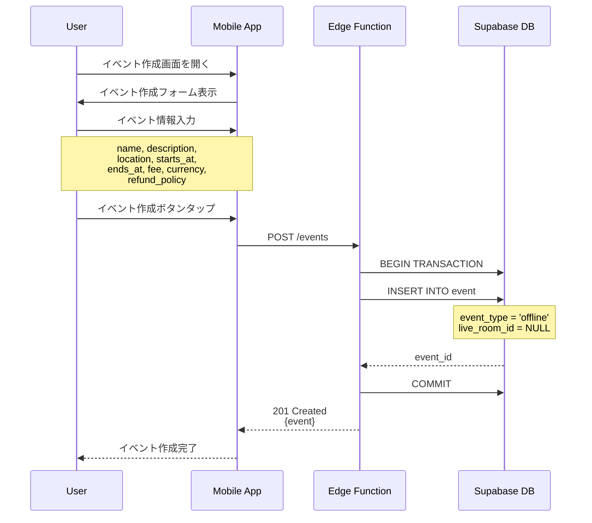
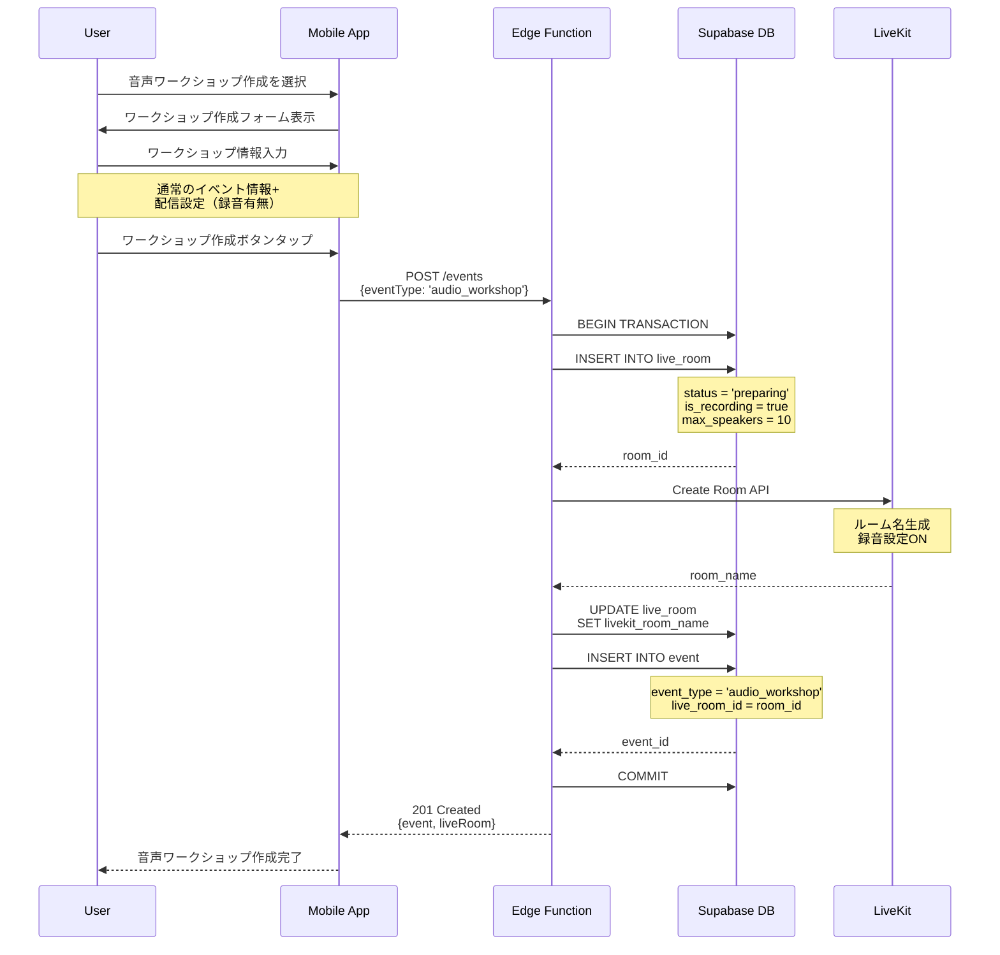
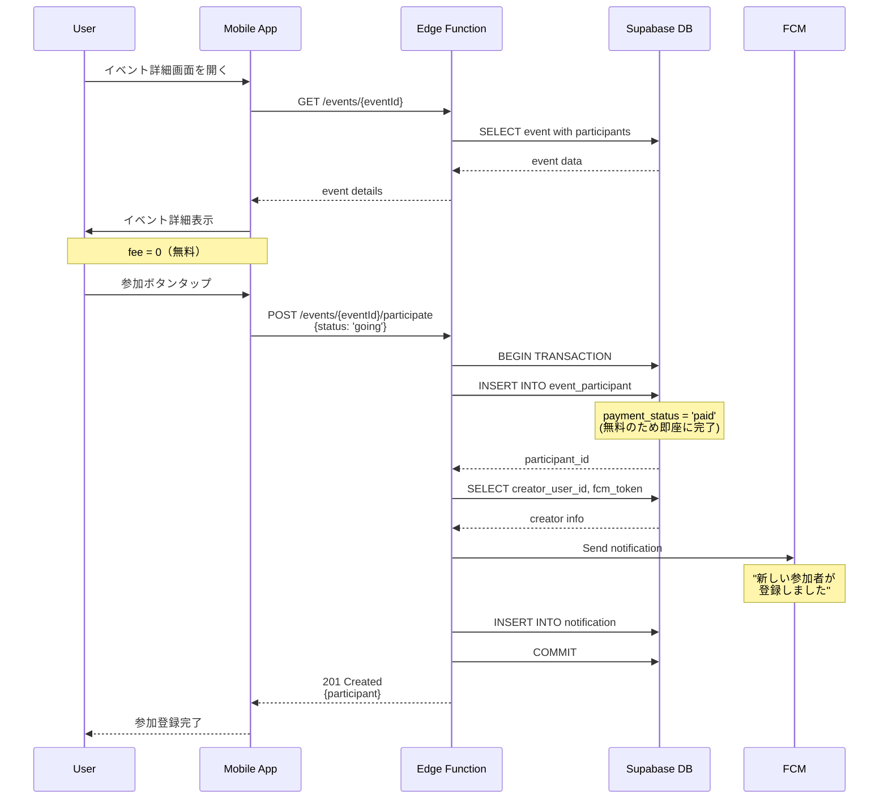
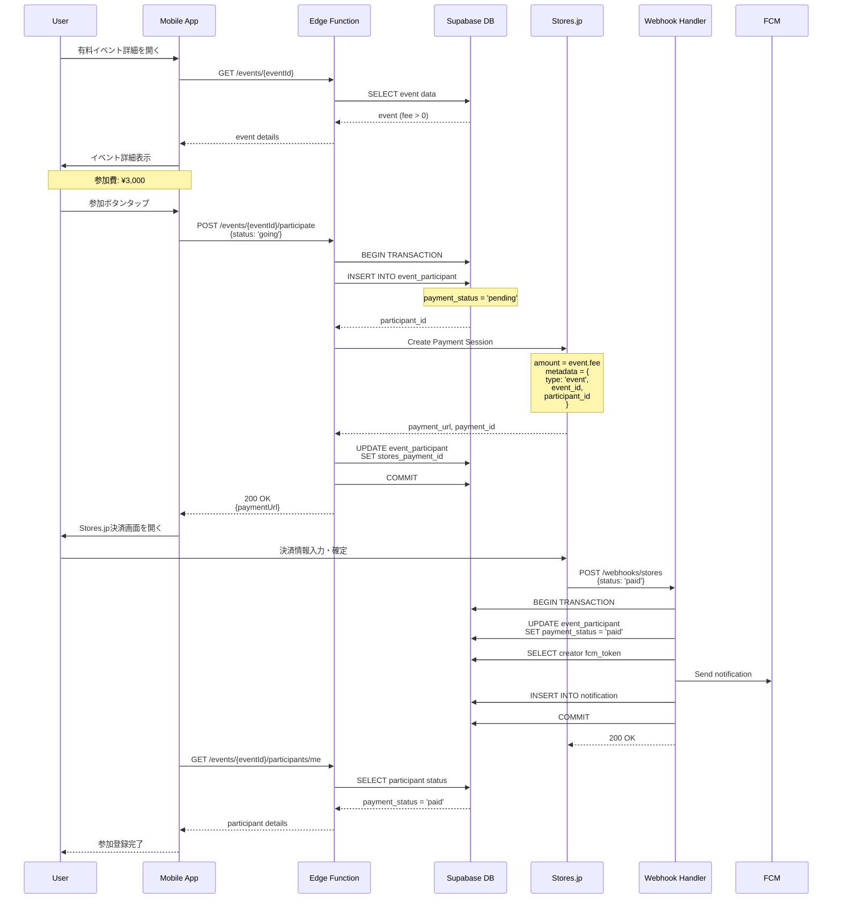
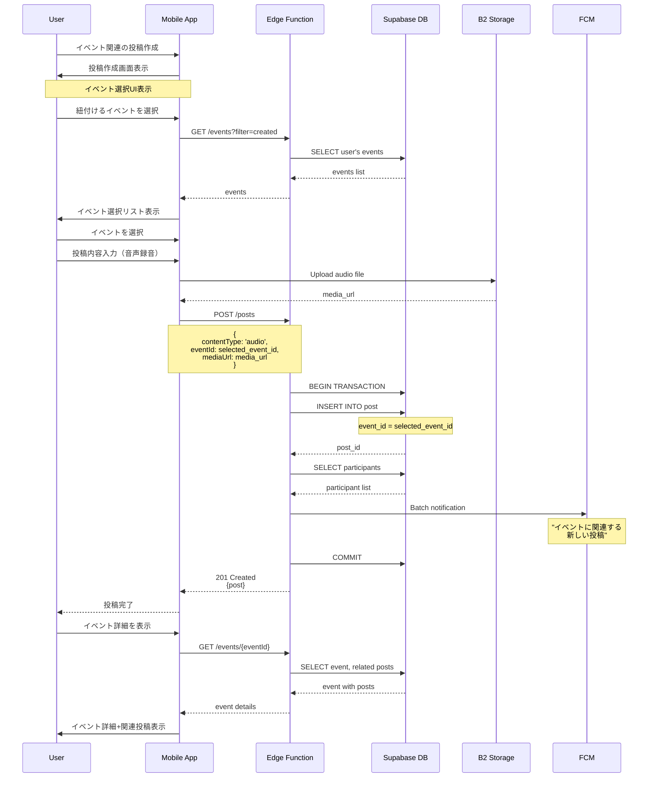
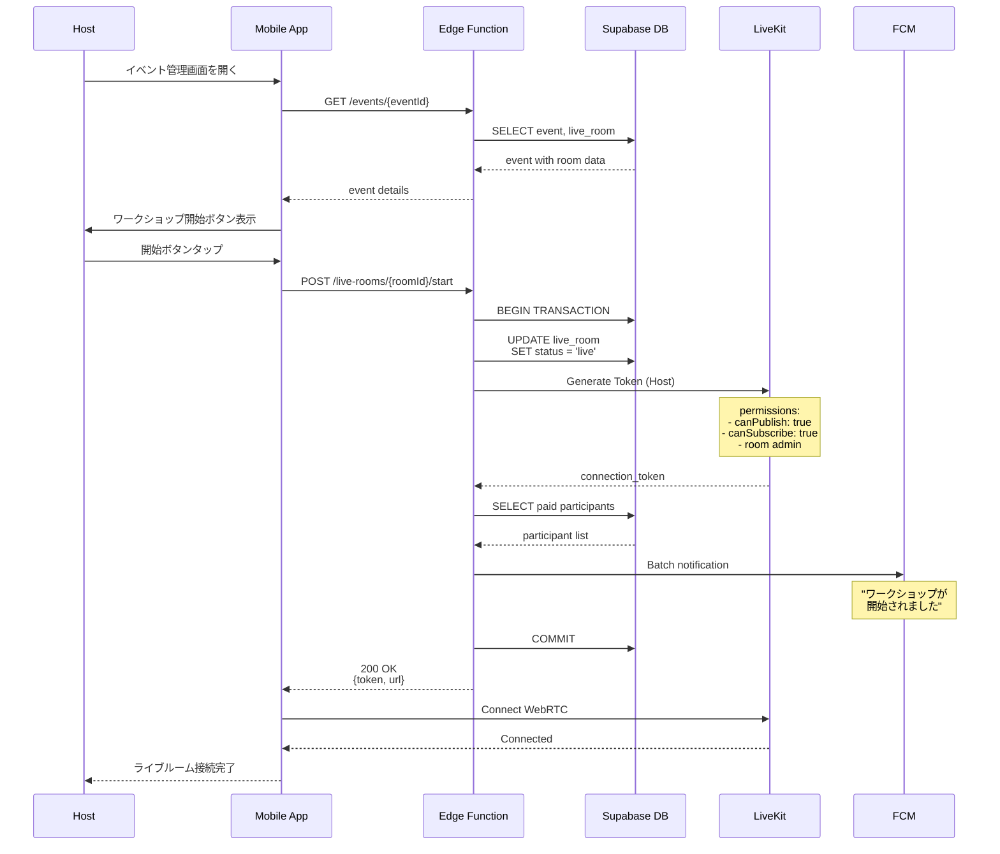
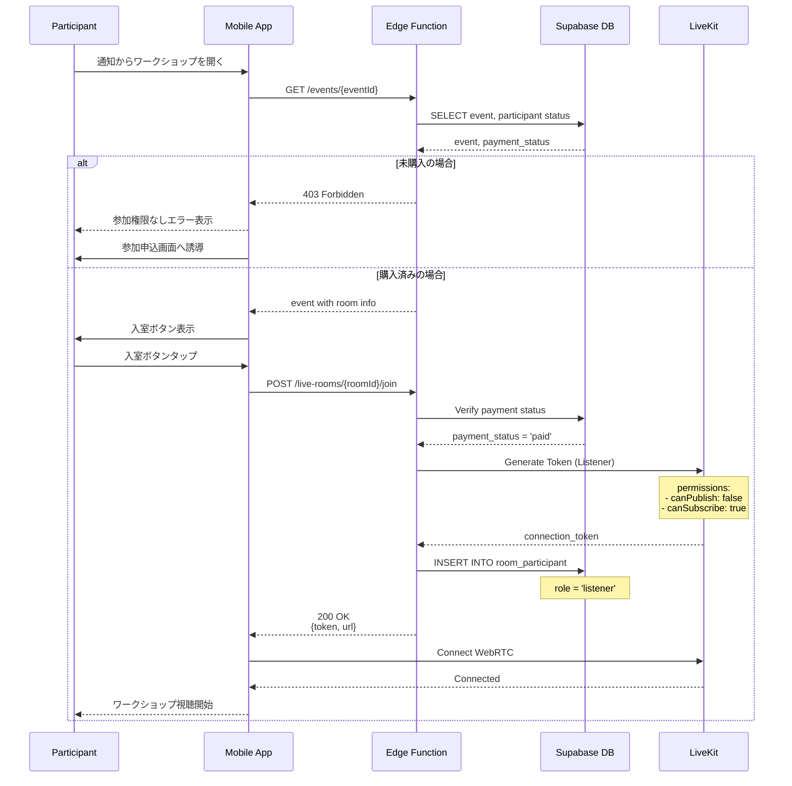
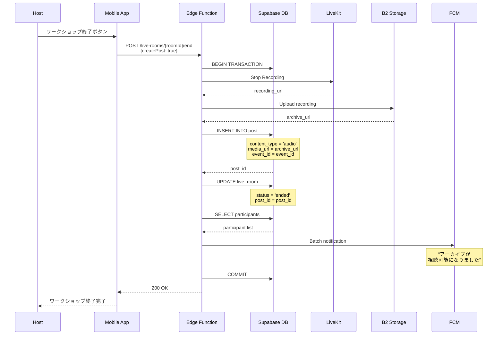
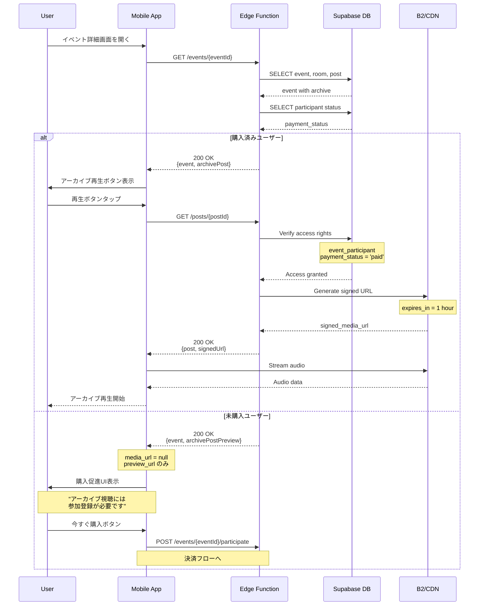
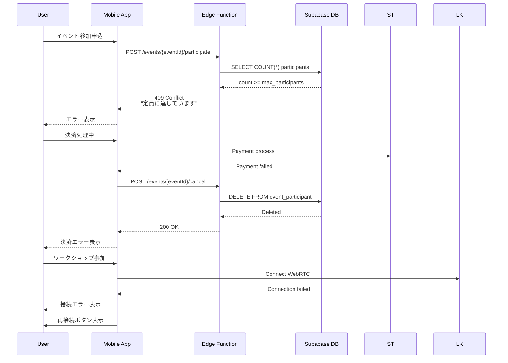

# 06. イベント機能のシーケンス図

## 概要
イベント機能は、オンライン・オフラインのイベント開催を支援する機能です。
特に音声ワークショップでは、ライブルームとの連携により、リアルタイム配信と
アーカイブ視聴の両方をサポートします。

## 6.1 イベント作成（音声ワークショップ含む）

### 6.1.1 通常イベント作成

### 6.1.2 音声ワークショップ作成

## 6.2 イベント参加・決済

### 6.2.1 無料イベント参加

### 6.2.2 有料イベント参加（Stores.jp決済）

## 6.3 イベント投稿紐付け

## 6.4 音声ワークショップのライブルーム連携

### 6.4.1 ワークショップ開始（ホスト）

### 6.4.2 参加者の入室（購入者限定）

## 6.5 アーカイブ視聴（購入者限定）

### 6.5.1 ワークショップ終了とアーカイブ生成

### 6.5.2 アーカイブ視聴アクセス制御

## 6.6 エラーハンドリング

## まとめ

イベント機能のシーケンス図では、以下の主要な機能フローを定義しました：

1. **イベント作成**
   - 通常イベントと音声ワークショップの作成フロー
   - 音声WSではライブルームを同時作成

2. **イベント参加・決済**
   - 無料イベントの即時参加
   - 有料イベントのStores.jp決済連携
   - Webhook経由での支払い確認

3. **イベント投稿紐付け**
   - 投稿作成時のイベント選択
   - 参加者への自動通知

4. **ライブルーム連携**
   - 購入者限定のアクセス制御
   - ホストと参加者の権限管理
   - WebRTC接続フロー

5. **アーカイブ視聴**
   - 自動アーカイブ生成
   - 購入者限定の視聴制御
   - 署名付きURLによるセキュアな配信

これらのフローにより、音声を中心としたワークショップやイベントの
開催から収益化までを一貫してサポートします。