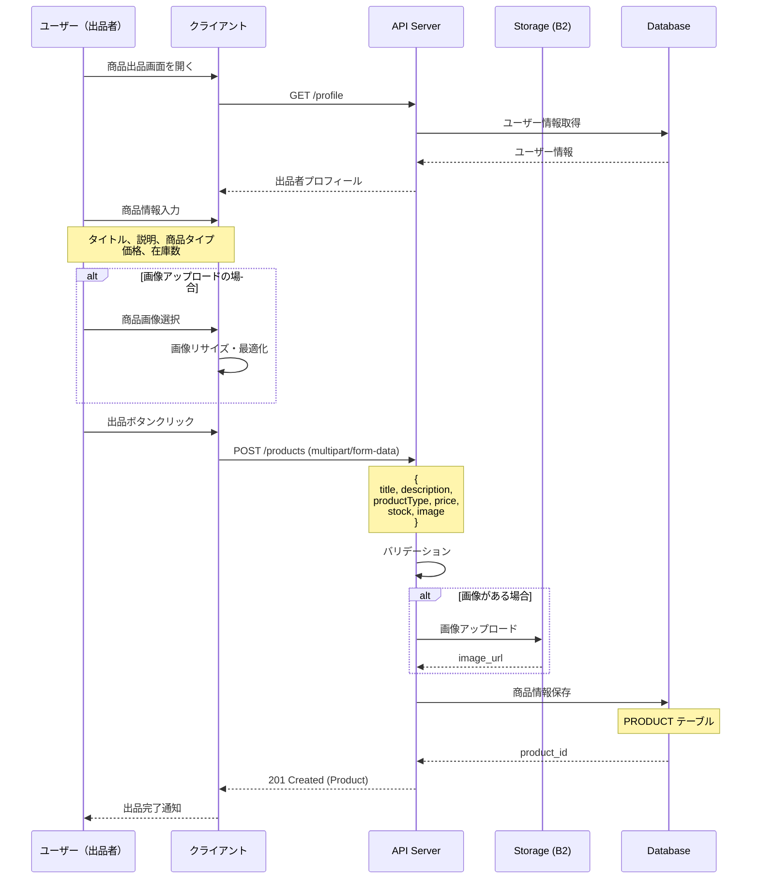
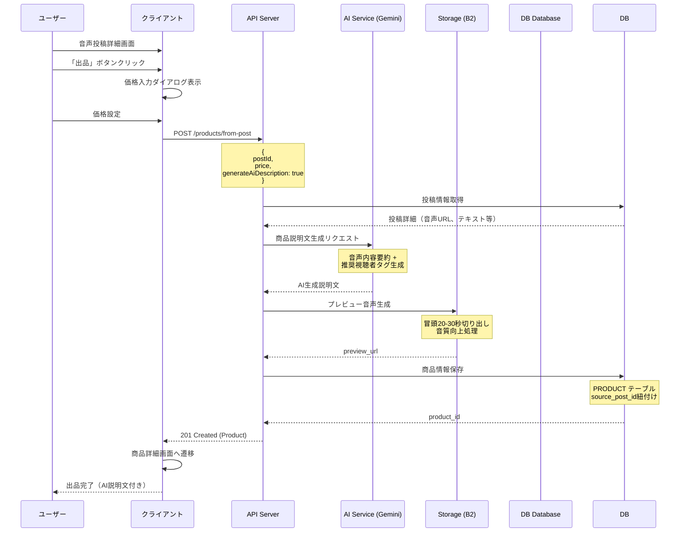
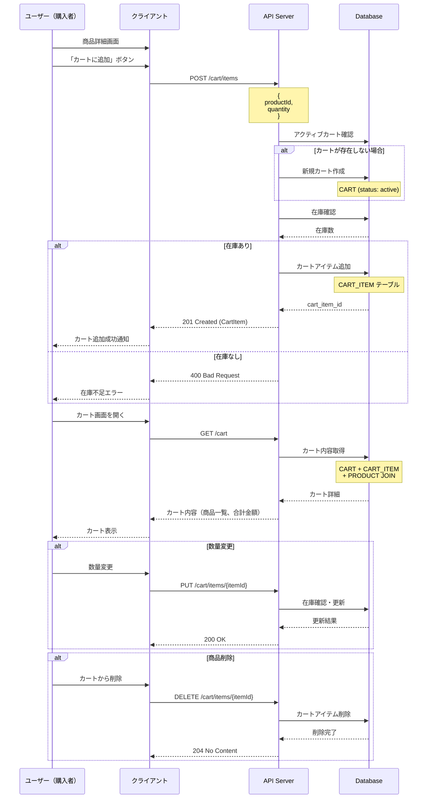
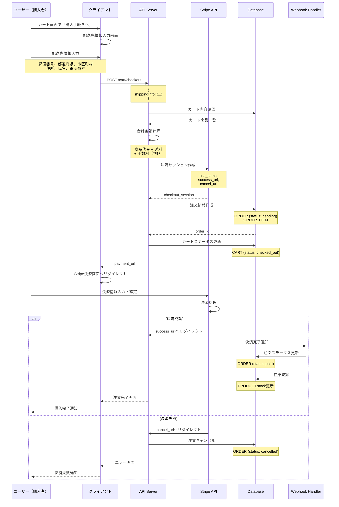
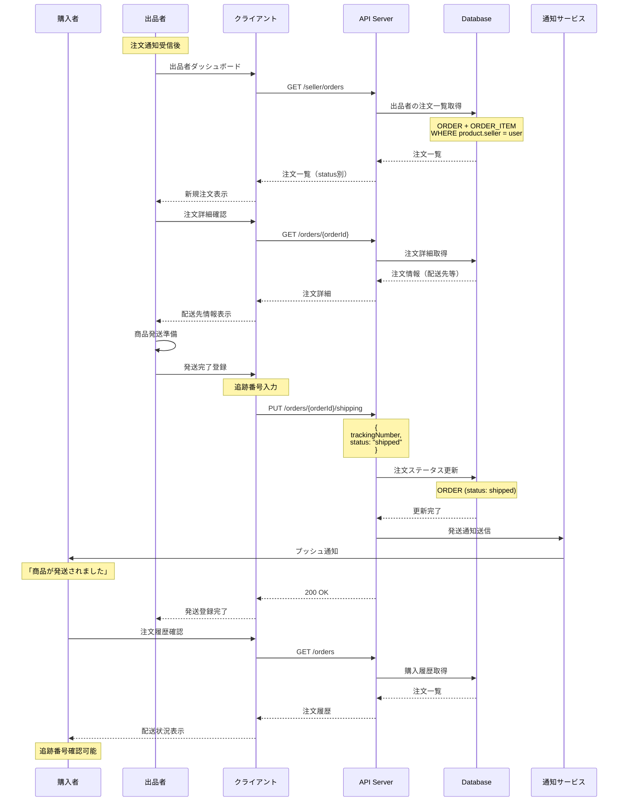
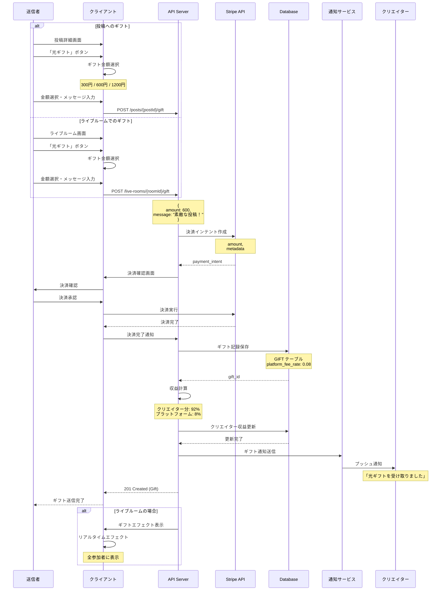
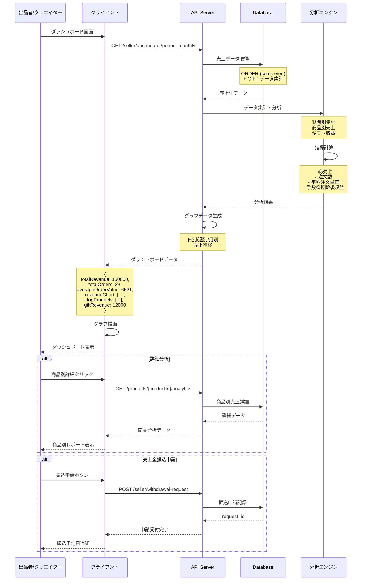
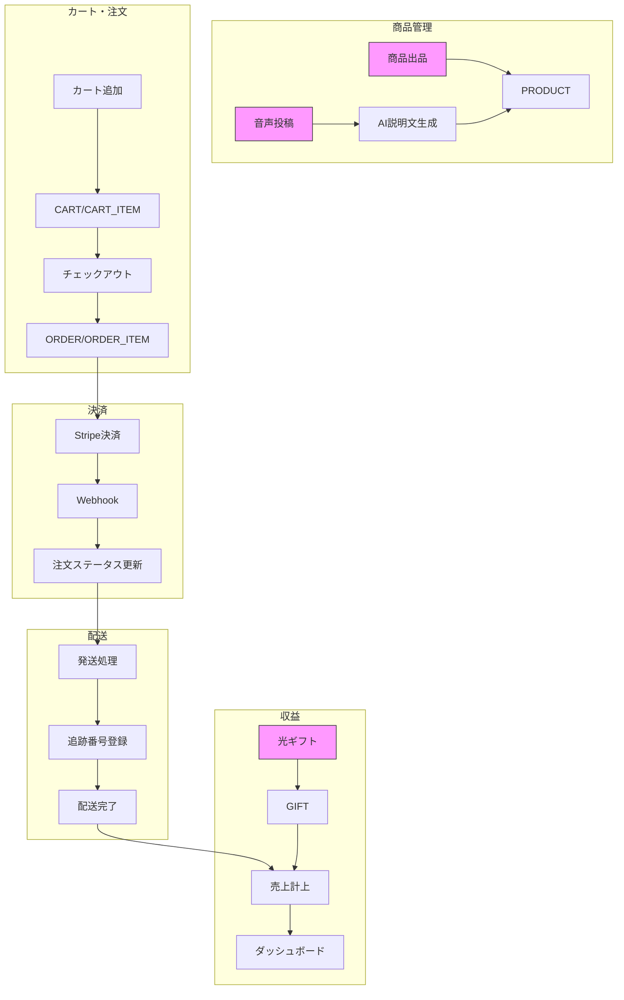

# 7. ショップ・EC機能 - シーケンス図

## 7.1 商品出品フロー（物理商品/オンラインセッション/音声）

## 7.2 音声即時出品フロー（AI説明文生成）

## 7.3 カート機能フロー

## 7.4 購入・決済フロー（Stripe統合）

## 7.5 注文管理・配送フロー

## 7.6 光ギフト送信フロー

## 7.7 売上ダッシュボードフロー

## 7.8 データフロー概要

## エラー処理とセキュリティ考慮事項

### 1. 在庫管理
- 同時購入による在庫不整合を防ぐため、楽観的ロック実装
- カート追加時と決済時の2段階在庫確認

### 2. 決済セキュリティ
- Stripe Webhookの署名検証
- 決済金額の改ざん防止（サーバー側計算）
- PCI DSS準拠（カード情報非保持）

### 3. 出品者保護
- 商品情報の編集権限チェック
- 注文情報の適切なマスキング
- 振込申請の本人確認

### 4. 購入者保護
- SSL/TLS通信
- 配送先情報の暗号化保存
- 返金・キャンセルポリシーの明示

### 5. パフォーマンス
- 商品画像のCDN配信
- ダッシュボードデータのキャッシュ
- 大量注文時のページネーション