# グループ機能シーケンス図

## 概要
グループ機能は、最大100名までのメンバーで構成されるコミュニティ機能を提供します。
無料グループと有料（月額サブスクリプション）グループの2種類があり、
チャット、グループ専用タイムライン、メンバー管理機能を持ちます。

## 1. グループ作成

### 1.1 無料グループ作成

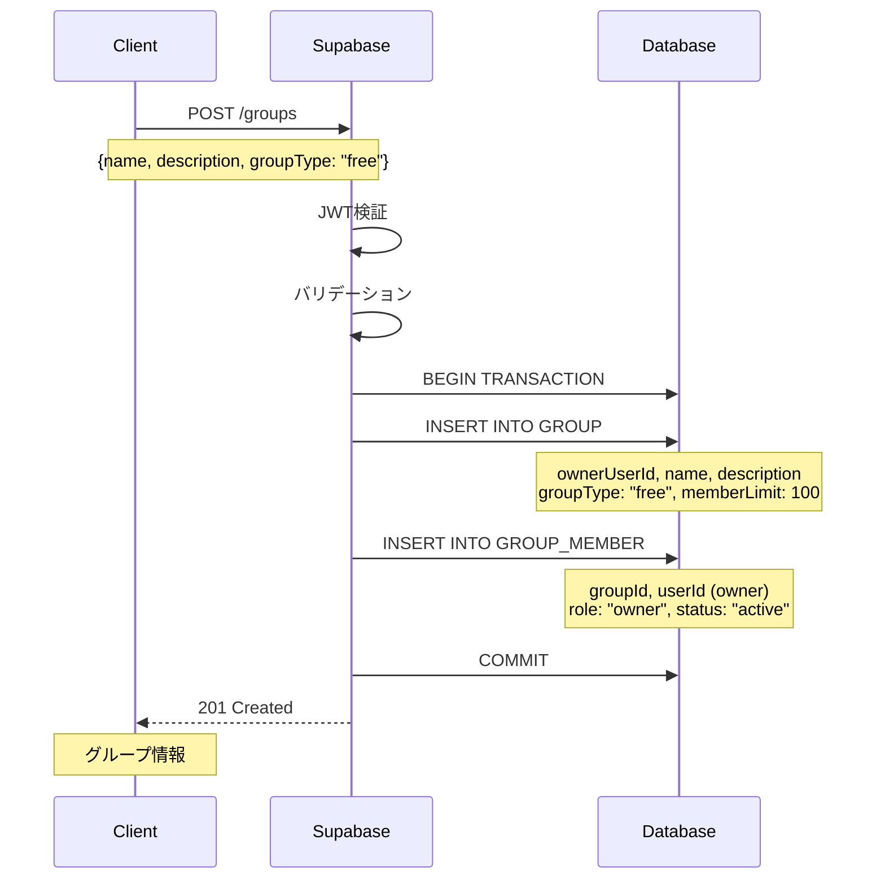

### 1.2 有料グループ作成

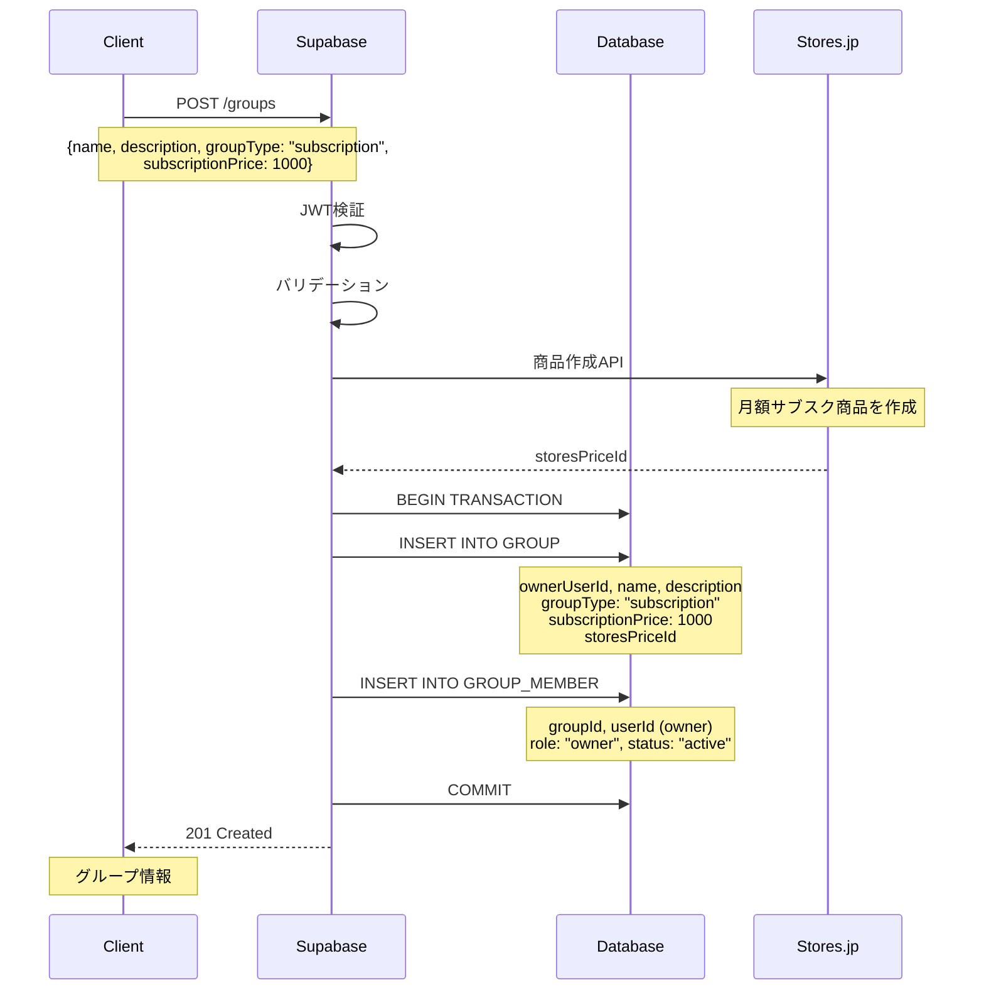

## 2. メンバー参加・退出

### 2.1 無料グループへの参加

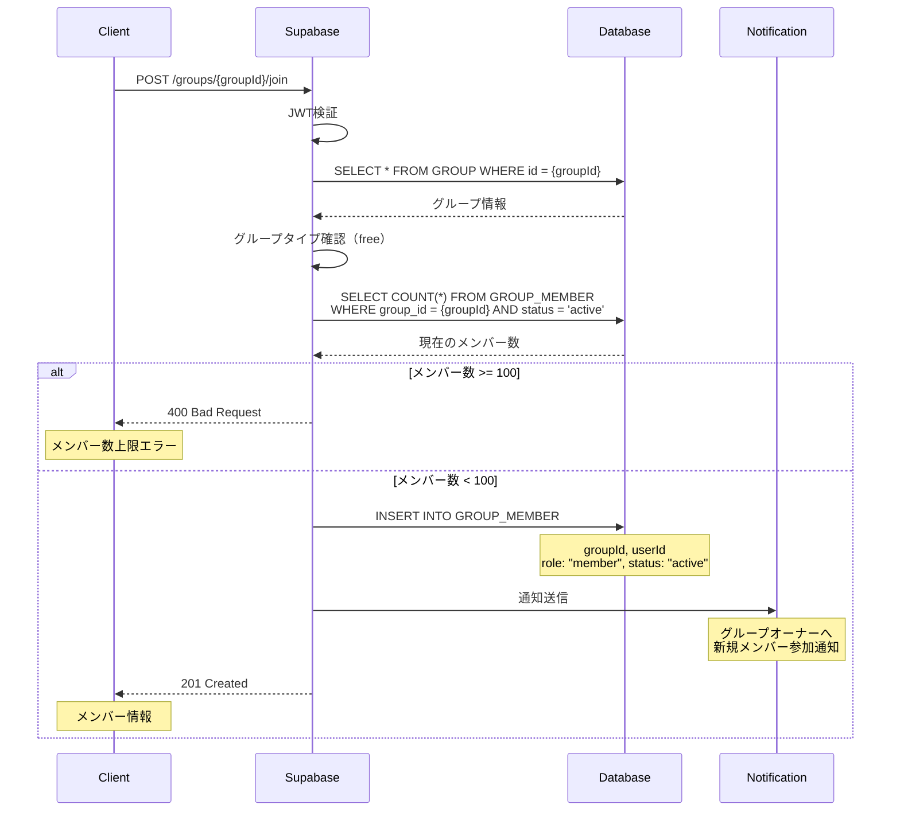

### 2.2 有料グループへの参加（サブスク決済）

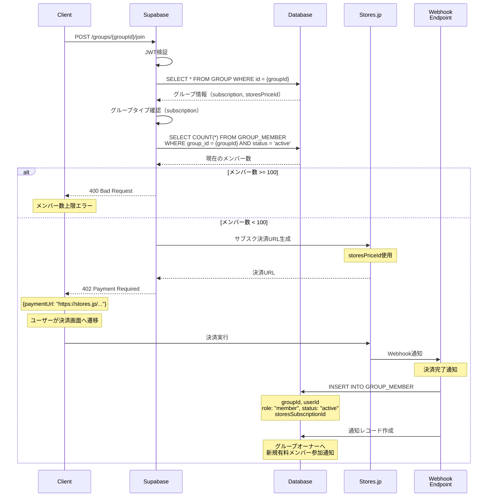

### 2.3 グループ退出

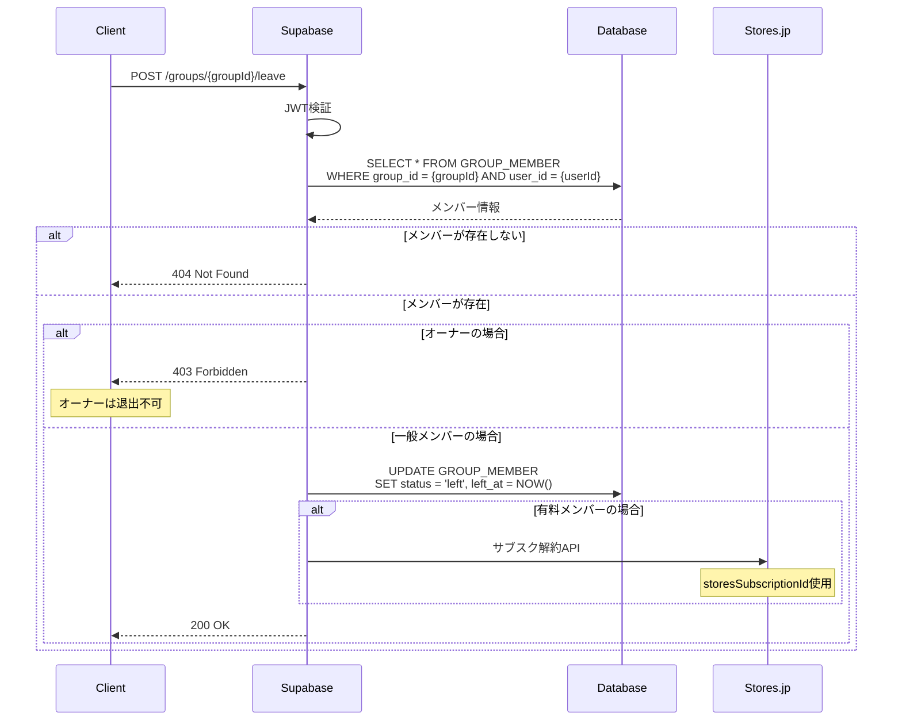

## 3. グループチャット

### 3.1 チャットメッセージ送信

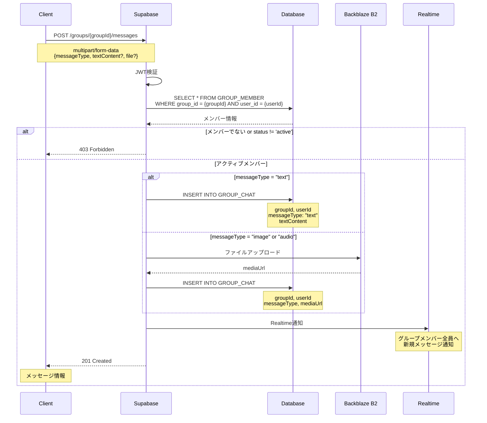

### 3.2 チャット履歴取得

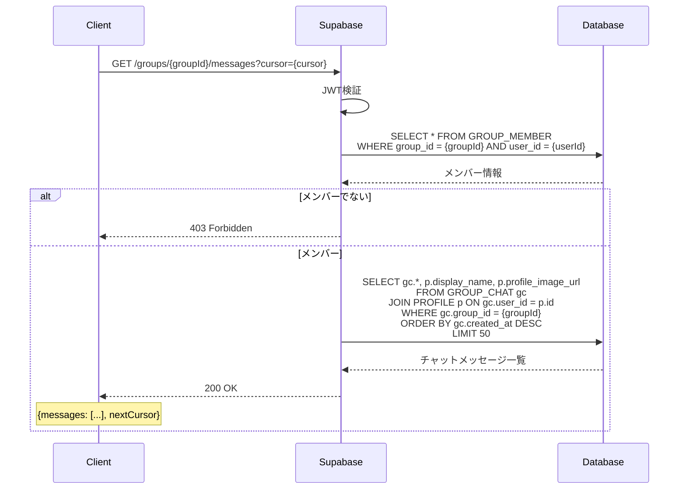

## 4. グループタイムライン

### 4.1 グループ投稿作成

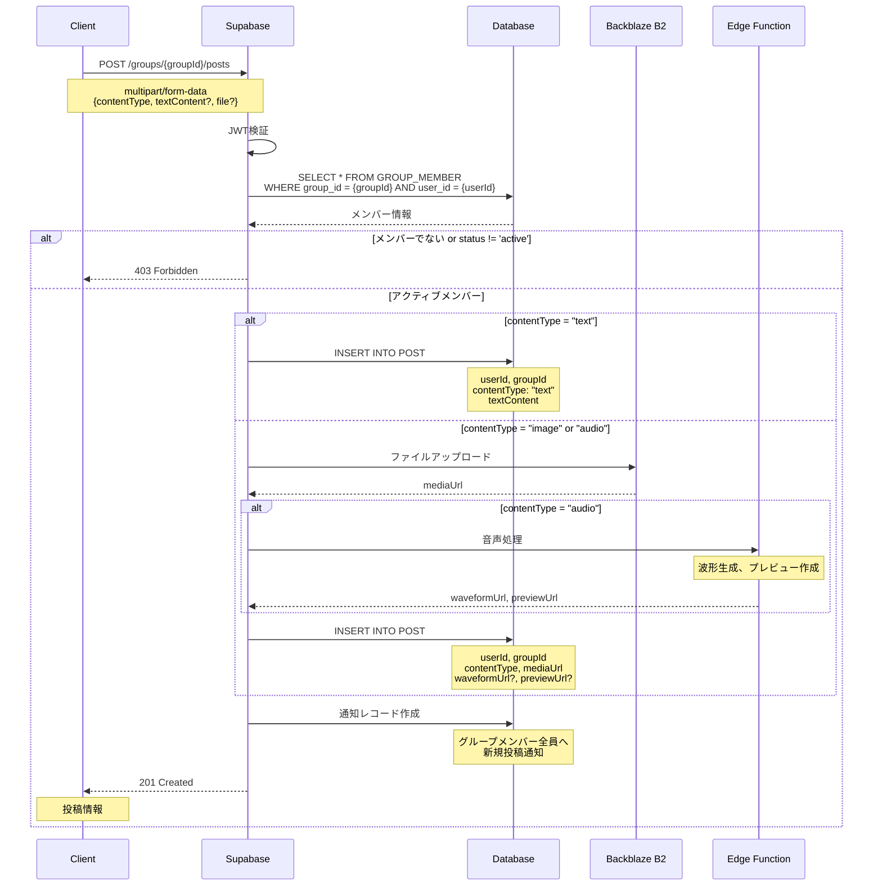

### 4.2 グループ投稿取得

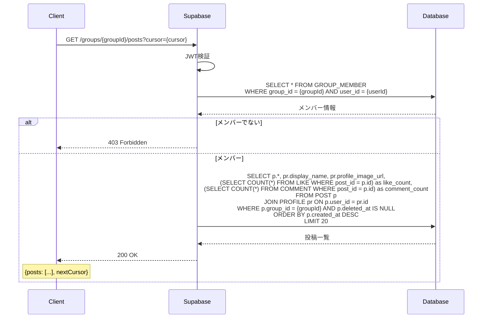

## 5. メンバー管理

### 5.1 メンバー一覧取得

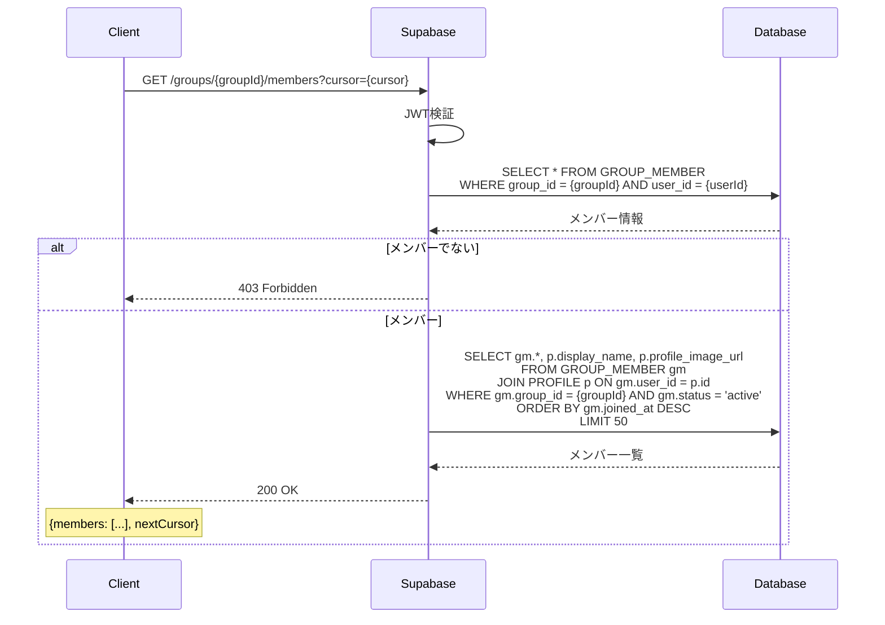

### 5.2 メンバー除名（オーナー権限）

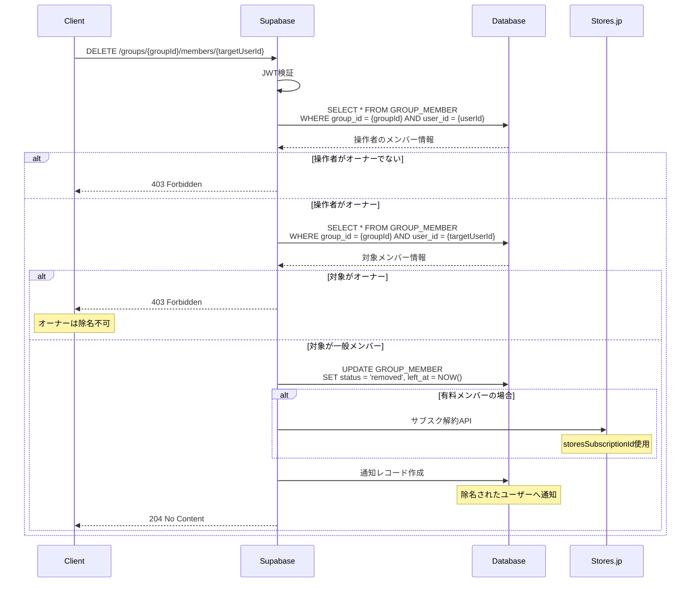

## 6. グループ情報更新

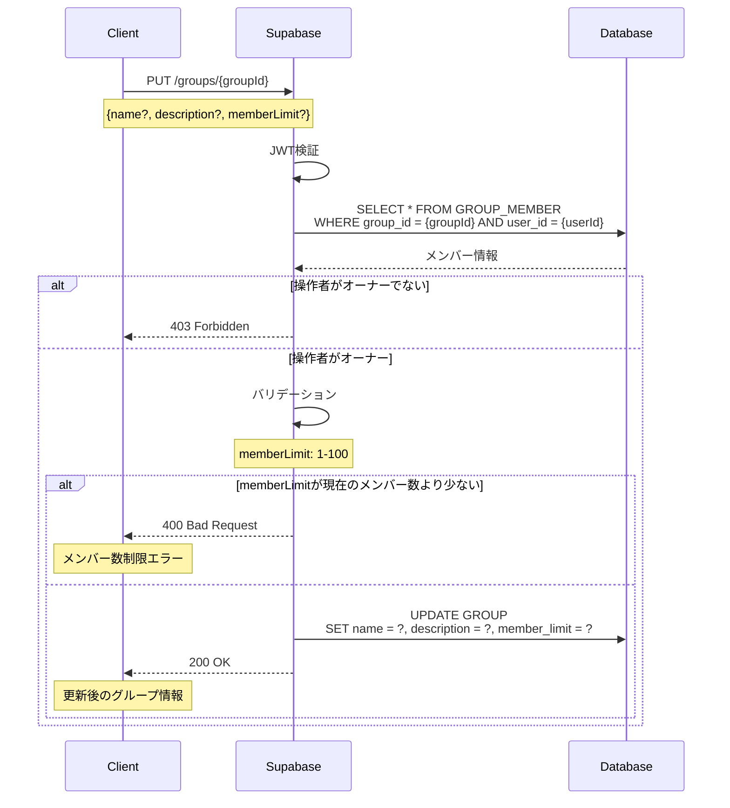

## エラーケース

### 権限エラー
- グループメンバーでない場合の操作
- オーナー権限が必要な操作を一般メンバーが実行
- オーナーの退出・除名

### 制限エラー
- メンバー数上限（100名）超過
- 有料グループの決済失敗
- サブスクリプション解約失敗

### データ整合性
- 存在しないグループIDへのアクセス
- 削除済みメンバーの操作
- トランザクション失敗時のロールバック

## セキュリティ考慮事項

1. **アクセス制御**
   - グループメンバーのみがコンテンツにアクセス可能
   - オーナー権限の適切な管理

2. **決済セキュリティ**
   - Stores.jp Webhookの署名検証
   - 決済情報の暗号化

3. **データプライバシー**
   - グループチャットのE2E暗号化（将来実装）
   - 退出・除名後のデータアクセス制限

4. **レート制限**
   - メッセージ送信頻度の制限
   - グループ作成数の制限