# AIチャット・検索機能シーケンス図

## 1. 全文検索（ユーザー/投稿/ハッシュタグ）

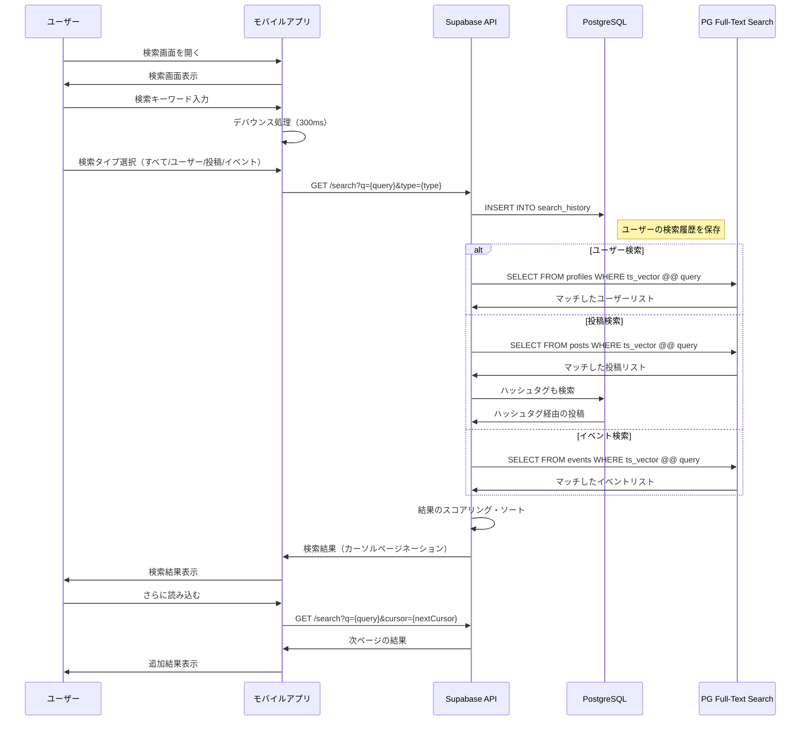

## 2. 検索履歴管理

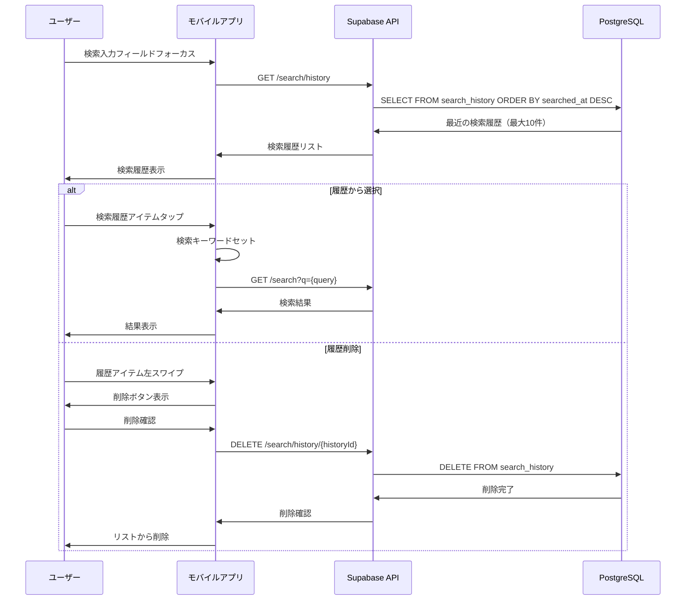

## 3. AIチャット（Gemini-2.5-Pro）

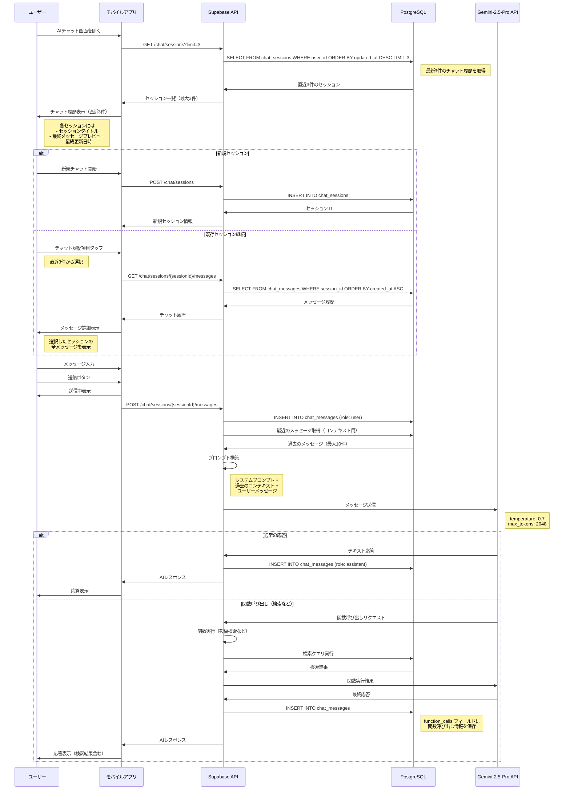

## 4. AIチャット - 高度な機能

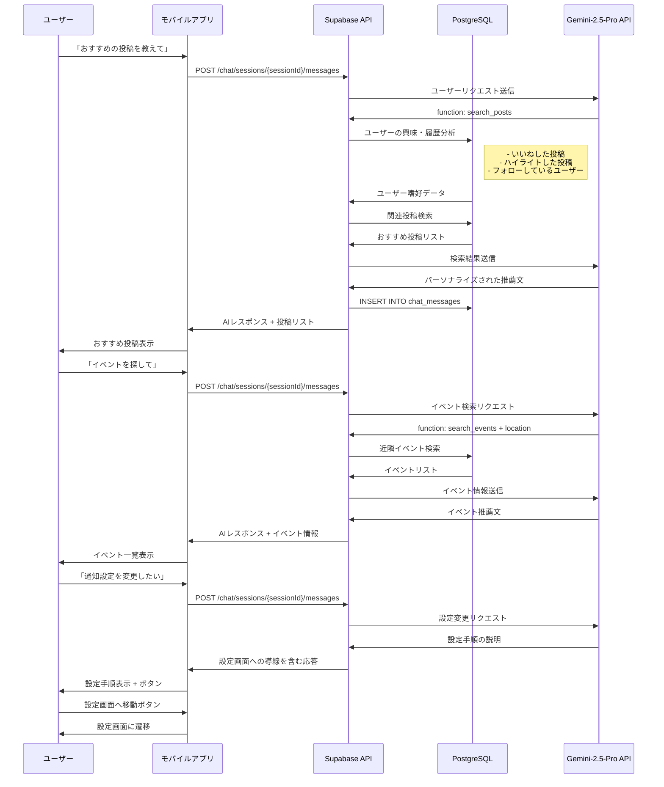

## 5. パーソナルAIキュレーター（CRON）

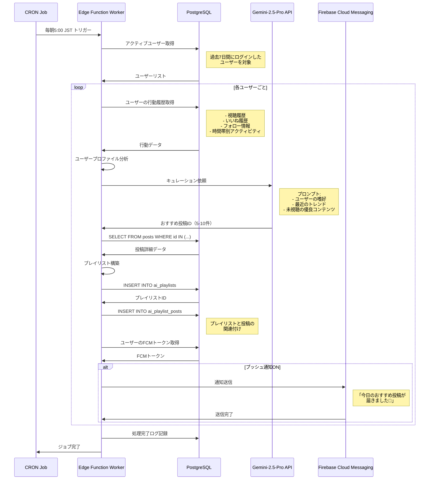

## 6. MyRadio生成

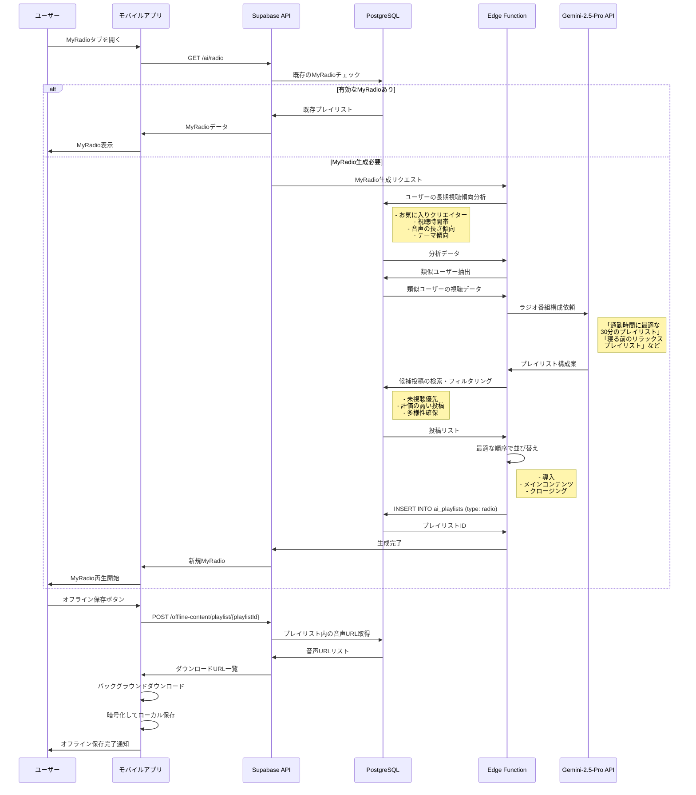

## 7. ヒットチャート生成

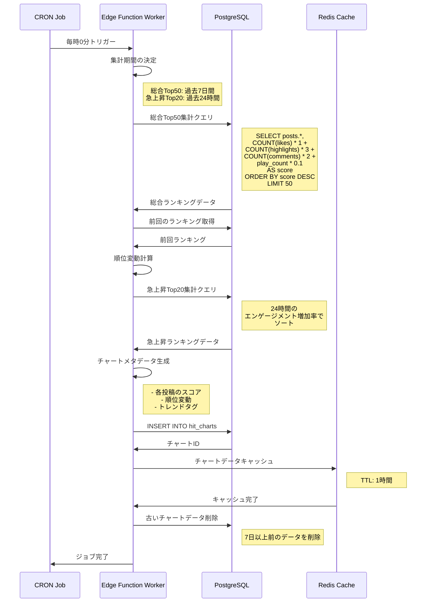

## 8. ヒットチャート表示

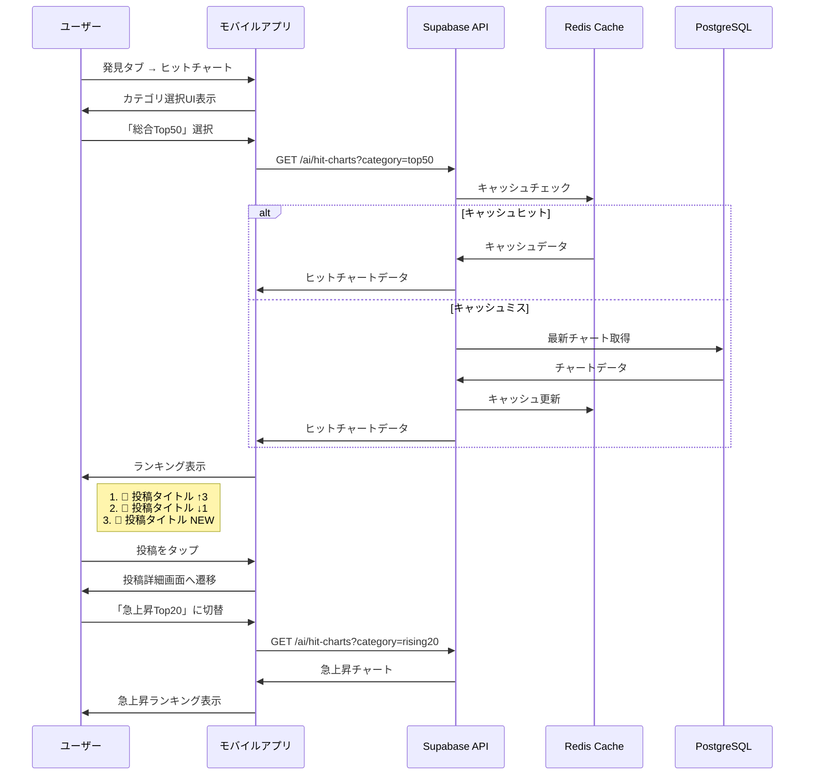

## 9. AI音声要約生成

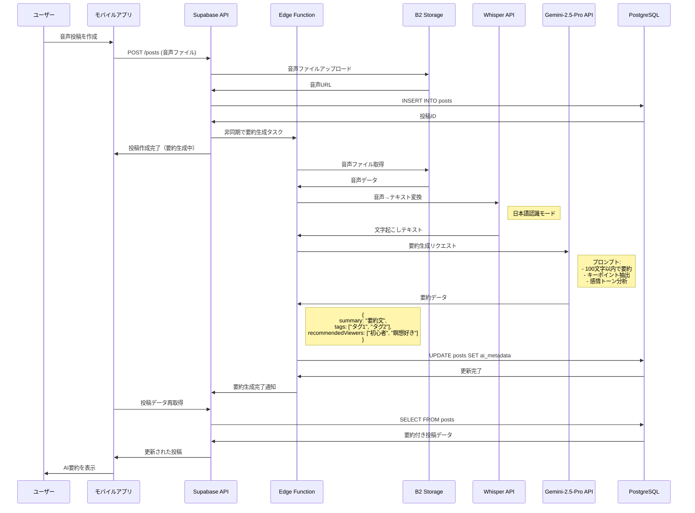

## 10. ユーザー分析

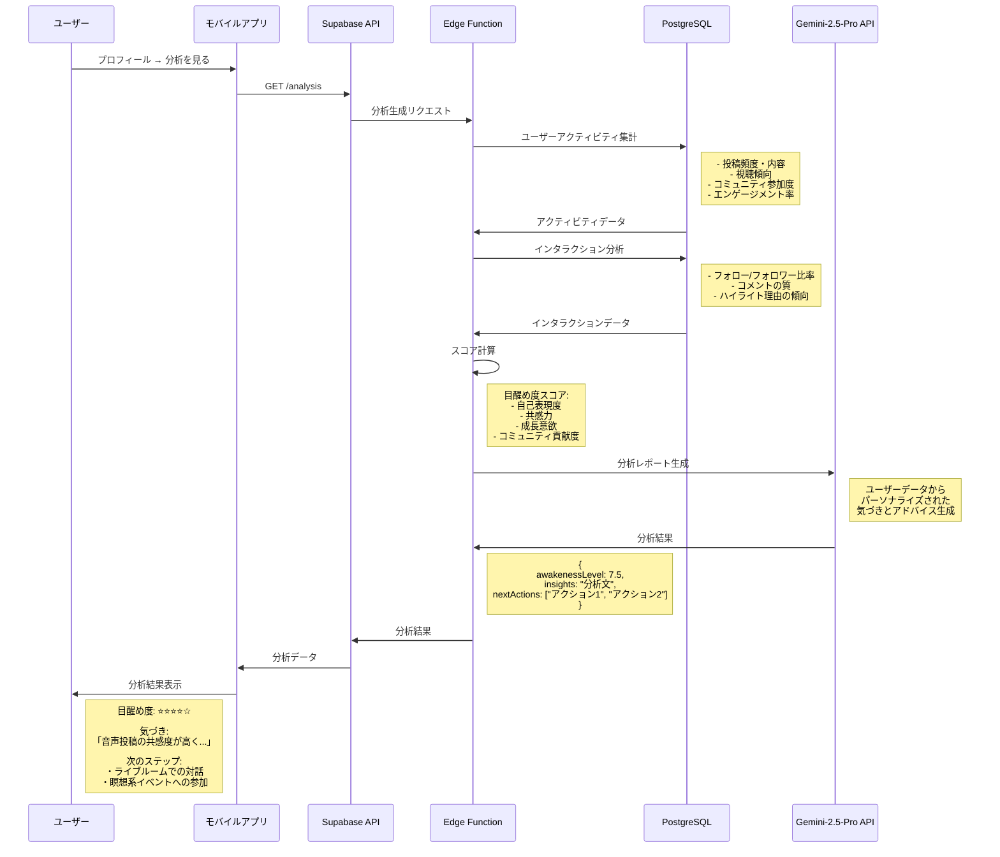

## エラーハンドリング

### AI API エラー

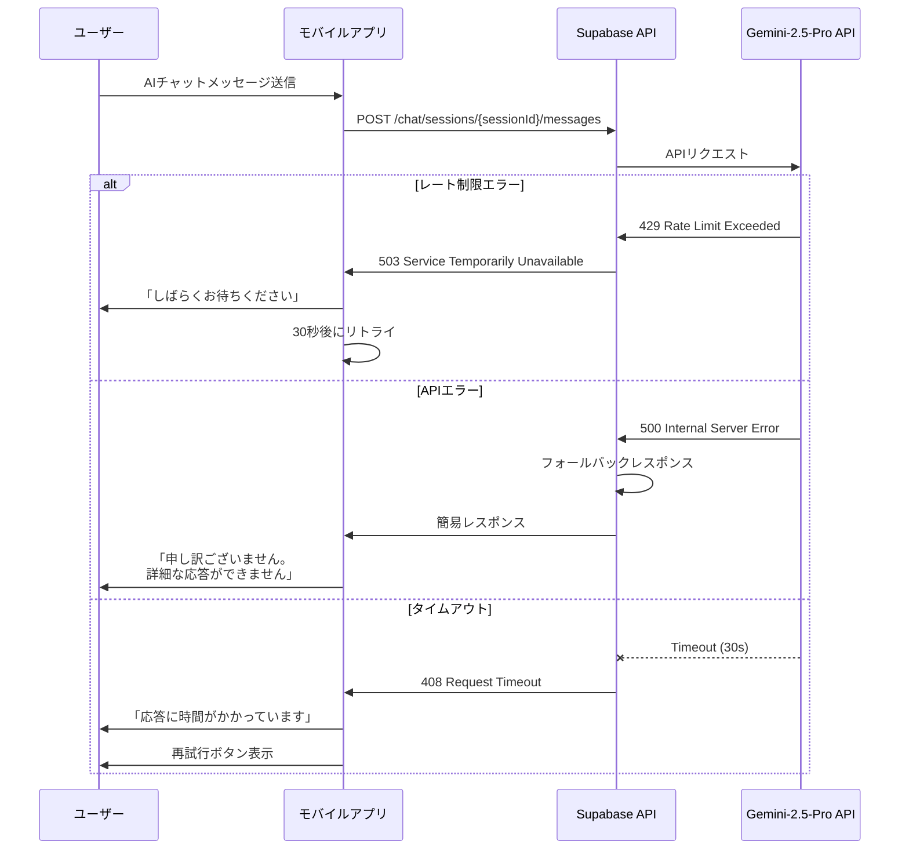

### 検索エラー

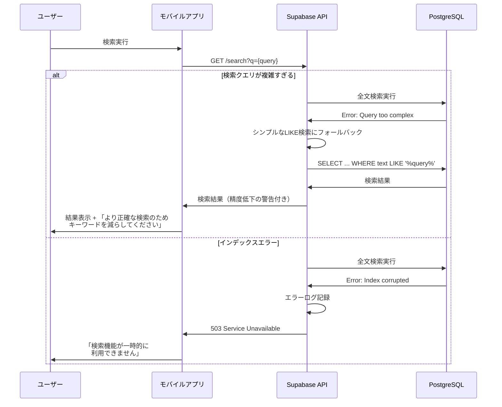