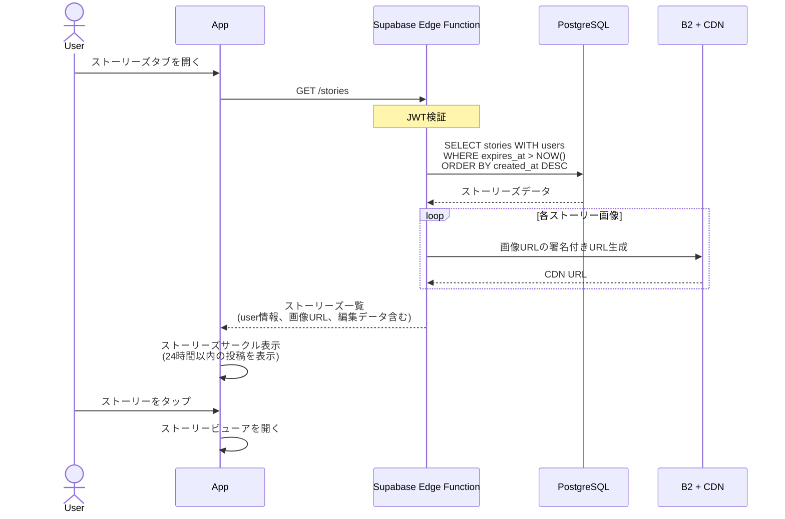
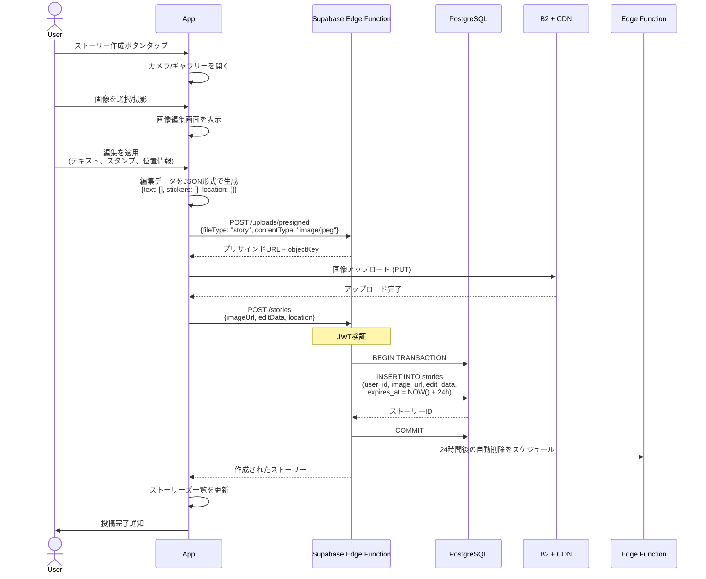
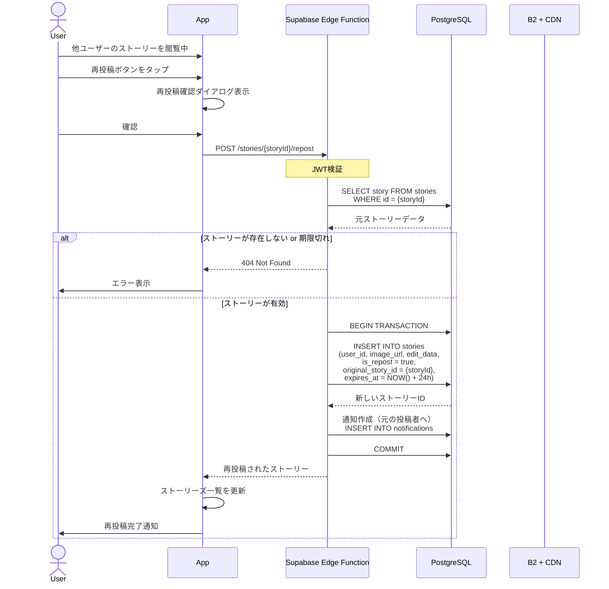
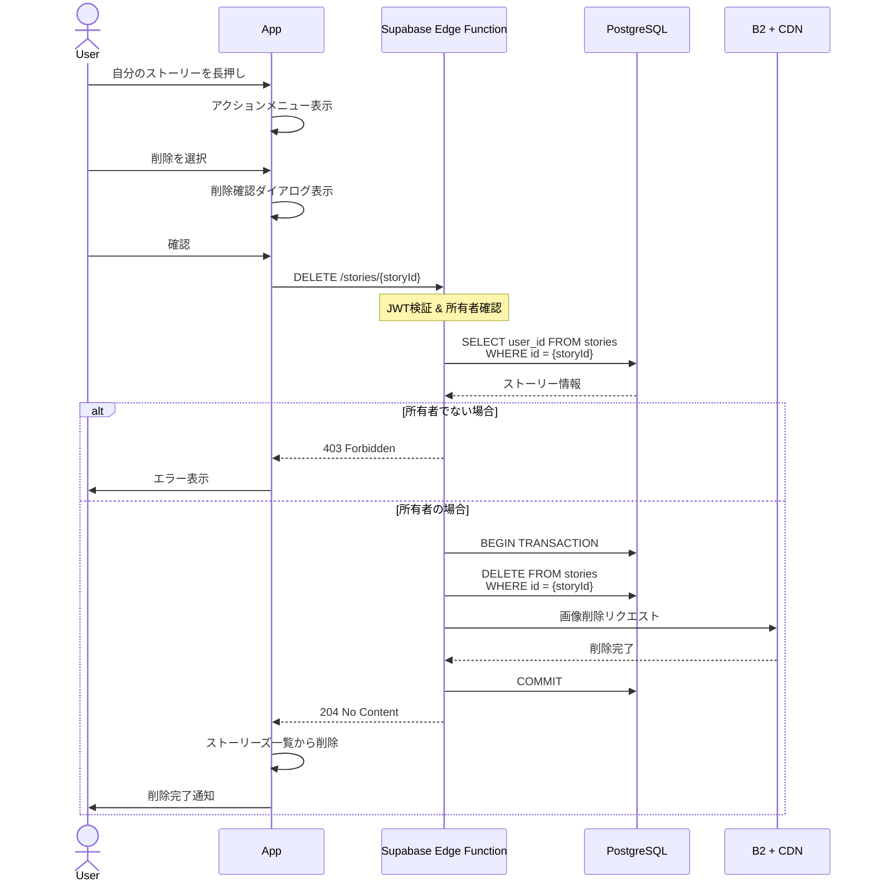
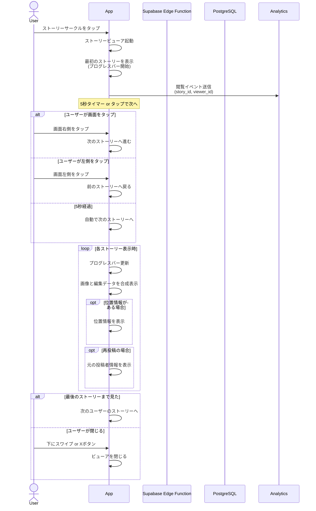
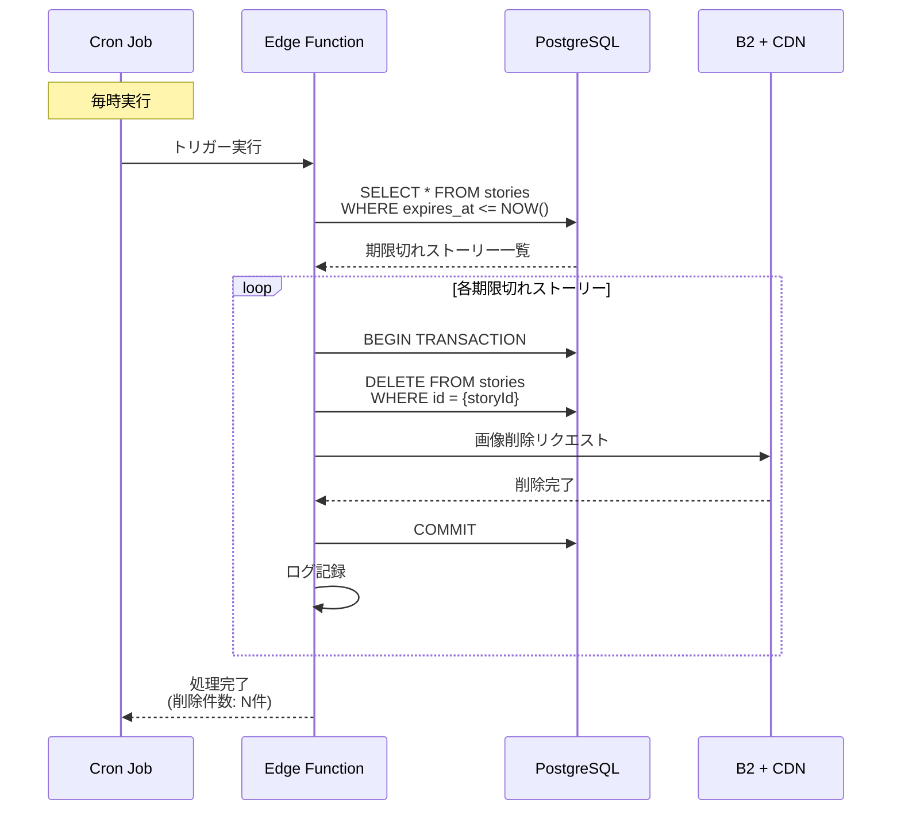

# ストーリーズ機能シーケンス図

## 1. ストーリーズ一覧取得

## 2. ストーリー投稿（画像編集付き）

## 3. ストーリー再投稿

## 4. ストーリー削除

## 5. ストーリー閲覧・進行

## 6. 24時間自動削除

## エラーハンドリング

### 画像アップロードエラー
- ネットワークエラー時はリトライ（最大3回）
- ファイルサイズ制限（10MB）を超えた場合はクライアント側でリサイズ
- サポートされない画像形式の場合はエラー表示

### 編集データの保存
- 編集中のデータは一時的にローカルストレージに保存
- アプリがクラッシュしても編集内容を復元可能

### 再投稿の制限
- 同じストーリーを同一ユーザーが複数回再投稿することを防止
- プライベートアカウントのストーリーは再投稿不可

## パフォーマンス最適化

### 画像の最適化
- アップロード前にクライアント側で画像をリサイズ（最大1920x1920）
- WebP形式への変換（サポートされている場合）
- CDNでの画像配信

### プリロード
- ストーリー閲覧中、次の2-3枚の画像を先読み
- スムーズな閲覧体験を提供

### キャッシュ戦略
- 閲覧したストーリーは一時的にメモリキャッシュ
- 24時間後に自動クリア