# 通知機能シーケンス図

## 1. 通知設定管理

### 1.1 FCMトークン登録

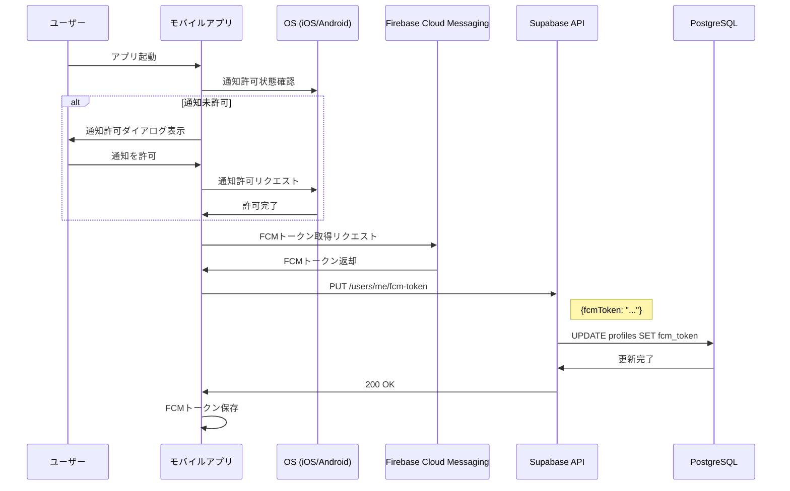

### 1.2 通知設定更新

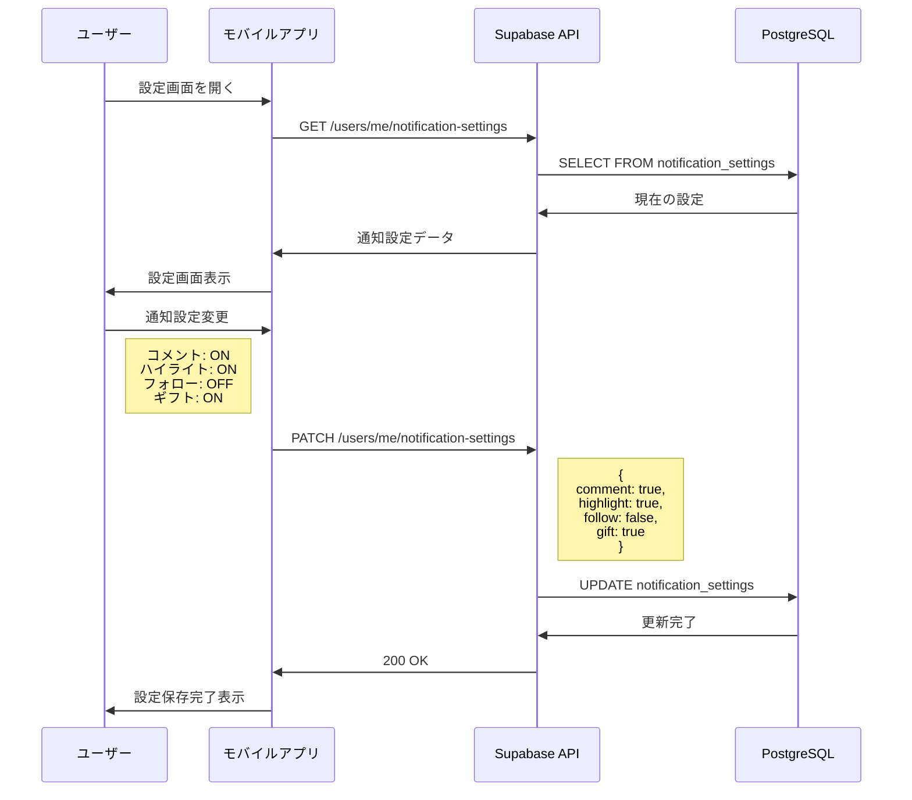

## 2. 通知配信フロー

### 2.1 コメント通知

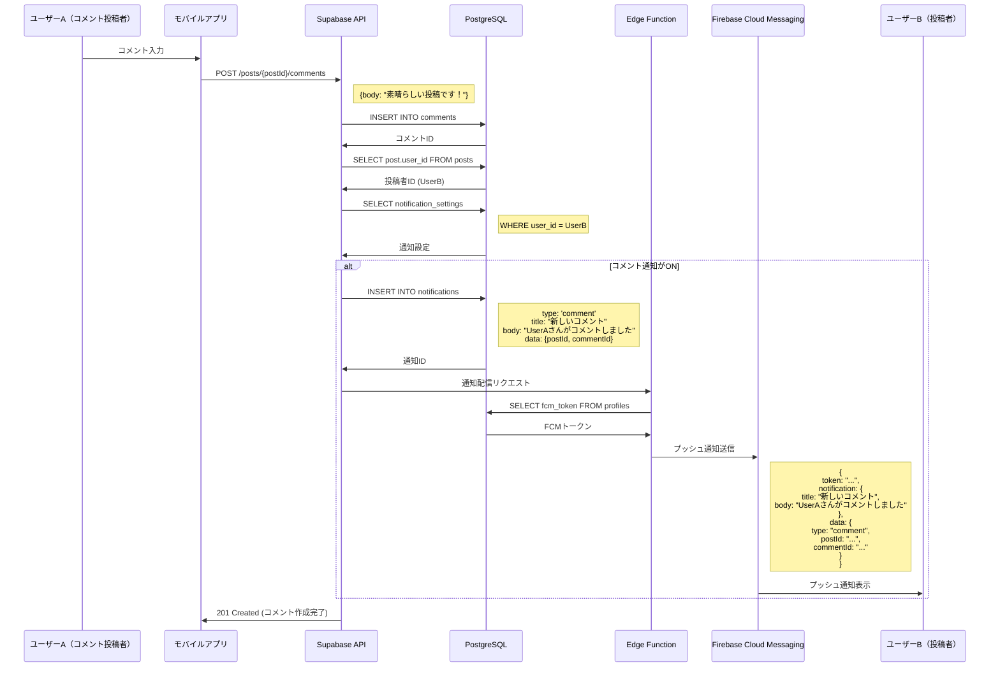

### 2.2 ハイライト通知

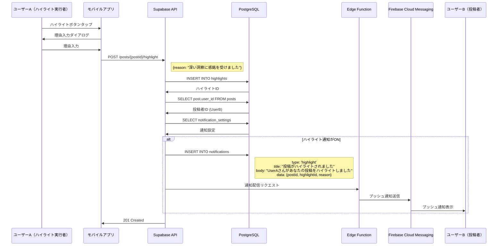

### 2.3 フォロー通知

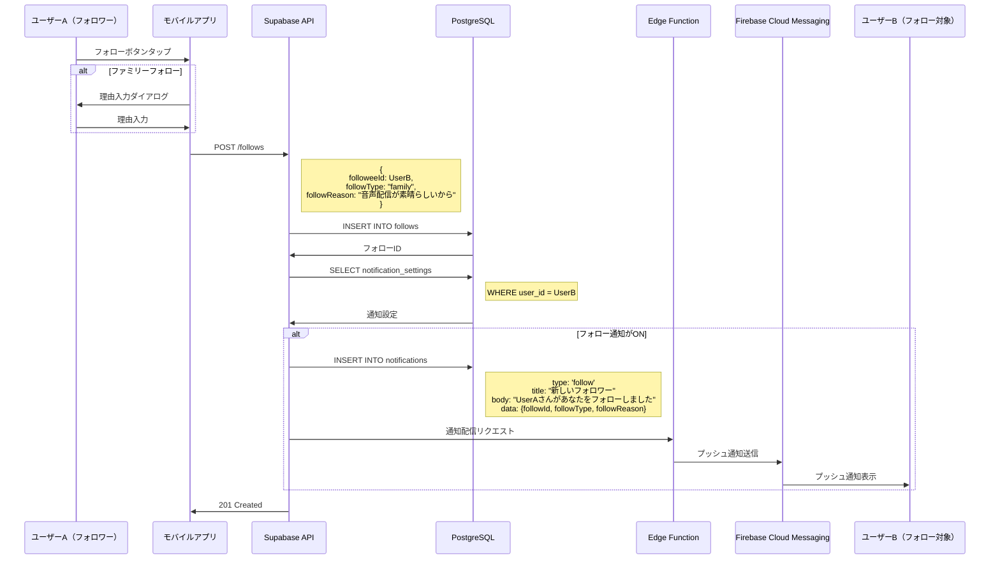

### 2.4 ギフト通知

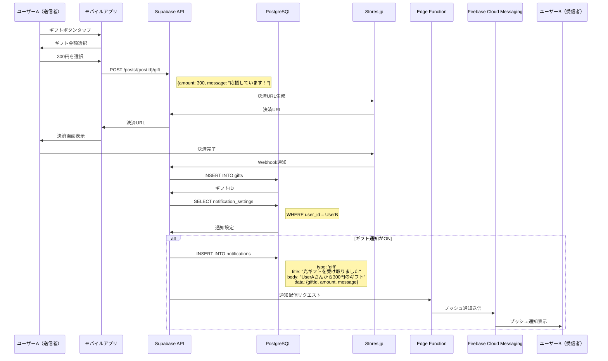

## 3. 通知一覧取得と既読処理

### 3.1 通知一覧取得

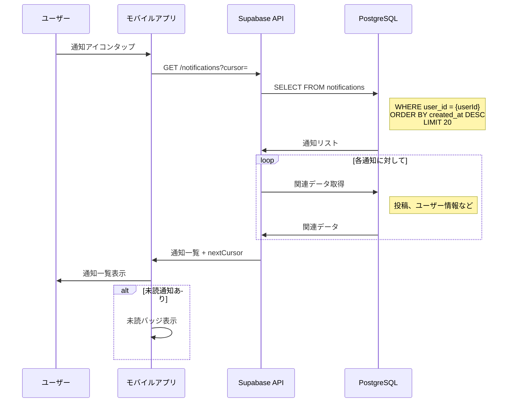

### 3.2 既読処理

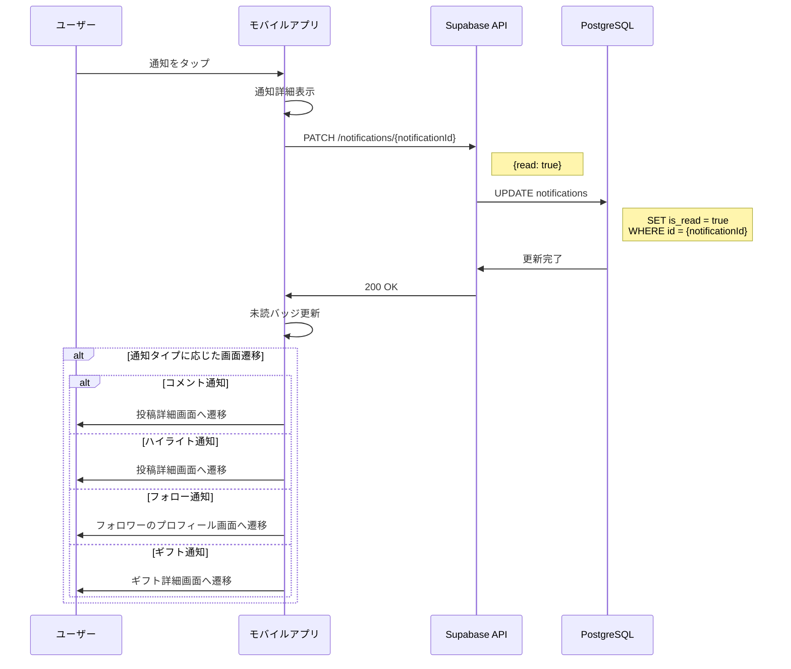

### 3.3 一括既読

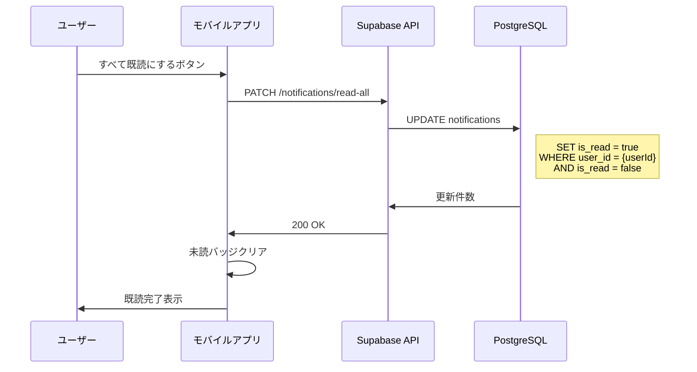

## 4. リアルタイム通知

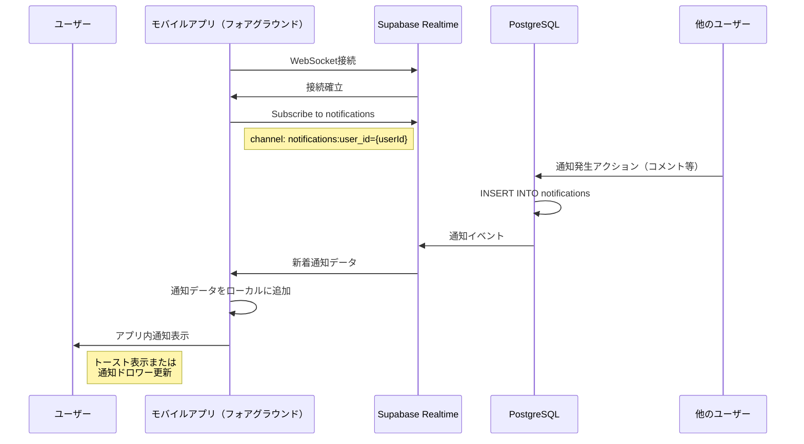

## 5. エラーハンドリング

### 5.1 FCMトークン取得エラー

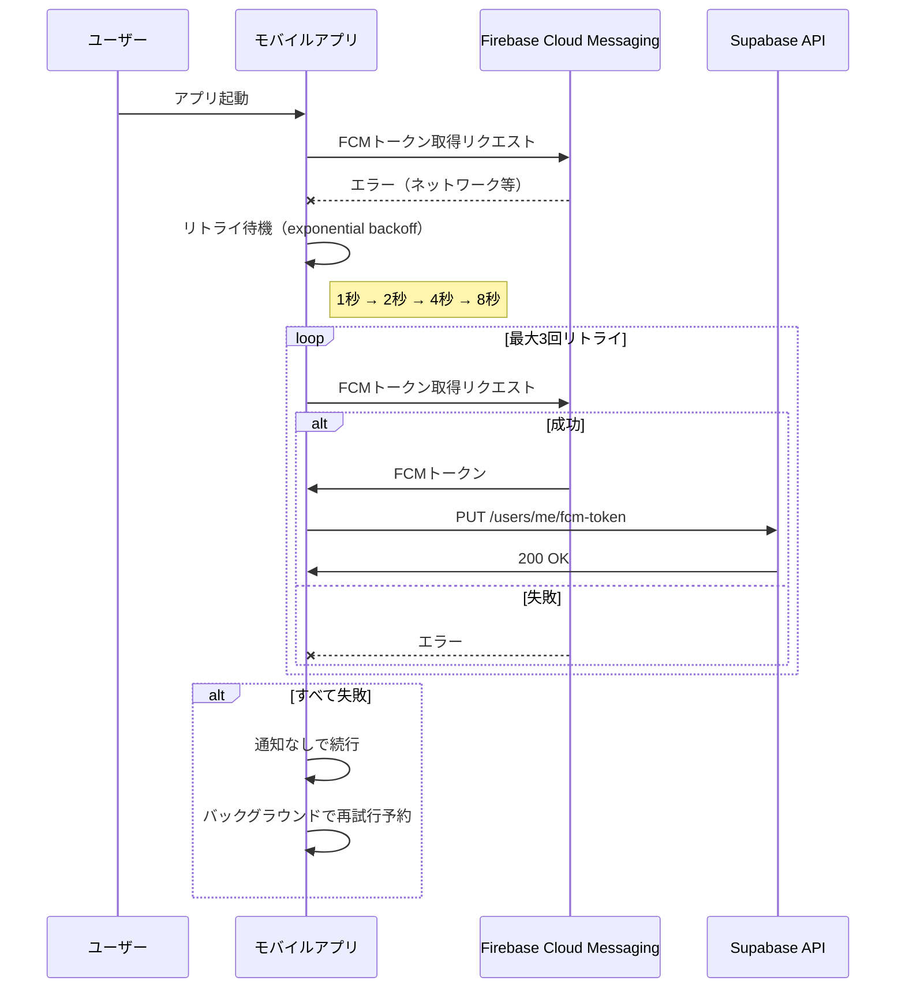

### 5.2 通知配信エラー

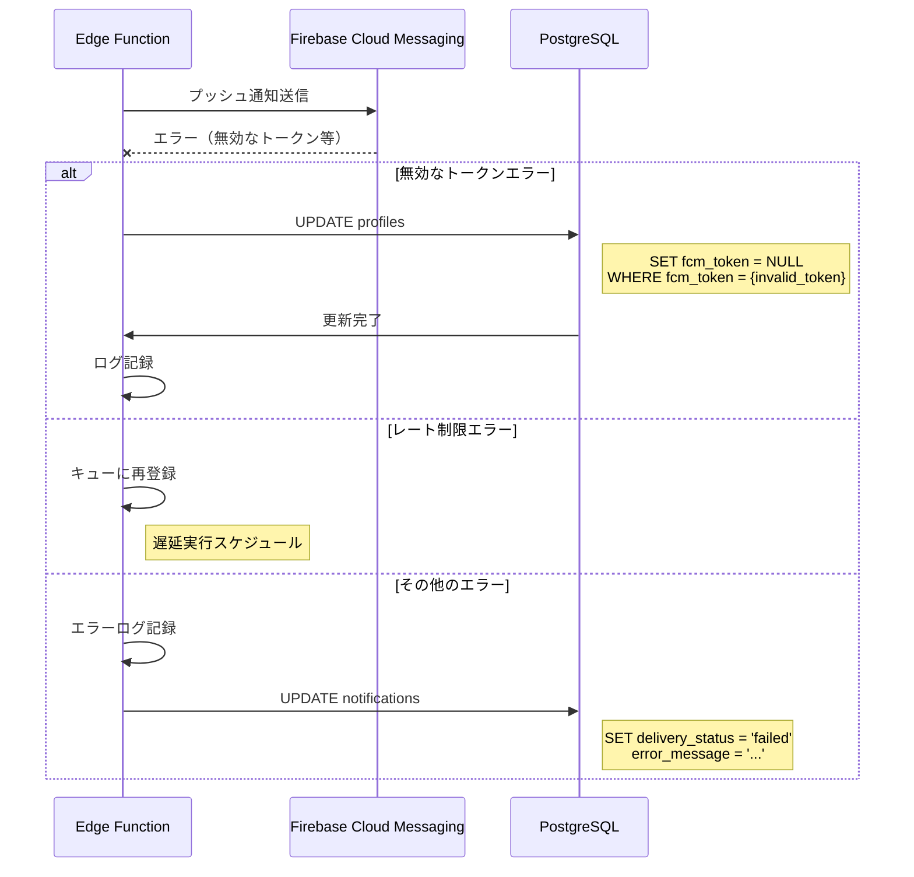

## 通知フォーマット仕様

### 通知データ構造

```json
{
  "id": "uuid",
  "userId": "uuid",
  "title": "string",
  "body": "string",
  "notificationType": "comment|highlight|follow|gift",
  "data": {
    // タイプに応じた追加データ
    "postId": "uuid",
    "commentId": "uuid",
    "followId": "uuid",
    "giftId": "uuid",
    "amount": 300,
    "reason": "string"
  },
  "isRead": false,
  "createdAt": "2024-05-25T10:00:00Z"
}
```

### FCMペイロード構造

```json
{
  "token": "FCMトークン",
  "notification": {
    "title": "通知タイトル",
    "body": "通知本文",
    "badge": 1,
    "sound": "default"
  },
  "data": {
    "type": "comment",
    "notificationId": "uuid",
    "deepLink": "kanushi://post/{postId}"
  },
  "apns": {
    "payload": {
      "aps": {
        "category": "COMMENT_CATEGORY",
        "thread-id": "post-{postId}"
      }
    }
  },
  "android": {
    "priority": "high",
    "notification": {
      "channel_id": "default"
    }
  }
}
```