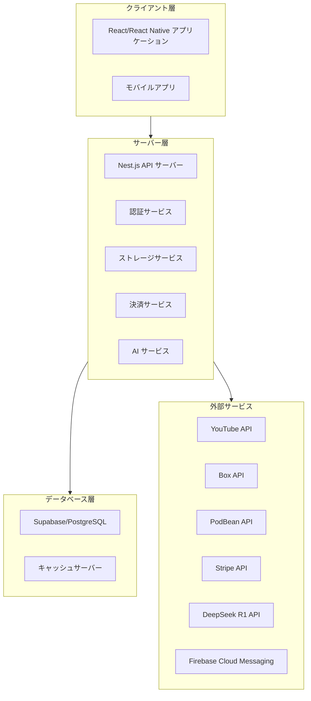
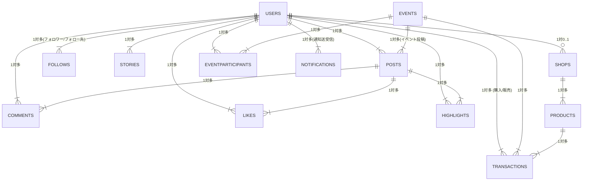
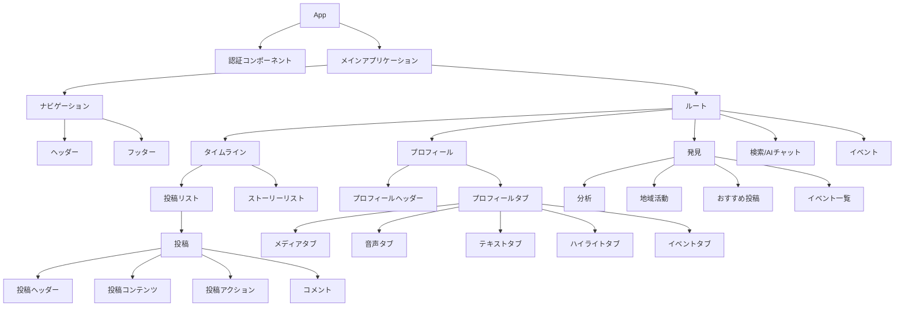
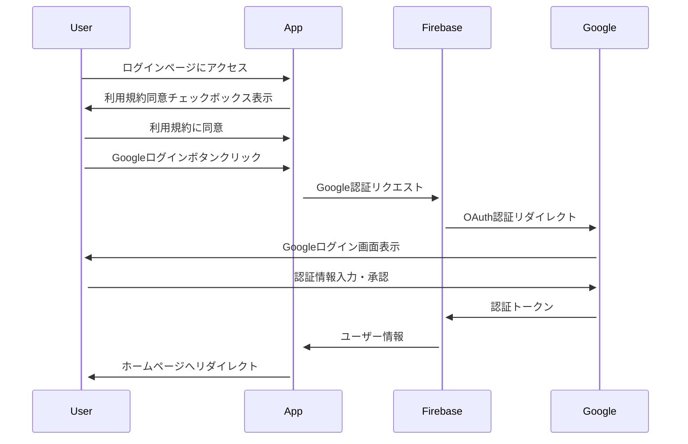
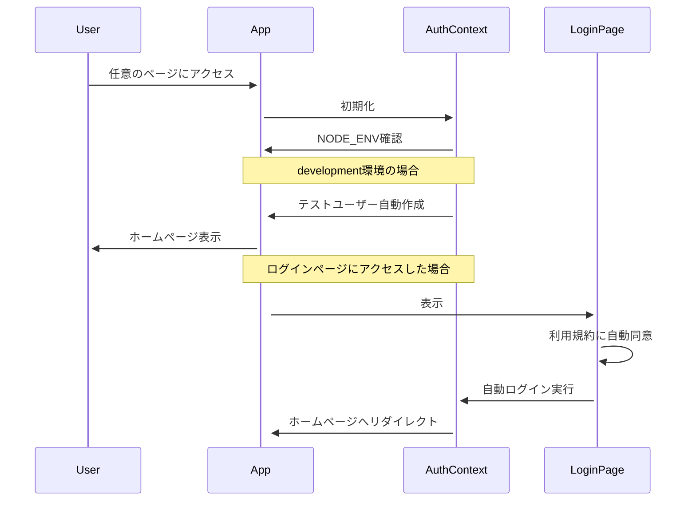

# システムパターン

## システムアーキテクチャ

「目醒め人のためのSNS」は、以下の3層アーキテクチャで構成されています：

### 1. クライアント層

- **現在**: React + TypeScript + Vite によるWebアプリケーション
- **将来**: React Native v7.6 + Expo によるiOS/Androidアプリ
- **主要コンポーネント**:
  - UI コンポーネント (shadcn/ui)
  - 状態管理 (React Context)
  - ルーティング
  - API クライアント

### 2. サーバー層

- **API サーバー**: Nest.js
- **認証サービス**: Firebase Authentication (Google OAuth)
- **ストレージサービス**: 外部サービス連携 (YouTube, Box, PodBean)
- **決済サービス**: Stripe 連携
- **AI サービス**: DeepSeek R1 API 連携

### 3. データベース層

- **メインデータベース**: Supabase (PostgreSQL)
- **キャッシュサーバー**: メディアコンテンツのキャッシュ

### 4. 外部サービス

- **YouTube API**: 動画コンテンツの保存・配信
- **Box API**: 画像コンテンツの保存・配信
- **PodBean API**: 音声コンテンツの保存・配信
- **Stripe API**: 決済処理
- **DeepSeek R1 API**: AIチャット機能
- **Firebase Cloud Messaging**: プッシュ通知

## データモデル

システムの主要なエンティティとその関係は以下の通りです：

### 主要エンティティ

1. **Users (ユーザー)**
   - ユーザー情報、認証情報、プロフィール情報

2. **Follows (フォロー)**
   - ファミリー/ウォッチの関係、フォロー理由

3. **Posts (投稿)**
   - 投稿タイプ (動画、画像、音声、テキスト)
   - コンテンツ情報、メタデータ

4. **Comments (コメント)**
   - 投稿に対するコメント

5. **Likes (いいね)**
   - 投稿に対するいいね

6. **Highlights (ハイライト)**
   - 投稿に対するハイライト、理由

7. **Stories (ストーリー)**
   - 一時的な投稿、メディア情報

8. **Events (イベント)**
   - イベント情報、参加者、関連投稿

9. **Shops (ショップ)**
   - ショップ情報、商品、取引

10. **Notifications (通知)**
    - 通知タイプ、メッセージ、既読状態

## コンポーネント構造

フロントエンドのコンポーネント構造は以下の通りです：

## 認証パターン

### 本番環境での認証フロー

### 開発環境での自動ログインフロー

## 通信パターン

### API通信

- RESTful API
- JWT認証
- エンドポイント構造:
  - `/api/v1/auth/*` - 認証関連
  - `/api/v1/users/*` - ユーザー関連
  - `/api/v1/posts/*` - 投稿関連
  - `/api/v1/follows/*` - フォロー関連
  - `/api/v1/events/*` - イベント関連
  - `/api/v1/shops/*` - ショップ関連
  - `/api/v1/search/*` - 検索関連
  - `/api/v1/ai/*` - AI関連
  - `/api/v1/notifications/*` - 通知関連
  - `/api/v1/admin/*` - 管理者関連

### 外部サービス連携

1. **YouTube API**
   - OAuth 2.0認証
   - 動画アップロード
   - 動画メタデータ取得

2. **Box API**
   - OAuth 2.0認証
   - ファイルアップロード/ダウンロード
   - ファイル共有設定

3. **PodBean API**
   - OAuth 2.0認証
   - 音声アップロード
   - ポッドキャスト管理

4. **Stripe API**
   - 決済処理
   - サブスクリプション管理
   - 支払い履歴

5. **DeepSeek R1 API**
   - テキスト生成
   - 対話管理

6. **Firebase Cloud Messaging**
   - プッシュ通知送信
   - トピック管理

## セキュリティパターン

1. **認証**
   - Google OAuth 2.0
   - JWTトークン
   - リフレッシュトークン

2. **認可**
   - ロールベースアクセス制御
   - リソースオーナーシップ検証

3. **データ保護**
   - HTTPS通信
   - センシティブデータの暗号化
   - 入力バリデーション

4. **外部サービス連携セキュリティ**
   - APIキー管理
   - OAuth認証フロー
   - スコープ制限

## エラーハンドリングパターン

1. **フロントエンド**
   - グローバルエラーハンドラー
   - ユーザーフレンドリーなエラーメッセージ
   - リトライメカニズム

2. **バックエンド**
   - 構造化されたエラーレスポンス
   - ログ記録
   - 例外処理

3. **外部サービス連携**
   - フォールバックメカニズム
   - サーキットブレーカー
   - レート制限対応

## スケーラビリティパターン

1. **水平スケーリング**
   - ステートレスAPIサーバー
   - ロードバランシング

2. **キャッシング**
   - メディアコンテンツのCDN配信
   - データベースクエリキャッシュ

3. **非同期処理**
   - バックグラウンドジョブ
   - メッセージキュー

## 監視・ロギングパターン

1. **アプリケーションログ**
   - エラーログ
   - アクセスログ
   - パフォーマンスメトリクス

2. **ユーザー行動分析**
   - イベントトラッキング
   - コンバージョン分析

3. **システム監視**
   - リソース使用率
   - レスポンスタイム
   - エラーレート