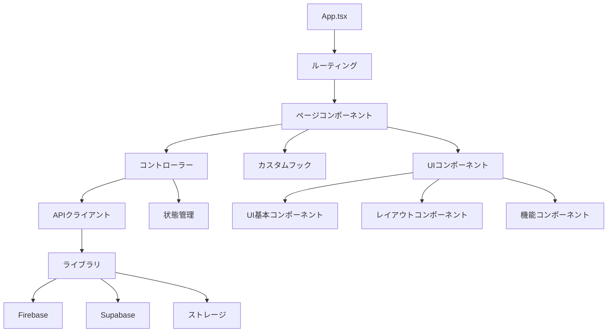
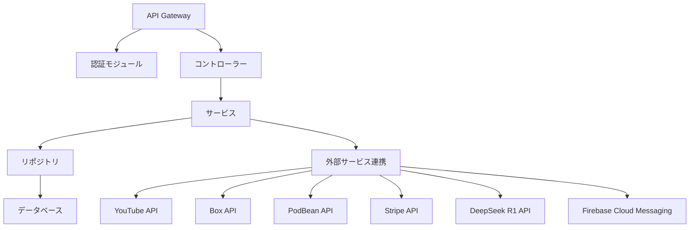
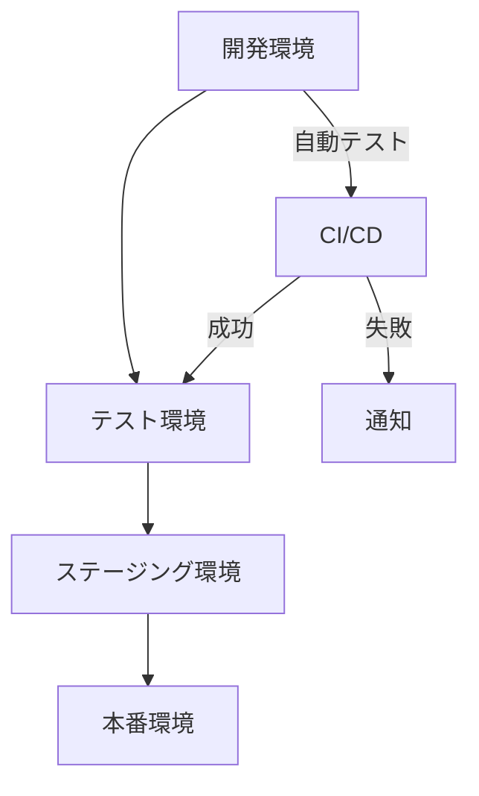

# 技術コンテキスト

## 技術スタック

### フロントエンド

**現在の実装**:
- **フレームワーク**: React 18.3.1
- **言語**: TypeScript 5.5.3
- **ビルドツール**: Vite 5.4.1
- **スタイリング**: TailwindCSS 3.4.11
- **UIコンポーネント**: shadcn/ui
- **ルーティング**: React Router Dom 6.26.2
- **状態管理**: React Context API
- **データフェッチング**: React Query 5.56.2
- **フォーム管理**: React Hook Form
- **バリデーション**: Zod 3.23.8

**将来の実装予定**:
- **モバイルフレームワーク**: React Native 7.6
- **モバイルビルドツール**: Expo
- **プラットフォーム**: iOS / Android

### バックエンド

- **フレームワーク**: Nest.js
- **言語**: TypeScript
- **API**: RESTful API
- **認証**: JWT、Google OAuth 2.0
- **データベース**: Supabase (PostgreSQL)
- **ストレージ**: 外部サービス連携

### 外部サービス連携

- **認証**: Firebase Authentication
- **動画ストレージ**: YouTube API
- **画像ストレージ**: Box API
- **音声ストレージ**: PodBean API
- **決済処理**: Stripe API
- **AIチャット**: DeepSeek R1 API
- **プッシュ通知**: Firebase Cloud Messaging (FCM)

## 開発環境

### ローカル開発環境

- **パッケージマネージャー**: npm / bun
- **バージョン管理**: Git
- **コードエディタ**: Visual Studio Code
- **テスト**: Jest
- **リンター**: ESLint
- **フォーマッター**: Prettier

### CI/CD

- **ビルド**: GitHub Actions
- **デプロイ**: Firebase Hosting / Vercel

## 技術的制約

1. **モバイルアプリ化**:
   - 現在はWebアプリとして開発中
   - 将来的にReact Native + Expoへの移行が必要
   - コードベースの一部書き換えが必要になる可能性あり

2. **外部サービス連携**:
   - YouTube API: ユーザーのGoogleアカウントと連携させる必要あり
   - アプリ審査時の連携方法の妥当性確認が必要

3. **パフォーマンス**:
   - メディアコンテンツ（画像、動画、音声）の効率的な読み込み
   - CDNやキャッシュサーバーの活用が必要

4. **セキュリティ**:
   - 外部APIキーの安全な管理
   - ユーザーデータの保護
   - CSRF/XSS対策

5. **スケーラビリティ**:
   - 想定MAU: 10,000人
   - 1人あたりの投稿数: 0.3件/日
   - 1人あたりのストーリーズ: 2件/日

## アーキテクチャ詳細

### フロントエンドアーキテクチャ



**ディレクトリ構造**:
```
src/
  ├── App.tsx              # アプリケーションのエントリーポイント
  ├── main.tsx             # Reactのレンダリングエントリーポイント
  ├── components/          # UIコンポーネント
  │   ├── ui/              # 基本UIコンポーネント (shadcn/ui)
  │   ├── layout/          # レイアウトコンポーネント
  │   ├── post/            # 投稿関連コンポーネント
  │   ├── profile/         # プロフィール関連コンポーネント
  │   ├── discover/        # 発見機能関連コンポーネント
  │   └── ...
  ├── contexts/            # React Context
  ├── controllers/         # ビジネスロジック
  ├── hooks/               # カスタムフック
  ├── lib/                 # ユーティリティ・ライブラリ
  │   ├── firebase.ts      # Firebase設定
  │   ├── supabase.ts      # Supabase設定
  │   ├── storage.ts       # ストレージ関連
  │   └── utils.ts         # ユーティリティ関数
  ├── pages/               # ページコンポーネント
  ├── types/               # TypeScript型定義
  └── utils/               # ユーティリティ関数
```

### バックエンドアーキテクチャ



## データベース設計

### 主要テーブル

1. **USERS**
   - user_id (PK)
   - user_name
   - email
   - password_hash (Google認証のためNULL許容)
   - profile_icon_url
   - profile_audio_url
   - shop_link_url
   - is_shop_link
   - introduction
   - created_at
   - updated_at

2. **FOLLOWS**
   - follow_id (PK)
   - follower_id (FK)
   - followee_id (FK)
   - follow_type (ファミリー or ウォッチ)
   - reason
   - created_at

3. **POSTS**
   - post_id (PK)
   - user_id (FK)
   - post_type (動画、画像、音声、テキスト)
   - title
   - text_content
   - youtube_url
   - image_urls (BoxのURLをカンマ区切りで保存)
   - audio_url
   - event_id (FK)
   - created_at
   - updated_at

4. **COMMENTS**
   - comment_id (PK)
   - post_id (FK)
   - user_id (FK)
   - content
   - created_at

5. **LIKES**
   - like_id (PK)
   - post_id (FK)
   - user_id (FK)
   - created_at

6. **HIGHLIGHTS**
   - highlight_id (PK)
   - post_id (FK)
   - user_id (FK)
   - highlight_reason
   - created_at

7. **STORIES**
   - story_id (PK)
   - user_id (FK)
   - media_url (Box, YouTube, PodBeanのいずれかのURL)
   - story_type (動画、画像、音声)
   - expire_at
   - created_at

8. **EVENTS**
   - event_id (PK)
   - organizer_id (FK) (主催者のuser_id)
   - event_name
   - content
   - capacity
   - price
   - recruit_start
   - recruit_end
   - location
   - event_start
   - event_end
   - created_at

9. **EVENTPARTICIPANTS**
   - event_participant_id (PK)
   - event_id (FK)
   - user_id (FK)
   - is_organizer
   - created_at

10. **SHOPS**
    - shop_id (PK)
    - user_id (FK)
    - shop_name
    - description

11. **PRODUCTS**
    - product_id (PK)
    - shop_id (FK)
    - product_name
    - description
    - price
    - image_url (BoxのURL)

12. **TRANSACTIONS**
    - transaction_id (PK)
    - buyer_id (FK)
    - seller_id (FK)
    - product_id (FK)
    - event_id (FK)
    - amount
    - status (pending, completed, failed)
    - created_at

13. **NOTIFICATIONS**
    - notification_id (PK)
    - user_id (FK) (通知を受け取るユーザー)
    - notification_type (コメント, ハイライト, 新規フォロワー, イベント参加, 商品購入)
    - from_user_id (FK) (通知元ユーザー)
    - post_id (FK)
    - event_id (FK)
    - product_id (FK)
    - message
    - is_read
    - created_at

## API設計

RESTful APIエンドポイント構造:

1. **認証関連**
   - POST /api/v1/auth/google/login - Googleログイン
   - POST /api/v1/auth/google/refresh - JWTトークン更新

2. **ユーザー関連**
   - GET /api/v1/users/{user_id} - ユーザー情報取得
   - PUT /api/v1/users/{user_id} - ユーザー情報更新
   - GET /api/v1/users/{user_id}/followers - フォロワー一覧取得
   - GET /api/v1/users/{user_id}/following - フォロー一覧取得

3. **フォロー関連**
   - POST /api/v1/follows - フォロー
   - DELETE /api/v1/follows/{follow_id} - アンフォロー

4. **投稿関連**
   - POST /api/v1/posts - 投稿作成
   - GET /api/v1/posts - タイムライン取得
   - GET /api/v1/posts/{post_id} - 投稿詳細取得
   - DELETE /api/v1/posts/{post_id} - 投稿削除

5. **コメント関連**
   - POST /api/v1/posts/{post_id}/comments - コメント投稿
   - GET /api/v1/posts/{post_id}/comments - コメント一覧取得
   - DELETE /api/v1/posts/{post_id}/comments/{comment_id} - コメント削除

6. **いいね関連**
   - POST /api/v1/posts/{post_id}/likes - いいね
   - DELETE /api/v1/posts/{post_id}/likes - いいね取り消し

7. **ハイライト関連**
   - POST /api/v1/posts/{post_id}/highlights - ハイライト
   - GET /api/v1/posts/{post_id}/highlights - ハイライト一覧取得

8. **ストーリー関連**
   - POST /api/v1/stories - ストーリー作成
   - GET /api/v1/stories - ストーリー一覧取得

9. **イベント関連**
   - POST /api/v1/events - イベント作成
   - GET /api/v1/events - イベント一覧取得
   - GET /api/v1/events/{event_id} - イベント詳細取得
   - POST /api/v1/events/{event_id}/participants - イベント参加
   - DELETE /api/v1/events/{event_id}/participants/{user_id} - イベント参加キャンセル
   - GET /api/v1/events/{event_id}/posts - イベント関連投稿一覧取得

10. **ショップ関連**
    - POST /api/v1/shops - ショップ作成
    - GET /api/v1/shops/{shop_id} - ショップ情報取得
    - POST /api/v1/shops/{shop_id}/products - 商品登録
    - GET /api/v1/shops/{shop_id}/products - 商品一覧取得
    - GET /api/v1/products/{product_id} - 商品詳細取得
    - POST /api/v1/products/{product_id}/purchase - 商品購入

11. **検索関連**
    - GET /api/v1/search - 検索

12. **AI関連**
    - POST /api/v1/ai/chat - AIチャット

13. **通知関連**
    - GET /api/v1/notifications - 通知一覧取得
    - PUT /api/v1/notifications/{notification_id}/read - 通知を既読にする

14. **管理者関連**
    - GET /api/v1/admin/users - ユーザー一覧取得(管理者)
    - PUT /api/v1/admin/users/{user_id}/block - ユーザー停止(管理者)
    - DELETE /api/v1/admin/users/{user_id} - ユーザー削除(管理者)
    - GET /api/v1/admin/reports - 違反報告一覧取得(管理者)
    - PUT /api/v1/admin/posts/{post_id}/moderate - 投稿モデレーション(管理者)
    - PUT /api/v1/admin/events/{event_id}/moderate - イベント削除(管理者)

## 外部サービス連携詳細

### 1. YouTube API

- **目的**: ユーザーの動画投稿をYouTubeにアップロード
- **認証方式**: OAuth 2.0
- **主要エンドポイント**:
  - `/youtube/v3/videos` - 動画アップロード
  - `/youtube/v3/playlists` - プレイリスト管理
- **実装上の注意点**:
  - ユーザーのGoogleアカウントと連携
  - アプリ審査時の連携方法の妥当性確認

### 2. Box API

- **目的**: 画像ファイルの保存と配信
- **認証方式**: OAuth 2.0
- **主要エンドポイント**:
  - `/2.0/files/upload` - ファイルアップロード
  - `/2.0/files/{file_id}` - ファイル情報取得
- **実装上の注意点**:
  - 適切なキャッシュ戦略
  - 画像の最適化

### 3. PodBean API

- **目的**: 音声コンテンツの保存と配信
- **認証方式**: OAuth 2.0
- **主要エンドポイント**:
  - `/v1/episodes` - エピソード管理
  - `/v1/files/uploadAuthorize` - アップロード認証
- **実装上の注意点**:
  - 音声ファイルのフォーマット対応
  - ストリーミング再生の最適化

### 4. Stripe API

- **目的**: 決済処理、サブスクリプション管理
- **認証方式**: APIキー
- **主要エンドポイント**:
  - `/v1/checkout/sessions` - 決済セッション作成
  - `/v1/subscriptions` - サブスクリプション管理
- **実装上の注意点**:
  - PCI DSS準拠
  - Webhookによる非同期処理

### 5. DeepSeek R1 API

- **目的**: AIチャット機能
- **認証方式**: APIキー
- **主要エンドポイント**:
  - `/v1/chat/completions` - チャット応答生成
- **実装上の注意点**:
  - プロンプト設計
  - レート制限対応
  - ユーザー質問の制限（1日5回まで）

### 6. Firebase Cloud Messaging

- **目的**: プッシュ通知
- **認証方式**: Firebase認証
- **主要エンドポイント**:
  - `/fcm/send` - 通知送信
- **実装上の注意点**:
  - トークン管理
  - 通知の優先度設定

## デプロイ・運用

### デプロイフロー



### 監視・ロギング

- **アプリケーションログ**: エラーログ、アクセスログ
- **パフォーマンスモニタリング**: レスポンスタイム、リソース使用率
- **ユーザー行動分析**: イベントトラッキング、コンバージョン分析

### バックアップ戦略

- **データベース**: 定期的なスナップショット
- **メディアファイル**: 外部サービスによる冗長化
- **設定ファイル**: バージョン管理システムによる管理

## セキュリティ対策

1. **認証・認可**
   - JWTによる認証
   - ロールベースアクセス制御
   - セッション管理

2. **データ保護**
   - HTTPS通信
   - センシティブデータの暗号化
   - 適切なCORS設定

3. **脆弱性対策**
   - 入力バリデーション
   - CSRF対策
   - XSS対策
   - SQLインジェクション対策

4. **外部サービス連携セキュリティ**
   - APIキーの安全な管理
   - 最小権限の原則
   - 定期的な監査